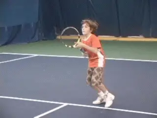

# Building the Spanish Forehand-P3 Racquet Speed and Power Building 

**Building the Spanish Forehand\
Part 3: Racket Speed and Power Building**

**Chris Lewit**

{width="3.3333333333333335in"
height="2.5in"}

**Racket head speed should be an obsession in junior development.**

As I explained in the first article in this series, racket speed is an
obsession in Spain, and I don\'t see why it isn\'t an obsession in every
player development system and for every coach around the world.
([**[Click
Here]{.underline}**](https://www.tennisplayer.net/members/classiclessons/chris_lewit/the_spanish_forehand/).)

I believe that young players need to start working on whip and power
early on - definitely under 12 years old\--to lay the foundation for
future world-class weapons. I believe that you develop technique first,
and then make the forehand into a huge shot for the long term success of
the player.

I also believe that players at all levels can benefit tremendously from
these articles to develop racket head speed. The lack of consistent
weapons at the club level is a far more obvious problem than in junior
tennis, and club players who take the time to really work on their
racket speed may find they can progress several levels in NTRP play. So
these drills are pretty much universal and not limited to the
development of high performance juniors.

A common developmental mistake, in my opinion, is to focus on the shape
of the swing alone without an equally strong emphasis on the speed of
the swing. I think this is what leads to a lot of the pushing that you
see in the juniors because the kids don\'t have the confidence that
comes from constantly going for their shots.

{width="3.3333333333333335in"
height="2.5in"}

**It\'s a mistake to focus on swing shape only, and not swing speed.**

The kids with the really pretty strokes who can\'t rip heavy kicking
topspin forehands or pound a ball down the opponent\'s throat simply
won\'t reach their potential in the juniors, or thereafter.

Creating more racket acceleration can be a difficult battle to win with
young kids, most of whom lack much awareness of their actual swing
speed. The process requires constant input. But I believe that the best
coaches in the modern junior game are working not only to get the form
right, but to develop the huge weapons that lead to success down the
road.

In the first article I outlined the technical elements I believe go into
the foundation Spanish forehand. ([**[Click
Here]{.underline}**](https://www.tennisplayer.net/members/classiclessons/chris_lewit/the_spanish_forehand/).)
Then, in the second article, I started to present drills to build
massive racket speed, starting with some of the classic hand fed
exercises that are so prevalent in Spain. ([**[Click
Here]{.underline}**](https://www.tennisplayer.net/members/classiclessons/chris_lewit/building_the_spanish_forehand_exercises/).)

Now in this third article, let\'s add more drills, this time drills fed
with a racket, rather than by hand. These drills are also common in
Spain, drawn from my experience studying and training with top Spanish
coaches. Let\'s also finish the article with a few strength building
drills that mimic the strokes and help kids - and all players\--develop
power in a very natural, fun way.

**The Classic Spanish Volley Racket Speed Drill**

{width="3.3333333333333335in"
height="2.5in"}

This drill is one of the most common racket speed building exercises
that I see on my trips to Spain. The coach volleys the ball softly,
lofting it so it floats high with little pace. The player has to execute
a massive, heavy forehand generating speed not from the oncoming ball,
but from his own swing. This drill is very important in helping build
confidence against slow ball players in the juniors, and is a great
progression from the hand fed racket speed drills in the first article.
It also forces the player to develop accuracy in combination with power
as he is required to return the ball to the coach for the next volley.

The coach must have the skill to volley the ball and still take away all
the energy. The goal is for the player to create all the pace for
himself through his rotation and whip. Depending on the level, the coach
should ask the player to hit 10, 20, or even more balls in a row. The
key is for the player to learn to control, accuracy, and consistency,
without reducing whip and racket head speed. Easier said than done, but
a great drill to create the mind set to destroy pushers.

**Racket Speed Swinging Volley**

{width="3.3333333333333335in"
height="2.5in"}

The swinging volley is a regular part of racket speed drilling in Spain.
This exercise develops the swinging volley, but also racket head speed
on the forehand in an integrated way. The coach feeds the player 10 to
15 balls near the service line and the player must get into good
position, load and then explode with whip into every ball in quick
succession.

The feeds can become quicker and the coach can move the ball around to
challenge the player\'s footwork, positioning, and timing. This drill is
critical to help a young player become comfortable taking the ball out
of the air with maximum acceleration and no fear. At the same time this
drill boosts confidence in unleashing completely on forehand
groundstrokes.

**Swinging Volley Racket Speed - Double Time**

{width="3.3333333333333335in"
height="2.5in"}

Here is a more advanced and difficult version of the same swinging
volley drill. Now the coach doubles the speed of the feed, feeding the
second ball before the first ball is even hit. This kind of
overcompensation makes hitting a single ball in real time seem slow! The
quick tempo of the feeds overloads and fatigues the arm building
strength and endurance. The result is players with more Rafa-like
confidence in their ability to whip through and crush the ball time and
again in point situations.

**Spanish Defensive Racket Speed**

{width="3.3333333333333335in"
height="2.5in"}

This is the racket fed version of the drill we saw in the last article
using a hand feed. Its purpose is to develop racket speed when the
player is on defense, and also, to develop defensive movement. The goal
is to hit a high, defensive, heavy spin ball. This shot is sometimes
known as the \"aggressive defense\" in Spain. The idea is that a very
aggressive heavy spin will allow the player to neutralize the incoming
ball and perhaps turn defense into offense.

The player must move back with double rhythm (Spanish diagonal shuffle
steps), load off the back leg, and accelerate with arm speed and body
rotation. Usually this shot is hit with an open or semi-open stance.

**The Easiest Ball in the World**

{width="3.3333333333333335in"
height="2.5in"}

I have to credit my long time mentor Gilad Bloom, the subject of a
previous article ([**[Click
Here]{.underline}**](https://www.tennisplayer.net/members/high_performance/chris_lewit/two_coaches_two_styles/))
for creating and naming this drill. It\'s a favorite with my students.

The title has a certain irony as the drill is not easy to do well. We
all know from watching junior matches that the \"easy\" balls are the
balls that many players miss on a regular basis, and that hitting them
for winners with power and consistency is the mark of an accomplished
player.

The coach feeds the players short sitters near the net. The player has
to load, and then explode and tee off with maximum force and racket
speed, 10 to 15 times in a row. The goal is to create the mind set to
punish that \"easy\" ball. It takes a lot of concentration, footwork,
and great technique, to make 10 or 15 in a row. You can add some Spanish
flavor to this drill by adding more movement and positioning and asking
the player to whip the ball with more spin rather than slamming it
flatter.

**Three Forehand Kill Shots**

{width="3.3333333333333335in"
height="2.5in"}

Here the player is fed three short balls in the midcourt. The idea is to
kill the ball moving forward abd wide, then moving directly forward, and
then moving up and around the ball to an inside position. The player
starts at the baseline, sprints to the ball, loads and explodes, and
then recovers to the baseline. The player is then fed the second ball.
After the kill, the player recovers again, and then receives the third
ball, etc.

The coach can vary the positions of the feeds as the player gets the
feel for the drill. This is a great attacking movement exercise,
emphasizing maximum whip and racket speed. It works on the most common
kill shot situations, building the player\'s comfort and confidence in
finishing the point. To develop a great forehand weapon, players need to
have no fear in pulling the trigger and ripping a big forehand.

These midcourt kill shots are not practiced nearly enough by most
American coaches, in my opinion. One of the separations between
mid-ranked national players and top ranked international/national
players is the consistency of their kill shots. Most highly ranked kids
are pretty solid laterally, but the best kids move forward on the
diagonals, jump all over short balls, and rip them for winners
consistently.

Hey club players, it can be the same for you. All these drills apply.
You just have to practice the shots you actually want to hit in matches,
that is, if you actually want to hit them in matches, instead of merely
dreaming about doing it.

**EtchSwing Trainer**

{width="3.3333333333333335in"
height="2.5in"}

Renowned physical trainer Pat Etcheberry ([**[Click
Here]{.underline}**](https://www.tennisplayer.net/members/physicaltraining/physicaltraining.html) to
see his training system on Tennisplayer) developed this swing trainer
and I like to use it in workouts with my players. I\'m not big on
gimmicks, but I\'ve found this swing trainer to be valuable tool. It
looks cool and the kids always enjoy working with it. For more info
about getting an EtchSwing, [**[Click
Here]{.underline}**](http://etcheberryexperience.com/en/info/the_etch_swing).

Players can perform sets of 10 to 15 repetitions. They can use the
trainer off court, or even on the court when waiting for the next drill
in group situations. I like this drill because the player is actually
building strength by practicing the correct technical swing. Here, I
have one of my future superstars using the trainer to build that big
forehand gun. He\'s 9 now but watch out when he hits 16. He\'s going to
have a weapon of mass destruction.

**Etch Swing Superset**

{width="3.3333333333333335in"
height="2.5in"}

This is a great superset drill. Work the Etch Swing 10 times and then
immediately transition to the regular racket for 10 more reps, what the
Spanish call The Wind Exercise. The Etch Swing makes the racket feel
like a toothpick in the player\'s hand and this makes this drill a great
way to work on whip. The classic Spanish wind exercise can also be
performed solo for 10-15 repetitions. The goal is for the player to load
and unload, accelerating the racket so fast, one can hear the wind
whistling through the strings. This drill is analogous to working the
speed bag or shadow punching in boxing.

**Double Racket Swings**

{width="3.3333333333333335in"
height="2.5in"}

Another option to develop strength and power is to hold two rackets or
tape two rackets together if the player can\'t control them both with
the racket hand. Now have the player swing the double weight for 10-12
repetitions. Lead tape can be also used for a less extreme effect. An
old 15 ounce wooden racquet makes a great heavy swing trainer. For me,
this is like working the heavy bag in boxing rather than the speed bag.
It facilitates power development in a slightly different, complementary
way.

Just be careful with the shoulders of young players. Don\'t overdo this
drill. A little goes a long way. Use an appropriate weight for the age
and strength of a student and monitor any sign of shoulder strain very
carefully.

**Medicine Ball Power Building**

{width="3.3333333333333335in"
height="2.5in"}

Medicine ball training is absolutely one of the best ways to train power
in players. It should have a regular place in every kid\'s training
regimen - both on and off court. And adult players can benefit just as
much. The medicine ball is so versatile and allows for very tennis
specific training. The kids love it and you can use it to play a variety
of mini tennis games. In this first drill I am doing the feeds. Notice
that my player is alternating neutral and open stance. Watch how closely
her physical movements correspond to her actual swing, and the depth of
the loading in the open stance version.

**Two Players Medicine Ball Neutral Stance**

{width="3.3333333333333335in"
height="2.5in"}

The kids probably enjoy doing these drills with each other more than
with the coach. Here both players are required to throw with neutral
stance. Notice that since the players aren\'t perfectly accurate with
their throws, their partners are forced to work on movement and
positioning as well, in order to execute the neutral stance. Again the
correspondence with the strokes and court movement is one of the things
that makes medicine ball drills so great.

**Two Players Medicine Ball Open Stance**

{width="3.3333333333333335in"
height="2.5in"}

This last exercise is the same except that the players now must set up
and throw from an open stance. Again notice how this promotes the
development of great strength in the load and explode phase. As with the
Etch trainer, the player feels lighter than air when he goes back to
doing the same movements with the racket.

These are just a few of the possible exercises coaches can use and all
of the ones I have presented can of course have multiple vartiations. I
hope they spur the imagination of coaches to design innovative exercises
to facilitate better weapon, power, and racket speed development in
their players\' games.

Next, I will give my opinions about some of the problems coaches run
into in traditional junior teaching that limit the development of
explosive weapons. Stay tuned!

**Special thanks to my students Sean Mullins, Will Coad, and Lia Kiam
for the doing the awesome demonstrations of the Spanish forehand that
made this article possible.**

{width="1.6118055555555555in"
height="2.029861111111111in"}

Chris Lewit, former #1 for Cornell and Pro Circuit player, has coached
numerous top 10 nationally ranked juniors and is a leading coach,
educator, and author. He has written two best-selling books, The Secrets
of Spanish Tennis and The Tennis Technique Bible.

Chris runs a popular high performance summer tennis camp in the
beautiful mountains of Vermont and coaches players world-wide through
his virtual school, CLTA Online
([**[CLTA.teachable.com]{.underline}**](https://clta.teachable.com/)).

Chris also produces a weekly high performance tennis video talk show and
podcast, The Prodigy Maker Show, which is available on Apple Podcasts
and all other podcasting directories. All shows can be accessed
at [**[ProdigyMaker.com]{.underline}**](http://prodigymaker.com/).

Check out Chris\'s blog, also at ProdigyMaker.com for free articles on
high performance junior development and Spanish training. Learn about
his camp at ChrisLewit.com or visit the online academy
at [**[CLTA.teachable.com]{.underline}**](https://clta.teachable.com/)

{width="1.761111111111111in"
height="2.7090277777777776in"}

**The Secrets of Spanish Tennis**

What makes Spanish tennis so unique and successful? What exactly are
those Spanish coaches doing so differently to develop superstars like
Rafael Nadal and David Ferrer that other systems are not doing? These
and other questions are answered in The Secrets of Spanish Tennis, the
culmination of five years of study on the Spanish way of training by
USTA High Performance Coach Chris Lewit.

[**[Click Here to
Order!]{.underline}**](http://www.amazon.com/gp/product/1937559491/ref=pd_lpo_sbs_dp_ss_1?pf_rd_p=1944687522&pf_rd_s=lpo-top-stripe-1&pf_rd_t=201&pf_rd_i=0982618212&pf_rd_m=ATVPDKIKX0DER&pf_rd_r=1J1QMC9PW98986T3ENJ0)
