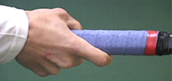

# Common Pitfalls in Spanish Forehand

**Common Pitfalls in\
Developing The Spanish Forehand**

**Chris Lewit**

**What are the pitfalls in building the Spanish forehand?**

In the previous articles in this series, we've looked at the technical
characteristics of the modern Spanish forehand. ([Click Here](https://www.tennisplayer.net/members/classiclessons/chris_lewit/the_spanish_forehand/)).
We've also looked at a range of innovative drills I have developed
based on my study with some of the greatest coaches in Spain.

These have included Spanish hand fed ball drills that are becoming
increasingly popular with high performance coaches worldwide ([Click Here](https://www.tennisplayer.net/members/classiclessons/chris_lewit/building_the_spanish_forehand_racket_speed/)),
as well a series of unique racket fed and power building drills
([Click Here](https://www.tennisplayer.net/members/classiclessons/chris_lewit/building_the_spanish_forehand_exercises/)).

The goal of this series has been to help players at all levels develop
not only sound technique, but world class racket speed. This is what
makes the difference in developing a forehand weapon that is capable of
both high velocity and heavy spin.

Now in this final article, I want to talk about what I consider to be
the common problems and or pitfalls that coaches and players can
encounter in trying to build a heavy forehand weapon.

**I don't recommend extreme grips, especially for young players.**

**Extreme Western Grip**

When Building a Spanish style forehand, a full, under the handle western
grip can be counterproductive. You don't see this grip at the pro
level. Even players such as Nadal and Novak Djokovic are using some
version of a semi-western grip with the hand still at least partially
behind the handle.

I believe that, particularly initially, the emphasis should be on a
relatively conservative grip. These pictures from the first article
again show the range of grips that I consider to be effective, basically
from a modified eastern to a strong semi-western. But I also believe
that the focus should be on developing whip and racket speed, utilizing
the whole kinetic chain of the body and maximizing upper arm, forearm,
and hand speed in developing the swing.

 

**The range of grips I advocate - basically from Roger to Rafa.**

**Developing Heavy Spin Only**

Players and coaches interested in the Spanish style forehand sometimes
become overly fascinated with spin. This can be often linked to problems
with the extreme grip described above. Under the handle grips can
produce amazing spin - but power is a different issue.

**Developing heavy spin alone doesn't lead to Spanish style power.**

The modern Spanish forehand is not just about spin. It can be unleashed
with power and penetration with minimal spin as well. It can be used
while taking the ball early and on the rise.

In the quest for heavy spin, coaches often neglect this ability flatten
the ball out ,and hit penetrating hard drives. A modern world-class
forehand should be able to produce heavy spin and also have the
versatility to rip flatter winners on the rise.

**The hinge action of the arm, not the wrist is the key to spin.**

**Excessive Emphasis on \"Wrist Snap\"**

As discussed in the first article, I believe the wrist can play a role
in some situational shots hit with heavy spin, such as sharp angles,
late contact points, and sidespin shots. But the primary spin generating
mechanism is the loose hinge action of the forearm.

Coaches who wrongly emphasize using the wrist to generate spin are
missing the more important element of the hinge forearm action at the
elbow joint. The hinge is usually where players struggle as they attempt
to develop spin.

I believe that the focus should be on more hinge action at the elbow
joint, not excessive motion or snap at the wrist joint. The wrist should
be relatively firm, and usually laid back to a greater or lesser extent
as the forearm brushes the ball. When the wrist is too loose, players
develop improper technique which hampers control, depth, and can make
players more susceptible to injury.

Put another way, topspin comes through the swing path. This is through
by a good loop that drops the racket head in the backswing, and then the
hinge forearm action. For me, any additional wrist action is a higher
level skill that should be addressed, possibly, in the development of
more advanced players.

**You can't build power at the expense of fundamentals like head
position.**

**Emphasizing Power Over Fundamentals**

Often times, especially with young players, coaches will skip ahead
prematurely to the weapon-building approach. This will come at the
expense of the shape of the parabolic swing, the footwork and especially
the balance of the player. In these instances, the player is often left
with a wild - yet powerful - shot.

In addition to racket speed, Spanish coaches are obsessed with footwork,
balance, and positioning. I believe that practicing racket speed with
sloppy swing technique will ultimately ruin shot accuracy and also place
the player at a greater risk of injury.

Although the exercises I have presented are aimed at maximizing racket
speed, this is always in conjunction with balance and footwork. For
example, if a player does not learn to keep the head still and stable
during rotation of the body through the shot, the consistency of the
shot will be compromised. The same is true of the balanced landing when
players go into the air with one or two feet.

**The racket starts back as part of the body turn.**

**Taking the Racket Back \"Early\"**

This is the old teaching adage that refuses to die, despite the vast
video resources on Tennisplayer.net and elsewhere that demonstrate the
relationship between the body turn and the timing of the backswing. In
my opinion, traditional coaches can kill racket speed by forcing players
to take the racket back too early with independent arm motion. As
discussed in the first article, I believe that what I call the
hold-rhythm is key to developing maximum whip. [Click Here](https://www.tennisplayer.net/members/classiclessons/chris_lewit/the_spanish_forehand/)

**Beautiful Technique without Power**

Many times, players will come to my academy with very nice, fluid modern
forehands but not enough heaviness and force behind their shots. I
believe weapon building through the exercises described in these
articles is critical to take a fluid forehand and make it a serious
threat.

The forehand must have vicious, scary racket speed, and generally this
must be developed quite systematically, unless the player is a freak
with incredible fast-twitch fibers in the arm. Neglecting to develop
this aspect of the swing will result in a forehand that can't do any
real damage at the high level.

**My goal: gorgeous swing shapes with awesome racket speed.**

This is the flip side of the problem of all power and no technique. Nice
for a textbook, but not going to win the big trophy. My belief is that
players can have it all, gorgeous fluid swing shapes with explosive
power and heavy spin.

**Stay on the Ground**

I know this will sound heretical to some, but I teach all my beginner
junior students to learn how to jump\--yes jump! - into their shots.

I believe leg drive and dynamic balance can and should be trained from
the earliest years. Kids should learn how to activate their calves and
quads and sequence the kinetic chain from the ground up.

Equally critically, as we saw in the previous articles, I train the
landing after the load/explode sequence, which helps kids learn balance.
Some traditional coaches will have a hard time allowing kids to explode
off the ground into the air to hit a shot, but this is a crucial
developmental step in learning the modern Spanish forehand.

**I teach kids how to explode into the air.**

One key in teaching kids to jump with balance is to first set up in
position behind the ball. As I always say, \"if you are in position you
can jump into a shot, but never jump into a shot to gain position.\"

**Lack of Tactical Integration**

Players should be introduced to the essential tactics that will become
part of their DNA as they learn their new forehand technique. Coaches
should try to integrate a tactical framework of how to use this new
forehand weapon to accelerate the comprehension of the student and to
motivate the student to learn the new techniques.

Students will be more willing to learn a modern forehand if they
understand how the forehand will serve them better as a more versatile
weapon, This means the ability to create sharper angle shots, playing
improved their defense, hitting with more margin when desired, and
moving around the backhand to control points.

I teach my students the kick serve along with a modern Spanish forehand
and link the tactical discussion to both shots. The kick serve often
sets up the big Spanish forehand at the top junior and professional
level. (For my series on developing this serve, [Click Here](https://www.tennisplayer.net/members/classiclessons/chris_lewit/keys_to_the_kick/keys_to_the_kick_page1.html).)

**The player hits a kick serve, lands on balance and then finishes with
a short forehand.**

I like to introduce these tactical/technical connections as early as
possible in a player's development. For example, all of my students
learn a big, angled kick serve. This sets up the classic kick/forehand
Spanish combination.

I do a drill where a player hits the kick, lands on balance, then moves
forward to finish a short ball, something this serve can produce on a
regular basis. Learning a Spanish forehand without learning a big kick
serve simply doesn't sense since the player will lack a key shot to set
up the new forehand weapon.

Training Only on Fast Courts (and/or with Fast Balls)

It is very difficult to develop racket speed and whip when the courts
are super fast and the balls shoot in low and hard. In Spain, they have
the great advantage of their beautiful red clay courts, which help
players learn tactics more easily, but also contribute to their players
developing tremendous whip on their shots.

The clay in Spain is generally very slow and the balls get weighted down
with clay and moisture. Thus, the players must learn by necessity to
swing like a beast or they simply can't succeed.

**Spanish players have the great advantage of red clay.**

It is more difficult to build a Spanish style forehand without clay. I
do it in the New York City area where we do not have a lot of clay, but
it's not easy. It helps to use slower balls, such as balls that are not
brand new, to give players time to step back, and let the ball drop into
their strike zone and accelerate.

**On the Rise Only**

To develop whip and racket speed the Spanish way, particularly with
younger players, it is essential to learn to back up and take the ball
on the fall. Learning only to take the ball early will kill the
development of a heavy topspin ball.

In previous articles I have written how important it is to develop an
attacking on-the-rise component in every player's game. [Click Here](https://www.tennisplayer.net/members/high_performance/chris_lewit/two_coaches_two_styles/)
But the other half of complete development is the ability to step back
and let the ball drop into the strike zone.

In Spain this is called \"receiving the ball.\" This allows the incoming
speed and spin to decrease, allowing players to whip upward to generate
the big spin shot. A player who is forced to take every ball early will
not be able to truly get under the ball, load and generate heavy spin.
This is why I believe that on the rise attack and heavy spin should be
taught as separate aspects.

**To develop racket speed and spin it's essential to learn to receive
the ball.**

**Conclusion**

Rafa has revolutionized the modern forehand with his power, racket
speed, and versatility. I believe all coaches and players who are
interested in building a Spanish forehand should experiment with the
advice and the exercises I have provided in this series to help them do
the same.

Most importantly, I hope you the reader will be creative and use the
ideas from these articles as inspiration to create your own drills to
help yourself or your students develop both better forehand technique
and maximum racket speed.

Through experimentation and creativity, coaches and players may be lucky
enough to stumble upon the next generation forehand evolution. Or more
likely, some next generation champion will show us all the way.

But racket speed and power development will always be essential to
building a world-class forehand shot. Having traveled widely in the
coaching world, I believe the Spanish have the best system to maximize
these two critical components of a world-class forehand.

