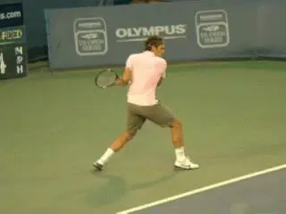

# Building A World Class One-Handed Backhand: The Forward Swing

In the first two parts of this series we discussed the applicability of
the one-hander for players at all levels ([Click
Here](https://www.tennisplayer.net/members/classiclessons/chris_lewit/one_handed_backhand_part_1/))
and then the factors in deciding to develop it. ([Click
Here](https://www.tennisplayer.net/members/classiclessons/chris_lewit/one_handed_backhand_part_2/).)
Last month we look at the preparation and the backswings. ([Click
Here](https://www.tennisplayer.net/members/classiclessons/chris_lewit/one_handed_backhand_part_3/).)

Now it\'s time for the pay off\--producing the forward swing. Let\'s
look at the positioning of the hands and arms, the role of the wrist,
the contact point, the finish and discuss the technical combinations and
variations that go into creating a gorgeous, powerful, heavy one hander.

{width="3.3333333333333335in"
height="2.5in"}

**Let\'s look at the one-handed forward swing, contact, the extension
and finish.**

### The Wrist and the Racket Face

I want a very firm wrist for developing players, firmer than the
forehand wrist position. As the player gets more advanced, the wrist can
move or snap in a subtle manner on angles and heavy spin shots.

But especially during early developmental, spin should be generated more
from the drop of the forearm than the movement of the wrist. A wristy
swing will get more spin, but will be unreliable.

{width="3.3333333333333335in"
height="2.5in"}

**A firm wrist: difficult to describe but critical in development.**

The sensation of what is \"firm\" is hard to describe. But the best way
to understand it is to look at the tilt angles of the racquet face
during the forward swing.

There are two important concepts to understand here, the Tilt Angle and
the Break Angle. The firmness or looseness of the wrist and these
racquet face angles are directly related.

### Tilt Angle

The tilt angle is the angle between the plane of the racquet face and
the plane of the court. I like to see the racquet face vertical to the
ground or slightly open in the single-handed backhand preparation and
during the backswing phase.

This changes in the forward swing. The tilt angle of the racquet face as
it drops and starts forward should be somewhere between vertical and
slightly closed, a maximum of about 10 degrees.

If the player can maintain this tilt angle, the wrist will remain
relatively still and sufficiently firm. This will promote a clean hit
with solid contact and also minimize the potential to shank or miss hit.

{width="3.3333333333333335in"
height="2.5in"}

**Tilt angle: slightly open in the backswing, slightly closed at the
start of the foreswing.**

Players can over tilt and under tilt. Under tilt means the wrist and
racket face have opened to the plane of the court. This can make topspin
difficult or impossible to achieve.

Over tilt, with the face more closed to the court is more common and can
help to achieve topspin. But over tilt risks miss hits and the ball
lacking depth and penetration.

The grip is a factor affecting the tilt angle of the racquet during the
backswing. More extreme grips have more severe tilt angles, and thus,
more likelihood of miss hits.

More classic grips will naturally have less tilt angle and less
likelihood of shanks. In general, the more extreme the grip, the more
likely the player will miss-hit the ball, especially early on.

This relationship is important to understand. But there is also a
relationship between the looseness of the wrist and the likelihood of
miss-hitting the ball regardless of the grip.

A very loose wrist, can help in applying power and spin, but often
results in a lack of control and precision. There is a fine balance
between wrist looseness and wrist firmness that must be achieved to have
a consistent powerful shot with good spin.

Heavy spin angles require a slightly looser wrist than others, for
example. But if the angle of the racquet face is positioned properly,
you can be assured that the wrist is in a sufficiently firm position
during the backswing.

{width="3.3333333333333335in"
height="2.5in"}

**In the wrap around backswing, the wrist can break slightly backwards
and then release into the hit, but this is an advanced element that is
difficult to control.**

### Break Angle

The other critical angle to understand with the wrist is what I call the
Break Angle. The wrist tilt can make the racquet head too closed. But
the wrist can also break back too much resulting in more of a slap shot.
I call this the break angle.

When we look at the wrap around backswing that is common on the pro
one-hander, we may think that the wrist is commonly breaking back
because of the angle of the racquet back behind the body.

This is really an illusion, though. On many world class shots, the wrist
is still firm and has not broken significantly during the backswing.

The arm has taken the racquet back and around the body, not the wrist.
This is a critical aspect of the swing to understand.

However, some players definitely do have a break angle at least on some
balls, for example, Justin Henin. This can add additional racket speed
and help create spin, but is very difficult to time.

If the wrist break angle is extreme in the wrap backswing, a sling shot
effect takes place, which can reduce the precision of the shot. The shot
will be more of a slap shot---unpredictable and imprecise. Of course,
some exceptions can be made for advanced one-handers on a case-by-case
basis if the player is gifted and has very good eyes and quick hands.

{width="3.3333333333333335in"
height="2.5in"}

**The leg drive can be massive in pro tennis and is key for both power
and spin.**

### Leg Drive

The leg drive up into the ball is critical to providing power and spin .
Too frequently I see players using mostly the arm in the backhand shot.
This not only limits the power potential of the shot, but it also
increases the stress on the arm musculature and could increase the
chance of injury.

As the arm drops in the backswing, the racquet head lowers. As the
racquet head lowers, the legs can bend tremendously to 45 degrees and
often more, preparing for a big push upward into the oncoming ball.

As the racquet begins forward toward the contact point, the legs begin
to straighten, providing power and lift into the shot. At contact, the
legs will usually move from the maximum bend to almost straight on a
ball between the hip and shoulder.

The feet come up on the toes indicating an excellent push from the
quads. At times the legs may straighten out completely, depending on the
player\'s height and the height of the ball.

{width="3.3333333333333335in"
height="2.5in"}

**The legs straighten for power and spin, sometimes propelling the
player off the court surface.**

The body may also lift off the ground. In a closed stance, the push from
the legs translates into the front-foot closed jump in a forward motion,
providing forward momentum and weight transfer.

In the open stance, the leg drive creates more rotational force. Many
clay court players are using the open stance more commonly and I see it
frequently in emergencies and when players are on the run.

I think that the open stance will continue to evolve for the
single-handed player over the next few decades and will become more and
more acceptable. In both cases the leg drive provides more leverage on
higher balls near or above the shoulder.

Many coaches advise not trying to \"jump\" into the shot. The argument
is that the jump should be a natural byproduct of the leg drive. That
may be for developed players at high levels.

But in my experience building strokes, players need to learn to activate
those quads! I have my players load up the legs and jump consciously
into the ball. I want them to get in touch with their lower body and get
the maximum drive upward possible.

{width="3.3333333333333335in"
height="2.5in"}

**I train kids to leave the court surface, similar to plyometrics.**

It's like plyometric training. For me, working on the leg drive is like
lifting weights in the gym. Initially, the player has to work hard to
make the explosive movement from the legs.

### Contact Point

The contact point is, obviously, the most critical moment. The player's
arm should be fully extended and straight. All the great backhands have
full extension of the right arm at contact with the arm straight at the
elbow.

Extension promotes both maximum power and good ball feel and control.
The racquet face needs to be square to the ball at the contact point,
even if it has approached with a slightly closed tilt angle.

The reality is that the racket head can be tilted forward slightly,
typically on very high balls. But this occurs at high levels of play
with high ball velocity and high swing velocity and is not recommended
as a teaching point in the developmental phase.

{width="3.3333333333333335in"
height="2.5in"}

**With the arm extended contact far away from the body and far in
front.**

Two key points are how far away from the body the contact point actually
is with the arm extended, and also, how far in front. For crosscourt
shots, the contact point will typically be slightly more in front than
on down the line shots.

### Hips and Shoulders

The hip position and shoulder position can vary from shot to shot and
from player to player. In general, the more closed the hips and
shoulders are at contact, the less power and the more control there will
be on the shot.

Interestingly, in world class one-handers, there is some hip and
shoulder rotation before the contact, as John Yandell has shown in an
article in this same issue. ([Click
Here](https://www.tennisplayer.net/members/avancedtennis/john_yandell/modern_backhand_stances/one_hander/).)
This is related to the use of closed stance, which naturally increases
the body turn in the preparation. So there are definitely some
rotational forces at work on the professional level single-handed shot.

Pro players generally coil up to about 150 degrees and uncoil all the
way to 90, the perpendicular point. However, once that left hip and
shoulder reach approximately 90 degrees, they stop and anchor themselves
as the right arm extends through the contact.

{width="3.3333333333333335in"
height="2.5in"}

**Hip and shoulder rotation coming into the contact, with the torso
remaining more or less perpendicular after.**

The single-handed shot is the only advanced shot in tennis where the
hips remain relatively still around and after the contact. This
relatively perpendicular position to the baseline is critical to
maintaining control on the shot.

The most common error that I see on the one-handed backhand is the left
shoulder and hip rotating through the shot, which may add some power but
reduces consistency and control. When combined with a bent arm as it
sometimes is at the recreational level, this is a recipe not only for
poor shot making but also for injury.

However with extreme grips the total amount of rotation can be greater,
with the shoulders going past perpendicular before reaching the anchor
point. You see this commonly in a player such as Stan Wawrinka.

Despite the role of the body rotation, the single-handed shot is still
primarily a linear shot. It is one of the last vestiges of the classic
linear game.

But, it is interesting to see how even this classic stroke has been
updated and improved with the more modern swings. More rotation before
the contact has added racquet speed, power, and spin.

{width="3.3333333333333335in"
height="2.5in"}

**High level extreme grip one-handers tend to have somewhat greater
rotation.**

In terms of developing the stroke, I want to see the left shoulder still
at contact and the chest facing the side fence.I prefer to see the same
side-on hip and shoulder position for both the crosscourt and down the
line shot.

With some players, however, the left shoulder and hip may open very
slightly for the crosscourt shot. The key, if this occurs, is to make
sure that the hips and shoulder are not opening early, compromising
control and disguise. If the hips and shoulder open too early the shot
direction will be telegraphed to the opponent.

As a general rule, clay court players will rotate more through the
contact point than fast court players because, over the years, they have
learned to hit with maximum pace and spin this way and there is often
more time to set up and rotate into the shot.

Clay court players learn that they must, with few exceptions, generate
maximum racquet speed in every swing. Fast court players often learn to
use the pace of the incoming ball better; thus, they will not need to
rotate as extremely to generate power.

### The Head

{width="3.3333333333333335in"
height="2.5in"}

**The head and chin: still and balanced during and slightly after
contact.**

One of the most important technical elements in developing the
one-hander is keeping the head still during the contact. Everywhere I go
I see players flailing away and jerking their heads around during the
most important moment in the swing.

I call this bobblehead tennis. I feel there should be much more emphasis
on head still training.

I consider a still head position a hallmark in my teaching and a
signature for our students. The head and chin should be completely still
and balanced.

The eyes should be focused on the contact point for a split second after
the ball is hit. Because of the weight of the head, keeping it still is
critical in optimal balance.

Watching the ball into the contact point creates clean contact and
minimizes miss hits. Nothing will disrupt a swing more than a bobbling
head.

It\'s hard to stress the point too much. If the head jerks even slightly
it can pull the shot offline. I see many good junior players who
basically intuit the last few feet of the incoming ball path. These
players are estimating\--guessing really\--where to contact the ball.

{width="3.3333333333333335in"
height="2.5in"}

**A still head position is a hallmark in my teaching.**

Players also have to resist the urge to look up too soon to see where
the shot is going. This is critical to disguise as we will see in the
next article.

Players will sometimes look up in the direction of the shot before
actually hitting the ball. Opponents can read this.

### Extension and Followthrough

The arm and racquet should extend straight through the contact point and
continue outward on the player\'s left side, arcing higher until the arm
crosses over and reaches a full extension and stretch on the right side
of the body. For players who do not extend in this way naturally, it
must be extensively practiced and trained.

This extension provides effortless power, better penetration, better
ball feel, and reduces the chance of injury by promoting a full, long
and fluid swing. Often I see players swinging across the body rather
than extending out to the left before following through to the right
side.

If the player does not continue upward through the contact, he will
limit spin production and height on the ball. If he does not hit through
the ball and extend, he will limit power, depth, and control.

{width="3.3333333333333335in"
height="2.5in"}

**The hitting arm stretched straight and pointed to the sky**

### Finish

The finish on the single-handed backhand is relatively straightforward
and simple compared to the forehand. There is less variation here and
the mechanical elements are more universally agreed upon.

The finish is a great tool to understand what is happening correctly or
incorrectly during the contact and extension portion of the swing---it
is a mechanical litmus test. Oftentimes a poor contact and swing will
result in an unorthodox finish..

The finish, for me, is the least important of all phases of the swing,
but it still should be mechanically correct. On the single-handed shot,
the arm should be stretched straight and pointing toward the sky. The
racquet should usually be perpendicular to the ground.

### Alternate Finishes

On very powerful swings or more wristy spin shots, the wrist and racquet
may release farther and point back toward the back fence.

{width="3.3333333333333335in"
height="2.5in"}

**In the pro game, sometimes the finish points back to the rear fence.**

This comes from extra rotation of the hitting arm, wrist and racket.
It\'s a common finish in today's pro game, but should only be attempted
by advanced players. The key is that his wrist is loosening mostly after
the shot---not before. Most beginners will try to copy this swing and
get too wristy at the contact.

And one final point about the finish. During some quick exchanges, such
as when hitting a passing shot, the finish may be abbreviated to allow
for a quicker recovery for the next shot. This technique, however,
should be minimized because it can develop into a bad habit, causing a
swing to become too short in general and hurting extension and racquet
speed.

So that\'s it for the forward swing. Next let\'s look at the critical
element of disguise, as important as the technical swing development in
creating a worldclass one-hander.

Stay Tuned.

{width="1.6118055555555555in"
height="2.029861111111111in"}

Chris Lewit, former #1 for Cornell and Pro Circuit player, has coached
numerous top 10 nationally ranked juniors and is a leading coach,
educator, and author. He has written two best-selling books, The Secrets
of Spanish Tennis and The Tennis Technique Bible.

Chris runs a popular high performance summer tennis camp in the
beautiful mountains of Vermont and coaches players world-wide through
his virtual school, CLTA Online
([[CLTA.teachable.com]{.underline}](https://clta.teachable.com/)).

Chris also produces a weekly high performance tennis video talk show and
podcast, The Prodigy Maker Show, which is available on Apple Podcasts
and all other podcasting directories. All shows can be accessed at
[[ProdigyMaker.com]{.underline}](http://prodigymaker.com/).

Check out Chris\'s blog, also at ProdigyMaker.com for free articles on
high performance junior development and Spanish training. Learn about
his camp at ChrisLewit.com or visit the online academy at
[[CLTA.teachable.com]{.underline}](https://clta.teachable.com/)
