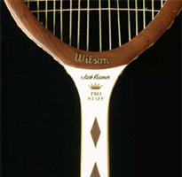

# My Journey With String

### By Geoff Williams

------------------------------------------------------------------------

**My journey with string goes back as far as Maria Bueno, the Brazilian
Grand Slam champion from the 1960s.**

For the last several years, there has been an explosion of new strings
and new string combinations as part of the always evolving polyester
revolution. So much has changed and continues to change that the average
player can be befuddled by the range of options and claims.

String has fascinated me for decades, and over time I have probably
tried as many configurations as anyone, including most of the newer
polyester strings and some bizarre combinations of my own. In this
article I want to sketch out some of the details of my personal journey
with string. Then I want to suggest some guidelines and possible string
combos for both power players and spin players at the club level.

**A Little History**

My first string job was piano wire, coated with rusty engine oil, in the
mid 1960s! I saw Maria Bueno and Rod Laver play in Oakland California,
so that should date me somewhat! That piano wire was ribbed, so that the
ribs grabbed the ball, and created vicious spin. I was about ten years
old and hitting spin like Nadal.

My first frame was an old Bancroft, purchased at Value Village, a
Richmond, California thrift store located right next door to the
emergency wing of Kaiser hospital. I remember how the outside air
smelled like hospital drugs, pungent, and not exactly medicinal.

**How many other players remember the Jack Kramer Pro Staff?**

The balls we used were Slazengers, and they came in a four ball can,
which you had to peel off sideways like an old sardine can. The key used
to open it often broke, forcing me to use a can opener.

When that first string job finally broke, I had warped the frame beyond
recognition. It was so worn down at the top from scraping the court that
it finally cut the rusted out piano wire in half. What do you expect for
fifty cents?

My next move was way up, to a Jack Kramer Prostaff frame with brown
diamonds on the throat, and Leoina nylon string. The Leoina didn't last
long, and it didn't hold tension very well either.

So after Leonia, I moved to gut. The gut I used back then was Victor
Imperial Blue Streak, which you can still find strung up in some old
frames owned by collectors. That was a superb and powerful string, and
when it frayed or broke and the blue streak unraveled, you could see it
was a ribbon imbued string, with the ribbon twisted inside the gut
itself during manufacture.

**Victor Imperial gut: superb, powerful, ribbon imbued.**

The gut retained its tension a lot better than the Leoina, and that
qaulity is one reason why players such as Murray, Federer and Djokovic
still do hybrids with VS team, the Ferrari of guts.

Bill Strei, at Plaza Tennis strung that first gut job for me, using a
1950's Oliver drop weight machine, which he still uses, three shop
incarnations later. The older two point mounting machines like Bill
allows him to actually \"elongate\" frames, although most players and
many stringers aren't even aware of this effect. This slight change in
the shape of the frame affects power and the shape of the sweet spot.

The truth is that stingers can elongate or compress frames by about
1/8\" in either direction, based on the technique used, when they clamp
the frame into the machine and how tightly, and also, which strings they
string when and how tight.

A compressed or rounder frame affects power and feel as well. Rafael
Nadal requests a rounder shorter frame on his string jobs. Nadal's
frames are strung to be shorter by 1/8\". Nadal also requests stringing
from the bottom up, rather than top down, on the crosses.

To make the frame rounder stringers allow the mains to compress and
round out the frame before fully locking it down. By pre-stressing and
stretching the frame before locking it down on the stringing machine,
the frame can be made less round and more oval. Tensioning the crosses
differently, such as higher tension up at the top crosses, and lower on
tension on the lower crosses, will also elongate the frame and shape the
sweet spot.

**Bill Strei's drop weight stringing machine from the 1950s.**

There are many other ways stringers can effect the characteristics of
the string bed. They can use something called \"proportional stringing\"
by varying the machine tensions of the longer lengths of strings in the
middle of the frame versus the shorter lengths closer to the edges. This
allows them to create the exact same actual tension for all the strings
in the finished string jobs, no matter how long they are.

Some stringers do this by \"pinging out\" the mains on each
corresponding side, so that they have the same sonic tone, like tuning a
guitar. They then vary the tension to match tones on shorter lengths, to
match the tone of the longer strings.

**Decades of String**

Since I first hit a ball, I've put in at least 10,000 hours on court,
and had thousands of string jobs, many times cut out after just one hit.
(I've also got my own stringer and like to experiment.)

Over the decades, I've used a huge range of different strings, guts,
synthetic guts, ribbon, poly, copoly, Luxilon Alu Power, Big Banger Ace
18g, original Big Banger, Adrenaline Lux, Polyolefin Ribbon, Kevlar, and
some stuff I can't even remember.

**Drinking straw pieces under the cross strings: my most successful
topspin experiment.**

I also experiment with some very unusual combinations of my own: very
thin fishing wire wrapped horizontally around the crosses; super glued
crosses; zip cord copper lamp wire under the crosses; even electronic
parts under the crosses; silicone spray on the strings; spaghetti string
dual mains. (For more on Spaghetti Strings, [Click
Here](https://www.tennisplayer.net/members/physics_of_tennis/josh_speakman/spaghetti_strings/).)

Most of these experiments have been made to produce more spin. My most
successful spin experiment to date: short pieces of drinking straws
placed under the crosses.

But enough about me and all that for now. It's probably fair to say I
am far more interested in the esoteric aspects of string than most
Tennisplayer readers. The more relevant question is this: what have I
learned that can help you match a string configuration to your game?

So, to begin to understand this, let's go over some of the factors that
go into creating power and also spin and see what role string plays (as
well as the racket frame). Then I can make some stringing configuration
recommendations based on your style that will have the potential to
seriously impact what happens when you hit the tennis ball.

**What role do frames and strings play in creating power?**

**Power**

Power depends on several things. Generally, the stiffer a string is, the
less power it has, due to less elasticity, less recoil, and less energy
returned at impact. Lower string tension creates more power, allowing
more energy and more of a trampoline effect on the ball. This will also
create more depth.

The problem is, many low tension shots will go past the baseline if you
are a hard hitter. This is the bane of the hard hitter\--missing long
due to tension loss after just a few hours. Softer hitters often like
lower tensions, and can use strings that don't cost as much.

Softer strings such as gut will produce more power. But hardly any male
pros use an all gut job, unlike the days of old, when all of them did!

**The Gut Factory**

Gut is made from cow intestines, starting with strands that are 42 feet
long. (They say that the cows who eat a lot of stones make the best gut
string.) It is made in liquid filled troughs, with workers who wear
plastic gloves, and lab coats. Don't take my word for it, click on the
video and see for yourself.

**Click Here to see the amazing manufacturing process for natural gut.**

Many string testers claim gut has the best feel/control/power/touch
combination, so why don't more pros use it? With the increases in
velocity in the modern game they cannot control it fully, nor can they
depend on the same feel from set to set. Pros must believe absolutely in
the equipment they use, and it takes many years of using the same
equipment to create that stone cold belief.

**How does racket flex affect power and spin?**

So they hybrid it, with polys or copolys to get the best of both worlds,
controlled power and controlled depth, combining the feel of gut and the
consistent snap back spin response of polyester.

**Frames**

It's important to note that the stiffness of the frame also affects the
power. The ball impact causes the frame to wobble and vibrate after the
ball is gone. Flexible frames wobble more, for a longer duration, with a
lower rate of frequency compared to stiff frames. A stiffer frame
wobbles less and imparts more energy and absorbs less.

For these reasons, stiff frames create a lower angle of trajectory.
Flexible frames create a higher angle of trajectory due to a greater
flex during impact. Heavier frames create more power as well, but only
if they can be swung at the same speed, which is why most players now
use lighter frames that allows to radically increase their swing speeds.

Does a more flexible frame create less spin? The greater flex absorbs
more of the ball's energy, robbing some of the power and speed of shot
that stiffer frames provide, but do they then add more spin? I don't
know, if this is enough to affect the spin rate much at all.

Flexible frames do change the angle of trajectory though, increasing it
somewhat, so it might seem that they do add more spin due to the higher
angle and shorter depth they create. But I believe that the more
flexible frames just make it appear that they create more spin due to
the shorter, higher shots.

**Lighter frames can be swung faster to generate more racket head
speed.**

**Sweetspot**

Even though players favor lighter rackets, they still often add lead
tape. This is because lead tape can also change the shape and location
of the sweet spot in the string bed.

Elongating or compressing the sweet spot is a science. Compression,
creating a rounder sweetspot, occurs when lead is at 3 and 9 oclock.
Elongation occurs when lead is up higher, such as 12 oclock or lower,
such as in the handle or lower on the hoop.

We have seen in Josh Speckman's articles how poly string really works,
through the \"snap back\" mechanism. ([Click
Here](../../More/Tennis%20Science/Copoly%20Strings%20-%20How%20Do%20They%20Really%20Work.docx).)
You get the same effect with a more open string pattern. This is because
there is less friction on the mains due to a wider space in between
mains and crosses in the impact zone, and this causes more snap back.

This configuration also causes more \"sawing\", and explains why a more
open string pattern breaks string so much more quickly than the closed
pattern, as the strings don't move as much, and so don't saw as much
back and forth in a closed pattern as they do in an open pattern!

**Open stringing patterns, as used by Mark Woodforde, also generate more
spin.**

It's important for players to understand that a stiffer frame or a
stiffer string is harder on the arm, as are higher tensions. The higher
tension creates a higher pitched resonant frequency, and your elbow
vibrates faster with more force applied.

So those who use a stiff poly, strung tightly, on a stiff frame, will
get hurt more often, unless they are immune to the harsher impacts.

Gut is also the softest string, more elastic, and will recoil more than
poly, which affects the angle of trajectory off the string bed as well.
Everything else being the same, gut will create a higher angle of
trajectory, as it is softer and stretches more, with a greater
recoil/impact/elastic rebound than poly, Kevlar, or most copolys. But
even gut can hurt you if strung at high tension in a stiff frame.

No one thing controls power or any aspect of control/feel/touch. A low
tension, stiff frame strung with gut produces so much power that no pro
can control it, so no pro plays with that combination! Power in our game
is worthless without control.

**Spin equals control.**

**Spin**

Spin is addictive, and some say, \"Spin is control.\" All the top string
experts talk about \"snap back.\" Snap back occurs when the mains slide
down as they grab the ball, and \"snap back\" into place as they impart
spin/power/angle of trajectory/feel/control/depth to the ball. This
happens in milliseconds. The ball only stays on the string bed for about
4 thousandths of a second. Everything the hand feels is transmitted in
that very short time.

So why does it feel as the ball is one the strings a much longer time?
Part of that is due to the \"wobble\" after impact, making the time seem
as if it's a quarter of a second, and the resonant frequency of the
frame used and the string used. Everything is vibrating at high
frequency when the ball strikes the string.

Every frame, every string, and every string job has its own resonance,
and its own frequency. This is what I think creates the illusion of
extended impact times. And why it is so difficult to produce identical
string jobs. As soon as the stringing is finished, the string starts to
lose tension, due to the static tension of the job itself. Then it
immediately begins to lose tension as you hit. So the tension of the
string job is constantly dropping downwards.

VS Team gut is best at holding tension, and Ashaway Kevlar is among the
worst. Ashaway does not stretch during stringing hardly at all, and VS
does a great deal! Paradoxically, Ashaway feels very similar as it loses
tension, and VS becomes a rocket launcher as it loses tension. String
can be very strange.

**3000 hits equals 12 seconds of actual dwell time!**

Although the impact time of the ball varies slightly, it stays on the
string bed in the range of about 3-5 milliseconds. Most people can't
even blink more than three times in a second!

So, think about it, if you hit three thousand balls the actual time the
ball was on string bed time is about 12 seconds total! Twelve seconds of
contact on the string bed, out of three thousand shots.

That's amazing when you really think about it. It shows how little it
takes to change the characteristics of particular string bed, and
explains why pro players change frames so frequently.

**Time Staggering**

**The hand has many thousands of nerve endings, and we learn to
magnify the perception of those nerve endings, to \"stagger\" time so to
speak.** **All top athletes are time
\"staggerers.\"**

**Great tennis players like great quarterbacks all stagger time.**

**[[They slow down time, and control the body's internal rhythm, to
create the \"grape fruit\" effect.]{.mark} [To them, the ball is moving
slower and seems bigger, making it an easier target for them to
attack.]{.mark}]{.underline}**

**The same goes for other athletes in other sports, such as football.
Quarterbacks talk about \"slowing down time\" and how long it takes them
to be able to do that.** The quarterbacks only have
a couple of seconds to find the receiver and lead him correctly before
getting hit by gigantic muscled defensive players.

**The same principle applies for top tennis players. They stagger time
to deal with 140mph serves and 90mph forehands, all reaching them in a
second or sometimes even less.**

**It is possible to focus our training/hitting sessions on our
perceived impact extension. This also helps relax us during our shots,
and causes less deceleration or braking, which is what you fell when the
dreaded \"lead arm\" rears its head, a braking effect in the arm/body
instead of a fluid, relaxed attacking shot.**

It's called choking by most, but actually it's decelerated tension
caused by rigidity in form. Ever notice how fluid and fast the best are
under the worst pressure? They strike the ball faster and move more
fluidly by will, by design, and by practiced and by very focused
intention. Ask for power and ye shall receive power. Ask for spin and ye
shall receive spin. Ask for fluidity and ye shall receive relaxed speed.

**Do players believe they can control volleys on balls with 3000rpm?**

Those who learn to place great spin on the ball give the rest of us
great trouble, as the spin takes away our time, and our ability to
\"stagger\" and slow down time. Some call it \"action\" on the ball.
When you see it or feel it on your racket, you know it, let's put it
that way.

And there is no doubt that the string revolution has been key disrupting
the stagger effect\--as well as causing the most successful players to
take the ability stagger time to new levels.

No doubt string and spin have played a big part in reducing net
attack\--in part by affecting players' confidence that they can control
a ball spinning at 3000rpm with a volley motion\--especially if that
ball is down at their shoes. So, yes, I believe string has definitely
affected the mental dimensions of the game.

Spaghetti jobs were invented to create more spin. They were outlawed
after Illie Nastase beat up on a few guys like Vilas. What would Nadal
play like with a spaghetti job? Would he be unplayable? Good question
that probably will never be answered\--although Federer once practiced
with spaghetti strings!

**Why is Andy Murray interested in spin rates?**

Some say, \"Higher string tension creates more spin.\" But the effect
probably is an illusion. A higher tension affects the angle of
trajectory, and does not impart as much force/velocity to the ball, and
has less elasticity/recoil, so the ball drops shorter into the court and
fewer balls go out long.

How important is spin in the minds of the top players? Maybe more than
we think.

Andy Murray actually called television commentator Chris Fowler after
Fowler mentioned John Yandell's study of forehand spin for Roger, Rafa
and Novak. Murray wanted to know if John had measured his forehand spin.
(And the answer is now less\--Murray hits with somewhat less spin than
either Federer or Djokovic.)

So why does Andy Murray care about the science of spin enough to make
that call? He wants to see if his rpms match up to the guys who are
beating him, that's why. Some of the pros think spin is more important
than power.

**Club Power**

So after all that, here are my recommendations about where to start in
searching for your own ideal string combinations. First, for the club
player who considers himself a power player I recommend starting with a
relatively stiffer frame such as the Wilson KBlade 98, or a medium stiff
Babolat frame.

**The Premium combination for power players: Babolat VS and Alu.**

I recommend this frame be strung with VS Team natural gut mains, and
Luxilon Big Banger Alu 1.25mm (Alu only comes in 1.25mm) as the crosses.
It's the premium choice and should be strung at a higher tension that
allows control of the gut mains. Somewhere in the 58lbs-64lbs range, in
a 98 sq. in frame.

**A second club power choice: Poly Fibre High Tech and Technifibre
NRG2**

Make it lower with a smaller 90-95 sq. in. frame, or way higher in an
oversize frame, with the Alu crosses a few lbs. lower. This will allow
the gut mains can snap back and grab more just they do for Federer and
Djokovic.

**PolyStar has better feel at the net than most polys.**

Here is a second choice for club power players. For the mains: Poly
Fibre poly hi-tech 1.25mm (thicker strings have more power and less
stretched out trampoline vs. the 1.20mm version) at 55lbs-60lb range and
for the crosses, Technifibre NRG2 crosses strung a few lbs lower.

I also have a third single brand poly option for you: Poly Star Energy
16g, a soft poly with great power. I think this string also has better
feel at net at the net compared to most other poly string. String it in
the 52-60lbs range.

**Club Spin**

Here are my recommendations for club players who consider themselves
spin players.

First, I recommend open patterns and stiffer frames, like Babolats with
16 x 19 patterns. Now string the mains with Tourna Big Hitter Blue Rough
Twisted. Cross this with Luxilon Big Banger original rough.

The tension range can be higher without injury, due to the softness of
this combination. Try anywhere between 58-69lbs in a 98 square inch
frame, and up to 10 lbs higher in an oversize frame. Wow, is what you
are going to say when you feel how you can work the ball with this
combo.

**The club spin first choice: Tourna Big Hitter with original Big
Banger.**

Here's a second club spin combination. For the mains: Pro Supex Blue
Gear Ultra (a stiffer twisted string, so watch it, as it could hurt you
if you have arm issues). Cross this with Technifibre NRG2. I suggest
lower tension here: 49-53lbs.

**Second spin option: Pro Supex Blue, crossed with NRG2.**

And my third suggestion: Solinco Tour Bite or Barb Wire twisted string
for the mains crossed with Alu power. String in in the 53-65 lb range.
You'll get excellent soft pocketed spin/power, but, a warning, the
tension loss sucks.

These are just a tiny sampling of the possible combinations, but
represent a great place to start. There are 12 different root words for
snow in Inuit, and innumerable permutations of those roots. Similarly,
in our game, control/feel/touch/playability, are all close to each
other, like those 12 Inuit root words are for snow.

**Yet, it's all just ice falling from the sky. They are just words.
Every snow flake is actually different; as is every shot you ever make,
and every frame you ever use, and every string job you ever hit
with!**

To match all those variables to your playing style is the real art of
the stringer, and is the great desire of all pros. But I do believe the
stringer has to see you hit before he can maximize what he can do for
you.

**And you as the player have to know if you prefer flex and feel or
spin, over power and penetration.** The true artist
can create a string job that feels virtually the same every time, and
give you a maximum hybrid of control and feel and power.

Those who learn to match the frequencies of the frame/string/tension to
fit the amplitude of their games have a healthier and happier time on
the court. When the string/frame/tension feels perfect, so do you.

**Two more options: Solinco Tour Bite or Barb Wire, crossed with Alu
power.**

My true desire is to see you create the best string job you have ever
had, as a result of reading this article!

  --------------------------------------------------------------------------------------------------------------------------------------------------------------------------------------------------------------------------------
                                                                                                                                                              first and only junior tournament at age 11. Over
                                                                                                                                                                                 the years he went on to become a fixture on the
                                                                                                                                                                                 Northern California NTRP tournament scene,
                                                                                                                                                                                 winning numerous titles at both the 4.5 and 5.0
                                                                                                                                                                                 levels. He accomplished this with a self-taught
                                                                                                                                                                                 style, shunning lessons. His recent return to
                                                                                                                                                                                 glory was inspired in part by his intensive study
                                                                                                                                                                                 of Tennisplayer.net. He claims with a straight
                                                                                                                                                                                 face to have read literally every article on the
                                                                                                                                                                                 site. An electrical contractor by profession,
                                                                                                                                                                                 Geoff lives in the East Bay with his wife Ronda.
                                                                                                                                                                                 Want to swap stories with Geoff or talk Gear Head
                                                                                                                                                                                 talk? Email him: <bestelectrician@sbcglobal.net>
  ------------------------------------------------------------------------------------------------------------------------------------------------------------------------------ -------------------------------------------------

  --------------------------------------------------------------------------------------------------------------------------------------------------------------------------------------------------------------------------------

------------------------------------------------------------------------
