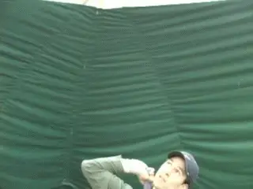

# The Kick Serve: Part 3: Philosophic Issues, Common Mistakes

### Chris Lewit

**A complete competitive server can hit all three variations of the
kick.**

In Part 1 of this series on the kick serve, I presented the technical
reference points for the kick serve motion. This included explaining the
three versions of the kick that a player needs to be a complete
competitive server. These versions are true topspin, slice topspin, and
twist. [Click Here](Keys%20to%20the%20Kick%20Serve.docx) Then in Part
2, I presented the drill progressions and a training plan for developing
the kick in all variations. ([Click
Here](Constructing%20the%20Kick.docx).)

Now, in this third article, I want to further discuss some important
questions regarding this controversial serve and outline what I see as
the 5 most common mistakes in teaching and hitting the kick.

Finally, in the upcoming in the fourth article, I'll present the last
critical component in my system, the prehabilitation and strengthening
exercises I use with my students everyday at my academy.

**There are plenty of \"kick\" issues worthy of discussion.**

### Preface

Let me preface this discussion by saying that, although I have been a
certified personal trainer, I am not a doctor, nor am I physical
therapist. This article presents my personal observations regarding the
kick serve. It is intended to promote discussion and to explain my views
on some of the common movements I see that in my opinion can lead to
injury.

But this article is not meant to dispense medical advice. I advise all
readers to carefully consider my point of view, as well as those of
others, to do their own research, and to make an informed decision about
following the training protocols outlined in this series.

### Kick Philosophies

So first, some philosophical points. I invite all readers to \"kick\"
around the following ideas with an open mind. It is only through
intelligent, respectful discussion and further research that some of the
kick serve conundrums can be resolved.

***The big question of course is this: is it \"dangerous\" to teach
the kick, especially to young players? I believe the kick serve can be
learned safely and efficiently following my system. However, there seems
to be a lot of disagreement in the coaching community about the safety
of this serve. Many pros fear teaching the kick for liability reasons or
because they have become convinced that the serve will ruin their
students' backs or shoulders.***

**Is there definitive research regarding injuries and the kick?**

I think this fear of the kick is misguided. Perhaps it's even one of
the great myths in modern tennis teaching. Where is the definitive
research proving that the kick will ruin the back and shoulder? Has
there really been enough evidence to condemn teaching this serve, or is
most of the fear based on insufficient data, rumor and/or supposition?

I have not seen any research that convinces me that this serve will
cause injury in well-trained and well-conditioned athletes. In fact, my
own experience as a player and in teaching the kick in my academy
supports the opposite conclusion. This serve can be used and taught
safely, even at a young age.

I was heartened in a recent conversation with Pat Harrison at the US
Open, whose boys Ryan and Christian, are some of America's brightest
prospects, when he admitted to me that he taught them the kick serve
very young\--with a back arch\--at ages 7-10. But it takes a brave coach
in today's current tennis philosophical and political climate to teach
the kick this very contrarian way.

### Research?

As I stated, this is my opinion and it would be great to see research
that provided more definitive answers to the many questions coaches and
players ask.

**What is the right age to teach the kick and with what supplemental
training?**

Can the kick be taught safely with or without an accompanying stretching
and strengthening program? What age of introduction minimizes the chance
of injury? At what age is it safe to teach the aggressive left-to-right
hand and arm action and shoulder motion?

Should there be a \"no kick\" type rule in tennis for young 10-under
kids, similar to the \"no curve\" rule in some baseball leagues? Or can
a well-trained and supple shoulder safely endure the kick motion at a
young age, say 5-10 years old? What age window of introduction maximizes
the attainment of kick serve mechanics? Is it easier to learn the kick
at 7 than at 17?

Do most of the top tour players use a back arch in the kick? If so, how
much and when? Should players be taught a back arch or does that just
happen? Does teaching the arch put too much stress on the spine and back
muscles?

**No doubt you find pronounced back arch in most pro kick serves.**

Can the risk of injury be minimized with a good strengthening and
stretching program? What are the long-term (20-30 year or more)
consequences of hitting a heavy kick on the shoulder and back? Will the
kick shorten the lifetime career of a server?

Now think of how you would answer these questions. More importantly, ask
yourself the basis for your answers. Is it research or study of video?
Is it experience and observation? Or is it what someone may have told
you, that is, rumor? Tennis pros are loathe to admit that they don't
know the definitive answer to every tennis question, but the best
coaches know both what they know, what they don't know, and what is
debatable.

I think it is important for coaches to be honest with students and
clients. Tell them the truth. \"The jury is still out on this or that.\"
Don't become dogmatic on a subject that you are not sure of to mask
your insecurity.

### To Arch?

***[There is significant disagreement in the coaching community about
whether pros should\--or even do\--arch their backs on the kick, and if
so how and when.]{.mark}*** I think the high-speed video shows without
question that many top pros do indeed arch their backs significantly on
the kick.

**The question is whether the back arch is stressful.**

***[The video shows that at some point in most kick serves there is a
significant convex shape in the back.]{.mark}*** This seems to be
particularly true in servers with pinpoint stances, which is a stance
that I personally favor. The question is not does it happen; the
question is whether the back arch is a stressful or harmful motion.

It would seem logical that a repetitive extreme curving and snapping of
the spine would put this area, including the related musculature under
more stress then when serving with a straighter back. If this is true,
the question is whether the benefits of this action outweigh the risks
of injury and whether the risks can be mitigated.

There are similar issues around the modern open stance forehand. The
extreme rotation is believed by many to be more stressful on the hip and
core, but the coaching community by and large has accepted this
technique, presumably because the performance gains are worth the risk
and the injury potential can be minimized.

We know the open stance forehand may be more stressful to the body and
may cause more injuries, but we teach it because it gives our students a
performance edge on the court. Following the same logic, I argue that
the same approach should apply to teaching the extreme kick.

As I have argued, the ability to hit this serve is integral to high
performance. Not teaching it\--including the back arch\--is a disservice
to the student who aspires to play at the highest level. If you don't
teach a twist with a back arch, I believe you are taking away a
performance edge.

**I believe the back arch\--and all the kick elements\--can be taught
safely.**

I posit that without a back arch, the maximum angle and sidespin on the
kick cannot be achieved, limiting the player's tactical effectiveness.
This may be a debatable point, but my approach is based on this
postulate.

***[Simply put: more back arch equals more angle (specifically serving
to the ad court) and more sidespin on the ball, which allows a player to
strategically pull his opponent off the court - a critical advantage in
today's pro game.]{.mark}***

### Sooner is Better?

I simply believe that the body can be taught to arch the back safely,
when the player follows the proper stretching and strengthening program.
In fact I think it is possible to argue that it is easier and safer to
develop this strength and flexibility when players are younger, rather
than adding new physical stresses to the motion of an established player
later in his junior or early pro career.

***[For these reasons, my concern about back injury is not extreme,
except in the case of prior susceptibility, such as a previous back
injury, or scoliosis, etc. I think we need to draw the line in these
cases and players who have a history of back problems should avoid
learning a twist with a back arch. They should focus on learning good
topspin and topspin slice serves. But for those players with healthy
backs, the benefits of a great twist are too important to ignore because
of what I feel is an unfounded and exaggerated fear of
injury.]{.mark}***

I would also draw a distinction between coaching recreational versus
competitive players. In my business, all the students I work with are
aspiring towards some kind of high performance competitive tennis.
Therefore, the coaching protocols for me might be different than for a
recreational coach teaching adult club players or juniors who are just
playing for fun.

One other critical issue that bears on injury is how the kick is often
hit and/or taught. In my opinion, there are 5 common kick serve mistakes
that not only reduce the effectiveness of the serve, but that are
possible causes of injury. So let's go over them now.

**A common error is to bend backwards at the waist\--rather than arching
the back.**

### Error 1: Bending Backwards at Waist

The first error I often see has to do with how players try to bend in
the kick motion. ***Players often bend backwards from the waist and
push the hips out. There is no back arch\--rather there is an extreme
lean backwards from the waist with the back more or less straight. I
believe this move puts a lot of pressure on lower
back.***

***The correct way to bend the back is to push the chest out and pull
up from the rib cage, arching the more supple middle
back.*** We'll go into this in more detail in the
prehabilitation exercises in the next article. At my academy players
actually work on this exact move as a variation of a yoga stretch in our
system.

**Another tendency is to move the contact back too far, behind the edge
of the body.**

### Error 2: Tossing Behind

***It's true that the toss for the kick serve is more to the left,
and also, possibly slightly further back, compared to flatter
variations.*** ***But too many players exaggerate
this. In an attempt to get more spin, they move the contact point back
far behind the front edge of the body. This reduces power and
depth.***

***In my opinion it can also put excessive stress on the
shoulder/rotator cuff. If there is any truth to the correlation between
the kick serve and injury, it may have to do with players making contact
too far back over many years. Sadly, this ball position undermines the
strategic value of the serve by taking away so much
speed.***

Young players, and all players for that matter, should resist trying to
hit more spin than is natural with a proper contact point. The toss
behind your body may give more spin, but the player will lose MPH on the
serve and end up using more arm in the serve rather than the whole body
kinetic chain.

**Don't try to force the back to snap artificially before the toss.**

### Error 3: Early Back Snap

***The back arch should happen smoothly and rhythmically as part of
the motion.*** But some players start the arch
artificially so it occurs too early in the serve. These players tend to
snap the back with a jerky and spasmodic motion. I often see this
happening before the toss.

***If you look at the pro examples, however, the arching starts later,
well after the release of the ball. This early back snap is a forced
movement, as compared to the natural arching in a well developed kick.
It's painful to observe and in my view puts additional unnatural
pressure on back, pressure that could increase the risk of
injury.***

**In the attempt to get more spin some players actually toss to the
opposite side of the body.**

### Error 4: Toss Extreme Left

***One tendency on the toss is to place the ball behind the edge of
the body. Another is to toss too far to the left. In a worst case
scenario, these two factors can be combined.***
It's true that some of the great servers pull the ball quite far to the
left. Pete Sampras routinely made contact over the center of his head or
even further left. But this is the most extreme case with an elite
server and Grand Slam champion. Meanwhile, I've seen lower level junior
and pro players actually making contact further to the left than Pete,
in fact on the actual left side of the body.

***It may be true that you can generate more kick from this position,
but again you lose speed. It also makes it very difficult to land on
balance and recover for the next shot. More importantly, I believe this
contact point goes too far and creates far too much stress on the back
and shoulder, again, a possible factor in increasing the chance of
injury.***

**Don't force the extreme right side finish.**

### Error 5: Abbreviated Right Finish

***The final error I commonly see is abbreviating the finish on the
right.*** And, speaking of Pete Sampras, yes you
can find examples of him not finishing all the way across the body. But
it all cases, his motion appears totally relaxed. That's not what I see
when I observe this error.

The player exaggerates the right finish and appears to force the
racket to stay on the right side, and then stop abruptly. We know from
biomechanics that one key to any stroke is a smooth and natural
deceleration of the racket head. Forcing the right
finish doesn't accomplish that. In my opinion, this puts unnecessary
stress on the rotator cuff. ***[[It is preferable to release the serving
arm over to the left pocket after swinging all the way
out.]{.mark}]{.underline}*** If on occasion the hand tends to stay more
right as a consequence of the swing path, that's fine, but it should
happen on its own and not from a mechanical attempt to imitate Pete.

So that's it for this installment on our journey exploring the kick
serve. It's been great to hear from so many Tennisplayer subscribers
about the articles, so keep the comments coming in the Forum, please.
Next we'll see the awesome series of training exercises that complete
my kick system and give you the full training approach you need to
develop this awesome serve. Stay tuned.

