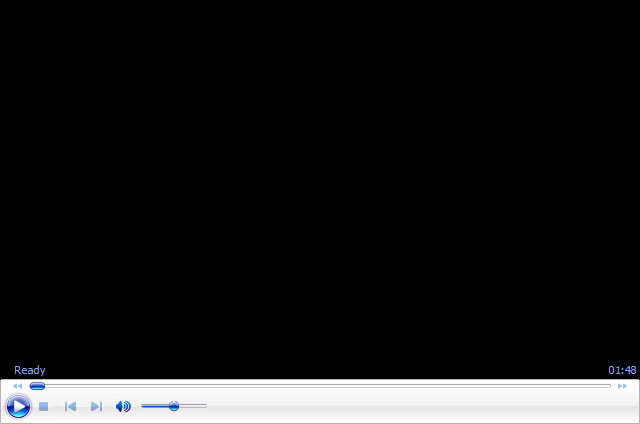

# The One Handed Backhand - Foundation

### The One Handed Backhand:

### Foundation

### John Craig

How do players really move to ball on the one-handed backhand? Or any
shot? Watch John Craig demonstrate (with effortless grace I might add)
the gliding steps out to the ball that meld with the turn. This is the
first article in a five part series on the one-hander.

Yes on that shot that Roger Federer and Stan Wawrinka and a kid named
Dominic Thiem are all using in the alleged dominant day of the two
hander. Which backhand is right for you? It may not be what you think.
But if you think it is the one-hander, this is a good place to start.

John is a former Division I Collegiate player with over 35 years of
playing, coaching and teaching experience. He is an Elite member of the
USPTA, and has been an avid player, student and coach since his passion
for tennis flourished in 1976. Based in Orange County, California, John
has developed hundreds of students into quality players over the course
of 3 decades.

John has held a variety of prestigious tennis positions, including
serving as the Director of Tennis at the legendary John Wayne Tennis
Club in Newport Beach, CA. John was also the founder and Director of The
Edge Tennis Academy, a high-performance Junior Development program, also
in Newport Beach. In addition to developing his latest project -
Performance Plus Tennis, John is also a Pro at the Newport Beach Tennis
Club.

