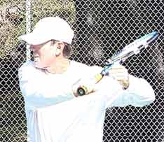

# The Slice or Underspin Backhand

### The Slice or Underspin Backhand

### Scott Murphy

**Here I demonstrate the basics of the multi-purpose slice backhand -
you can't be a successful competitor without it.**

Despite the great emphasis today on the topspin power game, the fact
remains having a slice backhand is an absolute must, whether you hit
your backhand with one hand or two.

The use of underspin is multi-faceted: for groundstrokes, return of
serve, approach shots, half volleys, and volleys. Patrick Rafter is an
example of a player who may use all of these possibilities in a single
point. Andre Agassi may hit two-handers for 90 percent of a match, but
suddenly call on the slice backhand in a given situation. Then there's
the great Steffi Graf who hit virtually all of her backhands with
underspin.

You can't be a complete player or a successful competitor without it.
In match play you need slice in a wide variety of situations: to
neutralize a heavy topspin shot, to mix up the pace of a rally, to keep
the ball low, to buy time on defense, and play balls that are low, high,
wide, or short. (It's worthwhile mentioning that some tennis pundits
prefer to call slice, \"underspin\" because in the literal sense a
sliced ball curves. However, I think for most people the shots are
considered one in the same and in this article I'll use the terms
interchangeably).

**Rafter's beautiful compact backhand slice - ideal for returns,
baseline rallies, and approach shots.**

**Initial Difficulty**

Although developing this shot is critical, it has been my experience
over the years that the vast majority of players find the slice backhand
to be difficult initially and have to be encouraged to stick with the
shot, practicing its essential elements repeatedly until they become
more familiar.

Before covering those elements, I'd like to dispel a couple of common
misconceptions about this shot. First, a good slice backhand is neither
\"chopped\" nor \"scooped.\" Trying to use these motions can put the
ball in the bottom of the net or cause it to pop up and float.

**The best slice backhands are actually drives**
that can be hit with varying degrees of underspin, and we'll present
the proper swing trajectory to allow you to do this.

### Grip

The Continental grip is almost universally considered the best grip to
hit slice. This is because the continental allows the player to open the
racquet face more naturally.

**The continental is the most widely used and effective grip for the
slice backhand.**

With some students, learning the continental can become a real bone of
contention, usually because they are not using it effectively in other
aspects of their game, such as the serve or the volleys. Trying to learn
the slice, players have a tendency to quickly switch back to their old
backhand grips. For a one-hander, this is the full eastern backhand. For
a two-hander, it's usually a right-handed forehand grip.

While it is possible to hit a version of the slice with a full (or
strong) backhand grip, players who don't shift to the continental
ultimately work a lot harder to do so. This is because, with the
stronger grip, it's much harder to **get the leading edge of the
racquet on the outside of the ball.** The result,
typically, is a ball with too much sidespin that is also much harder to
direct, and sacrifices pace. At the other extreme, trying to slice with
a forehand grip will cause the ball to float, as well as create possible
stress on the wrist.

Granted, if you haven't used it before, the first attempts with a
Continental grip can be very disorienting. But with a real understanding
of what makes it work and lots of repetition, this shot will eventually
become very comfortable. In fact, many experienced players think it's
the most natural and flowing stroke in the game.

### Preparation Phase

As with all other shots, start by making sure **you use your eyes
effectively.** The earlier you see the ball off
your opponent's racquet the sooner you'll be able to determine if your
reply needs to be hit with slice, and the more quickly you'll be able
to get into position to hit it.

**Mark Philippoussis demonstrates a perfect turn for the slice backhand.
Note the step with the left foot and the full coil.**

Make a ready hop just before your opponent hits the ball and when you
see the ball moving toward your backhand, step to the side with the foot
nearest the ball and begin to rotate your hips and shoulders. Create a
full coil by keeping your head and shoulders level and connecting the
hitting shoulder with your chin. Be sure to keep your eyes on the
incoming ball.

On the backswing, your hitting arm should bend to about a 45-degree
angle. If you bend your arm much more than that you risk a late hit or a
choppy swing. The racquet head should be just a little above the plane
of the incoming ball, higher or lower depending on the actual height of
the particular shot.

To facilitate the change of grip and provide support, your non-racquet
hand should be on the throat of the racquet during the entire backswing.

At the completion of the backswing, the wrist should be set at a
45-degree angle relative to the forearm. The racquet face is now open
with the edges of the racquet more or less even.

This is very important. The inside edge of the racquet is the one
closest to the ear. The outside or \"leading edge\" is the one that
moves toward the ball first. If the outside edge is much lower than the
inside edge at completion of the backswing (as in the topspin backhand),
this indicates that the backhand grip is too strong or the wrist
position is poor.

###  Completion Phase

### 

**Your hitting arm should bend at about 45 degrees on the turn. The
racket face is open, the edges close to even.**

**Just prior to the forward swing, plant your back foot (the left foot
for right-handers) and transfer your weight onto the front foot as
straight-ahead as possible.** **Be sure to bend
your knees (except for very high balls), but stay as erect as possible
from the waist up.** **Dipping the lead shoulder
is a common source of errors when hitting with
underspin.**

***Avoid hitting from an open stance. Ideally you want to step into
the shot, but if you're forced to step more across your body that's
usually ok.*** **[This is because you can still hit
the slice well with a somewhat later contact point than on the other
groundstrokes.]**

**[With this later contact point, you're able to carry the ball longer
because it allows for maximum extension of the arm into the
shot.]** ***Hitting a slice backhand too early can
actually result in a weak, \"floaty\" shot or a ball that lands in the
net.***

**While contact is still at the front edge of the body, the slice can be
hit with a somewhat later contact point than other groundstrokes.**

There are those who advocate a severe \"high to low\" forward swing.
This can definitely produce slice, but tends to cause the ball to float
and lose pace. It may also give you the wrong idea about the finish. If
you study the animations of Rafter or Philippoussis, you see that
**although the racquet moves downward after the hit, it still finishes
high with the hand position close to the same height as a topspin
drive.**

For these reasons, I prefer the racquet head start only slightly above
where you'll actually contact the ball. This makes for a simpler swing
that allows you to generate plenty of spin, but still \"drive\" the
ball.

As you bring the racquet forward maintain a firm wrist. You arm should
straighten out prior to contact, and stay that way all the way through
the finish.

  ----------------------------------------------------------------------------------------------------------------------------------------------------------------------------------------------------------------------------------------------------------------------------------------------------------------------------------------------------------------------------
  
  -------------------------------------------------------------------------------------------------------------------------------------------------------------------------------------- -------------------------------------------------------------------------------------------------------------------------------------------------------------------------------------
  **The finish position on the slice. Too much emphasis on hitting high to low can cause the ball to float.**                                                                            **Note how Rafter keeps his shoulders almost square to the net with his non-hitting arm moving in the opposite direction from the hit.**

  ----------------------------------------------------------------------------------------------------------------------------------------------------------------------------------------------------------------------------------------------------------------------------------------------------------------------------------------------------------------------------

High speed video shows that at contact the racquet head will actually be
square to the court. But trying to consciously create this position
leads to real trouble. **Don't use the wrist to adjust the racquet
face.** Visualize the face as slightly open at
contact and allow the forearm to roll through the shot naturally and
make the adjustment. The racquet face will naturally reopen and stay
that way to the finish.

**Aim for the outside of the ball.** The image of
hitting across the ball helps solidify ball contact. The follow through
should be outward toward the top of the net and upward toward the
target.

**During the swing the player should strive to keep the shoulders
sideways to the net position, and minimize the torso rotation. To ensure
this, at the instant you begin the forward swing send the non-hitting
arm in the opposite direction.**

  -------------------------------------------------------------------------------------------------------------------------------------------------------------------------------------
  
  -------------------------------------------------------------------------------------------------------------------------------------------------------------------------------------
  **Philippoussis hitting through a backhand slice return - a must for a well-rounded game at all levels.**

  -------------------------------------------------------------------------------------------------------------------------------------------------------------------------------------

### Distance to the Ball

**Finding the ideal distance between your body and the ball takes
experience. If you're too close, you'll wind up leading the swing with
your elbow, in which case the racquet face will be late and too open. If
you're too far away your arm will be overe-xtended and you won't be
able to get any bite on the ball. For high-bouncing balls however, you
do want to keep your body somewhat further away, and let your front leg
straighten during the hit.**

That covers the basic mechanics of generating slice, something you can
apply to many situations, some of which we'll be discussing in further
lessons. No matter what style you play, it will make your game more
flexible and well-rounded.

**Scott Murphy** is from Marin County, California where he started
playing tennis at age 5 in a family of tennis nuts. Both of his parents
were major influences in his development. He also took lessons from
Marin legend Hal Wagner and former top 10, Harry Roach. Scott is a
graduate of the University of California at Berkeley where he played
baseball and football but continued to work on his tennis game with
renowned coach Chet Murphy. He was the head pro at San Domenico/Sleepy
Hollow Tennis Club for over 20 years. He also directed the Nike Tahoe
Tennis Camp at the Granlibakken Resort for 10 years. Scott now teaches
privately in Ross, Marin County and in the summer he directs the Tuscan
Tennis Academy which he founded in Quarrata, Italy.

Check out Scott's website at
[scottmurphytennis.net](http://www.scottmurphytennis.net)

You can contact Scott directly at: <scottmrph@yahoo.com>
