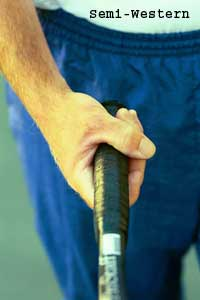

# Private Lessons: Understanding The Forehand Grips

### By Kerry Mitchell

------------------------------------------------------------------------

  ----------------------------------------------------------------------------------------------------------------------------------------------------------------------------
                                                   
  ----------------------------------------------------------------------------------------------------------------------------------------------------------------------------
                                  **Extreme forehand grips make it more difficult to develop the mental image of the hand and racquet face.**

  ----------------------------------------------------------------------------------------------------------------------------------------------------------------------------

In Part 1, we looked at the continental grip, which was once nearly
universal, but is under utilized by most players, both at the pro and
the club level. Now let's take a look at various forehand grips in
modern tennis and the key images associated with mastering them and
incorporating them into your game.

As I said in the first article, **the most difficult process in
understanding grips and grip changes is the visual or mental
aspect.** Correlation between the position of the
hand and the angle of the racquet face has to be created visually in the
mind's eye for each grip position.

This is very difficult when transitioning between two extreme positions
because visually/mentally they are so different. One of the best reasons
the past generations played with just one grip was the ease of
transition between different shots.

With the rise of semi-western and western grips, developing images to
make these transitions is one of the biggest challenges faced by most
club players.

Since the grip changes are so great, today's players have to practice a
lot with each grip position to acquire clear visual and mental images.

The other mental process to understand about grips is that the image and
the reality of the contact position don't always correlate perfectly.
Some coaches call this over-compensation**. It means the image the
player develops is more extreme than the reality of the motion. This
exaggerated image or over-compensation** is used to
correct, or to hold in check, natural tendencies most players have in
their swings.

This is true for the topspin forehand regardless of the grip, but
especially for the numerous players who have gone \"western.\" The
reality is for all the grips, the racquet face is perpendicular with the
court at contact, or very close to perpendicular, as it brushes up
through the ball from low to high. (Although some of the Advanced Tennis
high speed footage shows that on high balls pro players actually are
closing the racquet face slightly. [Click here for more
info](http://www.advancedtennis.com).)

 

**The mental image of the racquet face closed for topspin as it
approaches the ball. Note: The face is slightly more closed for the
extreme grips.**

However, **to create topspin with the modern forehand grips, the
mental image should be of the racquet head approaching the ball with a
closed face.** This is true for all three major
grips, however, for the Western and Semi-Western, the angle will be
slightly more closed than for the Eastern.

**As players swing through the forehand, there is a natural tendency
to open the palm so the face of the racquet points
skyward.** This causes a loss of ball control and
makes it extremely difficult to hit consistent topspin. This natural
body reaction has to be controlled through the image of the closed face.

**The faster the swing speed and/or the more vertical the swing
trajectory, the quicker the palm of the hand/racquet face wants to
open.** For this reason, the more Western your
grip, the more important the image of the closed face becomes.

At the highest levels of the game, the kind of imaging required can be
quite extreme due in great part to the speed of the balls and the speed
of the swing required to return them. As you watch matches on
television, you will often see a player, after missing a ball long, do a
practice swing, either with their hand or with the racquet, emphasizing
the closed position of the racquet face (or palm) in the contact zone.

  ----------------------------------------------------------------------------------------------------------------------------------------------------------------------------------------------------------------------------------------------------------------------------------------------------------------------------------------------------------------------
                                                                                                                                                      
  -------------------------------------------------------------------------------------------------------------------------------------------------------------------------------------- -------------------------------------------------------------------------------------------------------------------------------------------------------------------------------
                                               **The Western grip so common in junior tennis with the hand mostly underneath the handle.**                                                                                          **The less extreme or Semi-Western. Part of the hand is behind and part is underneath.**

  ----------------------------------------------------------------------------------------------------------------------------------------------------------------------------------------------------------------------------------------------------------------------------------------------------------------------------------------------------------------------

Mental imaging is often difficult for the club player to control because
natural swing patterns (free and relaxed), good preparation, and
footwork are difficult to achieve.

The other factor that compounds the difficulty for club players is the
added ball speed created by the modern racquets which causes them to
tighten up and panic, resulting in an abbreviated swing with an open
racquet face. For this reason, the closed face image is a common key
across all the forehands.

Now let's look at the grips individually, discuss some of the pluses
and minuses, and note some other images associated with each one.

**The Western Grip**

**Actually, there are two forms of the western forehand grip: the
Extreme Western and the Semi-Western.** These grips have become very
popular over the last 15 years among players as well as instructors.

  -------------------------------------------------------------------------------------------------------------------------------------------------------------------------
                                                        
  -------------------------------------------------------------------------------------------------------------------------------------------------------------------------
                              **Visualizing the racquet head above the wrist corrects the common problem of incorrect positioning at contact.**

  -------------------------------------------------------------------------------------------------------------------------------------------------------------------------

Both western grips allow a player to hit more topspin, which in turn
allows him/her to hit the ball harder and higher over the net. **One
of the problems with any western grip is it requires what I call a
\"swing away mode\". The more fully you swing the better the
result.**

**Without a full swing the racquet head at contact trails too far
behind and/or below the hand. This causes the face of the racquet to
open too dramatically producing an error.** It also
causes the swing to be too wristy. The arm and hand stop, but the
racquet head keeps going, causing a loss of racquet head control.

The image I use to correct this is the image of the racquet head above
the wrist at contact. In general, this is another over-compensation,
although, again, on some balls, we can actually see pro players in this
position.

**Even though the extreme western grip is extremely common, in my
opinion this is the worst possible forehand grip position if you want to
play a complete game.** The transition from an
extreme western to a continental grip required for the volley and the
serve (moving between the two most extreme possible grips) is very
difficult and often not achieved very successfully.

  ---------------------------------------------------------------------------------------------------------------------------------------------------------------------------------------
                                                         
  ---------------------------------------------------------------------------------------------------------------------------------------------------------------------------------------
                                                  **The western is a "swing away" grip, which causes problems below the highest levels.**

  ---------------------------------------------------------------------------------------------------------------------------------------------------------------------------------------

**With the extreme western grip, the swing pattern is extremely
vertical. This is necessary to get the racquet face into the proper
position at contact.** It is almost impossible to
hit a completely flat ball with this grip position and the extra swing
speed required for this grip position creates a greater potential for
error.

The swing pattern also has an extreme inside out shape. This pattern is
essential to produce quality topspin. If the inside out pattern is not
correct, the player can actually come across and under the ball,
creating underspin and right to left side spin. This causes the ball to
fly and also to fade to the right.

**The extreme western also requires open stance foot positioning to
allow for a complete swing**. **[*[This is because
the contact point is further back in the stance (nearer the back foot)
than other grip positions, making trunk rotation impossible with a
closed stance.]* [Open stance positions make hitting the ball
\"late\" in the stance possible for every grip position. This is one of
the major reasons why open stance hitting is so popular
today.]]**

  --------------------------------------------------------------------------------------------------------------------------------------------------------------------------------------
                                                               
  --------------------------------------------------------------------------------------------------------------------------------------------------------------------------------------
                           **When the racquet head and hand are either too late or late, this image of the racquet head above the wrist corrects the problem.**

  --------------------------------------------------------------------------------------------------------------------------------------------------------------------------------------

**The Semi-Western Grip**

The semi-western forehand grip is very similar in a lot of respects to
the extreme western, but has definite advantages over the extreme
western. With the hand in a less extreme position getting the racquet
head through the ball is much easier and makes for a less wristy shot.

Still, even with the semi-western, players often have the same problem
getting the racquet head to the contact. Again, the tendency is that the
racquet head trails behind the hand and has to be raised with the
rotation of the forearm and wrist to meet the ball at the proper angle,
producing errors both into the net and out of the court.

  ----------------------------------------------------------------------------------------------------------------------------------------------------------------------------------------
                                                         
  ----------------------------------------------------------------------------------------------------------------------------------------------------------------------------------------
                                                      **With his Semi-Western grip, Agassi can hit flatter and penetrate the court.**

  ----------------------------------------------------------------------------------------------------------------------------------------------------------------------------------------

**Unlike the extreme western, the semi-western forehand swing pattern
can have a more horizontal plane producing a flatter, more penetrating
ball which is essential to playing an all court
game**. Transitioning from the semi-western grip
position to a continental grip position is much easier (at least
compared to an extreme western grip position).

The semi-western is the most flexible grip position of the two western
grips in terms of stance positioning as well. It is easy to flow between
open and closed stance hitting. This is another essential element in
being a more rounded player who uses their good ground strokes to get to
the net.

Both western grip positions are most successful on slower, high bouncing
surfaces where there is more time to set up for the shot and complete
the lengthy swing pattern. It is very difficult to \"push\" with either
western grip. So, if you are prone to half swinging or poking the ball
in match situations then these grip positions are not for you.

**The Eastern Forehand**

  ---------------------------------------------------------------------------------------------------------------------------------------------------------------------------------------
                                                               
  ---------------------------------------------------------------------------------------------------------------------------------------------------------------------------------------
                                                           **The modern Eastern grip puts most of the hand behind the handle.**

  ---------------------------------------------------------------------------------------------------------------------------------------------------------------------------------------

**The eastern forehand grip is the most versatile of all the forehand
grips, due in large part to the fact that a player can hit either a flat
or topspin shot; with an open or a closed stance.**

A closed, or what I call a neutral stance, is preferable to open stance
positioning with the eastern grip because of timing problems when the
ball is either high or too far back in the hitting zone. This makes
being able to hit on the rise essential.

Swing speed, swing length, and the swing path (the angle at which the
racquet travels through the hitting zone) can vary considerably with
this grip, again making it more versatile than either western grip.
**Unlike a western grip (a \"swing away\" grip position), the eastern
grip allows for a variety of swing speeds (slow or
fast).**

The swing length can be very compact or very loopy. Obviously, loopy
swings, just like western grips, make hitting on the rise more
difficult. **The swing path with the eastern forehand is more
horizontal in nature but can be easily adapted to create topspin with a
slightly more vertical swing path when needed.**

  ----------------------------------------------------------------------------------------------------------------------------------------------------------------------------------------
                                                           
  ----------------------------------------------------------------------------------------------------------------------------------------------------------------------------------------
                                                           **With the Eastern grip, learning to hit on the rise is a necessity.**

  ----------------------------------------------------------------------------------------------------------------------------------------------------------------------------------------

At the higher levels of the game there is much more of a need to adjust
all of these aspects to be successful. The eastern forehand grip
definitely accommodates the ability to adapt the stroke when needed in
match play.

Transitioning from the eastern forehand grip to the continental grip is
the easiest of all the grip transitions. One reason is the hand has to
move only slightly on the racquet. The second reason is mental. Since
the grips are very similar, the mental and visual understanding of how
the hand and racquet face correlate are easier to understand than either
western grip.

As the speed of the game has quickened over the last few years, the
player of today has become faster and more fit creating a need for a
more varied game\--a player who can do it all. If you want to be that
kind of player, then learning the necessary grips should be your highest
priority. Being able to transition between grips is difficult, but
necessary to reach one's potential.

Next, we'll look at the transitions and images for the backhand grips,
for both the one-handed and two-handed player.

|  | numerous ranked junior players and coached |
|  | a series of championship high school teams. |
|  | He was highly ranked both sectionally and |
|  | nationally in men's 30 and 35 singles. |
|  |  |
|  | After 15 years as the Head Teaching Pro at |
|  | the John Yandell Tennis School in San |
|  | Francisco, California Kerry and his partner |
|  | are now splitting time between homes in |
|  | Merida, Mexico and Toronto, Canada. He has |
|  | continued to coach and to have great |
|  | competitive success winning Canadian |
|  | National seniors titles---not to mention |
|  | continuing to write articles for |
|  | Tennisplayer from his unique perspective. |

------------------------------------------------------------------------
