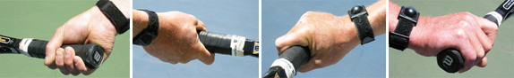

# Weaponize Your One Handed Backhand

### By Geoff Williams

{width="3.3333333333333335in"
height="2.5in"}

**Weaponizing your one-handed backhand: a physical and mental event.**

I did not hit any topspin back hands for my first 12 years of tennis. My
father, who was just a hacker, never hit a single topspin back hand in
his life. As a child I was a fan of Ken Rosewall. My dad taught me that
slice at the age of 10-11.

A lack of topspin didn\'t stop Rosewall from winning 8 grand slams and
making the US Open final at age 39. But one day, after watching Bjorn
Borg play John McEnroe, and seeing Big Mac hit one-handed topspin shots,
I decided to learn how to hit it myself.

I had no idea what I was doing, so I just grabbed the frame in a full
eastern backhand grip. Immediately I hit the next three balls directly
down into the dirt. Eventually, I switched to a \"Uni Grip.\" That means
that, instead of shifting grips I turned the racket over and hit the
ball with the same side of the strings on both sides.

{width="6.474048556430446in"
height="0.9925371828521434in"}

My Uni Grip gave me a strong semi-western grip on both the forehand and
the backhand sides, ideal grips for heavy spin. With this change, I
officially became a topspin hitter.

{width="3.3333333333333335in"
height="2.5in"}

**The Uni Grip in action going both ways.**

I decided to make this change in part for quicker return reactions. But
I also committed to driving the ball on my backhand and backhand
returns. My velocity improved immediately. Eventually I developed the
capacity to rip the ball with pace but also with high levels of spin.

Some people made fun of my new stroke, due to the unusual grip. But
others would get behind the fence behind me and watch the shot from the
rear and ask me, \"How do you do that?\"

Since the change over 30 years ago, my attacking topspin backhand has
become my best shot. I went from a mindless slice that laid up for
anyone to crush, to a backhand with real velocity and heavy spin.

Now, I don\'t ever slice my backhand return and I don\'t slice much at
all, except when chipping/charging and I want to keep the ball low and
away. My shot was not a conservative shot, and it goes against what many
coaches teach. It certainly didn\'t end up look like Johnny Mac\'s.

{width="3.3333333333333335in"
height="2.5in"}

**I never slice a backhand return.**

But I could see that fewer players were now able to beat me attacking my
backhand side. And that in general is still the most common stratagem,
attack the backhand, especially when facing a one-hander.

No one really had a complete game at my 4.0 to 5.0 level, especially at
public parks and small tournaments that I played. When I ran into a
player who tried to attack my backhand, I began to hear a voice. And the
voice said: \"This point is over now.\"

And usually it was. When the voice spoke I relaxed and became highly
confident. I would open the court, get my opponent on the run, and
generate a weak shot for another easy put away.

{width="3.3333333333333335in"
height="2.5in"}

**As my backhand became stronger, I began to hear a voice.**

Today, the voice is seldom wrong. My goal is to construct points so that
I can crush backhands. Drive opponents wide, get weak returns, and put
their weak, crappy shots away.

I developed an attitude and believed \"I\'m going to kill this shot.\"
There\'s nothing like the sweet feeling of absolutely nailing a heavy
backhand winner. And that\'s what I hope you will be able to do after
reading this piece. Absolutely nail your one hander, not just on
sitters, but on serve returns as well, so your backhand will become a
great source of happiness.

{width="3.3333333333333335in"
height="2.5in"}

**Nailing the one-hander: a great source of personal happiness.**

But learning how to do all this without coaching, or mentors, has at
times felt like an impossible journey. In this article, I\'d like to
shorten that journey for anyone interested in learning how to do the
same thing. As you will see however, the stroke that I created is
unorthodox in many ways.

**Creating Rotation**

**[[I believe the fundamental key to weaponizing your topspin backhand
is body rotation, specifically hip rotation. The goal is to viciously
rotate your hips into the shot.]{.mark}]{.underline}**

**This rotation is the source of racket speed leading to pace and spin.
You want to strike the ball with speed not moderation, strike in offense
rather than in defense.**

So, let\'s see how to set up this hip rotation, by looking the
preparation, including the unit turn and the footwork.

**[[The first point that makes this stroke unusual is the position of
the hands. Unlike virtually any other one-hander, I keep the non
dominant hand on top of the handle.]{.mark}]{.underline}**

**[[This is similar to the way the majority of two-handers hold the
racket. But it is unlike any coach will currently
teach.]{.mark}]{.underline}**

Have you ever seen a baseball player with his batting hands separated in
the middle of the bat? Only when he bunts. And that\'s what too many
one-handers are doing, bunting the ball.

{width="3.3333333333333335in"
height="2.5in"}

**The key to weaponizing: vicious hip rotation.**

I believe that the typical one-hander is limiting his turn with his hand
position. Two handers have the advantage over the one-handers on high
balls and when returning kick serves because the non dominant hand is
not restricting their full coil.

I have incorporated this same advantage into my one hander. With both
hands close together on the grip, the forearm isn\'t restricting the
take back.

This allows me to create a faster, bigger coil. This increased coil is
then released with the hip rotation. This is what creates speed combined
with spin, the two characteristics of the heavy ball.

{width="3.3333333333333335in"
height="2.5in"}

**I increase the coil more like a two hander with the hands closer
together.**

**Mental Coil**

The coil on the backhand is not just physical. There is what I call the
\"mental coil\" as well. **[[The will to strike a high velocity flat
shot or a superior rpm topspin shot is also a mental
thing.]{.mark}]{.underline}**

Having that mental purpose is just as important as the physical coil. A
flaccid, passive mind will never produce a weaponized backhand. Do not
mistake relaxation for passivity!

There is a way to relax while ready to strike. The coil is a combination
of tension and relaxation. **[[Learn to wait in the coil like a snake,
ready physically and mentally to strike out with full force when the
target arrives.]{.mark}]{.underline}**

**Uncoil**

Now let\'s look closely and see what happens in the forward swing. Watch
that the front hip opens first. Watch how the arm and racket drag
slightly behind. This is a similar lag to what Brian Gordon has found on
the ATP forehand ([Click
Here](https://www.tennisplayer.net/members/biomechanics/brian_gordon/developing_an_atp_forehand_part_01/).)

The lag between the start of the rotation and the actual movement of the
arm and racket is what generates the ferocious speed and spin.

**[My hips open up first, just like throwing a Frisbee, or a karate
chop. This is followed by a full follow-through across and then
continuing back and to the right.]{.underline}**

**[[Any backhand punch is outlawed by the Queensbury rules in pro
boxing. It\'s too powerful to allow in boxing, yet is allowed in martial
arts. And in tennis.]{.mark}]{.underline}**

**[(How to perform a Karate Chop]{.underline}
<https://www.youtube.com/watch?v=WRHmf65Rdgw>**

**[How to perform a Backhand punch]{.underline}
<https://www.youtube.com/watch?v=Gm0SyEqc7ns> [)]{.underline}**

{width="3.3333333333333335in"
height="2.5in"}

**The hips open before the racket comes around.**

**Arm Bar**

A key to making the hip rotation work in a backhand weapon is the shape
and alignment of your hitting arm. I call this the \"arm bar.\"

{width="3.3333333333333335in"
height="2.5in"}

**The \"arm bar,\" like a 2x4 at contact, straight at the elbow.**

**[[At impact, the arm is \"barred\", like a 2 x 4, with the elbow in
line with the whole arm. If the elbow is bent, not as much force is
applied to the shot.]{.mark}]{.underline}**

**[[A bent elbow means the pathway to contact is shorter and the impact
is softer.]{.underline}]{.mark}** **[[With the radical hip rotation this
can mean late contact and is the kiss of death in generating a heavy
ball and shot accuracy.]{.mark}]{.underline}**

**[[The wrist is kept locked backwards during the entire stroke. Because
of its locked back position, it applies solid force at
impact.]{.mark}]{.underline}**

**Contact**

Watching video of Andre Agassi taught me to never let the ball play you.
Agassi always defended his contact point out in front, and that\'s what
I intuitively learned how to do as well.

The point of contact location on my backhand is much further in front
than many coaches teach---at times as much as a full shoulder width.
Some coaches mistakenly teach a contact point even with the hitting
foot, because that\'s where the contact point is located for the
forehand.

With the topspin uni grip backhand, a shot hit even with the front foot
is a shot hit up to a shoulders width late. This late contact also robs
you of up to a full shoulders\' width of acceleration.

**[[Defending your contact point means keeping all shots in front of
your body, no matter what the incoming shot\'s speed/spin/height. You
wait for the ball to approach your hitting zone and then you rotate into
your strike!]{.mark}]{.underline}**

This is timed inside your own body and has nothing to do with the bounce
of the ball or its depth. It has everything to do with the ball\'s
distance from your correct contact point. If you don\'t hit out front on
the topspin shot, racket speed is radically reduced at impact.

Most of the racket speed in pro shots is developed in the last portion
of the forward swing before impact. That is why defending the contact
point is so important.

{width="3.3333333333333335in"
height="2.5in"}

**Always defend your contact point.**

If the contact is late, the acceleration will be cut off. This attacking
backhand style can be likened to a diamond backed rattle snake uncoiling
and striking full force, an instant of pure acceleration.

**Footwork**

Now let\'s look at how we set up the coil and rotate when there is
movement to the ball, as there almost always is in match play. Here is
the basic footwork pattern.

It starts with a split step. Then a unit turn. Note that I am doing the
advanced split step, in which my left foot is already turning in the
direction of the shot by the time of the landing. Next comes cross steps
to the ball.

This is followed by what I call the plant step. This is the set up on
the left rear foot. It corresponds with the maximum amount of coiling
with the hips.

Next, I take what I call the hitting step, transferring my weight
forward onto the front foot. This step is a usually a cross step into a
closed stance. But when I am near the middle of the court, the step can
be neutral, directly forward.

{width="3.3333333333333335in"
height="2.5in"}

**Split step, unit turn, cross steps, plant step, hitting step**.

**Pound Down**

This is followed by what a call the Pound Down Step. I power out of the
hitting step with a pound down recovery step in which the rear left foot
as it comes around and pounds down hard on the court. I then push off
and backpedal rather than sidestep if I have significant distance to
recover.

Have you ever watched cornerbacks moving back in coverage? They don\'t
use shuffle steps---that\'s too slow. Instead, they backpedal. This
pattern is very effective in tennis especially if you are moving
backwards.

{width="3.3333333333333335in"
height="2.5in"}

**The Pound Down Recovery Step followed by backpedaling.**

**Common Mistakes**

**[[The number one most common mistake is not to
coil.]{.underline}]{.mark}** Not taking your frame backwards with the
non dominant arm or leaving the non dominant hand at the throat at take
back. Not coiling your rear shoulder back, not lining up your hips with
the doubles alley, not closing off your stance with an attacking hitting
step. This all results in a hitting stance which is too open and
therefore powerless.

The hips are parallel with the doubles alley or even more closed off.
The plant foot is pointed towards the side fence. The shoulder has to
coil backwards, and the frame has to reach way back around the body.

**[[The stance has to close off whenever possible for real power. The
cross step is what makes it possible to maximize the hip
rotation.]{.mark}]{.underline}**

{width="3.3333333333333335in"
height="2.5in"}

**Closed stance is critical for hip rotation and power.**

**Lifting**

The second common mistake is lifting. Lifting the hitting foot up at
impact takes you off the ground and interrupts the weight transfer.
**[[You have to stay grounded to hit the most powerful back hands and
derive forceful acceleration from the ground in timed
footwork.]{.mark}]{.underline}**

If you drive up off the plant foot too early, it straightens your front
leg out, lifts your front shoulder up and your chin, sends the ball
long, and takes away your planted weight, and moves your head,
shoulders, and frame upwards too early before the impact of the ball.

**[[All that is fine if the ball has already been struck and the weight
transferred properly. It\'s not impossible to hit great shots by lifting
off too early, but it\'s a lot harder.]{.mark}]{.underline}**

A simple thing to concentrate on is keeping your chin stable and even.
When you are grounded, with your knees bent, weight down, shoulder and
hips \"dragging\" the frame, the pathway is open to nail the shot.

**Fear**

Playing in fear is another common problem. Fearless play is the only way
to achieve full acceleration into any tennis shot. There are conscious
steps you take to keep fear out of your body. Keep your torso relaxed.
Keep your feet and your entire lower body moving fast into the shot.

Fast feet and a relaxed/fluid upper torso will also give your unit turn
more speed. Relax the shoulders and arms and hands after impact and keep
the feet fast as you recover and move to the next plant. It\'s the
\"drunken monkey\" or fearless snake for the upper body, and samurai
speed for the lower body.

{width="3.3333333333333335in"
height="2.5in"}

**Fearless play equals maximum acceleration.**

**Abbreviating**

Abbreviating the follow through is another common error. This results in
a chopped shot. Stopping the follow through will result in a less
powerful, shorter shot, as you are chopping down the full kinetic
potential of your swing.

**Passive Attitude**

If you don\'t believe your backhand is a weapon, this can result in a
passive match play attitude. It also results in a passive practice
routine, where you simply keeping the ball in play in a \"lull\" mode.

This causes your own shots to lay up for easy hitting by your opponents.
If you don\'t attack the shot in practice with a full, forceful
accelerated strike, you certainly will not be able to do it in a match.

**Not Defending the Contact Point**

Not defending the contact point, that is, not waiting for the ball to
arrive at its optimum strike point neutralizes your ability to strike.
No matter the height, the contact point should happen in front of the
point where your arm forms the \"arm bar\" with the elbow locked. The
best protector of the contact point is the best attacker.

**Trying to Kill**

The opposite problem is trying to kill every ball. Although you are
looking to strike and make aggressive winners when possible, even the
best players have a \"lull\" mode.

{width="3.3333333333333335in"
height="2.5in"}

**The best protector is the best attacker.**

In lull mode they simply keep the ball in play. In addition, they have a
medium mode, which is designed to maneuver the opponent and keep him
running.

Many shots in competition are hit in these modes, depending on the
opponent. You need to learn which balls to kill when you are in control
and have the opening. The only exception is when you yourself are on the
defense and realize that only a very aggressive shot or a winner can
reverse your situation.

**Not Adjusting**

Too often players fail to adjust to depth or height or spin changes.
Short low balls call for small quick steps, like the master of small
steps: Jimmy Connors.

Note also how I start the movement forward with a small drop step. These
balls also call for bent knees and making sure you get under the ball
with the string bed.

Deep, higher balls call for a higher start point with the non dominant
hand and a higher coil pathway. The unit turn is often disregarded in
both these situations. Line up your non dominant hand at the same height
as the incoming shot. So on the higher balls and the lower balls, wait
for the ball to come to you a little longer to obtain the right \"arm
bar.\"

{width="3.3333333333333335in"
height="2.5in"}

**A short ball: drop step, smaller movement steps, great knee bend.**

**[[The unit turn, the foot work, the coil, and arm bar, and the hips
opening up fast, that all comes together when the ball arrives at the
right point. There is often a feeling \"waiting\" for this to happen,
but in a very fluid, fast way.]{.mark}]{.underline}**

**[[The faster you can arrive at the point where you are ready to strike
from a big coil, the better shot you will be able to
hit.]{.underline}]{.mark}** That\'s why the best players always seem to
have so much time. And then, in emergency situations, they are so used
to uncoiling very fast that they are able to handle it better.

So yes, there are some unorthodox points here on weaponizing your
one-hander. But the only way to evaluate them for your game is to
experiment and put these new principles into practice. I truly hope that
you will\--and if you do\--that you enjoy your powerful new back hand!

  --------------------------------------------------------------------------------------------------------------------------------------------------------------------------------------------------------------------------------------------
  {width="1.8729166666666666in"   hometown of Richmond, California, winning his
  height="2.73125in"}                                                                                                                                                                        first and only junior tournament at age 11. Over
                                                                                                                                                                                             the years he went on to become a fixture on the
                                                                                                                                                                                             Northern California NTRP tournament scene,
                                                                                                                                                                                             winning numerous titles at both the 4.5 and 5.0
                                                                                                                                                                                             levels. He accomplished this with a self-taught
                                                                                                                                                                                             style, shunning lessons. His recent return to
                                                                                                                                                                                             glory was inspired in part by his intensive study
                                                                                                                                                                                             of Tennisplayer.net. He claims with a straight
                                                                                                                                                                                             face to have read literally every article on the
                                                                                                                                                                                             site. An electrical contractor by profession,
                                                                                                                                                                                             Geoff lives in the East Bay with his wife Ronda.
                                                                                                                                                                                             Want to swap stories with Geoff or talk Gear Head
                                                                                                                                                                                             talk? Email him: <bestelectrician@sbcglobal.net>
  ------------------------------------------------------------------------------------------------------------------------------------------------------------------------------------------ -------------------------------------------------

  --------------------------------------------------------------------------------------------------------------------------------------------------------------------------------------------------------------------------------------------
