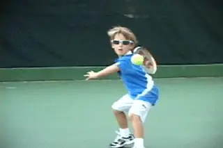

# Starting Kids Right: The Forehand

### Rick Macci

**A player's technical foundation lasts a lifetime, for better or
worse.**

Starting your child out right.  That's the key to what's going to happen
down the road.  Unfortunately, it's probably the most neglected part of
development. 

The foundation laid down when kids first start out is going to last a
lifetime, for better or worse.  So if you've got a child in tennis and
that child is 5, 6, 8, or 10, it's important to understand this is a
journey.

It's not how good you are when you're 10, or 12, or even 14.  It's what
your ultimate objective is.  Maybe as a player you want to play high
school tennis, or college tennis.  Or maybe you want to be the real deal
and try pro tennis. \
Any way you slice it, it's a journey and you're constantly building
blocks.

Tennis development isn't a sprint, it's a marathon.  That's why we call
it Junior Development, not Junior Final Destination. 

In the first article in this series we took a look at the first building
block\--attitude.  ([Click
Here.](Starting%20Your%20Kids%20-%20The%20First%20Fundamental%20Is%20Attitude.docx)) 

**Attitude underlies the whole process. **

**For** **the process to succeed you need an incredible amount of
motivation.** 

**You've got to make it fun.** 

**You've got to make kids feel like they can jump over that fence
behind them. You've got to make them feel like they can do anything.
They have to want to do it.  You've got to want to make them love it. So
it can't be so serious and so negative that they're not going to
respond.**

**Let's not fall into the trap of trying to creating 5 year olds with
grips like Nadal.**

**Critical Technique**

**Attitude is the prerequisite.  But the technical part is equally
critical.**  So now, in this second article, let's
start to look at that, beginning with the forehand.  

We all know the "modern" forehand, especially on the men's side, is
dominated more and more by extreme grips and heavy spin. But at the age
of 5 or 6 it's not about trying to create miniature pro players with
grips like Rafael Nadal. 

With players of age 5, 6, 7, 8, the strokes that they're taught at that
young age can either lead to weapons or they can lead to disaster.  Even
though you might end up the best junior player in the U.S. you still
might be doing all the wrong things.

 

**Good fundamentals allow young players to connect with the ball.**

**Connecting with the Ball**

**[I believe that players need to be learning certain
fundamentals.]{.mark}** 

**[[Fundamentals that will eventually lead to the development of
weapons.]{.mark}]{.underline}** At an early age, the goal of these
fundamentals is simple. To help young players develop the feeling of
connecting with the tennis ball. 

**[[Once that is established, their games can evolve technically in many
different ways.]{.mark} ]{.underline}** But without these fundamentals I
feel players won't ever have the chance of reaching their potential. 

As with the attitude part, the basic technical fundamentals don't apply
just to kids\--they probably apply to 95% of all club players who want
to get better.

But from the development point of view, you've got to be building a game
that you're going to grow into because you're not always going to be 4'8
and 62 lbs. You might be 6' tall 160 pounds and you've got to have that
vision, you've got to have that mindset.

You've got to be able to see down the road exactly where this game is
going to grow. Over the years I have seen many talented players,
including pro players, suffer from this. In some cases I believe it has
cost them literally millions of dollars.

  --------------------------------------------------------------------------------------------------------------------------------------------------------------------------------------
                                                        
  --------------------------------------------------------------------------------------------------------------------------------------------------------------------------------------
                                                                  **I like to start young players in an eastern grip.**

  --------------------------------------------------------------------------------------------------------------------------------------------------------------------------------------

**Grip**

**It all starts with the grip. The grips are the
key.**  This may sound shocking but I have to say
almost every young child who has come to work with me has had a grip
that I thought was too far under the handle, either a full western or
something close.  And it seemed that with every one of them, I had to
have a conference with the parent to convince them why I needed to
change the grip.

**The grip, obviously, orients the racket
face.**  And the kids are holding it underneath the
handle because it feels natural when the balls bounce up over the
shoulder. And I just see that as detrimental. They never really develop
a feel for the strike zone.

I don't want young children using a western grip for many reasons. 
They don't learn to hit through the ball. They learn to hit only off
their back foot. They induce way too much spin. They break off the
follow-through too soon. I could go on and on with the litany of
problems that I see.  **[[The bottom line is that if you want to develop
a forehand that is going to be a weapon, you can't let the kids get away
with these crazy grips.]{.mark} ]{.underline}**

Almost all the young kids I work with, I change them to an eastern or
semi-western. Whether the player is a boy or a girl is a big factor
here, and this is incredibly important to understand.

**The top women play a cleaner, flatter game.**

I feel that the way a boy should be taught is different from the way a
girl should be taught. And if you want to understand why, the best thing
I can say is just turn on your television. 

The men and the women hit the ball very differently. With the men there
is more variety, more spin. There is more improvising. It's a little
faster. The men's game is more physical. The men are hitting many more
balls outside the doubles lines.

Women's tennis is a little cleaner, a little flatter. It's more about
pure ball striking. Which player can get on top of the other with those
clean, penetrating groundstrokes. I'm not saying you can't have variety
and spins and angles, but ***at the end of the day it comes down more
to ball striking, and that starts with the grip.***

So when a young girl comes to the academy we put her into an eastern
grip, the handshake grip where the knuckle is going to be flat right
back on the back of the racket.

**With boys I want them to gravitate toward a semi-western.**

With the boys it could also be an eastern to start, but I would
eventually have them gravitate to a semi-western where the knuckle moves
at most one bevel down.

The girls, I generally let them stay in an eastern if I feel they can
cover the ball, if I don't see any liabilities coming, and they handle
high-bouncing balls okay.  If as time goes by, they slip to a
semi-western, or possibly a hybrid grip between the two, that can be
fine too.

**The grip is critical because what I'm trying to establish with a
young kid is the point of contact.** **Second I
am trying to teach them to find the middle of a racket.  You want them
to understand how to use the racket.**  ***[The
racket has to be their best friend.]{.underline}*** **The conservative
grips give them the feeling of controlling the racket head with the
hand. This is how they find the strike zone.**

And in teaching kids the strike zone, it's been my experience that the
western is deadly. The eastern and the semi-western are just easier for
the kids to make contact. They learn the true sense of the strings. Then
as spin becomes more prevalent, it's ok to let them slide a little. 

**Little kids, high balls, and western grips-not the ideal
combination.**

But because the balls are so high and the kids are so little, they all
want to play with the western. To do this in the long run they are going
to have to be super fast, they will tend to play much further back in
the court, and they will limit their ability to hit winners. So I just
don't see the benefits. 

I've seen it ruin many young players that actually went on to play pro
tennis, but could have  been 30 or 40 or 50 spots higher. Players I've
coached. And they've got all the other elements: great serve, good
legs, good backhand. And I'm thinking why couldn't they have Jennifer
Capriati's forehand or why couldn't they have Andre's Agassi
forehand?

**Preparation**

**[After the grip, the next key is obviously the ready
position.]{.mark}** You want them to focus on having good balance. You
want the hands in front, knees bent, good handshake grip. 

**And then the preparation.** What we want is for
the kids to **take the racket back as a unit.** A
lot of kids will take the racket back by itself. **You want the racket
always to be taken back with the shoulder turn. You're going to take it
back with the shoulders, always.  And that turn move, that preparation
should start immediately.**

**[Preparation begins with the shoulders.]{.mark}**

**This is a game of time.** ***[So preparation is
the name of the game. But to establish this with youngsters you've got
to be repetitive.]{.mark}*** **[[Tennis is a repetitive
sport.]{.underline} You've got to say the same thing over and over
again.  \"Turn the shoulder, turn the shoulders.\" If you say it enough
it will become automatic.]{.mark} **

**Footwork**

**[I think at the beginning stage with a young child, it's also about a
rhythm and a flow. And this is related to another critical part, which
is the footwork.]{.mark}**

I'd say that 90% of the kids that come to me have real problems with
their point of contact that are related to footwork. This is because
they have little legs and little arms and a little body. And the brain
is telling the little competitor, hit the ball. And so they all try to
reach up and hit it with their hand. 

But if they are going to develop a forehand that is a weapon they need
to learn to hit the ball in their strike zone. **To do this they need
to learn is to let the ball drop.** **So one of
the basic drills is to learn to back up and let the ball fall into their
strike zone**, **or if it is short and high, to
do the same, come forward and let the ball
drop.** **Let the ball fall to the correct point
of contact.**

**Letting the ball drop allows young players to find the strike zone.**

**Now that might sound crazy because eventually they will have to
learn to hit the ball on the rise, and I train my kids to do that when
the time is right.** I want people to learn to play
the ball instead of the ball playing them, but there's a time and place
to develop that.

**[[So letting the ball drop into the strike zone and learning to hit it
with the right grip is critical.]{.mark} ]{.underline}**It will expedite
the learning curve and I've seen that over and over. Most players back
up because they're afraid. I want kids to back up but for the right
reason. 

**[The kid needs to learn to think, "I've got to let the ball drop into
the strike zone."  When kids learn to work this way, [positioning to
find the contact point]{.underline} becomes second nature. The brain is
saying, "My feet have to move."]{.mark}**

So we work on backing up, letting the ball drop, getting a rhythm,
finding the contact. Like everything I do, it's all based on my
experience. It's what the students have taught me or I've learned from
the students, being in the trenches for so long. It's not just my
theory or what someone taught me or something that I read. It's based
on the pure hard facts of this experiment I am conducting on the court
everyday.

**Kids need to feel what it's really like to hit through the ball.**

**The Strike Zone**

So throw the balls up higher and make them just go back, let it drop in
the strike zone. When you teach this you'll see their footwork is
totally different because their brain now is saying wait a minute, I've
got to get in position to hit the ball, instead of here comes the ball,
hit it. 

**[I want young players to be able to [hit the ball in front
comfortably.]{.underline}]{.mark}** **[[To find the ball in the middle
of the racket, I just want the kids to feel what it's like to really
hit through the ball instead of coming off of it too
soon.]{.mark} [Because I think once you do that, you learn how to hit
through the ball, you learn extension, you learn
follow-through.]{.mark} ]{.underline}**

What I try to stress to the kids is less is more. Keep the backswing
smaller. Don't take the racket hand back so far you break the plane of
the shoulder. Let the racket drop into the hit to start the forward
swing.

[**[Learn to push on the ground.]{.underline}** **[Learn to hit the ball
with your legs.]{.underline}**]{.mark} 

That point right there is a million-dollar lesson. **[[Most young kids,
no matter what grip they have, play mostly with the arm. The racket
dominates them instead of the body doing the work. Pushing on the ground
means the whole body in going to be involved.]{.mark}]{.underline}**

**Pushing on the ground: a million-dollar lesson.**

**But when parents and a lot of coaches see the kid hit 20 in a row
over the net with the arm, they think that means something. And it
does.**  **It means the kid has good hand-eye
coordination. But it doesn't mean he is going to have a good
forehand.**

There are many kids that I have worked with that have been number one in
the nation, and they're very consistent.  But as you get older, it's
the quality of the consistency. **Everybody can be consistent. Number
one thousand in the world could be hitting with number one in the world
and they could be doing a drill and you can't see the difference until
you say, "Play these." And then it changes.**

**[[When the kids are young you want fluidity. You want more power with
less effort. That's what you should be looking for. We're looking for
the youngster to be able to hit a cleaner shot.]{.mark} ]{.underline}**

I'm not looking for her to win the 8 and under or the 10 and
under. Believe me, that can't happen if she has other factors.  **But
the technical part is at the top of the
menu**. **You don't want to go out there and
start imitating the pros. That can be the kiss of death. What you do
want to imitate with the pros is if it is a weapon and if it is special,
imitate the grip.**

You've got to be very careful because it can be a slippery slope if
they're holding the racket wrong, or if they're taking it back wrong, or
if the primary intention is not to keep improving. You've got to look at
it in a bigger picture. Don't look at the moment. We all want the
trophy, we all want the "W." We want that instant gratification. But you
still can have success and also make sure you're developing a forehand
that is eventually going to be a weapon.

|  | years. He is widely regarded as one the world's top |
|  | developmental coaches. Rick and his staff have shaped |
|  | the strokes of Jennifer Capriati, Venus and Serena |
|  | Williams, Andy Roddick, and dozens of other |
|  | successful tour players. In the last 30 years, Macci |
|  | students have won 134 USTA national junior |
|  | championships, and have been awarded over 4 million |
|  | dollars in college scholarships. Rick is a USPTA |
|  | Master Pro and a member of the USPTA Florida Hall of |
|  | Fame. |
|  |  |
|  | The Rick Macci Academy is located in Boca Raton, |
|  | Florida at the beautiful Boca Logo Country Club, |
|  | where Rick works in collaboration with Dr. Brian |
|  | Gordon in implementing their new world class training |
|  | system. |
|  |  |
|  | For more information about Rick's Academy, email him |
|  | at: info@rickmacci.com or call Rick Macci directly |
|  | at: (561) 445-2747 |

