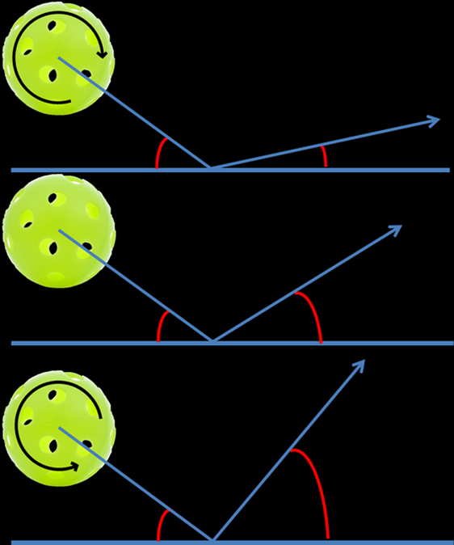

# Tennis principles and foundations

### Tennis Fundamentals and foundations

### Ean Meyer

**The fundamentals of strategy**

**[[Besides yourself, there are three necessary elements to the game of
tennis:]{.underline}]{.mark}**

1.  **A Ball**

2.  **A Court**

3.  **An Opponent**

To be good at this game you need to focus on all three of these
elements. To do that you need to develop "Triple Vision". Triple vision
is critical in tennis. **[Essentially it is the ability to see the ball,
court and opponent all at the same time.]{.underline}**

**We have all heard a coach say "watch the ball" during a lesson. But
you actually have to [[focus on more than just the ball itself to know
where it is and where it is going]{.underline}]{.mark}. [[Your "hard
focus" should be on the ball, but your "soft focus" should be on the
opponent and the possible openings on the court.]{.underline}]{.mark}**

If you are only looking at the ball while you are playing, you are
playing as if you're drunk. When testing potential drunk drivers, the
cops always look at the eyes first. Intoxicated drivers fixate on an
object and look at only one thing. The eyes of sober drivers dance
around all over the place. They are looking at the person talking to
them, cars going by, and other movement or objects in the environment.

**[The Second Fundamental: Balance]{.underline}**

Balance is the secret to power. **[[A body is balanced when the center
of gravity is directly over the base of support, the
feet]{.underline}]{.mark}**. **[[The feet need to be well
grounded]{.mark} [and the head has to be centered in order to be
properly balanced]{.mark}]{.underline}**. Move your head off of center
and you are no longer in balance.

**[[Balance is about the way you move before, during and after the
swing.]{.underline}]{.mark}** Footwork has a lot to do with balance.
However, working on footwork is not the best way to actually improve
your footwork. The way to better footwork is actually to work on
balance. **[[Good footwork results when you are balanced, not the other
way around.]{.mark} [Focus on improving your balance and your feet will
move accordingly.]{.mark}]{.underline}**

***[Balance and timing are interrelated.]{.mark}*** Swinging with poor
timing throws you off balance and being off balance will disrupt your
timing. If you're balanced before you swing, you can use your whole body
(kinetic chain) to generate power. If you're balanced as you swing,
you're more likely to be balanced when you finish your swing which means
you'll be in a position to react better to the next ball.

**[[When executing a stroke, the force of the swing is determined by a
kinetic chain that starts in your legs and then travels through the
hips, trunk, shoulders and arm. It is the key to power. For the kinetic
chain to work properly, your body needs to be grounded and balanced with
no disconnect between your upper and lower body.]{.underline}]{.mark}**

**[[Your posture needs to be strong with your head centered between your
feet. Without proper posture you'll lose links in your chain and,
consequently, lose power.]{.underline}]{.mark}**

This kinetic chain starts as a result of a phenomenon called **[[Ground
Reaction Force]{.underline}]{.mark}**. Basically, your legs push against
the natural force that is keeping you on the ground -- gravity. This
push starts a rotation in the hips which results in trunk, shoulder and
arm rotation. Energy moves through your body and, when you make contact,
into the ball.

**[[Balance is the key fundamental. It is possible for you to compensate
for certain inadequacies when you hit a ball.]{.underline}]{.mark}** For
example, timing can compensate for lack of speed. Stamina may compensate
for lack of strength. **[[Nothing however can compensate for a lack of
balance. Being off balance slows your reaction time and impinges on your
shots. In tennis, being balanced means you are balanced all the time,
whether you're standing, moving or hitting.]{.underline}]{.mark}**

Whether swinging or punching, the force of an effective swing travels
from your center of gravity to your racket head. **[[A loss of balance
at the beginning of a stroke will inhibit the body's ability to initiate
force. A loss of balance during a stroke will inhibit your body's
ability to transfer force to the racket.]{.underline}]{.mark}**

**[[Excessive waist flexion will lead to an off-balance stroke.
However]{.underline}]{.mark}**, when you are rapidly accelerating to an
approaching ball, waist flexion is necessary for maintaining balance.
Imagine a sprinter as he leaves the starting block. His upper body tilts
forward. After several steps the posture becomes straighter. However, in
order to maintain balance during his initial burst of speed, he must
flex at the waist and lean into the direction of his movement.

**[[An off-balance stroke will also occur when you flex at the waist
without flexing your knees.]{.underline}]{.mark}** **[[Keeping the head,
shoulders and hips in a vertical line will help your balance. It also
reinforces head stability and a consistent contact
range.]{.underline}]{.mark}**

**[[In tennis, being balanced requires moving your
feet.]{.underline}]{.mark}** **[[This means bouncing, shuffling, and
running to get to the ball]{.underline}]{.mark}** and **[[back to the
Ideal Recovery Position.]{.underline}]{.mark}** If you don't have good
footwork, you won't have good balance. The way to better footwork is to
work on balance though, not the other way around. You've developed your
footwork's muscle memory over a lifetime. It won't change easily.

**[[Good players work just as hard between shots as they do when they're
hitting the ball. They have their heels off the ground and are up on the
balls of their feet, ready to move. Think about when you are running.
Your heel always comes off the ground before your toe. If you are
already on your toes between shots, you eliminate the extra movement and
time needed to pick up your heel.]{.underline}]{.mark}**

**[[Your objective is to get your balance before your opponent even hits
the ball. That's where the "split step" comes in.]{.underline}]{.mark}**
**[[If your "split step" is well timed, you'll feel very balanced by the
time you react in the direction of the incoming
ball.]{.underline}]{.mark}** **If you're off balance when the opponent
strikes the ball, you will be late in responding to the incoming ball
and can easily become "wrong-footed".**

**[[Balance doesn't need to be taught. It's natural. You just need to
become conscious of being balanced to become aware of
it.]{.underline}]{.mark}** Instead of saying: "Are you ready to react?"
say to yourself: "Are you balanced?". That will make you ready.

**The Third Fundamental: Angular and Linear Momentum**

**[[The two most significant sources of power are hip and shoulder
rotation (]{.underline}]{.mark}*Angular Momentum)*** **[and weight
transfer]{.underline}** ***(Linear Momentum).*** These power sources are
important fundamentals. Any stroke can be placed in to one of three
categories. These categories are based on the stroke's most significant
source of power.

- **Swinging strokes** (ground strokes, serves, swing volleys) **use
  angular momentum where hip and shoulder rotation is the most
  significant source of power.**

- **Punching strokes** (volleys, half volleys, difficult returns) **use
  linear momentum where weight transfer is the most significant source
  of power.**

- **Some strokes require a balanced combination of both sources
  (approach shots and high volleys).**

**[[In angular momentum, the hips and shoulders are literally the
central gears of the swing system.]{.underline}]{.mark}** **[[An
efficient swing is a series of rotational movements that flow in
sequence and balance is critical to initiate this rotation. The feet
must be in contact with the ground, and there cannot be a disconnect
between the upper and lower body.]{.underline}]{.mark}** **[[With the
hips and shoulders the central gears, the muscles between the hips and
shoulders are significant.]{.underline}]{.mark}** **[[The swinging
movement begins with the muscles of the trunk. Because of the elastic
action of the muscles between the hips and shoulders, a relatively small
degree of hip and shoulder rotation can account for a high proportion of
swing force.]{.underline}]{.mark}**

**[[The hips and shoulders are not efficient power sources for all
strokes though. On a low volley, hip and shoulder rotation can be
detrimental.]{.underline}]{.mark}** **[[On this shot emphasis should be
placed on weight transfer, or the use of linear
momentum.]{.underline}]{.mark}**

It is critical for an aspiring high-performance player to understand
these power sources. As a player you want to be efficient to ensure a
long career in tennis. Efficiency means effective results with little
waste of energy. So many great players don't reach their full potential
or careers are cut short due to injury because this fundamental was
neglected or not properly trained at a young age.

This post follows up on last Monday's post as **[[it is critical for
players and coaches to understand the roles of the hips and
shoulders.]{.mark}]{.underline}** The hips and shoulders are literally
the central gears of the swing system. Your swinging movement begins
with the muscles of the trunk. **[[As they rotate the generated force
works its way both up into the shoulders and down into the
legs.]{.underline}]{.mark}**

**[[Muscle is required to initiate hip and shoulder rotation, and even
more muscle is required to translate the generated force into efficient
racket movement]{.underline}]{.mark}**. **So, if all this force is
required, why aren't tennis players more muscular? That's because
[[there's a distinction between the force generated by the contraction
of muscle and the force provided by the elastic action of
muscle.]{.underline}]{.mark} [[Tennis swings require muscle elasticity,
like a rubber band being stretched and released, rather than muscle
contraction.]{.underline}]{.mark}**

**Another very important thing to understand is that in order for the
trunk muscles to fire effectively, [[the forward rotation of the hips
must precede the forward rotation of the
shoulders.]{.underline}]{.mark}** There is in fact a lag between hip and
shoulder rotation that creates a stretching in the muscles of the trunk
followed by an explosive snapping action of the shoulders. **[Increasing
the total amount of hip and shoulder rotation will NOT necessarily
increase the force of the swing.]{.underline}** **[[The amount of lag
between the rotation of the hips and the rotation of the shoulders is
more important than the total amount of rotation.]{.mark} This is the
reason that the semi-open stance is so critical.]{.underline}**

**First Foundation: Ball Awareness**

**[There are two critical components to ball awareness: spin and
height.]{.mark}**

**[Spin:]{.underline}**

**[[Only two things make a ball land on the court -- gravity and
spin.]{.underline}]{.mark}** **[By hitting harder or softer, beginners
use gravity to help them vary the depth with which they place the ball
on the court.]{.underline}** **[[Pros however use spin to control the
depth of the ball, allowing them to hit the ball very hard without
sacrificing placement.]{.underline}]{.mark}**

The fundamental rule in understanding spin is that backspin bounces
lower and topspin bounces higher. Also**[[, backspin will tend to float
while topspin will dip quickly down toward the
court.]{.underline}]{.mark}** Observe someone hitting with different
spins. **[A topspin ball landing at the service line will bounce past
the baseline. A backspin ball landing on the service line will bounce
inside the baseline.]{.underline}**

|  |  |
| --- | --- | --- |

+--------------------------------------------------------------------------------------------------------------------------------------------------------------------------------------+                                                                                                                                                                               |
| **Magnus Force** |  |
| --- | --- |
|  |  |
|  |  |

**[[Use backspin as your control spin and topspin as your power
spin.]{.underline}]{.mark}**

**[Height:]{.underline}**

**[[Generally, on a medium paced ball, the height at which the ball
clears the net relates to how deep it lands in the
court]{.underline}]{.mark}**. **[[A higher ball will land deep and a
lower ball short. Obviously, this varies according to the speed and
trajectory.]{.mark}]{.underline}**

**[[Good players can see the height of the ball as soon as their
opponent hits. The]{.underline}]{.mark}** **[[very latest they see it is
as it crosses the net.]{.mark}]{.underline}** That's why, on a let cord
shot, a pro will often get to the ball quite easily whereas a club
player watches the ball fall over for a winner.

The pro, seeing the height of the ball earlier, knew the shot would be
short. While some people just naturally have good ball awareness, you
can improve yours through drilling. Try the drill below and let me know
how it works for you!

**Zone Drill:**

Divide the court up in to four equal zones starting from the net and
working back to the fence. Watch your opponent carefully. As soon as the
ball leaves the opponent's racket, look at the height, and call out
which zone you think the ball will land in based upon the height of the
ball.

**The Second Foundation: Court Awareness, Clay Courts, Hard Courts and
Grass Courts.**

The surface you're playing on and how that affects your decision making
is another important aspect of court awareness is. This week we'll look
at clay courts.

**Clay Courts**

Clay courts grip the ball so that it bounces up slowly, which favors a
steady baseline style. Topspin is more effective than backspin or flat
balls on clay because backspin will increase the surface's grip on the
ball, slowing it down even more. It's not unusual for clay court matches
to last a few hours. You need to be mentally and physically prepared if
you want to win on clay courts.

From a physical standpoint clay players must be in peak physical
condition. A long match requires a strong heart, effective lungs and leg
power. The best way to develop stamina is by running to improve capacity
to take in oxygen. Slack muscles will tighten during long matches,
restricting leg and arm movements. Be sure to include strength training
to help avoid, or at least delay, this. Finally, clay is slippery, so
don't forget to practice your sliding to avoid overrunning.

Mentally you need to be prepared to play long, tedious points and to
stick to your plan. Patience is key on clay. The mental attitude you
need to have is that you'll eliminate all mistakes rather than trying to
rush the match and put away winners.

Clay courts are the true test of a player's skills and you'll need some
tactical strength to overcome your opponent on clay. Use the 7 target
areas discussed in prior posts, to do something with the ball. In case
you've forgotten, I'm talking about the deep corners, deep down the
middle, the side T's and the drop shot areas. Play steadily from the
back court, use your all- court game at every opportunity, but avoid the
net position unless you're certain of success there. Pace with accuracy
is important.

Use the side T's as set-up areas on ground strokes to maneuver the
opponent outside the doubles alley. A side T shot opens the court, which
allows you to run your opponent a long way if you're not able to hit a
winner. If he counters your shot with his own placements, it becomes
like a boxing match with both players counter punching.

**Hard courts**

The basic strategy on a hard court is related to the speed of the
surface. The slower the hard court is, the more you follow clay court
strategy. If the court is fast, the points last fewer shots. The chances
of exploiting an opponent's weakness are therefore less on a hard court.
It's also harder to hit passing shots, because the ball gets to you so
much faster.

**Grass Courts**

Grass courts are hard and resilient making the ball bounce far and skid
low. Since the ball reaches you faster, shorter preparation is required.
Use slice and flat strokes to make the ball stay low. Grass is
unpredictable, so, your emphasis is on getting to the net volleying.
Introduce your attacking game at every opportunity. Since the surface
does not allow the opponent much time to prepare, net players have an
advantage.

**The Third Foundation: Opponent Awareness**

Most players think they should win if they play well. They give very
little consideration to the opponent's game or how to exploit it.
Identifying your opponent's strengths and weaknesses is an important
skill to have. **[[Every player's game is like a combination
lock.]{.underline}]{.mark}** **[[It's tough to open, but with the right
combination, you can unlock the secrets to
success.]{.underline}]{.mark}**

**Scout the Opponent**

Scouting takes practice just like everything else. Carry a notebook and
write down what you see.

- **Do they have a better forehand than backhand?**

- **Where do they make more mistakes?**

- **Do they have a good first serve, but weak second serve?**

- **Can they hit a good cross court forehand, but their down-the-line is
  weak?**

- **How do they handle high balls?**

- **What do they do when the ball is short -- where do they hit to and
  what kind of spin do they use?**

- **When you hit an approach shot, do they pass cross court or down the
  line?**

- **How often do they lob and when?**

- **How well do they return wide serves and serves into the body?**

One of the most important pieces of information you can write down about
your opponent is **[[what breaks down under
pressure.]{.underline}]{.mark}** Players will almost always go for a
shot they can depend on under pressure. If the backhand is weak, they
will run around it. Movement tends to break down under pressure.
**[[Players lose their legs when they get nervous. This is a time to
move them away from the center of the court by going for the corners and
angled shots.]{.underline}]{.mark}**

Learning the foundation of awareness of the other side of the court is a
key ingredient to becoming a good player. Once the match starts, most of
your attention should be on your opponent's side of the court.

The greatest tool for exploiting your opponent is **[[the utilization of
the Two Opposites.]{.underline}]{.mark}** There is a pair of opposites
for everything in tennis. Use them to uncover your opponent's weakness
and then show your opponent that you've discovered it. It will make your
opponent lose confidence and swing the match in your favor immediately.
The trick is to find out which your opponent has trouble with:

- **Forehand or Backhand?**

- **Volley or Ground strokes?**

- **High shots or low shots?**

- **Hard or soft?**

- **Wide or right at him?**

- **Running him or giving him time to hit?**

- **Deuce or ad court?**

- **Cross court or down the line?**

**[[Your opponent may have a great low forehand but have real trouble
with a high ball.]{.underline}]{.mark}**

**[[A]{.underline}]{.mark}** **[[common pattern is a player who likes a
hard ball to his forehand and a soft ball to his
backhand.]{.underline}]{.mark}** **[So, a frequently used tactic would
be to hit a slow ball to the forehand and to blast everything to the
backhand.]{.underline}**

**[[If your opponent cannot cope with a high backhand, hit high looping
shots to the backhand.]{.underline}]{.mark}**

**[If they are slow, make them run.]{.underline}**

**[Tall player? Hit the ball at them and use low slices.]{.underline}**

**[[You shouldn't play a certain way just because that's how you like to
play.]{.mark} Don't hit what is Convenient, hit what is
Necessary.]{.underline}**

**Strategy: Fourth Foundation: You**

**Your Strengths**

Most players don't know what having a strength means. You may have a
great forehand, but, if as soon as your opponent approaches the net you
hit the bottom of the net, your forehand is not a strength. If you can
serve 120 mph, but at 5-5, 30-40, you usually double fault, your serve
is not a strength. **[[So, first and foremost, a strength is determined
by its reliability under pressure.]{.underline}]{.mark}**

**[[A strength is also determined by its adaptability and
creativity.]{.underline}]{.mark}** You may be able to overpower most
opponents with your serve, but what happens when you come up against a
great returner who is able to neutralize your big serve? Now you need to
consider better placement, depth, spin and height. The adaptability of
your serve is, what is important, not how strong or fast it is. Many
players don't understand this and they will keep going for the 120 mph
serve and get broken by a great returner.

The same thing applies to your forehand. Some days it won't be as
reliable as others. A crosswind may disturb you or your timing may be
off one day. **[[Again, adaptability is key]{.underline}]{.mark}**. If
your forehand is truly a strength, you should be able to adapt to the
situation. For example, you could adapt your game and play more up the
center of the court.

**[[A strength is also determined by its creativity. Top]{.mark}
[players get very creative with their strengths. They]{.mark} [will open
the court with angles, dip the ball down at the approaching opponent's
feet, or maybe flick a topspin lob]{.mark}]{.underline}**. **[[This
creativity is almost always related to an "educated
wrist".]{.underline}]{.mark}**

**[[The "Adapt or Die" drill is a great way to work on this
creativity.]{.underline}]{.mark}** Stay inside the baseline and have
your partner hit all kinds of balls at you -- high, low, fast, slow.
Don't back up at all. **[Adapt to what's being thrown at you.]{.mark}**
**[[Practice it often enough and this practice becomes
permanent.]{.underline}]{.mark}**

**Movement: Leg Lapse and Beating the Ball to the Bounce**

Because your lower body does the exhausting task of moving you from one
shot to the next, it is easy to experience **[["leg
lapse"]{.mark}]{.underline}** during execution. A leg lapse causes the
upper body to compensate for the loss of leverage resulting in a stroke
that is off balance. It means your body has an inefficient base of
support due to poor footwork or knee flexion.

**[[Fatigue and laziness are the causes of "leg
lapse".]{.underline}]{.mark}** **[[The most common "leg lapse" occurs
when a shot is wide to either side of the body and you simply "reach"
for it instead of moving your feet.]{.mark} [The second most common leg
lapse occurs when a shot is low and you flex at the waist without
flexing the knees.]{.mark}]{.underline}** **[[The best way to avoid
fatigue and laziness is to condition your lower
body.]{.underline}]{.mark}**

**Beat the ball to the bounce**

The difference between getting to the ball on time and being early is
the difference between mediocrity and winning. Early preparation allows
you to be relaxed and play on balance.

**[[There are 2 types of players: Anticipators and
Chasers.]{.underline}]{.mark}** Anticipators react as the ball leaves
the opponents racket and sometimes even earlier. Chasers wait for the
ball to get to their side before they react.

**[Beating the ball to the bounce is the essence of early preparation.
You]{.mark}** **[and the ball are in a race and the finish line is the
bounce.]{.mark} [[You want to get to the bounce before the ball does.
This is a concept few players understand. Most players move at the same
pace as the ball.]{.underline}]{.mark}** **[[Great players attempt to
move at double the speed of the ball.]{.underline}]{.mark}**

**[Achieving Optimal Performance: Winning vs Performing -- 1st in a
series]{.underline}**

"When the Great Scorer comes to write against your name, he marks not
that you won or lost, but how you played the game" --Grantland Rice

**[[We live in a highly competitive society that is obsessed with
winning.]{.underline}]{.mark}** **[[Most players experience tremendous
pressure, fear and anxiety generated by an overwhelming obsession to
win.]{.underline}]{.mark}** Without realizing it, we pass this on to our
children starting from the instant they're born. Children are constantly
measured with grades, win/loss records. etc. Society echoes this chase
for the win with the **[["Thrill of victory, agony of defeat"
mentality.]{.underline}]{.mark}**

This approach, where winning alone is the ultimate goal, has given rise
to questionable ethical and moral means in competition and has distorted
the standards of success. The overwhelming desire to win, rather than
succeed, can be seen played out in the anger, fear, stress and
dishonesty that plagues our sports and society today. The result of our
overwhelming desire to be number one can be seen in definite
dysfunctional behavior patterns. Unrealistic expectations result in
frustration and anger and some players seek unattainable perfection.
**[[Players with poor self-esteem blame others when things go wrong as
they are unable to accept failure on their own.]{.underline}]{.mark}**

**[[As players, coaches, teachers and parents, we tend to lose sight of
why we're playing sports in the first place.]{.underline}]{.mark}**
***[[Aside from being enjoyable and healthy, tennis, like many other
sports, can prepare us for the challenges we will face in
life.]{.underline}]{.mark}*** The way you meet challenges on court
reflects the way you will meet them in life. Playing a sport should be
thought of as a spiritual journey that combines physical and mental
activities. The journey has no final destination, because you will be
evolving and constantly thinking in new ways about how to play.

Winning should be a by-product of performance. As in life, optimal
performance in tennis is created by a passion for what we do. Passion
encourages commitment, discipline, hard work and continuous search for
excellence. **[[Optimal performers strive to be the best they can be
every day. They are more interested in how they've played the game than
the outcome. Pressure situations are challenges, not threats for them
and they are not afraid to take risks.]{.underline}]{.mark}** **[[Rather
than becoming discouraged from losing, they become motivated to
improve.]{.underline}]{.mark}**

**[[If you want your kids and players to succeed, stop focusing on the
importance of winning and encourage them to
perform.]{.underline}]{.mark}**

**Mental: Achieving Optimal Performance -- 2nd in a Series**

Belief: "Whether you think you can or think you can't, you're probably
right" -- Henry Ford

In the 1950's the world believed it was humanly impossible to run a mile
in less than four minutes. In 1954 Roger Bannister became the first
person to break this barrier with a time of 3 minutes 59.4 seconds. Once
this barrier was broken, other people started to believe they could
break it as well. Within eighteen months of Roger Bannister breaking the
barrier, the sub four- minute mile was achieved by 45 other runners.

**[[The mind is the most powerful thing we have going for us. We can use
the power of our minds to fulfill our dreams or set the power of our
minds aside and accept mediocrity. Most people in the world don't expect
much, so they don't give much and don't get much. Even talented athletes
settle for less. Why? Different reasons, but mostly because of negative
input from others.]{.underline}]{.mark}**

In an effort to save us from the pain of failure, well meaning coaches,
teachers and even parents often tell us we don't have what it takes to
become the best, make it to a pro level, etc. Players start to doubt
their own abilities when they hear these negative messages every day.
They stop believing in themselves and develop a poor self-image. **[[Low
self-esteem is probably the biggest obstacle in achieving optimal
performance.]{.underline}]{.mark}**

**[[The only limitations that exist are those we place on ourselves or
let other people place upon us. Once the mind believes "I can't", you
have sabotaged all efforts to reach your goals.]{.underline}]{.mark}**
To become an optimal performer, you have to renounce your restrictive
beliefs about what you can and cannot accomplish as a player**[[. One of
the marks of a good coach, parent or teacher is the ability to inspire
their players to go beyond preconceived
limitations]{.underline}]{.mark}**. **[[They challenge their players to
move out of their comfort zones by putting them in challenging
situations. They build their self-belief by communicating two very
important messages: "I believe in you" and "You
can".]{.underline}]{.mark}**

**[[Building self-belief requires a commitment to pursue excellence in
everything and a refusal to settle for mediocrity. Challenge yourself
daily to do the impossible. Surround yourself with friends and family
who support your dreams and believe in you.]{.underline}]{.mark}**
**[[Emulate athletes you admire and look up to. Use visualization and
affirmations to build your confidence along the
way.]{.underline}]{.mark}**

In the Art of Strategy, R. L. Wing says: "Your inner opponent's greatest
advantage is your lack of belief in your ultimate triumph". Do not doubt
yourself or your ability to succeed. What you believe you will achieve.
Align yourself with the belief "I can", and your power as an athlete,
awareness that you have unlimited potential, will start.

***One thought on "Mental: Achieving Optimal Performance -- 2nd in a
Series"***

Enjoying reading your entries. I'm a recreational "athlete" I suppose.
15 years of skiing, 11 of figure skating, 4.5 of horseback riding, and
now just started tennis. I have found "I can" very important in my
various recreational pursuits. While every goal may not be achieved
every time, "I can" is what has helped get those I have. The rest just
is -- it's a journey, a road...whatever. When one is older like me, the
road is a reward in itself.

**Achieving Optimal Performance: Positive Thinking -- 3rd in a Series**

**Positive Thinking**

"The mind is like a fertile garden, it will grow anything you wish to
plant, beautiful flowers or weeds. Do not allow negative thoughts to
enter your mind, for they are the weeds that strangle confidence". --
Bruce Lee

Negative thinking creates mental and physical resistances that greatly
hinder your performance, on and off the court. Each of us carries around
a mental blueprint of self that is based on a rigid belief system formed
by past performances. Even the best players carry around internal signs
that say things like: "Your serve is weak", "You can't handle pressure",
etc.

These deeply ingrained beliefs and attitudes can be changed through the
power of positive thinking. A major part of positive thinking is having
a positive self-image. In the Inner Game of Tennis, Tim Gallway writes,
"I know of no single factor that more greatly affects our ability to
perform than the image we have of ourselves." **[[Self image is an
ongoing conversation within our minds. The voices in the conversation
are the voices from the people who raised you, telling you what you
should think about yourself. In addition to the messages you received as
a child, you also have messages you receive as an adult from loved ones,
bosses, colleagues and even the media. All of this adds up to a lot of
unproductive ways of thinking.]{.underline}]{.mark}**

Because self-esteem is something that you have learned, not some sort of
innate genetic trait, it is possible to retrain your thoughts. How?
Positive thinking conveys the language of affirmation to the body.
Affirmations are strong, positive statements confirming either what is
already true or has the potential to become true. Notice how much
stronger you feel when you replace "I hate" with "I love", "I can't,
with I can", and "I won't, with I will". Write these affirmations down
on index cards and place them in an area where you see them on a regular
basis, like the bathroom mirror or in your tennis bag.

**[[You have to stop letting other people have control over the way you
think about yourself. Learn to make your own choices of how you perceive
yourself.]{.underline}]{.mark}** Nobody is in a position to make
judgments about you, because nobody knows you like you do. As soon as
you shut all critical voices out, including your own, your self image
will improve. You will start to feel positive, accepted, and
significant. Perceive yourself through your own eyes, not the eyes of
people who judged you as a child. Move away from negative restrictive
thinking and into close harmony with the reality of positive
possibilities.

Allowing yourself to think positive does not mean you're ignoring the
difficulties of an event or circumstance. **[[Positive thinking is
self-direction, not self-deception. Life's difficulties and negative
occurrences often become lessons that show us how to forge
ahead.]{.underline}]{.mark}**

**Achieving Optimal Performance: Relaxation -- 4th in a Series**

"The mind of a perfect man is like a mirror. It grasps nothing. It
expects nothing. It reflects but does not hold. Therefore, the perfect
man can act without effort" -- Chuang Tzu

Most of us truly believe that if we try hard enough, our efforts will be
rewarded. Players and coaches push to the max for success. Thinking it
will help bring out the best in a player, coaches and parents often say
things like: " Give it all you've got" and. "I want a 100% effort".
Rather than elevating a player's performance, these "going all out"
attitudes create enormous tension, stress and anxiety that in fact
impede performance. An athlete's optimal performance occurs when their
physical, mental and emotional selves are relaxed and working
harmoniously together, both prior to and during a performance.

Do not try too hard. Too much concentration defeats itself. Trying is
the opposite of trusting. The instant you become conscious of trying and
making an effort, that very thought interrupts the flow and the mind
blocks. There is an ancient Zen riddle that says: "If you seek it, you
cannot find it". Bud Winter, coach of many Olympic athletes developed
what he called the "Ninety Percent Law", which says: "Running or
performing at ninety percent effort stimulates relaxation and results in
faster movement, more strength, sharper vision, less fatigue and
improved sense of well-being.

**[[If your mind is fixed on victory or defeating your opponent, you
will not function automatically.]{.underline}]{.mark}** The less effort
you have to expend on thinking about what to do and how to do it, the
faster and more powerful you will be. If your mind is fixed on either
your own victory or on defeating your opponent, you will be unable to
function automatically. Too much concentration defeats itself. **[[If
you truly relax and allow the unconscious to do it's share instead of
working the unconscious overtime with unproductive thinking and stress,
concentration can become effortless.]{.underline}]{.mark}**

In athletic environments where people take themselves and their sport
very seriously, it can often be difficult to relax. So how do you
achieve relaxation and effortlessness? After you have practiced
something for a long time, it becomes second nature. It's like operating
on automatic pilot. Think about your best practice sessions. I bet you
make some of your best serves on a Sunday afternoon when you are all by
yourself on one of the back courts, relaxed, with some music playing and
not a care in the world. You are not thinking about making big serves,
they just happen. As you compete, remember how relaxed those serves
felt.

**[[Relax to achieve the max. Tension and stress are obstacles to
achievement.]{.mark}]{.underline}** When you begin to feel tension,
think of the image of water. Water is soft and yielding, yet strong. In
the great scheme of things, no loss or setback will ruin your life.
Create a mental environment for yourself where you take your task
seriously, but not yourself or the outcome.

**Achieving Optimal Performance: Visualization,** **5th in a Series**

"If an athlete can picture in advance each movement of an event exactly
as it should be, in a relaxed meditative state, the greater will be the
chances that he or she will carry out those movements during the actual
performance" -- Jerry Lynch

Visualization is an active form of meditation in which you relax and
choose to view images in your mind's eye that will influence your
emotions and energy. Our central nervous system does not understand the
difference between real and imagined events. It sees and accepts all
images as though they were real. So what you see in your mind's eye can
strongly influence your beliefs and achievements.

Imagery is a powerful tool. One of my favorite stories about the power
of visualization concerns a navy pilot who was incarcerated in Vietnam
for many years. To help himself stay sane, he drew 6 lines on a two
inch-wide flat stick to resemble the neck of a guitar. He had never
played guitar. His cellmate, who did play guitar, taught him in their
free time using that stick. For a few hours a day, he was taught the
finger positions and sang the notes. Every day he visualized the chords
and heard the sounds in his mind. By the time he was released he had
become an accomplished guitarist.

Perhaps one of the most convincing pieces of research to verify the
power of imagery or visualization was an experiment performed by two
groups of basketball players who were trying to improve their free throw
percentage. One group shot one hundred free throws every day for three
weeks. The other group simply visualized doing the same. The study found
that the visualizing group showed significant improvement over those who
actually shot the ball.

In sports, the actions (losses and victories) are all the result of
visions and images that the players carry with them. If you have an
image of missing a shot, you create tension and anxiety that in return
contributes negatively to your performance. On the other hand, if you
visualize success, you create an inner state of calm, confidence and
relaxation that contributes positively to success.

Almost all successful athletes use a system of visualization. Billie
Jean King said: "Before the second serve, I visualize it going in. I
never permit myself to think for even a moment about the possibility of
a double fault". Visualization works because it acts like a dress
rehearsal. It is a form of practice that makes you familiar with the
script for the task ahead of you. When the time comes for the actual
performance, you have a sense that you already experienced this moment,
and everything seems familiar.

Visualization is a learned skill and one you can develop on your own.
Learning to visualize is essential if you are going to become an optimal
performer. When you practice it regularly, it will enable you to perform
up to or beyond what you perceived as your potential. Visualization
clears the mind of interfering, negative images that block your efforts
to succeed by replacing them with images of success. Positive images
relax the mind and body and allow you to perform well.

**Achieving Optimal Performance: Focus, 6th in a Series**

" Focus your thoughts and actions on one small aspect of the present,
and you will create personal power" -- Chungliang Al Huang

Focus is the process of narrowing your concentration in order to
eliminate unproductive or distractive occurrences. It means keeping the
mind here and now. By focusing, you can fine-tune your attention so that
you stay on the moment. In the Tao of Leadership, John Heider states
**[["Expeditions into distant lands of one's mind distract from what's
happening. By staying in the present, you can do less, yet achieve
more."]{.underline}]{.mark}**

As the mind is kept in the present, it becomes calm. Concentration
becomes relaxed. Jerry Lynch, in his book Thinking Body, Dancing Mind,
teaches us that "Relaxed concentration is the supreme art, because no
art can be achieved without it, while with it, much can be achieved."
When Soren, a sixty-five-year-old ultra distance runner reached the
finish line of a hundred mile marathon, a reporter asked him how someone
his age runs a hundred miles. **[["I don't run a hundred miles. I run
one mile a hundred times"]{.mark}]{.underline}** he said.

**[[Developing the power to devote full attention to the present is one
of the most valuable skills in achieving optimum
performance.]{.underline}]{.mark}** The mind naturally wants to predict
the future or mull over the past. We want things to be different from
the way they are, and that pulls our minds into an unreal world. But
this only puts pressure on you and affects your concentration. The only
way to make something positive happen is to focus on it in the present
moment. **[[Concentrate on what you have control over. You can't control
your opponent, the weather or the crowd. But you can control your own
performance.]{.underline}]{.mark}**

To learn to focus, you must practice. The key to achieving focus at will
is to choose a small aspect of your activity and dwell on it. Whatever
you choose will involve one of three senses: seeing, hearing or feeling.
The problem is the mind has difficulty focusing on a small thing for a
long time.

There are two things a player must know on every shot: where the ball
is, and where the racket is. It is easy to see the tennis ball, but how
many players see the exact pattern made by the seams of the ball as it
spins? When looking for the pattern made by the seams of the ball, you
will discover that you see the ball much better than when you are just
"watching" it. Because it is such a subtle thing, it engrosses the mind
completely. The mind is so busy watching the seams of the ball, it
forgets to try too hard. The best way to maintain focus, is to assume
you don't know much about the ball, no matter how many balls you've hit.
Not assuming you already know is a powerful principle of focus.

**[[Most players see where the ball is, but very few know where their
racket heads are, especially when they start to move
around.]{.underline}]{.mark}** To maintain focus, try saying the
following mantra: "Ball", "Bounce", "Hit". Say "Ball" when the opponent
strikes the ball, "Bounce" when it bounces on your side and "Hit" when
you're hitting. The words will keep you in the present and make you feel
calm. It is difficult to say these words and worry about the score at
the same time.

**[It is easy to lose focus in between points.]{.mark}** **[[The best
thing to do is to focus on your breathing.]{.underline}]{.mark}** Notice
that each inhalation carries oxygen that will bring calm throughout your
body. As you exhale, notice that your breath carries away not only
carbon dioxide, but also all your tension and anxiety.

**[[The secret is not to think.]{.underline}]{.mark}** That means
quieting the mind so that the body can do instinctively what it's been
trained to do without the mind getting in the way. The only way to keep
the mind in the present is through practice. Train the mind to focus
through things like meditation, yoga and visualization exercises

**Achieving Optimal Performance: Centering and Reflection, 7th in a
Series**

"What is skillfully established will not be uprooted. What is skillfully
grasped, will not slip away. Thus, it is honored for generations" -- Tao
Te Ching

**Centering**

Optimal performance is greatly influenced by your ability to remain
centered within. Centering means remaining true to yourself and
performing up to your capabilities, regardless of the changes in your
external world. Centeredness is like a deeply rooted tree. When attacked
by hostile forces, the tree withstands them, remaining unmoved as you
will when you are centered within.

Centered athletes do not measure identity and self-worth by result,
score or rating of performance. They see victory as just another
component of playing the game. Therefore, they enjoy accolades and
rewards more fully as they are by-products of excellence rather than an
end in themselves. We are never as great as our greatest victory or as
bad as our worst defeat. Knowing this helps keeps things in perspective.

**Reflection**

As an athlete you're constantly bombarded with external input. You have
to be able to know and interpret such data to grow and develop into who
you want to be. The continual dramas of life and tennis can obscure your
awareness of where you are, where you come from and where you are going.

Practicing silent reflection or inner stillness can help you better
understand yourself, your perceptions and impressions and the world
around you. Periodic reflection helps you assess your training and
competitive performances. It helps you see what you need to change in
your game and in yourself. In turn, your timing will improve so that you
minimize your risk of error, setback and failure.

**[[Your tennis performance will have its ups and downs, it's a natural
cycle. Nobody can compete without fluctuations in performance, but much
is to be gained from reflecting upon these natural
cycles.]{.underline}]{.mark}** By aligning yourself with these rhythms,
you gain personal power over your performance. If you are at a low
period, accept it and you will stop fighting it. You will notice that
life is more meaningful when you take time to reflect.

**Movement: Anticipation**

Since most moves in tennis are only a few yards, it seems like raw
acceleration should be the determining factor in getting to the ball.
**[[But, of far greater importance, is anticipation and the ability to
change directions without losing balance.]{.underline}]{.mark}**
Anticipation means knowing early where your opponent is likely to hit
and being ready to respond to that.

**[[The first prerequisite for superior court coverage is to know where
your IRP (Ideal Recovery Position) is for every opponent and every
situation.]{.underline}]{.mark}** The IRP is not just a geometric
function of where you hit the ball, it also depends on your opponent's
strengths and weaknesses.

**Secondly, you must time your strokes, not your body**. **[[This means
you must arrive behind the bounce before the ball
does.]{.underline}]{.mark}** **[[If you arrive late, your momentum will
take you beyond contact and affect your recovery.]{.underline}]{.mark}**
**[[Many players hit well, but their movement back is slower than their
movement to the ball.]{.underline}]{.mark}** **[[It should be the same
speed.]{.mark} [Recovery is in fact part of your swing. Your stroke is
not completed until you're in position for the next
shot.]{.mark}]{.underline}**

**[[Thirdly, you must anticipate your opponent's shots by keeping your
eyes glued on them. Become sensitive to small cues which give away the
direction of the next shot.]{.underline}]{.mark}**

Continue to recover while keeping your eyes fixed on your opponent's
body language before making a final decision about where they are going
to hit. You will reach a moment in the decision process where you must
pause for a split second. This is the instant in which one more step
toward recovery will leave you vulnerable to being wrong-footed. It is
important that you not be running at the instant of decision. Slow down
like a butterfly before exploding again like a bee. Your split step, or
"flow split" and bounce out of the ready position can be done quickly,
once the timing has been mastered.

**Strategy Third Foundation: Opponent Awareness, Busting a Strength**

Most strategy involves finding an opponent's strength and denying him a
chance to use it. The one exception is when you decide to bust a
strength. Some players lose confidence when you break their strength
down. Boris Becker was such a player on the ATP tour. His forehand was
amazing, but it fell apart as soon as he lost a little confidence in it.

**[Very few player's strengths are perfect in every way. They either hit
spin or flat or they have great disguise. If you want to bust a
strength, you can't just pound the ball to the one side.]{.underline}**
**[[You have to use "opposites".]{.underline}]{.mark}** Start with
topspin, then throw in backspin. Make your opponent run and then "float"
one at them. Here's a great example from the pros. Steffi Graf's
forehand was a huge weapon. Yet, Martina Navratilova played her forehand
all the time to force her into the center of the court. Then she would
work her backhand with the approach shot.

**[[Some player's greatest assets are their legs. When playing a good
runner, try to hit where they just came from, or hit down the middle of
the court.]{.underline}]{.mark}**

**Six Steps to Better Footwork**

**Step One: Bouncing**

Keep your feet moving. Stay light on your feet (Butterflies). It's like
leaving your car in "idle". You can generate speed more quickly while
using less energy.

**Step Two: Split Step**

Probably the single most understated and underrated lesson in the art of
moving is the split step. The split step can both get you two steps
closer to every wide shot as well as out of the way of those balls that
tend to jam you up.

**Step Three: Sprint Step**

Your goal for each shot is to "beat" the ball to the bounce. Race to the
ball. When sprinting a long distance, the key is to have a wide balance
base. The first step is to "drop" the foot nearest to the ball in before
the outside foot crosses over.

**Step Four: Stutter Step**

Use the stutter step as you near the ball in order to set up your final
position before the stroke. Run with big steps to get close to the ball,
then use smaller steps as you near the bounce. Your steps ought to
produce a squeaking noise on hard courts.

**Step Five: Impact Step**

**[This is the final step before you hit the ball]{.underline}**.
**[[Make sure the heel of the foot strikes the ground first, not the
toe.]{.underline}]{.mark}**

**Step Six: Crossover Step**

**[After executing your shot, your trail leg swings around and crosses
over as it strikes the ground.]{.underline}**

**Obstacles to Optimal Performance: Fear**

"All things in the cosmos will be aroused to movement through fear. This
movement will be cautious, and cautious movement will bring success" --
1 Ching no 51

Fear is a natural emotion. It's a survival instinct and indicates that
you need to be alert. Trying to fight or force away fear creates a
counter force that makes you tense and anxious and interferes with your
performance. What you resist will persist. **[[Because fear is a natural
part of life, it doesn't go away. It can paralyze you or you can use it
to give you the opportunity to assess the risk you're facing and prepare
for it properly. Fear is a friend that you must
embrace.]{.underline}]{.mark}**

If you feel endangered or fearful, ask yourself why you're feeling that
way. Have you prepared well for what you are doing? Are you thoroughly
equipped? Let yourself be afraid. You can actually defeat your fear by
blending with its force. Alan Watts said: "The other side of fear is
freedom". Remember that you are not alone. **[[Every athlete, even the
greatest of the great, has fear.]{.underline}]{.mark}**

In the Western world we learn that "winning isn't everything, it's the
only thing" (Vince Lombardi). Many coaches, teachers and parents believe
that losing represents failure. This mentality is responsible for much
of the fear of failure that athletes experience at all levels.

**[[Failure cannot be avoided. The greatest of the great have failed at
times and so will you. You]{.underline}]{.mark}** **[[perfect your game
through adversity and failure.]{.underline}]{.mark}** **[[Look at
failure as a lesson from which you can learn. Seeing failure as an
opportunity for improvement makes it more tolerable and will help you
relax.]{.underline}]{.mark}**

As a child you learned from repeated failures to master one of the most
difficult and challenging of skills -- walking. You repeat falling,
bumping into things and crying until you have it down. You learn from
each mistake and receive encouragement from your parents until you can
walk. For some reason when we get older we start to tell ourselves we
are "no good" when we fail. The support we used to get from our parents
as babies turns into judgment in many cases.

The challenge is to see things as they are and to accept the truth about
them. Do not fight failure. What you learn from setbacks or defeat is
more valuable than a victory. Each experience we have yields us a
treasure of knowledge if we choose to see and accept it that way.

**Mental: 2nd article on the Obstacles to Optimal Performance**

**Tips for Handling Fear**

- Take a look at fear and ask yourself "What is the worst that could
  happen if I followed through on this fear-producing situation?" **[[If
  you can live with the worst-case scenario, you can go beyond your
  fear.]{.underline}]{.mark}**

- Vigorous exercise coupled with relaxation or meditation helps to put
  fear into perspective.

- Understand that it is impossible for anyone to be thoroughly competent
  and achieving all the time. Failure is part of the process of living.

- Patience and persistence will bring you from failure to success in
  most ventures.

- Real failure is the unwillingness to take a chance.

- See failure as an opportunity to learn. How would you do it
  differently next time?

- Expectations with regard to outcomes are setups for failure. Establish
  strong preferences instead.

**Myths about Fear**

1.  **Myth 1:** If you work hard enough you can avoid failure. Not true.
    The best of the best couldn't escape failure, how can you?

2.  **Myth 2:** Failure is worthless. Not true. Failure is a necessary
    prerequisite for success.

3.  **Myth 3:** Failure is devastating. It is disappointing yes, but
    generally the feelings that result from setback and failure are
    exaggerated.

**Obstacles to Optimal Performance: Fear of Success**

According to Sigmund Freud, some people have difficulty dealing with the
happiness of fulfillment. Some athletes who readily claim they desire
success subconsciously sabotage their own efforts. This may manifest as
a pattern of becoming ill or injured just when they are on the brink of
making major breakthroughs.

Because of the enormous stress associated with success, athletes'
performance suffers. They become erratic and inconsistent. Success
carries a lot of pressure such as repeat performances, envy, sniping
etc. It becomes an albatross fort them -- so weighty and strangling that
they avoid it at all costs. The truth is, in all of society, everyone
who tries to succeed experiences pressure and tension. By breaking away
from their stereotypical roles, many feel guilty for achieving beyond
the limits society has conveniently ordained.

**[[If you knew you were quite good at something, you would feel
compelled to act on it, or else feel guilty about not developing that
potential. But maybe you would rather not act on it. After all,
developing this aspect of yourself and living up to that standard will
probably require hard work.]{.underline}]{.mark}** **[[Becoming totally
committed to excellence often means taking time away from family and
friends. It's a decision that can have serious repercussions. As a
result, you may choose a road that avoids
success.]{.underline}]{.mark}**

**[[But, if you turn your back on your talent, you create another pain
to contend with: you must grow old constantly wondering how good you
could have been.]{.underline}]{.mark}** **[[The choice is yours to
make.]{.mark} *Being aware of this choice may make it easier for you to
determine what is more important. If you think you'll have regrets
later, go for it now while you're still capable.*]{.underline}**

**Rehearsed vs Improvised Strokes**

In a match you cannot think about or experiment with your strokes.
Practice is the time to experiment, but you should mostly rehearse your
strokes, so they become familiar and dependable. **[[A rehearsed stroke
is acquired through practice at a comfortable pace.]{.mark} [An
improvised stroke is a spontaneous reaction that occurs during match
play or fast paced drills.]{.mark}]{.underline}**

**[[Do not rely on your ability to improvise.]{.underline}]{.mark}**
**[[Rehearsing your strokes will never make you unimaginative. To the
contrary, the more situations you rehearse, the more imaginative your
range of options.]{.underline}]{.mark}**

**[[A tennis stroke is not a collection of disconnected
actions.]{.underline}]{.mark}** **[[An efficient stroke is a series of
actions that flow in an instantaneous sequence.]{.mark} [Your muscles
must be appropriately relaxed in order for the separate actions of the
stroke to flow.]{.mark}]{.underline}** **[[Whether swinging or punching,
the force of an efficient swing travels from your center of gravity to
the racket head in an instantaneous sequence.]{.underline}]{.mark}** A
loss of balance at the beginning of the stroke will inhibit your body's
ability to initiate force. A loss of balance during the stroke will
inhibit your body's ability to transfer force to the racket.

**Strategy, the Fourth Foundation: You**

Just like it's important for you to understand your opponent's strengths
and weaknesses, you also need to understand your own. **[[Don't try to
do what you're not capable of doing. If you're incapable of hitting a
power serve, why try it?]{.underline}]{.mark}** **[[If your backhand is
much weaker than your forehand, run around it. If your movement is
suspect, why try to play a running game?]{.underline}]{.mark}**

**When assessing your limitations there are a few specifics to look
for:**

- Do you have confidence in your 2nd Serve?

- How well can you place your serve?

- How well do you return crosscourt down the line and down the middle
  deep?

- Can you hit the 7 target areas?

- Can you apply different spins?

- How well do you move laterally, diagonally and up and down?

**[[Game Plan]{.underline}]{.mark}**

Most tournament players believe that if they play well, they should win.
To beat good opponents takes more than just playing well. **[[However,
you have to plan the work and work the plan.]{.underline}]{.mark}**

**[[A game plan is a set of strategic guidelines to exploit your
strengths and your opponent's weaknesses.]{.underline}]{.mark}** A good
plan should also minimize your weaknesses and your opponent's strengths.

**[[Keep the plan basic:]{.underline}]{.mark}**

Strengths, weaknesses, patterns and favorite shots under pressure. For
example, if you know your backhand is weak, your plan should be to run
around it as much as possible. If your opponent's backhand is weak, your
plan will be to run them wide to the forehand, thereby opening their
weaker backhand side.

**[[Changing your Plan]{.underline}]{.mark}**

You have to know when to change your game plan. The ability to change
your plan to suit the opponent and situation may be the most important
quality of a good tennis player. When you are losing, the first thing
you have to determine is: am I just playing lousy or is my opponent
playing well? Change your plan before the set is over. If you are down
4-1, it's time to change. Don't wait till it's 6-1, 2-0, then it's too
late to stop Momentum. You should change the plan when you're in a
losing pattern. For example, if you've been broken twice, find a way to
upset the momentum.

**[[Percentages vs Priorities]{.underline}]{.mark}**

If percentage tennis suggests you approach down the line to the
backhand, and the opponent's backhand pass is a weapon, is it percentage
tennis? Where and when you hit a shot is determined more by priorities
than percentages.

Your overall game plan is driven by priorities and should change with
every opponent. What may be a high priority shot against one player, is
suicide against another?

**[[Priorities determine that you go to your opponent's weaknesses. If
they don't have a weakness you can exploit, then you go to the
percentages.]{.underline}]{.mark}**

**[[Your own strengths can be your priority. Forget your opponent if
your strength is stronger than his strength. You don't have to worry
about percentages at all.]{.underline}]{.mark}**

**[Create A Vision of Who You Want To Be]{.underline}**

**1st in a series of articles on "The Ingredients to Become
Successful"**

Your mind is the most powerful thing you have going for you. You can
choose to use the power of your mind to do exactly what you want to do
or set the power of your mind aside and settle for less. Most people in
life don't expect much, so, they don't give much and don't get much.
Winners are not born winners like many thinks. There is no genetic code
in you that will determine who you will be.

Einstein used to say: "**[[Imagination is more important than
knowledge.]{.underline}]{.mark}** What you need is skill, not knowledge.
The skill to proactively use your imagination. Once you learn this
skill, the first task is to begin imagining the vision of who you want
to be".

Earl Nightingale said: "**[[We literally become what we think about most
of the time".]{.underline}]{.mark}** As you see yourself in the heart of
your thoughts, so you do become. What you see in your mind's eye is what
you get: Nurse or prostitute, alcoholic or athlete, drug pusher or
teacher, nobody or somebody, loser or winner. Each of us becomes that
make-believe self we have imagined and fantasized about.

Arnold Schwartzenegger, after winning his last Mr. Universe bodybuilding
title was asked by a reporter what he planned on doing next. "I plan on
being a number one box office star in Hollywood". And how was he
planning on doing this? "The same way I planned my bodybuilding career.
First you have to create a vision of who and what you want to be. Then
you have to live your life into that picture every day". Notice he
didn't say he would wait for a vision, he said: "I will create a
vision".

Neil Armstrong's vision began as a child. In an interview immediately
following his historic first step on the moon, he said: "Ever since I
was a little boy, I dreamt that I would do something important in
aviation". Fascinating that the thoughts of a child can shape a destiny.

So, if becoming successful at something is as easy as "deciding" to do
so, or "creating a vision" of who you want to be, why don't more people
do so? The road to the top is a long, hard grind. It involves sacrifice
and commitment. Most people are not prepared to put the time and effort
that it takes into it. As kids we all have dreams of who and what we
want to become. As we get older, these dreams are usually replaced by
"reality". There are other reasons for people not following their
dreams:

- **[Lack of support]{.mark}** -- in reality society does not want us to
  achieve above the limits that it has conveniently ordained. Most
  people don't want you to become more successful than what they are. In
  the process you consistently receive negative messages from others
  about your ability to rise to the top. This affects your confidence
  and self-esteem, and you stop believing in yourself.

- [**Lack of opportunity**.]{.mark} Many people don't follow their
  dreams because of lack of resources. You need enough money to pay for
  coaching and to be able to travel. Many times, people have to relocate
  to a different area to get the services they need. This is not always
  affordable.

- **[Fear.]{.mark}** Dealing with the pain of failure is the one factor
  that holds most people back from going after their dreams.

- But, believe it or not, **[[the main reason most talented people don't
  commit to fulfilling their visions, is laziness or lack of
  desire.]{.underline}]{.mark}**

There are basically 3 groups of people in the world. Your job is to
create a vision of which group you want to belong to:

First there are the **[[Spectators.]{.underline}]{.mark}** They are the
majority who watch life happen as bystanders. They avoid the main arena
for fear of being rejected, ridiculed, hurt or defeated. They prefer not
to get involved and would rather watch others perform. **[[Most of all,
Spectators fear winning. Winning carries the burden of responsibilities
and setting a good example.]{.underline}]{.mark}** That is too much
effort for most, so, they watch others do their thing. They prefer to be
on the opposite side of the TV screen.

**[Another large number of people are the
["Losers".]{.underline}]{.mark}** Losers are not the millions of
destitute people going to bed hungry every night. They are people in our
abundant society who never win, because everything they do is for
outside recognition. They need to drive a car like..., dress like...,
live in a house like.... or be someone else. Losers need anti- anxiety
drugs (60 million tablets per year are consumed in the US) to cope with
their daily emotional stresses. Their blood pressure jumps as they get
angry quickly and defensive easily. As a result, the Loser drinks more,
smokes more and pops more pills to escape.

**Then there are the [[Winners.]{.underline}]{.mark}** Winners aren't
necessarily the athletes with the trophies, or the students with the
straight A's. These are the few, who in a natural, free flowing way seem
to get what they want from life. They put themselves together at work,
at home and in the community. They set and achieve goals that benefit
themselves and others. True winning is one's own pursuit of individual
excellence. **[[Winning is nothing more than taking the talent or
potential you have and using it fully towards a purpose or a goal that
makes you happy.]{.underline}]{.mark}**

Your attitude towards your potential is either the key to or the lock on
your door of personal fulfillment. Most of us are unable to see the
truth of who we could become. It's hard to imagine the potential in
yourself. You might want to begin expressing it as a fantasy. Think up
some stories of who you'd like to be. Your subconscious does not know
that you're fantasizing. Fake it till you make it.

**[[THE MOST DANGEROUS RISK OF ALL:]{.underline}]{.mark}**

**[[The risk of spending your life not doing what you want on the bet
you can buy yourself the freedom to do it later.]{.underline}]{.mark}**

**[Commitment]{.underline}**

**2nd in "The Ingredients to Become Successful" series**

"Each great human accomplishment begins with a dream" -- Terry Orlick

"The dictionary is the only place where success comes before work" --
Vince Lombardi

These two statements go a long way to explain what is meant by
commitment. Dreams are about ambition, desire, interest, and vision.
Turning dreams into reality requires a full commitment. Commitment
involves passion, persistence, determination, dedication, courage,
motivation, willpower and hard work.

**[[Passion for what you do is what gives you the energy to pursue your
goals with full commitment every day.]{.mark}]{.underline}** There is a
saying that **[[if you have passion for what you do, you will not work
another day in your life.]{.underline}]{.mark}** People with passion
cannot wait to get out of bed to tackle their goals. The work is not an
inconvenience. It's an investment.

Calvin Coolidge said, "Nothing in this world can take the place of
persistence. Talent will not; nothing is more common than unsuccessful
men with talent. Genius will not; unrewarded genius is almost a proverb.
Education will not; the world is full of educated derelicts. Persistence
and determination alone are omnipotent."

Almost everybody involved in sport has a dream. Why do some people work
hard in pursuit of their dream while others give up or simply don't try
in the first place? Unfortunately, the route to achieving success is a
hard one demanding sacrifice and energy. If it were easy, we would not
value our achievements or those of others so highly.

Determination is drive. It is the mindset that impels you to make things
happen. It is the power of your intent. Determination is a function of
having clear goals, whether they are short- term or long- term goals.
Those short on motivation has nothing driving them forward; no dream, no
well-defined goal, no desire or need.

Commitment tends to be stronger when the motivation to achieve a dream
comes from within. If you are challenged or excited by your dream, you
are more likely to put in the hard work that is necessary for success.
Inner drive seems to be stronger than external motivators like prizes,
prestige or doing it for others. This does not mean external factors are
not important. There are many examples throughout sport of outside
forces providing the motivation for outstanding performances. **[[For
many, the motivating factor is money. But this external motivation tends
to boost performance only in the short -- term. When you are chasing a
dream that requires a long- term commitment, a desire from within is a
very powerful source.]{.underline}]{.mark}**

It takes courage to stay committed. Commitment is fueled by energy. The
more intense your desire to be successful, the more energy you will put
into achieving your goals. This will influence how often and how hard
you train and your persistence to keep going, especially when things get
rough. **[[If you are like most people, your energy is diffused and
spread over many areas of your life. If you want to get the best out of
yourself in pursuit of your dreams, you need to harness most of your
energy to that end.]{.underline}]{.mark}**

With commitment it's a case of actions speaking louder than words. You
often have to train when you'd rather be doing something else. I
remember Monica Seles back at Bollettieri's asking me to set up the ball
machine for her to practice angle shots on Saturdays when the rest of
the kids went to the movie theatre. You may have to follow schedules you
don't like. You will have to overcome setbacks as the road to glory is
seldom a smooth one. "The arrow that hits the bullseye is the result of
a hundred misses" -- Ancient Proverb.

Above all, you have to prepare thoroughly for those rare moments of
success. You spend much more time training than competing, so, patience
is important. An athlete can spend four years preparing for the Olympic
Games and compete for a few minutes if they get there. On the other
hand, equally committed athletes often miss major championships by
fractions of a second or through injury, having spent years in pursuit
of their goals.

**[[Commitment does not guarantee success. There is however great
satisfaction in knowing that you gave your best, because it takes
courage to commit to being the best that you can
be.]{.underline}]{.mark}** The majority of people lack this courage.
They hold back because of fear of failure. People who are afraid to fail
never give total commitment, so they avoid the hurt and risk that
results from falling short of their targets. By holding back, they have
a ready- made excuse if things do not work out according to plan.

Commitment is the engine that drives you toward your dreams. After you
establish where you want to go and what it's going to take to get you
there, then you must start up your engine. Setting targets or goals is a
very effective way of guiding you on your journey. It gives you
direction and a sense of achievement as each target is reached. Setting
goals also directs and focuses your energy. It is difficult to stay
motivated all the time. Sometimes adversity sets in like injuries,
slumps in performance, personal crisis or financial crisis. The athlete
with both short and long- term goals is more likely to survive such a
crisis. If you have no direction, you are likely to get bored,
frustrated or depressed.

**[Remember that:]{.underline}**

- commitment is the effort and energy that goes into turning goals into
  reality.

- the intensity of one's commitment tends to be stronger when it comes
  from within, although there are external motives and rewards to
  encourage this internal drive.

- commitment is a vital ingredient in achieving success.

- goal setting is the primary strategy for directing effort and energy

> **[It can be said of successful people that:]{.underline}**

- **[they know where they want to go.]{.mark}**

- **[they recognize where they are now.]{.mark}**

- **[they understand what it will take to reach their goals.]{.mark}**

<!-- -->

- **[they commit themselves to getting there.]{.mark}**

**Building Confidence**

**3rd in a series of articles on "The Ingredients to Becoming
Successful"**

"Life's battles don't always go to the stronger or faster man. But
sooner or later, the man who wins, is the man who thinks he can." Vince
Lombardi

**[[Confidence is knowing you have the ability to meet the demands of a
situation you are likely to face.]{.mark}]{.underline}** When you are
confident, you feel positive, optimistic, and in control. You expect to
perform well. Low confidence is characterized by pessimism, doubt,
anxiety, and even dread. When you aren't confident you expect to make
errors, and when you do, it confirms your doubts.

**[[Expectations have a huge impact on performance. Players seldom
exceed their expectations.]{.underline}]{.mark}** In a sense, you set
the scene with your thoughts and feelings, which are closely linked to
your beliefs. What you believe, you become. This means that expecting
something to happen actually contributes to making it happen. In the
40's and 50's the entire sports world believed it was humanly impossible
to run a mile in less than 4 minutes. Their limiting belief was
supported by research reported in more than fifty medical journals
throughout the world. In 1954 Roger Bannister challenged this belief and
ran the mile in 3 min 59.5 seconds. Within the next eighteen months,
forty-five runners achieved the sub four-minute mile. Once the
four-minute barrier was broken, they believed they could break it also.

If your mind believes "I can't", you will sabotage all your efforts. You
won't do what is required to realize the goal. But, if you believe "I
can", you are setting up a path of success. The psychology of dream
fulfillment includes the mindset of hope, motivation, commitment,
confidence, courage and concentration. You need to renounce your
restrictive beliefs about what you can and cannot do in sport. **[[Your
power as an athlete starts with the awareness that you have unlimited
potential once you align yourself with the belief "I
can".]{.underline}]{.mark}**

So, how did your beliefs get to where they are? Throughout your life you
receive messages. These messages come in many forms -- remarks,
gestures, opinions etc. These messages are planted in your subconscious.
Many times, these messages are negative and limiting. So, becoming aware
of these messages you have stored is essential to building confidence.
Confidence is learned, not something you are born with. It is largely
based on the experiences you've had. That is, your confidence is
influenced by the successes you've experienced, the setbacks you've
suffered, feedback from significant people such as parents, coaches and
friends, and the amount and type of preparation you've done. Confidence
stems from your expectation that you will perform well. Your expectancy
becomes your self-fulfilling prophecy. An essential ingredient in
developing confidence is learning from mistakes. If you practice in an
encouraging environment where mistakes are viewed as learning
opportunities and feedback is encouraging, you are more likely to become
confident. **[[Confidence is not a steady state. It can change
throughout the season, from day to day, even within a training session
or competition.]{.underline}]{.mark}**

**Strategies to build confidence**

- **Re-examine your beliefs.**

Remember, all beliefs are learned. Take each belief and consider how it
was planted in your mind. Was it a remark by a parent, coach, teacher,
or a friend? Re-examine these beliefs. Often, they are inaccurate and
you may not be aware of how much they affect your confidence.

- **Self-talk.**

We all have internal dialogue. We constantly react to situations,
interpret events and act out our beliefs. Self-talk is the thoughts we
experience and the comments we make to ourselves as events happen.
Positive self-talk motivates, affirms, and encourages. Negative
self-talk tends to be critical, demeaning, and disabling.

**[Situation: You serve a double fault.]{.underline}**

**Negative self-talk Positive self-talk**

I've blown it I'm playing well

How could I be so stupid? Relax and focus

I'm in trouble now I have a good serve

**[[What you should remember is that we all encounter similar
situations. It is how we react to them that accounts for many of the
differences between us.]{.underline}]{.mark}**

**Thought stopping.**

You cannot stop thinking, but you can exercise some control over your
thoughts. You need to stop negative, disempowering thoughts if you are
to build confidence. Thought stopping is a skill, meaning that you have
to practice it to make it habit. As you train and compete, be aware of
your self-talk. When you catch yourself thinking negatively, use what is
known as a "cue" to stop that type of thought. A cue could be shouting
"stop", clicking your fingers or slapping yourself on the thigh.
Negative thoughts will never disappear entirely. Even though they come
and go, never let them control you.

**This entails replacing negative thoughts with positive ones**

**Negative thought Positive thought**

This is impossible This is a challenge

I feel terrible I feel ready to perform

I have to win this point Relax and swing easy

It is good to use a motivational statement like: "I can do this" or an
instructional statement like: "Eyes on the ball" when you are reframing.
For thought stopping and reframing to work, you need to practice until
they become second nature. This is one skill successful people have
developed often unknown to themselves.

**Affirm yourself.**

Affirmations are statements about yourself that are generally optimistic
and positive. It should be clear by now that suggestions have a very
powerful effect on our minds. When affirming, use the word "I". Use
positive phrases "I can do this". Use present tense "I am calm and
confident".

- **Practice with purpose.** The purpose of training is to meet the
  demands of the competition you are going to take part in. Train at a
  competitive pace and with purpose. Set up competitive situations in
  practice. It is not possible to be confident if you are not competent.

- **Ensure success.** Experiencing success builds confidence. Sometimes
  you need to enter competitions where you know you will do well. Many
  times, tennis players want to compete "up" at the next level or age
  group to avoid pressure or to gain experience. Make sure you win 75%
  percent of your matches at the level you enter. Losing on a regular
  basis creates losing habits and makes you lose confidence.

- When you see your training and competition program planned, you are
  more likely to feel confident about what you are doing.
  Disorganization undermines confidence.

<!-- -->

- **Training partner.** Train with people who are positive and have the
  same goals as you do. Your coach should be knowledgeable, organized
  and challenging. Train with people who are serious and have the same
  ability as you. If you train with people who are much superior to you,
  you can easily lose confidence when you continually compare yourself
  to them.

- **Look and act confident.** Always walk tall with your chin up. Be
  proud of who you are. Take care of the equipment you use and the
  clothes you wear. Be aware of your body language.

Remember, when you are confident, you expect to perform well. Many of
these expectations stem from your beliefs. If your beliefs are negative,
it is vital to become aware of how they undermine your confidence.
Re-examining your beliefs, using self-talk, and using affirmations are
some of the strategies that can be used to build your confidence.
Confidence grows with competence, and this is developed through regular
and effective training and preparation.

**Control**

**4th in a series of articles on "The Ingredients to Becoming
Successful"**

**[Competition by its nature triggers a lot of thoughts and internal
dialogue]{.mark}**. It also triggers a lot of emotions ranging from joy
and excitement to fear, frustration, anger, and disappointment. Thoughts
and emotions are at the root of most of our actions and behavior and
therefore have a profound effect on our performance. **[[Controlling
thoughts and emotions, or using self-discipline,]{.underline} is
critical to getting the best out of yourself in competitive
situations.]{.mark}**

**[[Understanding and harnessing the power of thought and emotion and
how this impacts your performance is a key ingredient in maximizing your
potential.]{.mark}]{.underline}** Many talented athletes have failed to
reach their full potential simply because they could not control their
thoughts and feelings. **[[Negative thinking and emotions such as fear,
anger, and anxiety destroy self- confidence and concentration and
eventually weaken commitment.]{.mark} [Not only do they affect mental
fitness, but they can also diminish your physical
performance.]{.mark}]{.underline}** **[[A negative internal environment
creates stress and tension which can cause muscle tightness and poor
coordination.]{.underline}]{.mark}**

**[[Research on the effect of words and images on the functions of the
body offers amazing evidence of the power that words spoken at random
can have on body functions.]{.underline}]{.mark}** **[[Science shows
that thoughts can raise and lower body temperature, relax muscles and
nerve endings, dilate and constrict arteries, and raise and lower pulse
rate.]{.mark}]{.underline}**

**[[Learning how to control your internal dialogue then also means
gaining control over both your mental and physical
state.]{.underline}]{.mark}**

**[[A competitive situation, like a tennis match, is a strong trigger
for a range of thoughts and emotions.]{.underline}]{.mark}** Your mind
is bombarded with stimuli before and during and event. How you react to
external stimuli such as the event, the weather, coaches, family, and
friends and internal stimuli including your own thoughts, feelings,
memories and images, can determine the outcome of your match. Your mind
perceives and interprets stimuli in two ways. **[[Humans have a rational
or thinking mind and an emotional or feeling mind. These two "minds"
work together generating a series of thoughts based on what it sees and
the emotional mind reacting to it.]{.underline}]{.mark}**

For example, let's say your opponent is on court already and warming up
when you arrive at the court. Your opponent is the defending champion
and #1 seed. Do your thoughts start to wander? Are you thinking
something like -- my opponent looks so fit. No wonder they are the
champion. I hope I don't make a fool of myself. Or are you thinking -- I
have trained really hard and am so prepared for this match. My opponent
is tough, but I am excited to put all of my hard work into action and
win.

- **[The first set of reactions are based on fear.]{.mark}** **[[Fear of
  looking foolish and self-doubt can lead to anxiety which of course can
  lead to getting uptight and nervous.]{.underline}]{.mark}** In this
  situation most players will play it safe and let their opponent take
  control of the match.

- **[In the second set of reactions, the player is coming from a
  position of strength, rather than fear.]{.mark}** **[[This player is
  excited for the challenge and calm and ready to play. They are more
  likely to dictate play rather than just reacting to their
  opponent.]{.underline}]{.mark}**

**[[It takes practice and awareness to gain self-control over your
thoughts and emotions.]{.mark}]{.underline}** Consider how you react
when faced with a competitive situation mentally, emotionally, and
physically. Once you become aware, you can try to exert some control.

**[[You cannot prevent yourself from thinking and feeling, but you can,
with practice, manage these processes so they can help you perform at
your best.]{.underline}]{.mark}**

**Here are a few strategies to help control thoughts and emotions:**

**[Calming Techniques]{.underline}**

- **Breath Control**

Breathing is a bridge between your mind and your body. When you are calm
and relaxed, your breathing is quiet and easy. When you are angry, tense
or upset, you tend to hold your breath or take rapid, short breaths. You
can use deep and slow breathing to calm the mind and body.
**[[Exhalation, particularly long slow breaths, stimulate the part of
the nervous system that calms the body.]{.underline}]{.mark}**

**Finding Calm Under Pressure**

During competition, there will be times when you need to calm down.
These include critical times during the match like set points, after a
major error or when you are trying too hard.

- **Slow down.** Take time before you serve or return to reframe your
  internal dialogue.

- **Use cue words.** Choose words like "calm", confident" or "relax" and
  repeat them to yourself.

- **Stay in the present.** Many players get uptight when they make a
  mistake. Use a cue word or slap yourself on the leg as a signal to get
  back in the present.

- **Loosen up.** Shake your muscles out. Repeat this several times until
  the tension eases.

- **Choose your internal dialogue.** Think about what you want to happen
  instead of what you don't want to happen.

**[Train Under Pressure]{.underline}**

The most effective way to cope with pressure is to train for it. Set up
situations in practice that simulate competition. Make a list of
simulation practices you can set up to prepare for competitive pressure.
During these pressure situations, use the mental training techniques
that you've been practicing.

**[Imagery Control]{.underline}**

Imagery is also known as visualization. If a player can picture in
advance each moment of an event exactly as it should be, in a relaxed
meditative state, the greater will be the chances that he or she will
carry out those movements during the actual performance. In your mind's
eye, see yourself performing the way you'd like.

**Performing Under Pressure**

**5th in the series, The Ingredients to Becoming Successful**

**"Pressure creates tension, and when you're tense you want to get the
task over and done with as fast as possible. The more you hurry in, the
worse you probably will play, which leads to even heavier pressure."**
Jack Nicklaus

When players perform under pressure, they may experience stress, panic,
and anxiety. Most players react to that stress nearly the same. The
renowned sports psychologist Robert M Nideffer actually quantified that
response in the mid 1970's. His model consistently and accurately
described the physical and mental reaction to stress in his subjects.

The physical response was already well documented. In what is called the
"fight or flight response". **When you are under pressure, the body
releases very powerful hormones including adrenaline. Within seconds the
flood of adrenaline in the bloodstream speeds up the heart rate and
breathing, [effectively pumping blood into the larger muscle groups so
you can fight or flee the stressor.]{.underline}** **[[This
automatically deprives the smaller muscle groups of blood, which causes
you process lose fine motor control.]{.underline}]{.mark}** **[[Your
hands and feet quit working because they have less
blood.]{.underline}]{.mark}** **[[Your vision grows narrower and you get
"tunnel effect".]{.underline}]{.mark}** Tunnel effect is why you cannot
toss the ball straight. Those butterflies in your stomach bordering on
nausea? That feeling truly is in your stomach, not in your head. It's
the result of **[[stomach acid flooding into your stomach while blood
rushes out to your limbs.]{.underline}]{.mark}** **[[Muscles tense,
including your laryngeal muscles]{.underline}]{.mark}**, **[[so you feel
you cannot speak]{.underline}]{.mark}** -- hence **[[the term
"Choke".]{.underline}]{.mark}**

**[[Next the mind reacts, specifically the left hemisphere of your
brain.]{.underline}]{.mark}** **[[The left brain is inclined to analyze,
criticize, and distract with instructions to the right
brain]{.underline}]{.mark}**. **[[The voice from this side of the brain
is critical and judgmental. It's the voice of
doom.]{.underline}]{.mark}** It does not see possibilities, only failure
or perfection. It does not allow for mistakes. Your right brain is your
intuitive side. This is where your instinct, training, and muscle memory
are stored. Under stress, the left brain interferes with the right, so
the right brain cannot do its job.

**[[There are players who respond to stress differently and you can
learn ways to control your hormonal and adrenaline
firings.]{.underline}]{.mark}** **[[That's what great athletes do,
sometimes consciously and sometimes instinctively. They learn to control
their bodies and their minds, which is the essence of good
performance.]{.underline}]{.mark}** Chris Evert sometimes played in such
a zone that her hand would cramp around the racket and she had to pry
her fingers loose. For people like Chris, stress can be a catalyst to
optimal performance. You can be one of these players. You can take that
nervous energy and direct it into a force that will coax out your best
performance under tremendous pressure. Use it it to focus your energy,
silence the sabotaging voice of the left brain and tap into the talent
and training your right brain is ready to unleash.

How do you do it? **[[I was taught this by a sports psychologist famous
for helping professional golfers, Dr Bob Rotella.]{.underline}]{.mark}**
**[[You have to learn to control stress through a process called
"Centering Down".]{.mark} [Centering down works by switching from left
brain to right brain thinking. You take yourself from words and
instructions to images and sensations.]{.mark}]{.underline}**

Your first task is to learn proper abdominal breathing. Lie on the floor
with one hand on your chest and the other on your stomach. Breathe in
slowly through the nose, let the air fill your belly so it rises without
your chest moving. Breathe out through your mouth keeping the exhale
slow and even. When you've mastered this, practice breathing abdominally
in a sitting position. Once you're able to do this, stand with your feet
shoulder width apart, arms hanging at your sides. Now do abdominal
breathing in this position. You want to feel balanced and relaxed.
Before learning to center, it is critical to have mastered this
breathing technique in three positions, lying, sitting and standing.

**[Step 1: Form a clear intention.]{.underline}** What is it you intend
to do once you're centered? Determine exactly what you want to do as
soon as you're done centering. Focus on one action, one purpose, one
goal: "I'm going to hit this next serve out wide with good spin". Use
assertive language like "I intend" or "I'm going to". Never use the
"don't", like "Don't miss your serve". The subconscious hears the word
"miss". **[[The word "don't" should be avoided at all
cost]{.underline}]{.mark}**. **[[It does not communicate a clear
intention.]{.underline}]{.mark}**

**[Step 2: Find a focal point.]{.underline}** **[[Find something to fix
your gaze on that is below eye level.]{.underline}]{.mark}** It can be a
chair, water bottles (Nadal uses this method), anything as long as its
below eye level. It is better to direct your focal energy downwards.
**[[The more upwards your eyes drift, the more actively you engage your
left brain, which is what you're trying to avoid.]{.underline}]{.mark}**
Under stressful circumstances or adversity, this is where you're going
to direct your focus.

**[Step 3: Breathe mindfully.]{.underline}** Focus all your attention on
your abdominal breathing so you think about nothing else. This will take
practice.

**[Step 4: Release tension.]{.underline}** With your eyes closed, scan
your muscle tension. The hot spots are usually the shoulders, neck, jaw
and face. Keep breathing deeply. When you find tension, consciously
relax that muscle on the exhale. Imagine you are literally venting the
stress.

**[Step 5: Find your center.]{.underline}** **[[Our performance stems
from our center of gravity, which is about 2 inches lower than your
naval.]{.mark}]{.underline}** Take a moment to feel it inside. Stand
with your feet shoulders width apart so you're grounded. Leave your
hands hanging by your sides and close your eyes. Move your hips as
though you're keeping a hula hoop going around your hips. Move your hips
in tighter and tighter rotations, imagining that the hula hoop gets
smaller with each rotation until the hoop is about the size of a
bracelet inside your gut. What keeps the hoop going is your center, the
point about an inch below this imaginary hoop. Now, try to remember what
it feels like so you can locate your center sitting down.

The whole idea behind finding your center is to feel rooted, grounded,
stabilized, and in control of your energy. Stress has a tendency to lift
you up and away from this place of balance and control. Your shoulders
lift up, your breathing gets high in your chest and sometimes you
literally stand on your tiptoes. The exact location of your center is
not as important as directing your attention downward towards it. Once
your attention hits rock bottom, do abdominal breathing at least 5
times. Focusing on a sensation will quiet your mind. This process
engages the right brain, and effectively quiets the left brain.

**[Step 6: Repeat your cues.]{.underline}** You have quieted the left
brain, now its time to call the right brain into action. A cue or
trigger can be a word or phrase that summons an image or sensation.
Better yet, they are actual images, sounds, or sensations you associate
with performing well. Your cue could be words like positive, enjoy", or
rhythm. It can be a phrase like "Calm and confident, I play like a
champion". One of the most effective cues is a piece of music. A good
cue used at the right moment can be the mental equivalent of throwing a
switch -- off with the left brain, on with the right.

**[Step 7: Direct your energy.]{.underline}** Next, direct all your
attention towards the focal point you picked in step 2. You are going to
summon every bit of power in your body and concentration into one
motion. The server has a clear intention -- a spin serve out wide -- and
that is what he's about to realize. At the moment of release, you're
going to trust your ability, instinct, and experience.

**[[When you start to practice centering down, the goal is not to see
how fast you can do it, but to accomplish each step in the
process]{.underline}]{.mark}**. Make sure you form a clear intention and
pick a focus point. Once you have that, start proper breathing before
scanning your key muscles for tension. Take as many breaths as you need
to get relatively relaxed and find your center before repeating your
intention.

Practice centering down three to seven times a day. It will take time at
first, but your ability to center will improve with practice and
repetition. Soon you will experience that centering will take you from a
state of tension and over-thinking to a state that is much more suited
for optimal performance.

**Courage**

**6th in the series, "The Ingredients to Becoming Successful"**

**[["Death kills us once. Fear kills us over and over
again"]{.underline}]{.mark}** -- General Patton

"Bravery is the capacity to perform properly even when you're scared" --
General Omar Bradley

**[[Fear is the one thing that holds most athletes back from reaching
their full potential.]{.mark}]{.underline}** Some call fear "the thief
of dreams". Yet fear is a part of every human experience. The fear
response is instinctive and a natural part of life. In modern life, we
are afraid of our teachers, taking exams, being late, or being yelled
at. We can also be afraid of failure or, strangely, what success may
bring. Believe it or not though, the thing a lot of us fear most isn't
actually failing, but humiliation. We fear looking like fools. Why else
do so many people insist that they fear public speaking fear more than
death? Even race car drivers fear finishing in last place more than
crashing. How many of us have thought, "What if I go out there, do my
best and it's not enough? What will people think?" We are deathly afraid
of being perceived as losers.

Fearful people are so concerned with the possibility of failure that
they choose not to act. They become immobilized. As they cannot cope
with failure as an outcome, they instead of acting, do nothing. When
fear of failure immobilizes, defeat is almost certain. Courage is not
the absence of fear. Courage is doing the thing you fear. It's an act of
volition. There's always the option of giving in to fear and finding a
way out of taking any risk. Of course, there is always the option of
doing nothing. However, success isn't won by those who don't take risks.
It's not awarded to those who sit on their hands, do the safe thing, or
assume a defensive, passive position. The ability to risk is the ability
to seize initiative. Whatever is worth having, is worth taking a risk to
get. Success demands taking action when the results are not guaranteed.
It demands that you have the ability to risk defeat while acknowledging
the possibility of failure and its consequences, and yet choose to act
anyway.

Fear, especially in modern times, is not based on reality. There is no
sabre-toothed tiger chasing you on the tennis court, in the classroom,
or at work. This modern fear is irrational and is derived from
self-doubt. I like to think of the word "FEAR" standing for **[["False
Expectations Appearing Real".]{.underline}]{.mark}** Everybody has
experienced that strange feeling in their stomach the moment they had to
go out to perform. The body gets engulfed with adrenalin, you may start
to even shake or sweat from it. Logically you know that you are not
going to die giving the performance, but you may feel you will, because
fear isn't mindful of the facts. Your thoughts of doubt generate your
emotion of fear.

**[[Fear is powerful but know this. Whatever you fear, you can
conquer.]{.underline}]{.mark}** Courage, developed through action
conquers fear. Courage is like a muscle. It atrophies through fear and
inaction atrophies and flexes and strengthens through action.
**[[Instinct can be overcome by second nature, but it takes significant
practice and repetition. Merriam-Webster]{.mark} [defines second nature
as "an acquired deeply ingrained habit or skill".]{.mark}]{.underline}**
**[[While fear is an instinctive response, you can train to make courage
your second nature.]{.underline}]{.mark}** Just like you use workouts to
develop strength and flexibility, you can create workouts to develop
courage. Your workouts should start small and increase in difficulty and
duration until action becomes second nature and overcomes your natural
fear.

I have always been very afraid of heights. In the time and place I grew
up, all boys had to do military training once they turned 18 years old.
Off I went after high school and ended up in the paratroopers, not by
choice and definitely not to conquer my fear of heights. I don't
consider myself courageous and trust me, it goes against every instinct
to jump out of a perfectly good airplane. But the training was rigorous
and while I still don't like heights I can jump confidently from a
plane. Military training is effective because it is so repetitious.
**[[You do what you're trained to do over and over again until you no
longer even have to think about it. Your "second nature" starts to
override your "instinctive nature". This is what prevents fear from
dictating what you should do, which is good, because fear will propel
you either to do the wrong thing or to do nothing at
all.]{.underline}]{.mark}**

**[[How can you develop the courage to face fear? You need to get to the
point where you trust yourself enough to act and risk defeat even in the
face of fear. Here are some things you can do to build this trust in
yourself:]{.underline}]{.mark}**

- **Establish shorter-term [[performance goals]{.underline}]{.mark}**
  that are measurable instead of longer-term outcome goals. Sometimes
  the enormity of a task can be overwhelming. If you set short term
  goals that are achievable, you slowly build the courage to eventually
  face bigger tasks. Plan your work and work your plan.

- **Sweat in peace.** In the military there is a saying: 'The more you
  sweat in peacetime, the less you bleed in war". Whenever you're afraid
  of something coming up, find a way to do something even harder and
  scarier. Your workouts need to be vigorous. Make your training twice
  as hard as the actual competition. Do repetition until whatever you're
  working on becomes second nature. You can always stage a bigger battle
  than the one you have to face. Before big title fights, Muhammed Ali
  sparred against the best boxers he could find. He made his workouts so
  hard that the actual title fight felt easy.

- **Remind yourself of past experiences that took courage.** Knowing
  that you've handled something difficult before is a formidable weapon
  against fear. Some people like to keep a journal or a diary where they
  write down daily experiences. Write down things that filled you with
  fear that you went ahead and did anyway. The "courage journal" serves
  as a reminder that you have taken risks and handled consequences, both
  good and bad.

- **Surround yourself with symbols** that took courage like trophies,
  diplomas, and photos of accomplishment. Symbols serve as a mental
  "trigger". They make you aware of tests passed, tournaments won, or
  ordeals endured. One glance at a symbol and your fear instantly
  dissipates. Remember, perception is everything. Perception may not be
  actual reality, but it is our perception of reality that influences
  our actions. When we perceive evidence of past courage, then we feel
  the confidence to take further risk.

- **Tell yourself a true lie.** Most of us are unable to see the truth
  of who we could be. Form a picture in your mind of whom, or what, you
  want to be. Now act as if you are that person. Your subconscious mind
  does not know that you're fantasizing. Fake it till you make it. The
  lie will become a truth.

- **Loose your cool.** Show me a guy who's afraid to look bad and I'll
  show you a guy you can beat every time. Learn to lose your cool and
  take some risks.

- **Run toward your fear.** The world's best kept secret is that on the
  other side of fear there is freedom.

These tips will get your "courage muscle" in shape to face the fire. You
won't be rid of your fears necessarily, but you will no longer be
paralyzed by them. You will trust yourself to act and risk defeat, even
in the face of fear.

**THE RETRIEVER**

**First in a series on how to counter different styles**

**[[A Retriever stays on the baseline and gets everything back.
They]{.underline}]{.mark}** **[[are usually in pretty good shape, and
they cover the court well.]{.mark}]{.underline}** They don't use much
pace, spin, or depth but they're able to recover everything you throw at
them. A Retriever style can be very effective against an opponent who
does not know how to break it down. Here are five ways you can win
against the Retriever.

**Patience**

**[[The key to a Retriever's game is patience. It is also the key to
beating it.]{.underline}]{.mark}** The Retriever's success is based on
the same principle as Chinese water torture -- slow, dull and
repetitious. **[[The reason you lose to a Retriever is
impatience.]{.mark}]{.underline}** They are very consistent. They keep
retrieving knowing you will eventually make a mistake. You go for more
and more and you end up trying shots you never had.

**Go to the net**

**[[Your primary goal against a Retriever is to make them hit some real
shots]{.underline}]{.mark}**. **[[You want to get them out of their
comfort zone. One way to do it is to go to the
net.]{.underline}]{.mark}** Suddenly the Retriever faces the problem of
making a decision. **[[Retrievers don't like to make decisions! They
just want to counter your decisions.]{.underline}]{.mark}** Bring them
in and now all of a sudden they have to decide: "Should I pass cross
court or down the line? Should I lob?' Hit it right at them?". **[[They
like to hit into the big open court. You need to narrow their options by
narrowing the target.]{.underline}]{.mark}**

**Bring the Retriever to the net**

**[[You can also get them out of their comfort zone by drawing them
towards the net. Let]{.underline}]{.mark} [[them show some volleys,
overheads, or maybe half volleys.]{.mark} [To do this, you will have to
hit some short balls.]{.mark}]{.underline}** How do you do it? Well,
you've done it numerous times unintentionally in practice, now try to do
it on purpose.

**Take the pace away**

**[[In most cases Retrievers feed off the opponent's
pace.]{.underline}]{.mark}** Players make the mistake of hitting harder
and harder against Retrievers. Eventually, they over hit. **[[Take pace
off the ball against Retrievers.]{.underline}]{.mark}**

**[Hit your second serve first]{.mark}**

Once again, **[[by hitting the second serve first, it robs them of
pace.]{.mark} [It will make them have to take a swing at the
ball,]{.mark}]{.underline}** **[[which is exactly what they want to
avoid.]{.underline}]{.mark}**

**[To be continued...]{.underline}**

  ------------------------------------------------------------------------------------------------------------------------------------------------------------------------------------------------------------------------------
                                                                                                                                                 level of player from beginner to professional,
                                                                                                                                                                               coaching tennis for over 25 years and have worked
                                                                                                                                                                               with many different levels of juniors and adults.
                                                                                                                                                                               In this time I have worked at high performance
                                                                                                                                                                               academies including Bollettieri's,
                                                                                                                                                                               Seguso-Bassett, Evert Tennis Academy and most
                                                                                                                                                                               recently, the Harold Solomon Tennis Institute.
                                                                                                                                                                               I've been published in tennis magazines in
                                                                                                                                                                               Brazil, Venezuela, Italy, South Africa and the
                                                                                                                                                                               U.S. and have conducted seminars for coaches in
                                                                                                                                                                               different countries. My coaching philosophy is
                                                                                                                                                                               very simple: Develop strong Fundamentals in 4
                                                                                                                                                                               areas -- Technical, Tactical, Mental and
                                                                                                                                                                               Physical.
  ---------------------------------------------------------------------------------------------------------------------------------------------------------------------------- -------------------------------------------------

  ------------------------------------------------------------------------------------------------------------------------------------------------------------------------------------------------------------------------------

Visit his website at: <https://eanmeyertennis.com> and
<https://tennis.pro/>
