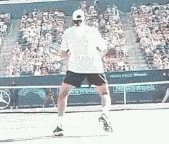

# The Approach and Volley

### The Approach and Volley

### By Allen Fox

### The Approach

### 

### Here Rafter moves forward with his shoulders coiled and his racquet back, then slices the approach shot, and continues on to the net.

**The purpose of the approach shot is to get you to the net and in
position to make a clean volley.** ***[The best
ball to approach on is a short ball, one that lands on or near the
service line because from there, you can get to the net with the fewest
steps.]{.mark}***

By moving to the net behind your stroke, you are in a sense running
forward as you hit the ball. Moving forward while hitting the ball will
add power to your stroke so a shorter backswing is necessary to reduce
the amount of power you impart to the ball. Also, because you're inside
the court a bit, the distance to your opponent's baseline is shorter so
again you don't need to get as much power as you do when you're back
behind the baseline.

**[[As you run toward the ball, your shoulders should be rotated, and
your body almost sideways to the net. After contact, continue on toward
the net.]{.mark}]{.underline}**

**[[Try to stay relaxed, since your body is somewhat tilted, and
twisted, as you rotate forward and step on through. Good balance is the
key to a successful approach shot.]{.mark}]{.underline}**

**On the backhand side, most one-handed players find it difficult to
hit and control a topspin approach shot. I recommend that these players
slice the approach shot because it is a physically easier stroke to
control.** When executing this slice approach,
swing forward and through the ball. Avoid chopping down to much and, of
course, finish out the follow through.

### Approach Down the Line

  -----------------------------------------------------------------------------------------------------------------------------------------------------------------------------
  \
  **Mac slices the approach down the line then easily covers the crosscourt pass.**
  -----------------------------------------------------------------------------------------------------------------------------------------------------------------------------

  -----------------------------------------------------------------------------------------------------------------------------------------------------------------------------

**Most approach shots should be hit down the
line.** **[That's the safest position to hit the
ball because your position on the court will [allow you to get to the
net quicker]{.underline} (the shortest distance to the net) and [allow
you to cover the down the line passing shot]{.underline} which is the
shortest distance the ball can travel to get by you.]{.mark}**

**Approaching down the line allows you to stay in control of the point
until you have a clear opportunity to finish.**
**[Hitting the approach crosscourt opens the court for your opponent to
take control of the point.]{.mark}** 

**[[Approaching crosscourt is a fundamental mistake in net play at all
levels]{.mark}]{.underline} - falling for the temptation to hit into
what looks like a wide opening, only to be passed or lose control of the
point.**

**Should you ever hit the approach crosscourt? Yes, if your opponent
has a serious weakness on a particular side that you can easily
exploit.** If your opponent does not have a
weakness and you choose to hit the approach crosscourt, you had better
hit it a dog gone good one because if you don't hurt your opponent,
he/she will have an opening to pass you right down the line.

**[Again, the key is to move forward with the shoulders coiled and the
racquet back.]{.underline}** **[Then uncoil as you hit and step through.
Remember to keep moving through the ball as you hit it. That gets you to
the net quicker and allows you to close down the passing
angles]{.mark}**.

  ----------------------------------------------------------------------------------------------------------------------------------------------------------------------------
  \
  **Pete must hit the ball up over the net on this difficult low volley, so he can't hit the ball too hard if he's going to keep it in play.**
  ----------------------------------------------------------------------------------------------------------------------------------------------------------------------------

  ----------------------------------------------------------------------------------------------------------------------------------------------------------------------------

### The Volley

It's very rare for a player to have an excellent volley game and an
excellent set of groundstrokes. Generally, the players who have good
groundstrokes have poor volleys, and the ones who have good volleys have
poor groundstrokes and that's because the entire concept of the two is
reverse. On the groundstroke you're concerned mostly about power and
control so you try to set up a stable base and you rotate off of that
stable base when executing the stroke. But at the net, volleyers are
moving so there's not a stable stroke.

**Where should you position yourself for the volley? The trick at the
net is to get as close as you safely can. It's easy to knock off almost
any volley while standing on top of the net.**
**If you are standing farther back, volley's become increasingly more
difficult, From the service line, even high volleys, become
difficult.**

**[[The problem is, standing on top of the net makes it relatively easy
for your opponent to lob the ball over your head. So, the volleyer has
several things he's trying to accomplish at
once.]{.mark}]{.underline}**

First, he can't move in too close to the net before he knows what his
opponent's going to do, whether his opponent's going to lob or hit a
ground stroke**. So the safest position at the net is about a third of
the way in from the service line to the net.** This
is where the volleyer should stand while he's waiting for the opponent
to commit.

**As soon as the volleyer sees the opponent is going to hit a
groundstroke and not a lob, he/she should start moving forward and if
possible, get right on top of the net.** **Then
he/she can hit down on the ball and create extremely sharp angles. From
further away from the net, the volleyer's angles are reduced and it
becomes more difficult to end the point.**

  -----------------------------------------------------------------------------------------------------------------------------------------
  \
  **Click Photo to see what Allen Fox has to say about closing the net.**
  -----------------------------------------------------------------------------------------------------------------------------------------

  -----------------------------------------------------------------------------------------------------------------------------------------

**[[Also, hanging back allows the ball to drop lower forcing the
volleyer to hit up over the net so the ball can't hit the ball very
hard.]{.mark}]{.underline}**

**[[The third reason you want to get in close when you hit the volley is
because the closer you are to the net, the easier it is to cover more of
the net.]{.mark}]{.underline}** As an example, let's say your opponent
hits a ball across the center angling away from you. If you're standing
close to the net, you can reach it by taking one step, however, if you
are standing farther back, you may have to take two or three steps. So,
the closer you can get, the easier it is to cover the net. If your
opponent never lobs, you generally cheat a little bit forward. If your
opponent's a pretty good lobber, you have to hold back and wait and see
what he's going to do.

### Practicing the Volley

During match play, coordination and timing on the volley is difficult
because you're usually moving forward during the stroke. Of course,
it's easier to hit the volley standing still. You only have one
velocity to worry about, the velocity of the ball coming at you.

**And that's the way most people practice the volley, standing still
or they may take one step into the ball as they block the
shot.** As I said before, hitting a standing volley
is relatively simple. **But during a match, you are rarely standing
still when volleying. You're always moving forward and that's the way
the volley should be practiced.**

  -----------------------------------------------------------------------------------------------------------------------------------------------------------------------------
  \
  **Most club players practice their volleys standing still but that's not the way the game is played.**
  -----------------------------------------------------------------------------------------------------------------------------------------------------------------------------

  -----------------------------------------------------------------------------------------------------------------------------------------------------------------------------

**The volley is a coordination of eye, leg, and hands all
together.**

1.  **The eyes see the ball coming and try to distinguish whether
    it's a lob or a ground stroke.**

2.  **When the eye decides it's a ground stroke, it transmits the
    message to the legs and you start to move
    forward.**

3.  **Then you get the hands in place, and your legs drive you
    through. You're getting a great deal of your power from your legs
    alone.**

### The Stroke

The volley stroke is the opposite of a groundstroke. The groundstroke is
hit low to high, with a fairly long backswing. The volley is hit high to
low with almost no backswing.

The racquet starts out above the wrist and punches down and through the
ball. Oddly enough, this is true even for low volleys. You hit down on
the low volley kind of like a chip shot in golf where the club goes down
and the ball goes up.

On the groundstroke, the racquet may be moving 50-60 miles an hour but
on the volley, the racquet may be moving only 10-15 miles an hour
that's because the stroke is much shorter. You don't need a lot of
power because you're close to the net and you only have to hit the ball
about half as far as you would hit a groundstroke. Also, the ball's got
a lot of energy because it hasn't hit the court yet so you don't have
to add much energy of your own.

  -----------------------------------------------------------------------------------------------------------------------------------------------------------------------------
  \
  **Even on low volleys, Venus hits down and through the ball.**
  -----------------------------------------------------------------------------------------------------------------------------------------------------------------------------

  -----------------------------------------------------------------------------------------------------------------------------------------------------------------------------

**It's important to stay relaxed and well balanced at the
net**. A lot of people make the mistake of trying
to do too much with the ball when they get in trouble at the net. This
is especially true on awkward or difficult to handle balls. For awkward
volleys, the trick is to relax your hands and watch the ball closely.
Try to manipulate it with the hands. The important thing is to get it
over the net and work for another shot.

**Because you are moving forward on the volley, you step with your
left foot on the hit (forehand) and the right foot comes up parallel to
the net after contact. That stabilizes you and allows you to gather your
balance so you can move to either side for the next ball if
necessary.**

**Remember, you're moving as you hit the ball, but you're not trying
to run through it. You don't want to run two or three steps afterwards,
just that one extra step to stabilize your position. Let your momentum
carry your other leg through naturally.**

**If the ball is high, however, and it's a fairly easy put-a-way,
then you don't have to worry about the next shot. Get to the net as
fast as you can right on top of the net if possible and knock it
off.**

|  | Tennis is mentally the most difficult sport due to it's personal nature which makes winning and losing feel more |
|  | important than they are. In this new book, Allen offers his proven solutions to problems such as choking, reducing |
|  | stress, finishing matches, and developing confidence. Based on a life time of high level play and coaching success, |
|  | it's a must for all competitive players. |
|  |  |
|  | [Click Here to |
|  | Order](http://www.amazon.com/Tennis-Winning-Mental-Allen-Fox/dp/0615407765/ref=sr_1_1?ie=UTF8&qid=1336083459&sr=8-1). |

|  | eminently preferable to losing. In his new book, The |
|  | Winner's Mind, Allen lays out an original step-by-step |
|  | plan for succeeding at any of life's endeavors, based on |
|  | his first hand and very personal observations of the |
|  | careers of both world-class tennis players and successful |
|  | businessman. The bottom line is that even if you are not a |
|  | born champion\--and only a tiny percentage of us are\--you |
|  | can still use the success strategies of champions to tilt |
|  | the odds in your favor. Writing with brutal honesty and dry |
|  | humor, Fox lays out the common mental characteristics of |
|  | winners in sports and in life. He explains the critical |
|  | role of intellect over emotion. He analyzes the struggle |
|  | between ambition and fear and the insidious and pervasive |
|  | fear of failure that undermines so many of us. He then |
|  | outline how to confront and overcome these fears in your |
|  | life and career, even when they are initially subconscious. |
|  | Must reading from one of the great thinkers in tennis, and |
|  | a Renaissance Man in life. [Click Here to |
|  | Order](http://www.tennis-warehouse.com/descpage-MIND.html). |
|  |  |
|  | To purchase this book you can also send a check for \$17.95 |
|  | to Allen Fox, 1120 Inverness Place, San Luis Obispo, CA. |
|  | 93401. The price includes shipping. |

|  | insightful analysts in modern tennis. A top 10 |
|  | American player from the glory days before Open |
|  | tennis, Fox played many of the legendary greats, among |
|  | them Roy Emerson, Rod Laver, Stan Smith, and Arthur |
|  | Ashe. At Pepperdine he developed the men's tennis |
|  | program into an elite contender for national titles, |
|  | and gave Brad Gilbert the insights that became the |
|  | foundation for \"Winning Ugly\". His book Think to Win |
|  | is a modern classic. He has also starred in a series |
|  | of acclaimed videos, including Pro Secrets of Match |
|  | Play and Allen Fox's Ultimate Tennis Lesson. |
|  |  |
|  |  |

