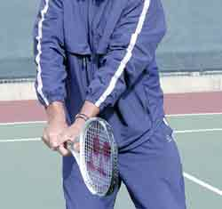

# The Lansdorp 2 Handed Backhand

### The Lansdorp

### Two-Handed Backhand

### Robert Lansdorp

  ------------------------------------------------------------------------------------------------------------------------------------------------------------------------------------
                                                    {width="2.7916666666666665in"
                                                                                    height="2.5in"}
  ------------------------------------------------------------------------------------------------------------------------------------------------------------------------------------
              **Lindsay Davenport is a player I developed. Now, at the top of the game, she hits through the ball using the exact method I\'m outlining in this article.**

  ------------------------------------------------------------------------------------------------------------------------------------------------------------------------------------

### One Hand or Two?

Deciding whether to hit your backhand with one hand or two is an
individual decision. With young kids I usually start them with a
two-hander. Kids have far more success in the beginning with two. It\'s
very difficult to start with one hand. When playing, other kids hit the
ball high to your one-handed backhand and you\'re dead. You can\'t
return as well, you can\'t pass as well. It\'s a lot harder to control.
You struggle for quite a long time if you start with a one-hander. But
some kids just want to hit with one hand. So I always ask the kid.

I think it\'s very important for the kid to tell me what they really
like. I give them that option. It doesn\'t make any difference to me. I
have no real preference. I can teach them either one. In fact, even
though it\'s more difficult to master, the one-hander is actually easier
to teach in some ways because it\'s a simpler motion.

In this article I am going to start by outlining the basics for hitting
the two-hander, and then we\'ll talk about the one-hander in the next
article, as well as how to make the transition from two hands to one, if
that\'s what the player wants.

  -----------------------------------------------------------------------------------------------------------------------------------------------------------------------
                                              {width="3.125in"
                                                                            height="2.3125in"}
  -----------------------------------------------------------------------------------------------------------------------------------------------------------------------
                                **The key to hitting through the ball on the two-hander is the follow-through, just like on the forehand.**

  -----------------------------------------------------------------------------------------------------------------------------------------------------------------------

### Similarity with the Forehand

To me the forehand and the backhand are the same. (See The Lansdorp
Forehand.) This is because, like the forehand, the follow-through is the
most important part of the backhand. The follow-through is what shows
how well you have hit through the ball. One of the big problems in
junior tennis is nobody talks about the follow-through. They don\'t
understand how it works or how important it really is.

Something else that is similar to the forehand, the wrist stays firm in
the hitting zone.

**[[Basically,]{.underline}]{.mark}** **[[you hit the two-hander the way
you would a left-handed forehand]{.underline}]{.mark}**. In fact, the
really good two-handers are probably people who can do something quite
well with the left hand, because the left hand is the dominant hand in
the two-hander. You could have them hit a left-handed forehand and
they\'d probably do quite well.

In teaching the two-hander I use the follow-through as a training tool.
In training, the follow-through on the two-hander should come straight
out.

The follow-through on the two-hander comes straight out, just like on
the forehand. It\'s almost in the same spot as the forehand. The only
difference is that now both arms come out together as straight as can
be. This is the finish I taught to Tracy Austin and Lindsay Davenport.
It\'s why they are able to hit through the ball with so much pace.

Like the forehand, really taking the arms all the way out is more of a
stroke you would hit in practice or in developing the stroke. It\'s
probably a little awkward when playing.

### Grip

**[[To develop the two-hander, you would like to have the player start
with a continental grip with the right hand and an eastern or a
semi-western grip with the left hand.]{.underline}]{.mark}** **[[The
grip with the left hand should match the grip the player uses with his
right hand on his forehand.]{.underline}]{.mark}**

+-----------------------------------------------------------------------------------------------------------------------------------------------------------------------+-----------------------------------------------------------------------------------------------------------------------------------------------------------------------+
| {width="3.125in" | confidence](media_the-lansdorp-2-handed-backhand/media/image4.jpg){width="3.125in" |
| height="2.0833333333333335in"}                                                                                                                                        | height="2.0833333333333335in"}                                                                                                                                        |
+:=====================================================================================================================================================================:+:=====================================================================================================================================================================:+
| **Two views of the two-handed grip. The left hand grip should match the forehand grip, either an eastern or a semi-western. The right hand grip should be a continental.**                                                                                                                                                                    |
+-----------------------------------------------------------------------------------------------------------------------------------------------------------------------------------------------------------------------------------------------------------------------------------------------------------------------------------------------+

  -----------------------------------------------------------------------------------------------------------------------------------------------------------------------------------
                                                             {width="2.7604166666666665in"
                                                                                  height="2.4375in"}
  -----------------------------------------------------------------------------------------------------------------------------------------------------------------------------------
                                                     **The best take back on the two-hander is between the hip and the shoulder.**

  -----------------------------------------------------------------------------------------------------------------------------------------------------------------------------------

**Preparation**

On the forehand, there is more flexibility in the way players can take
the racquet back - it can be straight, at shoulder level, or even a
little higher. But not on the backhand.

I like to see players bring the racquet back lower than on the forehand
close to the hip, or slightly higher, but definitely below the shoulder.
The reason is, on the backhand, if you bring it back too high it\'s more
difficult to get the racquet down and still hit the ball. The best
backhands don\'t bring it back too high.

### Contact

### {width="2.6041666666666665in" height="2.4479166666666665in"}

### The contact point on the two-hander is at the edge of the front leg.

**[[Getting ready early is critical because it allows you to step into
the ball with the right or front foot.]{.underline}]{.mark}** This means
you should reach the ball with the left foot if you are a right-hander.
Then you can readjust to the ball with your right foot as you step in.

A lot of players like Venus Williams hit the two-handed shot with the
open stance. It\'s become a common shot in the pro game, but in my view,
it is a mistake, especially when a player is trying to learn how to
drive through the ball.

With the two-hander, you open your body at contact the same way you do
on your forehand. This makes sense since the shot is so similar. This
motion puts the contact at about the edge of your front leg, which is
further back than the one-hander. It\'s one of the advantages of the
two-hander, the ability to take the ball later and change direction at
the last second.

### Follow-through

+------------------------------------------------------------------------------------------------------------------------------------------------------------------------------------+-----------------------------------------------------------------------------------------------------------------------------------------------------------------------------------+
| {width="2.6041666666666665in" | generated](media_the-lansdorp-2-handed-backhand/media/image8.jpg){width="2.6041666666666665in" |
| height="3.6458333333333335in"}                                                                                                                                                     | height="3.6458333333333335in"}                                                                                                                                                    |
+:==================================================================================================================================================================================:+:=================================================================================================================================================================================:+
| **When a player hits through the ball both arms come straight and all the way out. After this, it\'s ok to bring the racquet up and around the neck.**                                                                                                                                                                                                                 |
+------------------------------------------------------------------------------------------------------------------------------------------------------------------------------------------------------------------------------------------------------------------------------------------------------------------------------------------------------------------------+

**[[The follow-through is the most important part in learning to hit
through the ball on the backhand and developing
pace.]{.underline}]{.mark}**

It may sound like I\'m repeating myself, and I am, it\'s just that so
few people really pay attention to what the follow-through means.

**[[The follow-through should come straight out, just like on the
forehand, with both arms straight.]{.underline}]{.mark}**

Just like on the forehand, I teach players to \"hold the racquet out
front\" to see if they really hit all the way through the ball.

That\'s the hardest thing to make players do on the two hander, because
they feel like they can bring the left arm straight out but not the
right. When they try to hold it out front, the right arm is usually too
bent because they are used to bringing the arms around the neck. But if
you stick with it you can learn to bring the arms out together. After
that then it\'s fine and even natural for the player to bring the
racquet up and around the neck.

  -----------------------------------------------------------------------------------------------------------------------------------------------------------------------
                                                 {width="3.125in"
                                                                      height="2.2291666666666665in"}
  -----------------------------------------------------------------------------------------------------------------------------------------------------------------------
                     **One way to learn the follow-through is to let go with the left hand at the finish so the right arm can come all the way out.**

  -----------------------------------------------------------------------------------------------------------------------------------------------------------------------

Sometimes if a player is struggling with this, I\'ll have them actually
let go with the left hand at the finish.

Once a player gets a feel for the right finish then he has a better
chance of doing it with both hands. I\'ve even had players hit all their
backhands this way, and some of them have been quite good.

The point is to develop a feel for really hitting through the shot. If
the player does this in practice, when the player actually plays matches
the racquet probably goes out much further, closer to this practice
position before it goes up and around the neck. That\'s one of the
biggest mistakes I see kids make today - bringing the racquet up and
around the neck too soon.

Watch how well Lindsay extends through the shot. That\'s why her ball on
the two-hander moves and goes through the court, and why some other
player\'s balls tend to sit up.

  ------------------------------------------------------------------------------------------------------------------------------------------------------------------------------------
                                                     {width="2.8020833333333335in"
                                                                             height="2.4166666666666665in"}
  ------------------------------------------------------------------------------------------------------------------------------------------------------------------------------------
                      **If it had been up to me, Pete would have kept his great two-handed backhand. Would that have that made a difference at the French Open?**

  ------------------------------------------------------------------------------------------------------------------------------------------------------------------------------------

I know a lot of coaches today like to stress the wrap on the
followthrough. They tell their players to \"Show me the butt of the
racquet.\" In my opinion this couldn\'t be more wrong. Really, they
should be asking the player to leave the racquet out front. That\'s what
it takes to develop real pace on the shot, so that\'s what I do with all
my students, beginner, world class player, it doesn\'t matter.

Actually, that\'s the way I taught Pete Sampras. From the time he was 9
or 10 years old he had a great two-hander. If it had been up to me, he
wouldn\'t have changed. Who knows? Maybe he would have won the French by
now.

Pete did change to a one-hander of course, but it wasn\'t easy. After he
changed, his father brought him back to me so he could actually learn
how to drive the ball with one-hand, but that\'s a story for the next
article.

  ------------------

  ------------------

  ------------------------------------------------------------------------------------------------------------------------------------------------------------------------
  {width="1.3125in"
  height="1.914063867016623in"}
  ------------------------------------------------------------------------------------------------------------------------------------------------------------------------

  ------------------------------------------------------------------------------------------------------------------------------------------------------------------------

Robert Lansdorp is the legendary Southern California coach who has
developed dozens of world class junior and professional players.
Robert\'s players include 4 champions who have gone on to become number
one in the world: Maria Sharapova, Pete Sampras, Lindsay Davenport, and
Tracy Austin. In these articles, found exclusively on Tennisplayer,
Robert share his views on what goes into the making of a champion, and
how he developed the strokes of some of the best ball strikers in the
history of tennis.
