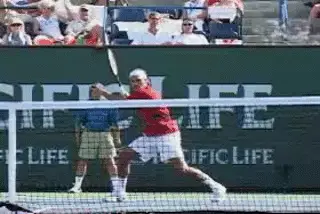

# The Seven Modern Topspin Forehands

### The Seven Modern Topspin Forehands

### Brett Hobden

**The modern forehand: [technique in the service of tactics.]{.mark}**

In the first article in this series, I demonstrated that there really is
no such thing as THE modern forehand. We established that there are
actually seven different topspin variations that pro players hit on a
regular basis. [Click Here](What%20is%20the%20modern%20forhand.docx)
Each of these forehands is situational and hit with a specific tactical
purpose. When we look at the differences in the swings, we can see that
each variation is a technical response to a tactical problem.

If you understand the different topspin forehands and how to use them,
you develop the ability to swing aggressively and take a full rip at all
your shots\--**but with a purpose, generating a specific forehand with
a specific tactical goal.**

In this article, we'll go into the different topspin forehands in more
detail. For each one, we'll look at when and why pro players use them.
We'll look at the differences in the trajectories and amount of spin.
Then we'll look at the different finishes players use to produce them,
and see how that varies depending on the grip and other factors. We'll
also compare the pro and the club variations, and see how the different
topspin shots can apply in your game.

**The arc actually clears the net by 3 or 4 feet.**

This article will give you a great general overview of the shot types.
But the relationships between swing pattern, tactics, impact height, and
levels spin are quite complex. That's why in future articles we'll go
into to all these factors in more detail for each of the modern
forehands.

**The Arc**

The first topspin forehand is what we call the arc. The arc is the one
of the most popular topspin forehands on the men's tour. It is hit very
aggressively with a lot of ball speed and moderate topspin. It has a
high safety factor because it passes 3 or 4 feet over the net, but is
still hit with enough spin to ensure that the ball drops down in the
court. **The top pros hit it fearlessly because it's safe. They use
the arc to move their opponents around the court and create
openings.** Although it is less common on the
women's tour, we are now starting to see this ball more frequently
there as well.

If you watch tennis on television, it's very difficult to see the real
trajectory of the arc. This is because the high camera shot typically
used in matches can make it appear that the ball is clearing the net by
only a few inches. In reality **the arc ball clears the net by 3 feet
or more traveling from baseline to baseline.**

**The finish on the arc differences with grip, ball height and amount of
spin.**

Understanding the arc ball can give you a big advantage in club tennis.
The message is that when you are rallying it's not necessary to hit
just a few inches over the net, even though it might appear that's what
the pros are doing. Instead copy the real trajectory of the arc ball.

**At the club level, the arc will be hit slightly lower and with a
little less spin, but the effect is the same**. You
will still be able to get the ball up, reduce your errors significantly
and hit aggressively with spin and depth***. If you are trying to
develop consistency from the ground, the arc can actually be a more
reliable shot than the drive.***

The finish on the arc, as with all the topspin variations, will vary
with the player's grip but also with the impact height and the amount
of spin on a given ball. On many balls the players will hit the arc with
a conventional finish which ends with the racket going over the
shoulder. This is particularly true with the moderate grips. But the
finish can be more across the body, with the hand going around the
shoulder or finishing lower somewhere in the mid torso.

**With conventional grips the finish on the drive is elevated, or over
the shoulder.**

**The Drive**

**The drive is a fast, penetrating shot still hit with topspin, but
with a flatter trajectory than the arc. It goes over the net much lower
than the arc, typically clearing the net by about 1 foot, versus 3 or 4
feet for the arc.**

**The drive is quick through the air and gets from one end of the
court to other very rapidly.** ***[Because of the
increased pace and lower trajectory, the opponent has less time to react
than with the arc, and this makes the drive more difficult to
reach.]{.mark}*** **[[The drive is a shot for hurting your opponent
and/or finishing the point from the baseline or a few feet
inside.]{.mark}]{.underline}** In the women's game the drive is
probably the most common of the seven forehands. This is because women
tend to hit the ball a little lower and flatter in the basic rallies
compared to the men who tend to hit more arcs.

***[The other primary situation you see players hit the drive is on the
passing shot, where it is important to keep the ball low.]{.mark}***
**When hitting the pass, depth is irrelevant if you can hit lower over
the net with pace and keep the ball close to
sidelines.**

For players with more conventional grips the drive finish will typically
be the elevated finish over the shoulder. With the more extreme grips
the finish will tend to be more horizontal with the hand finishing
across the body and around the shoulder rather than above it. When the
ball is low in the player's strike zone, you will see the hand and
racket turn over more with the finish also tending to be lower.

**Looping shots are great for defense but can also generate short
balls.**

**The Loop**

**[The loop is a more extreme variation of the arc. It's hit 2 or 3
times higher over the net than the loop, 6 feet or more.]{.mark}**
**[[It's also hit with heavy topspin. You commonly see players hit the
loop when they are pushed back. The result is a fast, high bouncing
ball, often played to the backhand from the inside out
position.]{.mark}]{.underline}**

When club players are pushed back, they often make the mistake of
panicking and going for the outright winner. The pros go for the loop.
Rafael Nadal is the classic example. When he is forced deep he will move
around the ball and hit a heavy topspin forehand that bounces up very
high usually to the opponent's backhand. **[[The loop is a great shot
to get you out of trouble.]{.mark} [But it can easily produce a short
ball to attack on the next shot. The depth and the high bounce can
actually make the loop a weapon and a way of transiting from defense to
offense.]{.mark}]{.underline}**

At high levels of the game the loop ball is hit with extreme spin.
However, **[[club players who are developing this high looping ball can
learn the trajectory with less spin. I call this the difference between
the rolling loop and the ripping loop.]{.mark}]{.underline}** As the
speed of the ball increases, the amount of spin should also increase, to
keep the ball on the same path.

**On the run, players finish the topspin lob on the right side.**

**TheTopspin Lob**

**The topspin lob is hit still higher than the loop, typically
clearing the net by 12 to 16 feet.** ***It's an
offensive shot used to hit over the head of an incoming
volleyer.*** **[The topspin lob keeps the volleyer
honest. If a player is closing in on top of the net and picking off
volleys, an offensive lob will not only win you points outright, [it
will keep the volleyer guessing and cause him to back off the net a step
or two.]{.underline}]{.mark}**

The top pro players hit this shot with very heavy topspin that drops the
ball quickly after it reaches its peak. But club players can use the
same shot hit at a lower velocity with less spin and be just as
effective.

The finish on the topspin lob will vary depending on how rushed the
player is and if he has to hit on the run. When the player has more time
and the ball is higher you will tend to see an inverted finish with the
racket finishing across the body. When the players are rushed and/or on
the run you will see what is called a vertical finish. With the vertical
finish the player hits much more radically upward and finishes the swing
on the same side of his body.

**The angle opens the court with an inverted finish.**

**The Angle**

***[The angle is hit cross court with a low trajectory and heavy spin.
It clears the net with about the same height as a drive, about 1
foot.]{.mark}** **[But it is hit with a sharp angle, typically landing
at about the sideline T]{.mark}*****. Because of the heavy spin the
angle is a dipping ball. Players like Monica Seles and Andre Agassi
pioneered this shot in the pro game. Roger Federer is also a modern day
master of the angle**.

The angle can be used in various situations. First, a heavy topspin
angle can be used to run your opponent, by pulling him very wide. By
pushing him outside of the court, the angle will open the court for the
next shot. The angle also makes a great crosscourt passing shot. When
you pass crosscourt you don't need to hit the deep corner. In fact you
have a better chance of getting the pass by the net player going
crosscourt with an angle.

Even if the volleyer gets there, the angle still makes his play
difficult. The ball stays low with heavy topspin. This means the net
player has to counteract the spin and still volley up. This is a very
difficult shot that will produce volley errors, especially at the club
level. If the volleyer does make the shot, he is still very unlikely to
put the ball away. If the ball does come back chances are you will have
a much easier ball to hit the passing shot.

An angle typically is hit with a lower inverted finish across the body.
This is true for all the grips particularly when the impact point is
low. This because you need to get the ball up and down very quickly.

**The semi-western grips have turned the dip drive into an exciting
weapon.**

**The Dip Drive**

**The dip drive is one of the most exciting shots in pro tennis, and
also one of my personal favorites. It's a high octane topspin shot that
is hit not only on the forehand side, but more and more on the backhand
as well.**

***The dip drive is hit off a short high ball. The player moves in and
makes contact, usually around shoulder level.***
**[[The ball is hit with great velocity and driven down into the court.
It's an offensive shot hit with power and spin that the great players
just blow by their opponents.]{.mark}]{.underline}**

Years ago a high ball on the forehand was considered a very tough shot
and caused even the top players problems. But with today's grips and
today's swing patterns players can rip the cover off this ball. You
also see the dip drive more and more on the return of serve in pro
tennis. **On the kick serves that used to pose a threat on the
backhand side, the players move around the ball, hit the forehand dip
drive and go on the offensive with the return.**

**Players like Tommy Robredo move around the return and hit dip
drives.**

The dip drive has become a huge weapon in today's game. It is extremely
comfortable for players with the extreme grips. But players with milder
semi western grips or with a hybrd grip like Federer can hit it as well.
Players with an eastern grip will find the dip drive difficult because
of the ball height. **A good solution is to let the ball drop lower
into the strike zone to make a penetrating shot. The more conservative
grips with finish higher on the dip drive.** But a
player like Roddick will finish all the way across his body and quite
low on the left side.

**The Bender**

**The bender is typically hit on the run from a low contact point. It
has a low trajectory and around a foot of net clearance like the
drive.** ***[We call it the bender because it has a
combination of topspin and sidespin, causing the ball to \"bend\"
inwards (curving from right to left for a right-handed
player).]{.mark}*** **It allows the player to neutralize a difficult
ball but also to pressure the opponent with the
reply.**

**The bender can be hit with either classic or more extreme grips.**

The bender was one of Pete Sampras's trademark shots. **He'd dare
players to hit crosscourt forehands or approach with their backhands
down the line.** Once they took the bait he would
hit incredible running benders to both corners.

But the bender is not just for players with classical grips like
Sampras. In the modern game it can be equally effective across the whole
range of more extreme grips as well. The thought once was that the way
to attack the players with the extreme grips was to hit the ball low and
wide. But not anymore when the extreme grip players can hit the bender:

**[[The bender is hit with an extreme vertical finish,]{.underline} with
the [racket traveling upward over the player's head and never crossing
the body.]{.underline}]{.mark}** This finish was discovered by players
reacting in extreme circumstances in match play. It's a great example
of how shots evolve in the modern game.

**The world's best player with the most varied and complete forehand.**

In today's game, the variations in the modern forehand have opened up
an entirely new realm of tactical possibilities. When you try these
shots, it's important to remember they have to be hit from the
appropriate area of the court with the right tactical goal in mind to be
successful. But the fact is that not every ball in tennis should be a
drive. And that's at all levels.

**[[When you add loops, angles, lobs all of a sudden you are building a
repertoire. You are expanding the tool kit of shots you have in your
game. That's how you start to play better
tennis.]{.mark}]{.underline}** There are many reasons why Roger Federer
is the number one player in the world, but his incredible variety on his
forehand is definitely one of them. It's a dimension that players at
all levels should work to add to their games as well.

  --------------------------------------------------------------------------------------------------------------------------------------------------------------------------------------------------------------------------------
                                                                                                                                                  website dedicated to providing coaches and players
                                                                                                                                                                                with the knowledge required to teach and play
                                                                                                                                                                                modern tennis successfully. Two DVDs are now
                                                                                                                                                                                available, the first in a new series on teaching
                                                                                                                                                                                and playing the modern game. ([Click
                                                                                                                                                                                Here.](http://www.moderntennis.com)) Anyone
                                                                                                                                                                                wishing to contact the authors can also do so
                                                                                                                                                                                directly through their website.
  ----------------------------------------------------------------------------------------------------------------------------------------------------------------------------- --------------------------------------------------

  --------------------------------------------------------------------------------------------------------------------------------------------------------------------------------------------------------------------------------
