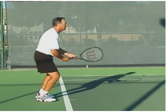
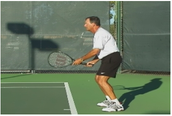
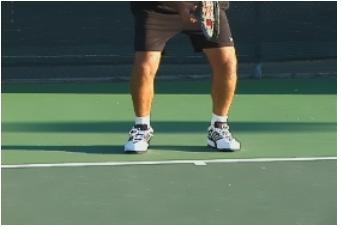
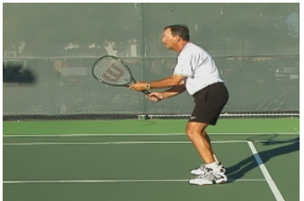

# Footwork: Ready Position

### **Michael Friedman**

{width="2.78125in"
height="2.53125in"}

**Start from a low ready position with a wide stance, learn when to
split step, stay low with knees bent when moving to the ball and when
recovering.**

**[[Ultimately the secret to great tennis is great footwork! Great
footwork means the ability to move into position to hit the ball and
then recover and be ready for the next shot.]{.underline}]{.mark}**
Great footwork will improve your reactions to the ball and how you well
judge it. It will move you consistently into better position and improve
your strokes. It will help you generate power from the ground and up
through your body. Good footwork will provide the rhythm and timing of
the point, and much, much more.

This may sound simple, but it takes work and discipline to develop.
Tennis teachers teach the ready position in the first lesson to
beginners, but may not emphasize it enough with every level of play. I
find myself coming back to the ready position in almost every lesson. If
students can make the first move correctly and get back into the ready
position, they can make the first move to the next shot the same way.
That consistency builds confidence.

The starting point for developing great footwork is the correct ready
position. This is the basic athletic position common to many sports with
a low center of gravity and a wide stance.

There are physical, technical and mental elements to this ready
position. This article focuses on the physical elements. You can read
about the mental aspects in my first article in this series, entitled
\"Concentration\". I\'ll address the technical elements in a later
article as well.

+-----------------------------------------------------------------------------------------------------------------------------------------------------------+----------------------------------------------------------------------------------------------------------------------------------------------------------------------+
| {width="2.5625in" | generated](media_footwork-ready-position/media/image3.jpg){width="2.5520833333333335in" |
| height="2.96875in"}                                                                                                                                       | height="2.96875in"}                                                                                                                                                  |
+:=========================================================================================================================================================:+:====================================================================================================================================================================:+
| **The starting point for developing great footwork is an athletic ready position with low center of gravity and wide stance, shown above in front and side views**                                                                                                                                                               |
+----------------------------------------------------------------------------------------------------------------------------------------------------------------------------------------------------------------------------------------------------------------------------------------------------------------------------------+

Every ball you react to in tennis is slightly different from every
other. By reacting out of the same ready position each time, making the
same first move, you will develop muscle memory that will help you
respond in the same fundamentally sound way to all different situations.
And you can learn to do this automatically.

Players should begin getting ready, or establishing the ready position,
when their opponent is hitting the ball. Most players tend to think
about what they are doing only when they are hitting the ball
themselves. In reality, you have to take the time to think about your
ready position and challenge yourself to get back into it by the time
your opponent is hitting the next shot.

### **Establishing the Ready Position**

You can get into the ready position right now while you are reading
this, and develop a feeling for the position. When you get on the court,
stand one yard behind the baseline and do the same.

Widen your stance so that your feet are a little more than shoulder
width apart. Now try to widen them a little more until you feel like
they are too wide apart. This might be uncomfortable but it is probably
correct. Feel like you are standing up straight. Your lower back is
concave, that is, the small of your back is curved in towards your
spine. Your shoulders are level and your head is facing forward. Now
bend your knees and reach down with your fingertips and touch the top of
your kneecaps, while keeping your back straight. Feel how your weight
has transferred to the balls of your feet and your toes. There should be
no weight on your heels. Don\'t lift your heels, just keep the weight
off of them. When you look down you should see your knees covering your
toes.

  ---------------------------------------------------------------------------------------------------------------------------------------------------------------------------------------------------------------------------------------------------------------------------------------------------------------------------------
                                          {width="2.75in"   confidence](media_footwork-ready-position/media/image5.jpg){width="2.6041666666666665in"
                                                               height="2.6979166666666665in"}                                                                                                                                   height="2.6979166666666665in"}
  --------------------------------------------------------------------------------------------------------------------------------------------------------- -----------------------------------------------------------------------------------------------------------------------------------------------------------------------
                  **If you can see the intersection of the court and the back fence looking over the net, your ready position is too high**                                    **From the correct, low ready position, you are looking through the net to see the intersection of the court and the back fence**

  ---------------------------------------------------------------------------------------------------------------------------------------------------------------------------------------------------------------------------------------------------------------------------------------------------------------------------------

When you get to the court, establish this position and look up. You
should be **[[looking through the net]{.underline}]{.mark}** to see
where the court surface meets the back fence. If you are looking
**[[over the net]{.underline}]{.mark}** to see this intersection,
you\'re too high. Lower your position until you see the intersection of
the court and the back fence through the net. This position should feel
like you are guarding someone in basketball, or you\'re playing the
linebacker position in football, or shortstop in baseball. This basic
athletic position should be used in all ball sports.

Hold this low center of gravity position and move your feet in place for
ten seconds like you are running as quickly as you can. Feel your
quickness, agility and balance by keeping your feet apart and your knees
bent. Experiment and see how quick and agile you are when you stand up
straight with your feet together and again try to move your feet as
quickly as you can again. You should be able to move your feet much
faster when you are lower. When you bend your knees, widen your stance,
and keep your back straight, you are creating leverage in your toes,
feet, ankles, knees and hips.

Staying with this low center of gravity will allow you to move to the
ball with your lower body while keeping your back or spine fairly
vertical and straight. This will provide good balance and allow you to
stroke the ball correctly, creating an elegant look! Knees bent and the
back straight might remind you of Groucho Marks running around the court
and that might be a good image for you to keep in mind if you can keep
from laughing.

This position might sound simple but it is not easy! Keeping your knees
bent means you are stressing your quadriceps, hamstrings, ankles,
calves, and shins, plus your glutes, which together makeup the biggest
muscle groups of your body. These muscles will demand a greater blood
flow. You will definitely start to feel it in your heart rate and
respiration. Try to stand in the correct ready position for a minute.
You will feel it! This is a much more physically demanding position, and
that might be why you would rather stand up straight with your knees
locked and rest a little when your partner or opponent is hitting. But
remember, while the ball is in play there is no time to rest. Stay down
into the ready position and be prepared to time your split step. You can
rest between points, but not between shots! If you start at this lower
center of gravity with your knees bent, you will already be in a bent
knee position for your strokes!

Your knees should always be bent and in your ready position, as you move
to the ball, hit the ball, and recover back to the middle.

Watch closely next time you are at a baseball game. Every time the ball
crosses the plate the entire infield does the split step? This alerts
the infielder to be ready to move in any direction when the ball comes
off the batter\'s bat. The same is true every time your opponent hits
the ball. You are on defense, ready to react. The split step is timed so
that your feet are separating three to four inches more than when you
started. Your feet should touch down just as your opponent hits the
ball. Time your split with his hit. Land low and on your toes, ready to
shift your weight in the direction you see the ball coming off your
opponent\'s racquet. This shift is also called the load.

You can see this best when watching tennis on television by looking at
the pros\' knees. See how the knee bends more toward the side the player
is moving. Watch the returner getting ready for the serve. Great
returners start with their feet far apart. They might start with their
body bent forward from the waist, but just as the server gets ready to
toss the ball they will stand up a little straighter but keep their feet
apart. Then they split their feet apart even further, timed to the ball
hitting the server\'s racquet.

**The First Move on the Baseline**

  ---------------------------------------------------------------------------------------------------------------------------------------------------------------
   {width="3.2881944444444446in"
                                                                  height="2.2118055555555554in"}
  ---------------------------------------------------------------------------------------------------------------------------------------------------------------
                                                          **The first move to the ball on the forehand.**

  ---------------------------------------------------------------------------------------------------------------------------------------------------------------

The first move is in the lower half of the body where the knees ankles
and hips shift or load in the direction that they see the serve going.
You will see many of the top players keep this shifting mechanism in
motion by shifting side to side just before the server serves. If you
anticipate and shift the wrong way, you can only hit a defensive return
of serve. The first reflexive move is the key to preparing the body to
turn to the side the ball is going. If the bottom half is shifting one
way and the top half is turning the other, you are in big trouble.

The last detail in the first move is a slight lean of your top half, or
shoulders, towards the net. If you are right handed and you are turning
to the right for a forehand, you should drop your left shoulder towards
the net. The bottom half of your body is shifting to the right and while
the top half is turning to the right it is leaning to the left.

  ---------------------------------------------------------------------------------------------------------------------------------------------------------------
   {width="3.2958333333333334in"
                                                                   height="2.229861111111111in"}
  ---------------------------------------------------------------------------------------------------------------------------------------------------------------
                                                     **Here is the identical first move on the backhand side**

  ---------------------------------------------------------------------------------------------------------------------------------------------------------------

To the backhand the right shoulder should be dipping towards the net.
This lean is what prepares the body to be lined up when you step into
the shot with your weight going towards the net.

**Practice Drill**

First try this without a ball. Start behind the baseline in the ready
position. See the relationship of the top of the net to the back fence.
Keep the bottom of the fence below the net throughout this drill. Do the
split step, stay down and take three steps to your forehand, after you
finish your swing get down and side step back to the middle of the
court. If you saw the bottom of the fence move from below the net to
above the net, your center of gravity was coming up. Practice this
without a ball to the backhand as well. Do it once to each side and then
add repetitions. See how many you can do side to side. Do two or three
forehands in a row and then two or three backhands in a row. Feel like
you are playing a point without the ball. Then have your coach feed
balls to you and see if you can maintain the same low center of gravity.

  ---------------------------------------------------------------------------------------------------------------------------------------------------------------
  {width="3.2881944444444446in"
  height="2.188888888888889in"}
  ---------------------------------------------------------------------------------------------------------------------------------------------------------------
  **Here is the correct movement pattern to the ball and the recovery. Practice and see how many repetitions you can do, keeping your center of gravity low.**

  ---------------------------------------------------------------------------------------------------------------------------------------------------------------

**The First Move at the Net**

Do this drill first without using a ball. Get into your ready position
at the net. Do the split step. At the net when you do the split step,
your feet should land slightly behind you so that your weight is leaning
forward. This will force you to attack the ball.

Now shift or load your weight towards your forehand. Notice you have to
step across after you shift your weight to hit the volley. Recover by
stepping back with the same foot you stepped with and then split step
again.

 

 

 

  ---------------------------------------------------------------------------------------------------------------------------------------------------------------
   {width="3.2958333333333334in"
                                                                         height="2.175in"}
  ---------------------------------------------------------------------------------------------------------------------------------------------------------------
                               **Note how the feet land behind you after the split step. This shows your weight is going forward.**

  ---------------------------------------------------------------------------------------------------------------------------------------------------------------

The backhand pattern is the same. Shift or load your weight. Now step
across to make the hit. Recover by stepping back and split step.

Now have your coach feed balls to you and time your split with the
coach\'s hit. See the ball being hit by the coach\'s racquet and say the
word \"SPLIT\" when he hits and get the timing of when to split.

Practice the ready position, the split step and the first move in front
of a mirror and see what you look like making this move. It might feel
strange to begin with, but it will look and work great!

  ----------------------------------------------------------------------------------------------------------------------------------------------------------------------------------------------------------------------
  {width="2.079861111111111in"   teaching and coaching tennis for over 30
  height="1.663888888888889in"}                                                                                                                                            years. Currently he is the Tennis Director at
                                                                                                                                                                           the Millennium Sports Club in Rancho Solano,
                                                                                                                                                                           where he runs an active junior development as
                                                                                                                                                                           well as adult program. Michael has been a
                                                                                                                                                                           mainstay in the United States Professional
                                                                                                                                                                           Tennis Association\'s Northern California
                                                                                                                                                                           Division, and served as President from 2000
                                                                                                                                                                           through 2001. He has been a featured speaker
                                                                                                                                                                           at many USTA and USPTA tennis workshops
                                                                                                                                                                           throughout Northern California , specializing
                                                                                                                                                                           in teaching footwork and fundamentals to
                                                                                                                                                                           players as well as coaches. Michael was named
                                                                                                                                                                           USPTA Norcal Pro of the Year in 2003
  ------------------------------------------------------------------------------------------------------------------------------------------------------------------------ ---------------------------------------------

  ----------------------------------------------------------------------------------------------------------------------------------------------------------------------------------------------------------------------
