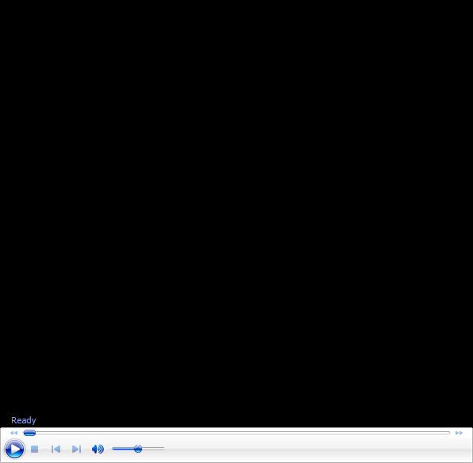

# The Golden Move # 12 The Power Move

**Golden Move 12:**

# The Power Move

**David Bailey**

See a key footwork pattern when you are pushed to the edge of the court.
The Power Move. Golden Move #12, in two variations. This move completes
David's amazing series on the 12 moves in pro tennis that you can learn
to develop yourself. With players he personally coached doing the demos
to prove it.

And there is more to come in a future series! 7 modified Golden Moves
plus 2 Advanced Moves. David is the man who brought the same level of
sophistication to teaching footwork that Tennisplayer has pioneered with
stroke production. It's a critical piece in player development. And this
is the only place to see it in fabulous detail.

David Bailey is a native Australian who has spent 15 years studying
tennis at the professional level. He has developed a new language for
one of the most complex and misunderstood aspects of the game, footwork
and court movement. David has worked with world class players and
coaches, national tennis associations and top academies, and has
presented at coaching seminars around the world. His teaching system,
the Bailey Method, has become a regular part of the coaching curriculum
at the Nick Bollettierri Tennis Academy, where it is personally endorsed
by Nick

Visit David's Website! [**[!]**](http://www.baileytennisfootwork.com/)

To Contact David directly [**[!]**](mailto:david@baileytennisfootwork.com)
