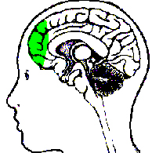

# Mindfulness - Can You Actually Change Your Brain

### Mindfulness: Can You Actually Change Your Brain?

### Jeff Greenwald

------------------------------------------------------------------------

{width="3.3333333333333335in"
height="2.5in"}

**What goes on in the brain of Rafael Nadal anyway?**

Ever lose a match because you got a little tight on a critical break
point? Or lose your focus and make uncharacteristic mistakes when
you\'re trying to close out a match? Or maybe you are that rare player
who doesn\'t think too much about the score, but still gets frustrated
and negative when you\'re off your game.

All these problems are related to your ability to manage your anxiety
and negative emotions. One line of thinking goes that the solution is to
try move to a place where you play from positive feelings of confidence
and fun, the ideal performance state. No doubt this is a great goal all
players should strive for that produces awesome tennis.

But how often do you actually get into and maintain that state for the
duration of an entire match? Most of us have glimpses of these feelings,
but struggle through the majority of our competitive experience dealing
with feelings of fear and uncertainty, at least at some level.

Now research on the brain suggests a completely different solution,
through an ancient technique called \"mindfulness.\" Rather than
completely eliminating negative feelings, mindfulness training can help
you escape their effect by changing how you focus and increasing
productive action within your brain.

The research shows that you can literally change the way your mind works
and in this way make fundamental changes in your mental game. The most
exciting aspect is that these changes can become permanent - by actually
rewiring how your brain responds in certain situations\--and this can
transform who you are as player.

  ------------------------------------------------------------------------------------------------------------------------------------------------------------------------------------------------
                                                                       {width="2.7777777777777777in"
                                                                                   height="3.513888888888889in"}
  ------------------------------------------------------------------------------------------------------------------------------------------------------------------------------------------------
                                                           **Mindfulness has its roots in ancient traditions such as Tibetan Buddhism.**

  ------------------------------------------------------------------------------------------------------------------------------------------------------------------------------------------------

\"Mindfulness\" can be defined as a deep focus in the present moment. It
is the act of doing just one thing with our attention completely
absorbed in an activity without judgment. Mindful breathing is the most
basic technique within this practice, consisting of prolonging our
attention to our breath.

The concept of course is not new. The concept of \"mindfulness\" comes
from the East and has its roots in a variety of disciplines - namely
Tibetan Buddhism, Vipassana, and Zen. Mindfulness works by strengthening
the \"focus\" muscle in the brain - known as the pre-frontal cortex.

What researchers are finding is that by consciously shifting our
attention through mindfulness we can balance the left and right
hemispheres of our brain. This is critical because each hemisphere has a
different task - the left hemisphere is more analytical and verbal, the
right being more intuitive and visual. Playing tennis well requires a
balance between the two, otherwise we can become too analytical, rigid
and less instinctive. Staying calm and fluid with our strokes requires
this balance.

The point is that through the practice of mindfulness we can not only
create a new, balanced mind state in the moment, but also alter the way
our brain looks and functions over time.

  -------------------------------------------------------------------------------------------------------------------------------------------------------------------------------------------------
                                                             {width="2.0833333333333335in"
                                                                                   height="2.2604166666666665in"}
  -------------------------------------------------------------------------------------------------------------------------------------------------------------------------------------------------
                                                                   **The goal is balance between the left and right hemispheres.**

  -------------------------------------------------------------------------------------------------------------------------------------------------------------------------------------------------

One of the most interesting implications of this research has to do with
how we deal with anxiety. It\'s generally assumed that the goal is to
reduce or eliminate our fears so that we can play with positive
emotional energy. That\'s a great goal, something most players can work
toward, and learn to access at times. It\'s sometimes called being in
the zone. But eliminating anxiety isn\'t always possible in many or even
most competitive situations in tennis.

Techniques associated with mindfulness offer a different solution to the
presence of these negative thoughts and fears. Rather than eliminating
them, proper focus will allow you to reduce or eliminate their impact,
so that you can function at your highest level even in their presence.

When you are balanced between the two hemispheres while playing, the
left hemisphere can still contribute analytic thought, but not at the
expense of dominating our mental experience. With proper focus, the left
brain can quickly assess what shot to hit next or how to clean up your
big backswing on your return, leaving more time, for example, to orient
yourself to your opponent\'s toss or position when returning.

  -----------------------------------------------------------------------------------------------------------------------------------------------------------------------------------------
   {width="2.6944444444444446in"
                                                                               height="2.7083333333333335in"}
  -----------------------------------------------------------------------------------------------------------------------------------------------------------------------------------------
                                                             **Mindfulness trains the prefrontal cortex, the \"focus muscle.\"**

  -----------------------------------------------------------------------------------------------------------------------------------------------------------------------------------------

This seamless focus on what is \"relevant\" in the moment has huge
performance benefits. If you find your mind drifting off the court
during matches, or have a difficult time functioning when you hear the
voice of your inner critic, a shift in focus may be all you need to help
resolve what might seem like insurmountable problems that have plagued
you for years.

Over time this kind of focus shift can actually rewire your brain to
make these responses permanent. This is what leaders in neuroscience are
now discovering: that our thoughts and conscious shifting of attention
can act back on our brain to actually change its structure over time -
not just in the moment. This possibility of impacting our wiring to
reduce deeply ingrained mental habits - namely losing focus under
pressure appears to be revolutionary.

I\'ve long known the value of preparing mentally for matches with
imagery and music, and the importance of managing our \"monkey\" mind in
matches. Over the years, I\'ve helped many players quell their critical
voice, play more aggressively even though their brain tells them to play
it safe, and shift their focus on demand. But, what nobody has fully
known, and what is now emerging, is that a practice of mindful
meditation and conscious attentional shifting can actually change the
way our brain is wired in a way that can transform you as a player.

{width="3.3333333333333335in"
height="2.5in"}

**Does he love the fight more than the win?**

**The Nadal Example**

By now, I\'m sure that you, like me, are dumbfounded by Rafael Nadal\'s
ability to concentrate and the depths of his competitive spirit. Can you
imagine what Rafa\'s brain chemistry looks like?

Take a recent comment Nadal made after his recent win over Federer in
the Australian Open. When asked by reporters about the match he said,
\"Maybe I like the fight more than the win.\"

Let\'s consider Nadal\'s statement from a neural wiring perspective as
it relates to focused attention. If Nadal\'s focus is truly on the
\"battle\" rather than the result as he claims - which I firmly believe
it is - than it is likely that he is spending little to no mental effort
trying to manage negative thoughts, negative memories or worries about
what could happen. He is so engaged in the present moment, focused on
what he needs to do every point to play his best. He is not allocating
important psychological real estate to manage the barrage of negativity
that can emerge from the common outcome-oriented mental state. Those
thoughts may flash through his brain from time to time as they do with
all players. The difference is Nadal is so focused that he doesn\'t
engage them.

  ------------------------------------------------------------------------------------------------------------------------------------------------------------------------------------------------
                                                          {width="2.4305555555555554in"
                                                                                   height="3.0555555555555554in"}
  ------------------------------------------------------------------------------------------------------------------------------------------------------------------------------------------------
                                                                            Balanced focus in the face of Rafael Nadal.

  ------------------------------------------------------------------------------------------------------------------------------------------------------------------------------------------------

If you look closely at Nadal\'s face when he is competing, particularly
his brow, he has a look of that almost appears as consternation. This
facial expression represents the depth of focus that Nadal is able to
generate. One can only imagine the beautiful brain circuitry that Nadal
is activating in the heat of battle - decisiveness, a narrow focus on
the ball, the court and Federer\'s patterns - all that processed,
literally, in split seconds. And the outcome is the incredible high
percentage execution of the most difficult shots at the most critical
moments.

**[[But let\'s take this one step further. Every time Nadal acts on this
pattern with a mentality of \"fight for every point, give up nothing\",
he actually deepens the connection of this particular neural network for
use in the future. For example, when he chooses to hit a deep backhand
crosscourt winner that makes our jaw drop open again, the brain
circuitry that created this decision becomes even more accessible next
time. In other words, the physical action Nadal chose will actually act
back on the brain to further reinforce the connectivity between focus
and execution.]{.mark}]{.underline}**

Let\'s look at another example, but this time not Rafa, but you. You\'re
leading 5-4 in the first set ad-out, set point, and as you crouch down
to return serve your brain flips through the rolodex of possible shots
that you could use to win the set. You think, \"Should I block it back?
Should I step in and take the offense right away? I missed my forehand
long the last time I really went for it. Maybe I\'ll just put it in
play.\" In the meantime, simply because you are spending too much time
processing the situation, your body tightens up just a little bit. You
decide to put it back in play and hope for the best. To your chagrin,
your opponent, realizing that she has to win the point, takes your short
blocked ball and hits a winner crosscourt.

{width="3.3333333333333335in"
height="2.5in"}

**With balanced focus players process input faster with less effort.**

In comparison, it\'s not that Nadal isn\'t thinking about these sorts of
tactical possibilities - rest assured he is - but the key point is that
he doesn\'t have to work as hard mentally as most players do to process
the input. He is decisive. His processing speed simply appears to be
faster. A study done recently found that verbal facility and problem
solving actually improve in elite athletes. Scientists Fink and Neubauer
describe it like this:

\"Like the expert meditator, the expert athlete, has developed the
ability to do more with less. By directing attentional resources more
consistently and with less possibility of engaging the attention in
surrounding cognitive noise, the elite athlete maintains full, or even
heightened, awareness of his or her context while simultaneously
engaging in sustained on-task attention.\"

  -------------------------------------------------------------------------------------------------------------------------------------------------------------------------------------------------
                                                              {width="2.9166666666666665in"
                                                                                          height="3.875in"}
  -------------------------------------------------------------------------------------------------------------------------------------------------------------------------------------------------
                                                                         **Pete Sampras: clutch serving even with anxiety.**

  -------------------------------------------------------------------------------------------------------------------------------------------------------------------------------------------------

**Improving Focus**

So how to do this? By learning to balance the halves of your brain
through a disciplined focusing exercise, such as focused breathing.

It\'s well known that elite athletes in any sport relish pressure. They
have learned to embrace their nerves and when they feel anxious they
immediately think something like, \"Yes, it\'s show time.\" When Pete
Sampras was asked about what he missed most in the game he responded,
\"I miss throwing up in the locker room before the finals at
Wimbledon.\" Elite athletes love these moments and don\'t let their
nerves get in the way. The key point is that they have figured out that
it is not the nerves that will determine their success but, rather,
being able to maintain their focus in the moment and committing to the
shots they believe in.

**[[Putting studies in golf, conducted by Crews and Landers, also
revealed that successful amateur golfers who were able to make putts
under stressful conditions reported feeling as much anxiety as those
were not able to make the shots. These reports were also confirmed with
physiological measures: Heart rates of the successful golfers increased
as much as those of golfers who failed to make their
putts.]{.mark}]{.underline}**

  ------------------------------------------------------------------------------------------------------------------------------------------------------------------------------------------------
                                                       {width="2.3333333333333335in"
                                                                                         height="3.125in"}
  ------------------------------------------------------------------------------------------------------------------------------------------------------------------------------------------------
                                                                **Reduced left side brain activity correlated with better putting.**

  ------------------------------------------------------------------------------------------------------------------------------------------------------------------------------------------------

The difference, however, was that left side brain activity was reduced
in the top performers, suggesting they were able to divert mental
resources to the right hemisphere as needed to complete the task. These
physiological studies concluded that the less experienced athletes had
higher levels of left-side activation when on task, while more
experienced performers consistently exhibit balanced patterns of
left-and right-side activity.

What\'s particularly relevant here is that many players are often both
overly preoccupied with finding ways to reduce their anxiety in
competition and are disturbed by these feelings. While reducing anxiety
is certainly possible through consistent practice of a variety of
techniques - including mindfulness training - the key to peak
performance appears to lie more in our ability to manage our focus than
in directly reducing our arousal levels. It\'s a matter of shifting our
focus away from feelings that may be there, so their role is diminished.
This makes sense because it is most commonly the negative thoughts and
irrelevant distractions that fuel the anxiety pump in the first place.

**[[So it is not the direct reduction of anxiety - heart rate, and blood
pressure, for example - that distinguishes the elite from the rest, but
our ability to shift our attention on demand.]{.underline}]{.mark}** And
so far, it seems, the quicker the better. This information is extremely
important because it can help us begin to use our psychological
resources more effectively.

  -------------------------------------------------------------------------------------------------------------------------------------------------------------------------------------------------
                                                                        {width="2.7777777777777777in"
                                                                                   height="2.4722222222222223in"}
  -------------------------------------------------------------------------------------------------------------------------------------------------------------------------------------------------
                                                                  **The Amygdala: the fear center lurking deep within the brain.**

  -------------------------------------------------------------------------------------------------------------------------------------------------------------------------------------------------

**Mental Brushfire**

Without the ability to shift and sustain focus our untamed minds remain
vulnerable to the compulsive thoughts that pop into our heads whenever
pressure begins to emerge. It is too easy to get carried away by these
thoughts and make poor choices in the middle of competition that only
strengthen our bad habits when it comes to our strokes - i.e. playing
tentatively and impatiently. Too often, we become victims of our
thoughts and forget how we want to really hit the ball or what we
practiced during the week leading up to the tournament.

In my CD Fearless Tennis ([Click
Here](http://www.amazon.com/Best-Tennis-Your-Life-Performance/dp/1558708448/ref=pd_bbs_sr_1?ie=UTF8&s=books&qid=1200341206&sr=8-1))
there is an extreme example of this. A player who actually equated a
first round loss with the possibility of being out on the street one day
in his life away from tennis.

The mental kindling went like this: \"What if my ranking drops? What if
I don\'t get a scholarship after all this time? Then I\'ll have to go to
a weak school. This will surely affect my chance of getting a good job.
If I don\'t get the right job maybe my whole career will take the wrong
track. Maybe I\'ll even be on the street one day. I have to win this
match!\"

{width="3.3333333333333335in"
height="2.5in"}

**Learn to put out the brushfire with your breathing.**

While I know this may sound far-fetched to you, this is the kind of
pressure he was placing on himself to win and improve his ranking. This
kind of thinking is called the \"brushfire fallacy,\" in which one
negative thought leads to another and another. Again we can directly
relate this to activity to one section of the brain, the amygdala or the
fear center . In this case the fear center was overly activated, which
held him captive. Then of course, his tentative play and eventual loss
only strengthened this mental loop. A nasty, on going self-fulfilling
prophecy.

So what did I do to help him shift this destructive thinking pattern? I
had him interrupt this process with a deep breath as soon as he noticed
the thoughts circulating in his head. He understood this was critical to
stop the brushfire and give other brain synapses a chance to fire. He
learned to focus on his breathing daily to practice \"catching\" these
thoughts and become more aware of his tendency to focus on things not
working out.

I also taught him to pull up pictures of himself playing loosely and
confidently and hitting his favorite shots - which were in direct
conflict with the actions he was choosing previously. I explained to him
that we needed to create new mental \"grooves.\" This is an important
distinction because I believe spending too much talking about fears -
beyond a certain point - can often deepen the emotion connected to the
irrational thoughts.

By increasing his awareness of his negative thinking style, particularly
the tendency to \"brushfire\", interrupting these negative thoughts, and
replacing them with new pictures his concentration improved. And, to his
great satisfaction and relief, he did earn that college scholarship to a
division I school.

{width="3.3333333333333335in"
height="2.5in"}

**Develop images of relaxed hitting in your own mind.**

Mindfulness Training

I feel confident when write about this topic because I have spent years
trying to tame my own mind. Like so many players, I was prone to
distraction throughout my playing career in the juniors, in college, and
on the tour. For twenty years, prior to learning about how to manage the
mind, shift focus, or reduce tension, I was largely a victim of my
thoughts and excess tension. Far too often, I would choose to play
tentatively in big moments, leaving the ball short because I wasn\'t
able to shift my focus to positive thoughts or be decisive about my shot
selection. I remember being very rattled by nerves and not knowing what
to do about it.

And if you think that I have spent years meditating to get a handle on
this, think again. It\'s not true. But, I will tell you what I have done
that has made a huge difference.

I have learned to focus my attention on my breath. I focus on my
breathing multiple times a day. It\'s now a habit. Just one or two
breaths in the middle of the day, before or during a match, before a
point, literally slows my mind down. I feel it immediately. My mind is
free to focus on what is relevant. During the week I might breathe for 5
minutes or so a couple of times in addition to the periodic breathing
throughout the day. I do yoga once a week. I also practice trying to pay
attention to one thing at a time. This is what mindfulness is all about.
It is not an either or proposition.

  -------------------------------------------------------------------------------------------------------------------------------------------------------------------------------------------------
                                                            {width="2.921738845144357in"
                                                                                   height="1.9478258967629047in"}
  -------------------------------------------------------------------------------------------------------------------------------------------------------------------------------------------------
                                                                        **Not everyone can meditate on the beach at sunset.**

  -------------------------------------------------------------------------------------------------------------------------------------------------------------------------------------------------

I tell you this because I believe there are significant benefits even if
you don\'t practice mindfulness breathing 20-30 minutes every day, which
would be more typical of a formal meditative practice. Some people will
never do this, but that doesn\'t mean you can\'t benefit tremendous from
the basic process. The point is that even a little bit can go a long
way. It will help you on the court to focus and play better. You will be
surprised.

So here is a simple series of 4 Steps to put this into practice:

First, commit to relaxed breathing 5 minutes per day. To do this, place
one hand on your abdomen and one on your chest and allow your abdomen to
rise with every breath. Imagine filling a balloon up with air. This will
ensure that you are taking the deep, relaxing breath necessary to create
the doorway to finding your true and ability and to be able to focus and
refocus as necessary.

**Click Here to see Jeff demonstrate\
relaxed breathing.**

Second, stay present off the court before your match by keeping your
attention on whatever you are doing in the moment. This has been one of
the most powerful mental techniques that has literally brought players
focus to an entirely new level. If you are in the shower, feel the water
on your body, if you are eating, taste your food. This will induce a
deeper state focus and relaxation even before you walk on the court.

Third, use passive attention on the ball when returning by keeping your
eyes fixated on the ball. Do not try to concentrate. Use your deep
breath to relax your body and just watch the ball and get absorbed into
tracking the ball from the moment your opponent steps up to the line to
serve.

Fourth, when serving practice a progression I call BPR, which stands for
Breath, Placement, and Relaxed Arm. First, take a deep breath as you
walk to the line to establish your presence, which is accompanied by a
choice of your serve. Second, briefly imagine the ball traveling toward
your target in your mind. Third, scan and release excess tension from
your shoulders and arm. This routine is followed by you bouncing the
ball a set number of times, which is comfortable for you and the serve.
Keep this routine consistent and practice it regularly so it\'s
automatic.

{width="3.3333333333333335in"
height="2.5in"}

**The serving progression: Breath, Placement, Relaxed Arm.**

Think about this: 50 years ago we didn\'t know that it was possible to
assert control over an involuntary response such as breathing. There is
something seemingly magical about being able to regulate something that
is part of the autonomic nervous system. We can\'t directly control our
heart rate or blood pressure but we can focus on our breathing as a way
to affect everything else. As we train ourselves to shift our focus to
our breath and stay mindful of what we are doing in the moment we
strengthen our mind and generate new firing patterns in our brain.

**[[As we shift our attention to the moment at hand, we increase the
likelihood that we will play the game of tennis on our own terms. No
longer do we need to be victims of random thoughts or physical
sensations that shoot through our body. We can create a \"pause\" button
that redirects our chain of thoughts to a new network that holds the key
to our greatest potential and joy.]{.underline}]{.mark}** As I always
say, we aren\'t taking any of these trophies with us. But I believe we
can lay our rackets down one day knowing that we responded to pressure
without being held hostage to a mind that was designed largely for
solving problems, not hitting a tennis ball.

{width="1.5909722222222222in"
height="2.078472222222222in"}

The Best Tennis of Your Life

Learn how to play with freedom and win more matches! In his new book
Jeff Greenwald, an elite international seniors player, coach, and
psychotherapist, outlines 50 specific mental strategies to play the best
tennis of your life. See how to embrace pressure, maintain confidence,
and increase your focus and intensity. Jim Loehr calls Jeff\'s book: \"a
real contribution to the field of applied sports psychology.\"\
\
[Click Here to
Order!](http://www.amazon.com/Best-Tennis-Your-Life-Performance/dp/1558708448/ref=pd_bbs_sr_1?ie=UTF8&s=books&qid=1200341206&sr=8-1)

{width="1.3736111111111111in"
height="1.64375in"}

Jeff Greenwald, M.A., MFT is a nationally recognized sport psychology
consultant. Jeff has worked as a consultant for the United States Tennis
Association and trains numerous players around the world on the mental
game. As a player in the men\'s 35 and over age division he attained an
ITF #1 world ranking, as well as the #1 ranking in men\'s singles and
doubles in the United States.

Greenwald is the author of [\"The Best Tennis of Your
Life\"](http://www.amazon.com/Best-Tennis-Your-Life-Performance/dp/1558708448/ref=pd_bbs_sr_1?ie=UTF8&s=books&qid=1200341206&sr=8-1)
published by Betterway. [Click Here to
order.](http://www.amazon.com/Best-Tennis-Your-Life-Performance/dp/1558708448/ref=pd_bbs_sr_1?ie=UTF8&s=books&qid=1200341206&sr=8-1)
Jeff has a private practice based in San Francisco and Marin County,
California. He can be reached at 415-640-6928 or by email at
jeff@mentaledge.net. You can also visit Jeff\'s website at
[www.mentaledge.net](http://www.mentaledge.net/).
