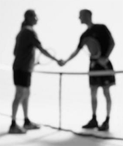

# Personal Antagonism Doesn\'t Pay

### By Allen Fox, Ph.D.

------------------------------------------------------------------------

{width="4.097222222222222in"
height="3.2083333333333335in"}

**Personal antagonism almost never pays off in tennis.**

It almost never pays to get personally antagonistic in a tennis match.
It will hurt your game. But like many things that involve emotions in
tennis, this is easier said than done.

This is because on an emotional level, tennis is very much like a fist
fight. It\'s different from other sports. It feels personal, especially
when your opponent is jerking you around the court or trying to dink you
to death.

So how does the antagonism start in what is supposed to be a friendly,
social match? Maybe you\'re playing Mike or Sue in a little tournament
at your club. It starts out on a friendly basis but after awhile, it
escalates. So you gradually step up your efforts to win, as does your
opponent.

As the gloves gradually come off and you feel the contest of wills, what
started out as just a fun match becomes seriously competitive. If you
don\'t watch yourself, your opponent may begin to irritate you and
negatively affect your game.

+--------------------------------------------------------------------------------------------------------------------------------------------------------------------------+
|                                                                                                                                                                          |
+:========================================================================================================================================================================:+
| {width="2.9166666666666665in" |
| height="3.4722222222222223in"}                                                                                                                                           |
|                                                                                                                                                                          |
| **Against some opponents you just don\'t want to shake hands.**                                                                                                          |
+--------------------------------------------------------------------------------------------------------------------------------------------------------------------------+

Maybe it\'s a swagger after making a good shot that grates on your
nerves. Or maybe the calls are made a little too quickly and there may
even be a pleased tone of voice to the \"Out\" calls. As you become
irritated you may start to think his calls are a little ungenerous.

Yup, the more you think of it, the more certain you become that this
person has no sense of morality and is sure to take unfair advantage
every chance he gets. The thought of losing and having to smile and
congratulate this person afterward makes you shudder.

So now you dare not lose. The match has become personal, and, as it
usually does when this happens, it will hurt your game.

Strongly disliking your opponent raises the stakes and you start wanting
to win too much. It diverts your thoughts and emotions away from
productive, practical ones and on to issues of \"winning\" or \"getting
the better of your opponent.\" You start thinking too much and your
emotions get out of control.

**Forewarned is Forearmed**

So how do you avoid falling into this trap? Realize beforehand that this
is likely to happen from time to time because tennis is mentally like a
boxing match. Heated competition has a tendency to make you feel
aggressive and dislike your opponent.

  --------------------------------------------------------------------------------------------------------------------------------------------------------------------------------
  {width="4.166666666666667in"
  height="2.25in"}
  --------------------------------------------------------------------------------------------------------------------------------------------------------------------------------
  **The fighting instincts in tennis are like boxing.**

  --------------------------------------------------------------------------------------------------------------------------------------------------------------------------------

Early advocates of the sport recognized this and instituted a rigid set
of sportsmanship protocols to keep our ugly fighting instincts at bay.
Observing courtesies is a good idea because it cools aggression. But the
best way to side-step personal antagonism is to make up your mind
beforehand that you will not allow yourself to have such feelings. They
are natural in our aggressive little game and you must be prepared to
counter them.

It becomes easier if you accept that your opponents are imperfect
beings, just as you are, and be prepared to overlook their
idiosyncrasies as you would expect them to overlook yours. Like you,
they have their own ways of walking, making calls, and hitting good
shots. They have egos and enjoy beating people just as you do. And they
have plenty of insecurities that have nothing to do with you.

Keep this in mind lest you allow your own insecurities to make something
personal out of their actions. Realize it\'s your own insecurities that
make you overly sensitive to your opponent\'s mannerisms. And if you
allow your insecurities to run freely they will not only hurt your own
game, but make you likely to behave in ways that you will later regret.

{width="3.3333333333333335in"
height="2.5in"}

**The personal one versus one competition makes tennis feel like a
fight.**

Giving your opponents the benefit of the doubt actually makes it easier
to keep yourself on track towards your real goals. (None of which are
well served by getting into fights with your opponents.)

**Like A Fight**

Andre Agassi, trained by his father who was a boxer, describes the
aggressive, fighting aspects of matches well in his new book, Open. (For
two amazing reviews by two of John Yandell\'s high school students,
[Click
Here](https://www.tennisplayer.net/members/notes_on_tour/alexandra_hills/open_by_agassi/)
and [Click
Here](https://www.tennisplayer.net/members/notes_on_tour/grace_fish/open_by_agassi/).)

Like a fight, the players use all their physical, mental, strategic, and
character skills to beat each other. They just don\'t hit each other,
but nonetheless It is a fight for dominance.

All social species are genetically programmed to compete for dominance
and position on the social hierarchy - for who is ahead of whom. Human
beings are just as programmed to do so too. In a hard-fought match,
therefore, winning and losing become emotionally important. Tennis
matches \"feel\" more important than they are.

  ---------------------------------------------------------------------------------------------------------------------------------------------------------------------------------
                                              {width="3.263888888888889in"
                                                                           height="3.1944444444444446in"}
  ---------------------------------------------------------------------------------------------------------------------------------------------------------------------------------
                                                     **Even great players are sometimes subject to counterproductive emotions.**

  ---------------------------------------------------------------------------------------------------------------------------------------------------------------------------------

The problem is that we were not genetically programmed to play 2 hour
tennis matches. So the emotions that pop up tend to be
counter-productive. Our nervous systems simply weren\'t programmed to
control the fine motor movements necessary to hit tennis balls over the
net and near the lines under stress for several hours.

Under these conditions we are likely to experience emotions like anger
or discouragement and be tempted to escape a stressful match by losing
concentration or making excuses. Thus during match play the successful
competitor needs to become adept at controlling these counter-productive
emotions.

This takes a constant effort of will because if one simply lets nature
take its course, these destructive emotions are almost certain to come
out. Inevitably this sometimes happens, even to great players, proving
they are human, and also, how difficult these emotions can be to
control.

Escape

Most counterproductive actions on court are subconscious methods for
escaping stress. The basic cause of the stress is the uncontrollability
of the outcome.

In a hard-fought match winning is very pleasurable and losing is very
painful. And no matter how well one prepares, how hard one tries, or how
well one controls one\'s self on court, he or she may still lose. The
fact that a player does everything possible to control the outcome of
the match, and may even have some belief that he or she can control the
outcome, yet at some level realizes that he or she can not, puts the
player in an inherently stressful situation.

{width="3.3333333333333335in"
height="2.5in"}

**Losing motivation is a normal and common way to escape stress.**

It is normal and natural for people to try to escape this unpleasant
stress. And their normal responses are to get angry, to lose motivation
when behind and/or to make excuses, all of which are counterproductive.

This is what normal people do, and, of course, normal people loose a lot
of tennis matches. In order to be a successful tennis competitor, one
must behave abnormally and, with one\'s conscious mind and logic system,
overpower these normal, counter-productive emotional reactions.

The answer is: acceptance of what you can\'t change. Accept the fact
that you will make mistakes. You make them not because you didn\'t move
your feet or you didn\'t watch the ball. Yes, of course you did those
things too, but you make mistakes because you can\'t help it and you
never will be able to help it.

You should always try to do better, but never forget that you are human
and humans simply make mistakes. Accept too the fact that your opponent
will make some great shots. Do not fight or deny reality. Make it easy
on yourself by simply accepting it with good grace and moving on to the
next point.

{width="3.3333333333333335in"
height="2.5in"}

**To allow your proper habits to come out, you must avoid strong
emotion.**

In a tennis match a player\'s strokes and shot-making abilities are a
result of habits developed by hours of repetition in practice. Shots in
match play occur too quickly for control by conscious thought. They
occur as habitual responses to the various situations on court and are
honed by years of experience.

As we all note, to our sorrow, our responses do not always come out
right. So we make mistakes and uncontrollable errors in matches. Our
job, as competitors, is to minimize these errors. In practice,
therefore, the objective is to develop the proper habits through
repetition of the exact stroke sequences we hope to use in matches. In
matches we just want to have these habits function properly.

Unfortunately, we soon learn that strong emotion during play disrupts
these habits. The margins for error in matches are too small. The
nervous system involved in producing the proper strokes and responses is
finely tuned. Strong emotions like anger, frustration, disappointment
and pessimism disrupt the sequences of exact motor responses and cause
errors.

{width="3.3333333333333335in"
height="2.5in"}

**Whether you realize it or not, your nervous system takes a hit when
you get angry.**

But there is a more subtle issue. Most people are aware that playing
while angry causes mistakes. But they think that they can get angry at
the end of a point - like after missing an easy shot - and then recover
before the next point and they will be okay.

But this is not quite true. When a player gets angry or frustrated after
missing an easy shot or losing an important point, the nervous system
takes a hit. Though not perceivable, it is thrown slightly out of
kilter. Then, even though the player may gather himself together and
cool down before the next point, the nervous system becomes ever so
slightly more likely to malfunction.

This in turn means that practiced habits tend to be slightly off and a
few extra errors result. And these extra errors are, in a close match,
just enough to cause a loss. On the average, a 6-4 or 7-5 set is won by
a difference of 4 or less points.

A player doesn\'t have to make many extra errors to change a winning set
into a losing one. And this generally happens without the player ever
being aware of it.

Decide before you go on court you will not allow yourself to feel angry.

So the bottom line is that if you want to win more matches you should
firmly decide before going on court that you will not allow yourself to
feel angry, frustrated, or discouraged at all no matter how many easy
balls you miss, how great your opponent plays, or under any other
circumstances whatsoever.

The General Point

Whether you are dealing with real antagonism from your opponent or not,
it\'s best to keep your head on your side of the net. This means
ignoring your opponent\'s actions under any circumstances. Look at the
tennis match as simply a set of physical and mental problems to be
overcome.

It is just a healthy project and that makes your opponent just another
necessary element of the equation - like the net and lines. As in math
class, problem equations are best solved unemotionally and rationally.
Getting antagonistic will stiffen your muscles, scatter your focus, and
blind you to productive adjustments to your game plan.

Read More From Allen!

Visit him at [www.allenfoxtennis.net](http://www.allenfoxtennis.net)

 

+----------------------------------------------------------------------------------------------------------------------------------------------------------------------------------+-----------------------------------------------------------------------------------------------------------------------+
| {width="1.3041666666666667in" |                                                                                                                       |
| height="2.0in"}                                                                                                                                                                  | Tennis is mentally the most difficult sport due to it's personal nature which makes winning and losing feel more      |
|                                                                                                                                                                                  | important than they are. In this new book, Allen offers his proven solutions to problems such as choking, reducing    |
|                                                                                                                                                                                  | stress, finishing matches, and developing confidence. Based on a life time of high level play and coaching success,   |
|                                                                                                                                                                                  | it's a must for all competitive players.                                                                              |
|                                                                                                                                                                                  |                                                                                                                       |
|                                                                                                                                                                                  | [Click Here to                                                                                                        |
|                                                                                                                                                                                  | Order](http://www.amazon.com/Tennis-Winning-Mental-Allen-Fox/dp/0615407765/ref=sr_1_1?ie=UTF8&qid=1336083459&sr=8-1). |
+==================================================================================================================================================================================+=======================================================================================================================+

+-----------------------------------------------------------------------------------------------------------------------------------------------------------------------------------+-------------------------------------------------------------+
| {width="1.8263888888888888in" | that, if we are honest with ourselves, winning is still     |
| height="2.7305555555555556in"}                                                                                                                                                    | eminently preferable to losing. In his new book, The        |
|                                                                                                                                                                                   | Winner\'s Mind, Allen lays out an original step-by-step     |
|                                                                                                                                                                                   | plan for succeeding at any of life\'s endeavors, based on   |
|                                                                                                                                                                                   | his first hand and very personal observations of the        |
|                                                                                                                                                                                   | careers of both world-class tennis players and successful   |
|                                                                                                                                                                                   | businessman. The bottom line is that even if you are not a  |
|                                                                                                                                                                                   | born champion\--and only a tiny percentage of us are\--you  |
|                                                                                                                                                                                   | can still use the success strategies of champions to tilt   |
|                                                                                                                                                                                   | the odds in your favor. Writing with brutal honesty and dry |
|                                                                                                                                                                                   | humor, Fox lays out the common mental characteristics of    |
|                                                                                                                                                                                   | winners in sports and in life. He explains the critical     |
|                                                                                                                                                                                   | role of intellect over emotion. He analyzes the struggle    |
|                                                                                                                                                                                   | between ambition and fear and the insidious and pervasive   |
|                                                                                                                                                                                   | fear of failure that undermines so many of us. He then      |
|                                                                                                                                                                                   | outline how to confront and overcome these fears in your    |
|                                                                                                                                                                                   | life and career, even when they are initially subconscious. |
|                                                                                                                                                                                   | Must reading from one of the great thinkers in tennis, and  |
|                                                                                                                                                                                   | a Renaissance Man in life. [Click Here to                   |
|                                                                                                                                                                                   | Order](http://www.tennis-warehouse.com/descpage-MIND.html). |
|                                                                                                                                                                                   |                                                             |
|                                                                                                                                                                                   | To purchase this book you can also send a check for \$17.95 |
|                                                                                                                                                                                   | to Allen Fox, 1120 Inverness Place, San Luis Obispo, CA.    |
|                                                                                                                                                                                   | 93401. The price includes shipping.                         |
+===================================================================================================================================================================================+=============================================================+

+----------------------------------------------------------------------------------------------------------------------------------------------------------------------------------+--------------------------------------------------------+
| {width="1.2520833333333334in" | a psychologist, and one of the most original and       |
| height="1.3215277777777779in"}                                                                                                                                                   | insightful analysts in modern tennis. A top 10         |
|                                                                                                                                                                                  | American player from the glory days before Open        |
|                                                                                                                                                                                  | tennis, Fox played many of the legendary greats, among |
|                                                                                                                                                                                  | them Roy Emerson, Rod Laver, Stan Smith, and Arthur    |
|                                                                                                                                                                                  | Ashe. At Pepperdine he developed the men\'s tennis     |
|                                                                                                                                                                                  | program into an elite contender for national titles,   |
|                                                                                                                                                                                  | and gave Brad Gilbert the insights that became the     |
|                                                                                                                                                                                  | foundation for \"Winning Ugly\". His book Think to Win |
|                                                                                                                                                                                  | is a modern classic. He has also starred in a series   |
|                                                                                                                                                                                  | of acclaimed videos, including Pro Secrets of Match    |
|                                                                                                                                                                                  | Play and Allen Fox\'s Ultimate Tennis Lesson.          |
|                                                                                                                                                                                  |                                                        |
|                                                                                                                                                                                  |                                                        |
+==================================================================================================================================================================================+========================================================+

------------------------------------------------------------------------
