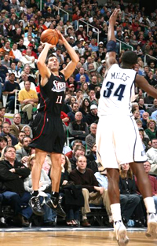
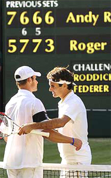

# The Diabolical Scoring System of Tennis

### By Allen Fox, Ph.D.

------------------------------------------------------------------------

**What makes the scoring system in tennis diabolical?**

**The tennis scoring system is different from most other sports. It
uniquely increases the stress of competition, because throughout the
match some points are substantially more important than others. In fact,
this system is diabolical.**

In other sports the score is generally cumulative throughout the
contest, and whoever has the most points at the end wins. In baseball,
for example, you simply keep adding up the runs, and the winning team is
the one that has the most after 9 innings. It's very straightforward.

**Football, soccer, and basketball are essentially the same except
that the game is over when time runs out.**
**Still, each team just keeps adding up their points. Even golf is the
same except the numbers are backwards. The winning player has fewer
points (strokes) than the others.**

Of course, there is a great deal of pressure in all sports if the scores
are close toward the end of the contest, but none are as continuously
stressful as tennis.

Consider the situation in tennis. Say are playing a close set, say you
are up 5-4 and you reach game point. There is a huge swing in the match
if you win that one point.

**Why is simply plugging away one point at a time the solution?**

**You will have won about as many total points as your opponent, and
should, for all intents and purposes be about even. But winning the next
point gives you the set, and you suddenly have half the match under your
belt. At the same time, you've wiped out all of your opponent's
points.**

**Essentially, you have half a match, and your opponent goes back to
zero. That's an enormous discrepancy hinging on the outcome of a single
point, especially when the two players are actually about
even.**

Moreover, since the play is so evenly balanced you are well-aware of the
danger looming behind the loss of that set point. Lose it, and it would
take very little for your opponent to turn the tables on you. He could
win that game by winning two points, tie the set, and then take the set
with only eight more.

Instead of being up half a match, you would be the one going back to
zero and your opponent who would be up half a match. This puts
extraordinary pressure on the outcome of a single point.

  -----------------------------------------------------------------------------------------------------------------------------------------------------
   
  -----------------------------------------------------------------------------------------------------------------------------------------------------
                                       **How big is a big point\--or any point? Click to hear Allen's analysis.**

  -----------------------------------------------------------------------------------------------------------------------------------------------------

There will be even more pressure on the players if the score reaches
6-all, and they play a tie-breaker. Now the points are all very
important, and it becomes a sprint to the finish under a constant load
of mental pressure.

When one of the players gets to set point in the breaker, say at 6-5 or
7-6, the pressure ratchets up yet another notch. If you're up, you are
one point away from winning the set but only three point away from
losing it.

And all of this is happening in the middle of the match, not at the end.
In a two out of three set contest the whole drama can go on twice before
culminating in the big showdown in the third set.

As if this were not enough, the same thing is actually happening on a
lesser scale in each game. If you reach game point and win it, the usual
tennis outcome occurs - you get the entire game while your opponent gets
nothing.

All the points he won in the game having been eliminated. The game could
be extremely close and hard-fought, swinging back and forth many times
from deuce to ad. But if one player wins the game point, he gets the
entire game and the other player gets zero.

  -------------------------------------------------
  **What if every 5 minutes the next basket counted
               for 10 points, not 2?**

  -------------------------------------------------

This creates pressure since the game point is obviously more important
than any other point within the game. So the pressure within the game
ratchets up as the score approaches game point. The deuce point gets
tense just because it gives the winner game point.

That's very different from the other sports. Try to imagine duplicating
the tennis scoring system in basketball. In basketball the real pressure
is normally at the end of a close game.

You could make the pressure similar to tennis by making the rule that
every five minutes the next basket would counts for 10 points instead of
two\--and at the same time, the other team would also lose five points.
That would add huge pressure periodically to the middle of the
game\--the way it is all the time in our sport.

**These features of the tennis scoring system (as well as its
one-on-one, personal aspect) make the game fraught with emotion,
pressure, and choking. It is simply mentally tougher than most of the
other sports.**

**So what do you do about it? If you are not particularly confident
(which most people players in fact aren't), you have to resist thinking
about the score. Getting heavily involved with the score and winning the
big points will make the unconfident player extremely
nervous.**

  ----------------------------------------------------------------------------------------------------------------------------------------------------------------------------------
   
  ----------------------------------------------------------------------------------------------------------------------------------------------------------------------------------
                                                        **Assuming something good will happen increases the chance it will.**

  ----------------------------------------------------------------------------------------------------------------------------------------------------------------------------------

Of course you will rarely be able to totally forget about the score.
It's a problem you can't completely solve, but you can make it better
or worse. Work to keep pushing the score to the back of your mind,
rather than focusing on it. Unless you are deeply confident of winning,
resist highlighting big points with thoughts like, \"Ok, it's set
point! I've got to win this one.\" This thinking will just make you
more nervous, and lead to choking.

Instead, concentrate narrowly. Do your best to lose yourself in watching
the ball, staying relaxed, not reacting too strongly any point, creating
good emotions, and executing your game plan. I've written more
extensively about all of these factors in another Tennisplayer article
called \"Becoming a Great Competitor.\" ([link](Becoming%20a%20Great%20Competitor.docx).)

**The secret is a paradox. To treat all the points the same, even
though they aren't. Take the stance that all points are important, but
none too important. Plug along, one point at a
time.**

**Try to ride over the big points by keeping your head into what you
will be doing in the next few seconds. Then, simply assume something
good will happen. This type of thinking about our diabolical scoring
system will increase the chance that it will.**

**This article is excerpted from Allen's new book, Tennis: Winning the
Mental Match, which will be available at the end of 2010 on Amazon and
on Allen's new website,
[www.allenfoxtennis.net](http://www.allenfoxtennis.net).**

Read More From Allen!

Visit him at [www.allenfoxtennis.net](http://www.allenfoxtennis.net)

 

|  | Tennis is mentally the most difficult sport due to it's personal nature which makes winning and losing feel more |
|  | important than they are. In this new book, Allen offers his proven solutions to problems such as choking, reducing |
|  | stress, finishing matches, and developing confidence. Based on a life time of high level play and coaching success, |
|  | it's a must for all competitive players. |
|  |  |
|  | [ to |
|  | Order](http://www.amazon.com/Tennis-Winning-Mental-Allen-Fox/dp/0615407765/ref=sr_1_1?ie=UTF8&qid=1336083459&sr=8-1). |

|  | eminently preferable to losing. In his new book, The |
|  | Winner's Mind, Allen lays out an original step-by-step |
|  | plan for succeeding at any of life's endeavors, based on |
|  | his first hand and very personal observations of the |
|  | careers of both world-class tennis players and successful |
|  | businessman. The bottom line is that even if you are not a |
|  | born champion\--and only a tiny percentage of us are\--you |
|  | can still use the success strategies of champions to tilt |
|  | the odds in your favor. Writing with brutal honesty and dry |
|  | humor, Fox lays out the common mental characteristics of |
|  | winners in sports and in life. He explains the critical |
|  | role of intellect over emotion. He analyzes the struggle |
|  | between ambition and fear and the insidious and pervasive |
|  | fear of failure that undermines so many of us. He then |
|  | outline how to confront and overcome these fears in your |
|  | life and career, even when they are initially subconscious. |
|  | Must reading from one of the great thinkers in tennis, and |
|  | a Renaissance Man in life. [ to |
|  | Order](http://www.tennis-warehouse.com/descpage-MIND.html). |
|  |  |
|  | To purchase this book you can also send a check for \$17.95 |
|  | to Allen Fox, 1120 Inverness Place, San Luis Obispo, CA. |
|  | 93401. The price includes shipping. |

|  | insightful analysts in modern tennis. A top 10 |
|  | American player from the glory days before Open |
|  | tennis, Fox played many of the legendary greats, among |
|  | them Roy Emerson, Rod Laver, Stan Smith, and Arthur |
|  | Ashe. At Pepperdine he developed the men's tennis |
|  | program into an elite contender for national titles, |
|  | and gave Brad Gilbert the insights that became the |
|  | foundation for \"Winning Ugly\". His book Think to Win |
|  | is a modern classic. He has also starred in a series |
|  | of acclaimed videos, including Pro Secrets of Match |
|  | Play and Allen Fox's Ultimate Tennis Lesson. |
|  |  |
|  |  |

------------------------------------------------------------------------
