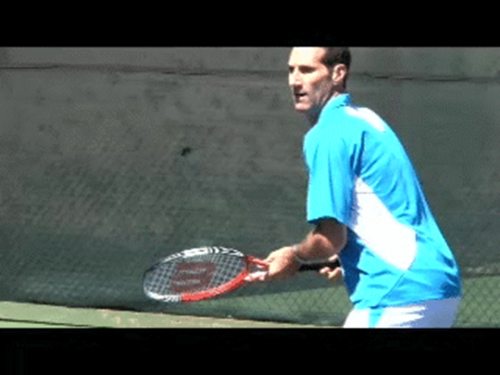

# The Mind of the Baseliner - And How to Transform It

### Jeff Greenwald

------------------------------------------------------------------------

{width="3.3333333333333335in"
height="2.5in"}

**How does the mind of the baseliner relate to the attacking game?**

Last month I wrote about my decision to incorporate more net play into
my baseline game, and how that helped me win the most recent ITF Senior
World Championship. ([Click
Here](https://www.tennisplayer.net/members/mentalgame/jeff_greenwald/the_opportunity_attack/))
Now in this article, I want to elaborate on the mental and emotional
processes that were critical in that transition.

It's commonplace for coaches to urge players at all levels to attack the
net more. But in all honesty how often do players make that happen?

There are reasons why it doesn't and I had to face them too. Primarily
it has to do with a player's mindset. The mindset explains why players
play the way they do, the satisfaction they get from their games, and
the inherent obstacles that prevent real change from happening.

This is a story about the mindset that drove my game for 30 years---what
I call the mind of the baseliner. If we understand the mind of the
baseliner we can understand why so many players resist the advice to add
attack to their game. It's true at the tour all the way down to the 3.0
club level.

**Actual Change**

This is also the story of how I changed that mindset. It's the story of
the challenging mental process I went through in doing this\--committing
to, incorporating, and following through with this addition to my game
in high level competitive tennis.

{width="3.3333333333333335in"
height="2.5in"}

**How did I change the baseline mind set I loved?**

My hope is that this process and change is something players at all
levels can aspire to should they choose a similar path. But actually it
would apply to any fundamental change in your game. The primary obstacle
is always mental.

For me, key was to find a new kind of satisfaction in the way I won
points and to redefine what I loved about competitive tennis. Without
this change in mindset, I would not have stayed committed to the
process.

I am also very pleased that this article is being published in
conjunction with two related articles on adding attacking tennis to your
game from my collaborators in my own process of change, top Marin county
California coaches Paul Cohen and Rod Heckleman.

Paul's article presents the steps for developing or improving your
forehand volley---something I quickly realized would be critical if I
was going to believe that I could truly get the job done once I was at
the net. ([Click
Here](https://www.tennisplayer.net/members/classiclessons/paul_cohen/classic_forehand_volley).)

Rod's article details the equally critical improvements in my footwork,
as well the progressive drills and practice games I used for a period of
weeks to assimilate opportunity attacking into actual competitive play.
([Click
Here](https://www.tennisplayer.net/members/rob_heckelman/incorporate_approach/).)

{width="2.878261154855643in"
height="3.497086614173228in"}

**From legs cramps to working with Paul Cohen.**

So far as I know this is the only multi-dimensional presentation of its
kind, put together by John Yandell, in yet another in a long line of
Tennisplayer firsts. I look forward to hearing what you think about our
trilogy of articles in the Forum!

**The Start**

So how and when did I decide to change from an almost pure baseliner
into a player who also was able to attack the net, and to do this
successfully under high level competitive pressure?

That decision came in one moment, during the third set of the semifinals
in a previous national senior tournament. I was sitting on the sidelines
in serious pain, getting treated for multiple cramps in my legs.

At that moment, my mind flashed back to the meeting I had had a few
weeks before with coach Paul Cohen, a meeting that I described in the
first article. ([Click
Here](https://www.tennisplayer.net/members/mentalgame/jeff_greenwald/the_opportunity_attack/).)

If you didn't read the article, it was an unusual meeting to say the
least. Having watched one of my practice matches, Paul walked up and
told me point blank I was playing some of the dumbest tennis he had ever
seen.

{width="3.3333333333333335in"
height="2.5in"}

**Was it possible I should be closing \"all the time\"?**

With my game---and he said it as a compliment\--I should be closing the
net \"all the time.\" At the time, I was amused and intrigued. What type
of person says something like that after meeting you for the first time?
Someone who has something to say and calls it how he sees it, I assumed.

Flash forward to a few weeks later and that national semifinal, when,
writhing in pain in another brutal baseline match, it occurred to me
that Cohen might have a point. When I returned to California I got in
touch with Paul, and so the process began.

**The Irony**

It is ironic that, as a sports psychology consultant and therapist, I am
in the business of change. I have helped hundreds of players, including
many high level USTA juniors and tour pros to play more fearless tennis,
to play looser, to believe in themselves and their games, and to win
more.

But now, I was considering going out of my comfort zone in a totally
different way. Up to this point I had never considered adding a net
attack dimension.

To do this I needed to shift the mind of the baseliner. But I really
enjoyed dictating points from the baseline. What would changing my
tactical style do to my mentality in matches? Would it interfere with
the automatic, instinctive responses that I had honed for years?

{width="3.3333333333333335in"
height="2.5in"}

**The fact was I enjoyed dictating from the backcourt.**

Could I find the motivation to make this change? Would I find real
satisfaction in attacking the net as opposed to dictating from the back?
In retrospect, these were the critical questions.

**Ego**

To understand how I answered them, it's important to understand more
about the mind of the baseliner and how that formed the foundation of my
sense of self as a competitive player.

I had learned all the parts of the game as a junior\--groundies, serve,
volleys\--the same way most players do in the beginning. But the fact is
that I never tried to put the pieces together in my match play---and
never wanted to.

As I said in the first article, my father tried to encourage me to
\"just get the hell in\" and finish points at the net. But how could I
believe in a tactic that I didn't understand, didn't practice, but
should somehow implement it with a match on the line?

That's what I told myself anyway. But there was a deeper reason. That
reason was that my identity as a player was tied to the baseliner
mentality.

{width="3.3333333333333335in"
height="2.5in"}

**I enjoyed the corner to corner struggle of backcourt points.**

The truth was I found it very gratifying to slug ball after ball. My
style in the juniors and on into college was to anchor myself on the
baseline, try never to miss, and run like a roadrunner.

I got used to the physical warfare and learned to relish it. There was a
sense of control and comfort associated with pushing other players
around and eventually grinding many of them into submission.

Serving an ace, in contrast, just never delivered the satisfaction that
a hard-earned backcourt did. Strange as it seems, I can admit now there
were times I would even kick my first serve in just get the point
started. This was because I was so excited to get into that kind of slug
fest.

There was intensity and drama in a good baseline rally that forced me to
engage and dig in from the first ball. As the rally length increased, so
did my adrenaline.

I loved the intensity of twelve ball rallies that had me stretched or on
the run. There were times I actually felt somewhat disappointed when the
point was over\--again as crazy as that may sound.

As my game developed, I typically knew exactly where I was going to hit
the ball before it even landed on my side of the court. Based on
experience, where my opponent was hitting and what I could see off his
racquet, I developed good anticipation.

{width="3.3333333333333335in"
height="2.5in"}

**A big first serve never gave me as much satisfaction as a tough rally
point.**

This was accompanied by a visual image of where I was going to go with
the next hit. This process became so natural that it happened
automatically.

Some people said that I was very fast on my feet\--and I believe that
was true. But there was much more going on in the way I played my
matches.

**[[Anticipating my opponent's shot and knowing my response created a
comfort level. It created predictability.]{.mark}]{.underline}**

**[This had the huge additional benefit of [reducing cognitive
\"chatter\" and indecision.]{.underline} All players like to control
what happens on the court. My game style gave me that feeing.]{.mark}**

In many matches, I firmly believed that if I could force the other
player to play my type of game I would win. In contrast, when I thought
about it, an attacking game always looked risky and unpredictable.

**Shot Tolerance**

By nature, the baseliner's shot patterns are relatively fixed. This
creates a certain built-in rigidity. The fact is that playing from the
baseline keeps the possibilities limited and manageable.

Many seasoned tennis professionals understand the concept of shot
tolerance. ([Click
Here](https://www.tennisplayer.net/members/high_performance/elliot_teltscher/shot_tolerance/shot_tolerance.html)
to read Elliot Teltscher's classic explanation.) Some players have a lot
of tolerance and some have much less. I prided myself on having a higher
tolerance than most of my opponents.

{width="3.3333333333333335in"
height="2.5in"}

**A mentality like Rafael Nadal\--based on shot tolerance.**

My goal was to create exchanges where I never felt rushed, where I
controlled the rhythm of the exchanges, exchanges that made my opponent
as uncomfortable as possible, physically but also mentally.

I found this to be an exciting way to play. I enjoyed imposing my game
on the other player, and knew that when I could do this, I had a very
good chance of winning. It was a similar mentality to players like
Rafael Nadal or Bjorn Borg.

I knew who I was on the court and felt very comfortable in the heat of
battle. And this mentality was producing enough competitive success to
prevent me from entertaining anything drastically different. All in all
there was a significant emotional payoff in the game that I had
developed and was very attached to.

**Evolution**

Around the time I turned 35, when I won my first ITF World Championship,
my game morphed into a more aggressive version of itself. The primary
change I added was a new emphasis on trying to dominate with my forehand
and be more aggressive with my backhand as much as possible.

I also started loosening up my arm and was serving a bit bigger. But I
still avoided the net like the plague.

The essence of my game was still a rally battle. My goal was still not
to miss and to move my opponent around and force errors. It was just
that I also looked to create opportunities to hit more winners. My
rallies were often still over ten balls, sometimes longer to win a
point.

My game morphed as I tried to dictate with my forehand---inside out and
inside in.\>

I tried to hit two thirds of all balls with my forehand. I would go
inside out to inflict damage and then, when possible, use my down the
line off each wing or my inside in forehand to draw blood or win the
point outright.

I trained to get better at these forcing shots and combinations of
shots. I worked on having the courage to go for them even if I felt a
bit hesitant or nervous.

These additions helped me win some matches more easily. But in many
cases I still found players were less consistent than I was and would
miss before I had to pull out my \"point ending\" deliveries.

These additions only strengthened my baseline mentality. As a baseliner,
I didn't need to worry about which ball to come in on.

I was tucked into a comfort zone, running and hitting on the baseline
horizontal, a game that required little thought, just visuals, instinct,
cardio, and the courage to go for big groundstrokes at the right time.

Volleys weren't even on the radar. I couldn't see the sense in changing
from my basic heavy topspin to slice approach shots---the shot I had
also been told preceded the volley.

But in retrospect I realize that, to the extent I even considered the
idea, the reality was I simply couldn't afford the cognitive risk
associated with trying to close the net.

{width="3.3333333333333335in"
height="2.5in"}

**A simple idea: use my forehand and back it up with an easy volley.**

**The Transition**

And that takes us back to the decision point\--cramping badly in the
semifinals of a national event. Sometimes you need a certain level of
pain to make a major change.

I realized that my game had hit a wall. As I continued to get older, I
would need to do something different to continue to maintain my level
and sustain my results.

As hard as it was to admit, I decided maybe my father was right. I was
leaving too much on the table after I hit a penetrating groundstroke.

So, I forged ahead and started working with Paul. Cohen's concept was
simple. Take advantage of my forehand. When I had hurt my opponent with
velocity, depth or when I had opened the court, I should move forward
and finish the point.

As I noted in the first article, Cohen believed that a huge percentage
of balls in most matches were actually short and therefore potentially
attackable. His advice was to learn to recognize these balls and pound
them with my best shot, my forehand.

{width="3.773912948381452in"
height="3.2304680664916887in"}

**Working with Paul, I realized I needed a better technical volley.**

Having already moved up into the court on a short ball, I would in most
cases be able to close tightly enough to end the point with just one
volley or an overhead. Many volleys, Cohen explained, could be hit away
easily with short angles.

For me this was a whole new approach to the net, because I would be able
to use my best shot and the shot I was most comfortable with to start
the attacking sequence. This was much more appealing than thinking about
learning multiple volley sequences that began with traditional slice
approaches.

Still, when Paul Cohen had me at the net angling volleys like a
beginner, I thought, \"You\'ve got to be kidding. What the hell I am
doing?\"

**[[Yet as we got into working on this strategy, it became apparent that
one of the reasons I had been reluctant to come to the net in the past
was the quality of my volleys, especially on the forehand
side.]{.mark}]{.underline}**

**[[Very quickly, with Cohen critiquing every micro-movement, I began to
see that there was value in really knowing how to volley. And I realized
I never had really mastered the shot.]{.mark}]{.underline}**

**[[As my technique improved, I gained confidence as I hit volley after
volley for clear winners in Cohen's drills. Gradually I began to see the
natural opportunities to get in and how to exploit
them.]{.mark}]{.underline}**

{width="3.3333333333333335in"
height="2.5in"}

**Rod helped me with footwork and balance in the midcourt.**

This was the process that I continued with my other coach/collaborator,
Rod Heckelman, the general manager at the famed Marin County Mt. Tam
Racquet Club. Rod quickly diagnosed that another major piece of the
puzzle was my transition footwork.

In addition to giving me more approach repetitions, we worked on my
split step in the mid court, establishing balance, and then breaking to
ball to hit my improved volleys.

I found that all this required a slightly more explosive movement toward
the net compared to the horizontal footwork pattern that I'd gotten used
to. However, in the end, exploding toward the net and finishing points
off sooner required far less stamina than longer rallies.

Working with Rod, we developed this forward movement pattern as part of
drills that ended with me finishing off the point with an angle volley
or an angled overhead. We also developed a series of competitive
drill/games and set up certain types of matches to make the transition
to tournament play in progressive stages.

I needed to pay more attention to see how short my opponent\'s shots
landed on my side to make my decision to get in. This was challenging
because it required me to be more cognizant of my strategic intention.
Over time recognizing the shot to attack started to feel nearly as
automatic and effortless as a groundstroke rally ball.

{width="3.3333333333333335in"
height="2.5in"}

**Not attack within 4 balls? You lose the point.**

**Dealing with the Baseliner Mind**

**[[These were all critical improvements. But, what about the most
important piece---dealing with the mind of a career
baseliner?]{.mark}]{.underline}**

This is where my own experience in coaching the mental game played a
huge part. I knew that I had to open myself to a new and different
experience, not only of playing points, but of how I enjoyed playing
them.

**[[One key was to be aware of not exerting too much effort on the
attack ball or tensing up once I recognized the ball I wanted. With my
knowledge about how to stay loose and focused at the same time I was
able to do this without too much trouble.]{.mark}]{.underline}**

So I began to consciously let go of my rigid baseline mentality. As I
did I started to love the moment I recognized a short ball that I could
pound and follow in.

I began to take real pride in being a more complete player. Finishing
off the point at net actually began to feel more dominant than a tough
baseline point.

**[[Once you realize the enormous benefit of taking time away from your
opponent and see him rushing to try to pass, attacking the net starts to
feel powerful and very dynamic. With the mid-court transition area no
longer so foreign, I felt I could use the entire court for the first
time in my life.]{.mark}]{.underline}**

{width="3.3333333333333335in"
height="2.5in"}

**I started to love the moment I recognized the short ball.**

When I saw opponents stiffen up, I began to feel a different but equally
gratifying sense of control. The pressure for me to build a point
exclusively from the baseline was now gone. All and all I found having
the attacking option to be much more fun than my former more
one-dimensional style.

I realized that not having to grind and work as much to dictate with my
forehand from the backcourt would help me physically in tough matches,
and reduce the chance of repeating that cramping experience.

This was all accomplished in under eight weeks before the World
Championships. As I wrote in the first article, it paid off in a major
international senior title.

Certainly, it was a dramatic shift. But it also felt like a choice.

As a player you have to truly want to expand your game. This also means
accepting that you will get passed and you will miss some volleys.

But if it's the right choice for you then these are challenge you can
embrace, rather than second guessing your decision to add opportunity
attacking to your game. Remember, it isn't all or nothing. It's an added
weapon in the arsenal and you can use it as much or as little as you
like.

{width="3.3333333333333335in"
height="2.5in"}

**Opportunity attacking was a dramatic shift that led to an
international title.**

I think it\'s actually possible to be a very good player but never
really understand the game very well at all. If you are a good athlete,
train hard and have the good fortune of being physically fit you can do
very well. But after developing an opportunity attacking game, I
realized I might have done considerably better in my career if I had
come to same conclusion sooner.

I had always known that my personality was not as conservative as the
game I had played all my life. It was exciting to feel that attacking
the net at the right time actually reflected my real personality much
more closely.

In the end, all changes we make on or off the court require conviction.
You have to be curious. You have to commit to the learning process and
be willing to accept challenge.

Ultimately, these values are more important and more gratifying than
winning. The result actually needs to become secondary to executing your
vision and mission out there. The irony of course is that this approach
leads to more wins anyway.

I believe when you are clear about how you want to play\--regardless of
the nerves or possible short-term defeat---you will enjoy the game more.
I hope my experience shows that it's never too late to play the best
tennis of your life.

{width="1.5909722222222222in"
height="2.078472222222222in"}

The Best Tennis of Your Life

Learn how to play with freedom and win more matches! In his new book
Jeff Greenwald, an elite international seniors player, coach, and
psychotherapist, outlines 50 specific mental strategies to play the best
tennis of your life. See how to embrace pressure, maintain confidence,
and increase your focus and intensity. Jim Loehr calls Jeff\'s book: \"a
real contribution to the field of applied sports psychology.\"\
\
[Click Here to
Order!](http://www.amazon.com/Best-Tennis-Your-Life-Performance/dp/1558708448/ref=pd_bbs_sr_1?ie=UTF8&s=books&qid=1200341206&sr=8-1)

{width="1.3736111111111111in"
height="1.64375in"}

Jeff Greenwald, M.A., MFT is a nationally recognized sport psychology
consultant. Jeff has worked as a consultant for the United States Tennis
Association and trains numerous players around the world on the mental
game. As a player in the men\'s 35 and over age division he attained an
ITF #1 world ranking, as well as the #1 ranking in men\'s singles and
doubles in the United States.

Greenwald is the author of [\"The Best Tennis of Your
Life\"](http://www.amazon.com/Best-Tennis-Your-Life-Performance/dp/1558708448/ref=pd_bbs_sr_1?ie=UTF8&s=books&qid=1200341206&sr=8-1)
published by Betterway. [Click Here to
order.](http://www.amazon.com/Best-Tennis-Your-Life-Performance/dp/1558708448/ref=pd_bbs_sr_1?ie=UTF8&s=books&qid=1200341206&sr=8-1)
Jeff has a private practice based in San Francisco and Marin County,
California. He can be reached at 415-640-6928 or by email at
jeff@mentaledge.net. You can also visit Jeff\'s website at
[www.mentaledge.net](http://www.mentaledge.net/).
