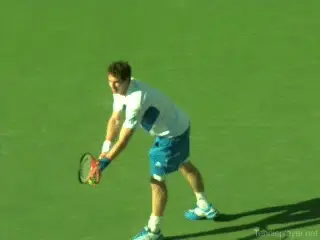

# First Strike Tennis: A Four Shot Battle

### Craig O'Shannessy

------------------------------------------------------------------------

**A serve and a forehand---a winning first strike point?**

In the last article, we looked at the number of hits that determine
points and found that in pro tennis, despite a limited number of rallies
that can last over 20 balls, most points are decided by 4 hits---or
less. It's 60 % or higher.

What wins? First strike tennis. A serve, or a serve plus one shot. A
return, or a return plus one shot.

If you are still struggling to get your mind around that, let's look at
some specific pro matches with players including Stan Wawrinka, Rafael
Nadal, Novak Djokoivic and Bernard Tomic.

Let's see how success in points of 4 hits or less determined what
happened to these players at the Australian Open in 2015.

**4 Shot Battle**

In Australia in 2015, Stan Wawrinka had a really nice run to the
semi-finals. He won five matches before losing to Novak Djokovic. The
table below outlines Stan's performance in those first 5 matches.

**Stan was a winner when he was a 4 hit winner.**

66% percent of his total points were 4 hits or less. So by far the
largest majority of the points Stan played were first strike points.

Why did Stan get to the semis? Because in this key category that
composes most of the points, he was +33. He won 33 more points than he
lost in first strike tennis.

Note also that another 25 percent of the total points were 5 to 8 shots.
And Stan did well there too at +17. That totals over 90% of all
points---8 hits or less-again with the large majority 4 hits or less.

You may think Stan is always at the back hammering forehands and
backhands into the middle of next week in long, grinding rallies. And he
is -- it just that this is only 9% of the time.

  -----------------------------------------------
  **Rally    **Points     **Points Won / Lost
  Length**   Played**     (+/-)**
  ---------- ------------ -----------------------
  0-4 Shots  66%          +33

  5-8 Shots  25%          +20

  9+ Shots   9%           +17
  -----------------------------------------------

**Novak Takes Over**

And then Stan went five sets with Novak in the semis and lost--
completely running out of gas mentally and emotionally in the 5th set.
So where did Novak have the edge in this match?

Let's look at numbers from Stan's point of view. His first strike
points went severely negative. In just this one match he was -13. In the
longer 5-8 shot rallies where he had also had a big edge, he was
negative again at -2.

The only place he stayed with Novak with in the rallies of 9 shots or
more. Those points were dead even. So battling Novak to a standstill in
the long rallies did him no good whatsoever.

Once again the first strike points determined the outcome. Novak simply
beat Stan up in this key category.

  ---------------------------------------
  **Rally         **Points Won / Lost
  Length**        (+/-)**
  --------------- -----------------------
  0-4 Shots       -13

  5-8 Shots       -2

  9+ Shots        0
  ---------------------------------------

What I am presenting here is a completely different way to evaluate
winning and losing. Instead of blaming strokes, we are evaluating is the
length of the rally and the direct, determinate effect it has on
outcome. What I am asking you is to open your mind to a new way of
evaluating a match.

**And for Rafa?**

Rafa made the quarter finals that same tournament in Australia in 2015,
winning four matches. Here are the numbers he put up from the matches he
won.

  ------------------------------------------------
  **Rally    **Points       **Points Won / Lost
  Length**   Played**       (+/-)**
  ---------- -------------- ----------------------
  0-4 Shots  65%            +22

  5-8 Shots  22%            +49

  9+ Shots   13%            -2
  ------------------------------------------------

**A backhand return and a backhand\--Rafa wins a 4 hit point.**

Rafa played by far away the majority of his points in First Strike mode.
65% of them. Notice this total First Strike point percentage was
virtually identical to Stan. And like Stan's in his winning matches,
Rafa was in positive 4 strike territory in the matches he won at +22.

And note this! Rafa actually played slightly fewer 5 to 8 shot points
than Stan! 22% for Rafa versus 25% for Stan.

True Rafa was tremendously effective when points were in that range at
+49 for four matches. But look at rallies of 9 shots or more.

Rafa is supposedly the king of extended rallies. But they comprised only
13% of his total points in the matches he won. And guess what? He lost
more of them than he won.

So put another whenever Rafa played three points, two were first strike
points, and one was longer. Again, 2 out 3 of Rafa's points went on for
4 hits---or less.

**Berdych**

But the good numbers didn't last for Rafa in the quarterfinals. Rafa
ran into a buzzsaw. Tomas Berdych really gave it to him!

Where did Rafa really lose the match? Tomas beat Rafa down in First
Strike tennis.

Rafa lost 23 more points than he won in First Strike points. And he was
also negative in 5 to 8 shot rallies. And only broke even in the 9 shot
or more rallies.

The conclusion? Dominating a big pool of points is where it's all at.
All of the long rallies that Rafa wanted to play to find an advantage
came down to zero. He won the same amount he lost.

Once again, the real battle ground was First Strike tennis. Our eyes may
see the long rallies. But the math tells the truth.

  ---------------------------------
  **Rally    **Points Won / Lost
  Length**   (+/-)**
  ---------- ----------------------
  0-4 Shots  -23

  5-8 Shots  -4

  9+ Shots   0
  ---------------------------------

**Winning First Strike Tennis in Australia: serves and returns---and
serves and returns plus 1.**

**One More: Bernard Tomic**

And one more example. Bernard had a solid tournament, making the fourth
round, before also losing to Tomas Berdych. Let's have a look at how
Bernie went about his business in the three matches he won.

Tomic played 72% first strike points in the first three rounds. He was
+47 in the 3 matches on the 0-4 shot points.

  -----------------------------------------
  **Rally    **Points    **Points Won /
  Length**   Played**    Lost (+/-)**
  ---------- ----------- ------------------
  0-4 Shots  72%         +47

  5-8 Shots  16%         -11

  9+ Shots   12%         -2
  -----------------------------------------

Compare that to his loss to Berdych in 3 straight sets. In only 3 sets
he was -15 in First Strike points. Huge, huge difference and it
definitely determined the outcome.

  -----------------------------
  **Rally    **Points Won /
  Length**   Lost (+/-)**
  ---------- ------------------
  0-4 Shots  -15

  5-8 Shots  -1

  9+ Shots   -5
  -----------------------------

**Starting to see a pattern?**

**[[Extended Rallies are not where you win or lose. Know the biggest
pool of points by far is in the first 4 shots. That's where you will
ultimately win or ultimately lose.]{.mark}]{.underline}**

And, again, this is how you should train, by focusing on the first 4
shots.

Serve and Serve plus 1.

The Return and the Return +1 groundstroke. Ideally the +1 shot is hit
aggressively from around the baseline.

You might say, OK I now believe that First Strike Tennis is key in the
pro game. But could that possibly apply at other levels?

How about high school tennis for example? Stay tuned for an amazing
story about one of the winningest high school programs in the country.

------------------------------------------------------------------------

|  | statistics, tennis strategy, and applying |
|  | his insights in coaching. His research has |
|  | uncovered the real magic numbers in winning |
|  | tennis across all levels of the game. He |
|  | writes for the ATP Tour website and the New |
|  | York Times among others elite publications. |
|  |  |
|  | He has coached on the tour for 20 years |
|  | working with players including Kevin |
|  | Anderson, Amer Delic, and Rajeev Ram. His |
|  | website Brain Game Tennis offers detailed |
|  | analysis and training programs based on his |
|  | research that have helped thousands of |
|  | players around the world. |

  ------------------------------------------------------------------------------------------------------------------------------------------------------------------------------------------------------------
                                                                                                                                        to visit Craig's site and check out his
                                                                                                                                                                      amazing training products!
  ------------------------------------------------------------------------------------------------------------------------------------------------------------------- ----------------------------------------

  ------------------------------------------------------------------------------------------------------------------------------------------------------------------------------------------------------------

------------------------------------------------------------------------
