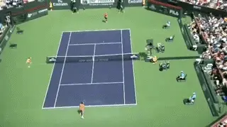

# Marginal Gains: Top Shots and Set Up Shots

### Nick Wheatley

------------------------------------------------------------------------

**Winning 52% of his total points made Kyle Edmund number 14 in the
world.**

In 2018, Kyle Edmund finished ranked No.14 in the world\--the 14th best
player on the planet. Yet, he lost 48% of all the points that he played.
That's right, being able to win 52% of his total points was enough to
rank him that high, amongst the tennis elite, and with the ability to
gain huge earnings from prize money and sponsorship.

As you move down the rankings, winning 50% of total points in ATP Tour
level events is good enough to comfortably maintain your position in the
Top 100, while winning 55% will usually be enough to make you the No.1
player in the world. ([Click Here](The%20New%20Magic%20Numbers.docx) for
more detail on that from Craig O'Shannessy.)

These numbers are not only true on the tour. They translate to every
level of the game all the way down to your local club singles league.
Whatever level you play at, being able to win an extra 1% or 2% or 5% of
the total points you play can make a huge difference in your results.

**How well do you really understand your game?**

**Understanding**

This series is about how to find those extra few points. How? By better
understanding the game of tennis. By better understanding your own game.
And then, based on this understanding, adopting some new practice and
game strategies.

In this first article, we'll look at understanding your strengths and
finding your top shot and a series of set up shots. In the next we will
talk in detail about patterns and shot combinations.

From there we'll help you define and understand your own game style.
Then, based on this improved understanding, we'll move on to how you
can change your practice routines to develop the ability to make the
marginal gains that change the outcomes of matches.

Understanding your tennis game is something that you may think you do
already, but often when asked to go through the process outlined below,
players are surprised to find they gain a deeper understanding that they
had not previously uncovered.

**Favourite Shots**

The process begins with identifying your favourite shots off the ground.
I am asking you to make 3 choices from the following 6 groundstrokes.

1.  **Forehand Crosscourt**

2.  **Forehand Down the Line**

3.  **Forehand Inside Out**

4.  **Forehand Inside In**

5.  **Backhand Crosscourt**

6.  **Backhand Down the Line**

When choosing these shots, make the assumption that you are hitting
these shots in a neutral or attacking capacity, not a defensive one. In
other words, when you have sufficient time to play the shot on your
terms. These are:

**What's your top shot?**

Players who favour their backhand side may also wish to include the
backhand inside out and inside in shots, though this is not that common.

Once you have your 3 favourites, the next step is to narrow it down to a
top shot. This should be the shot that is likely to be your strongest
shot and/or the one you are most confident hitting. It should be the
shot that often results in you winning the point, or setting you up in a
very strong position.

**Set Up**

[**[Once you pick your top shot, the next step is to work out a set up
shot for your top shot. This]{.underline}** **[is based on the
assumption that the majority of all shots are played on crosscourt
diagonals. This includes forehands inside out, hit on the same diagonal
as backhand cross-courts.]{.underline}**]{.mark}

Hitting on the crosscourt diagonal is the less risky and the higher
percentage play. For this reason, if you hit your forehand down the
line, you should expect your opponent to play the ball back cross-court
most of the time.

**Here Nadal uses his inside in forehand to set up a forehand
crosscourt**

That can set you up for a backhand crosscourt, a backhand down the line
or a forehand inside out or inside in. If you hit a backhand down the
line returned crosscourt by the opponent, it can set you up to hit a
forehand crosscourt, or a forehand down the line. Likewise, an inside
out forehand can set you up to hit a forehand inside in.

Nadal quite often goes the other way, using his forehand inside into a
right hander's backhand to create pressure and set up another forehand.

If your top shot is a crosscourt shot, either a forehand or a backhand
crosscourt or a forehand inside out, then it's likely the same shot
will be the best set up shot for you as well. But, for the purpose of
this exercise, I recommend choosing an alternative shot for your set up
shot to generate more options.

So here are all the set up shot options for all the possible top shots.
As you can see, the options are similar, depending which side you are
hitting your top shot from.

### Top Shot: Forehand Crosscourt

Set Up Shots:

Forehand Crosscourt

Backhand Down the Line

Forehand Inside In

### Top Shot: Forehand Down the Line

Set Up Shots:

Forehand Crosscourt

Backhand Down the Line

Forehand Inside In

### Top Shot: Forehand Inside Out

Set Up Shots:

Forehand Inside Out

Forehand Down the Line

Backhand Crosscourt

### Top Shot: Forehand Inside In

Set Up Shots:

Forehand Inside Out

Forehand Down the Line

Backhand Crosscourt

### Top Shot: Backhand Crosscourt

Set Up Shots:

Forehand Inside Out

Forehand Down the Line

Backhand Crosscourt

 

### Top Shot: Backhand Down the Line

Set Up Shots:

Forehand Inside Out

Forehand Down the Line

Backhand Crosscourt

 

**Federer uses a forehand down the line to set up a forehand inside
in.**

When choosing your options for set up shots, you should also calculate
how much movement you may have to do between the set up and the top
shot.

For example, a Forehand Down the Line set up shot for a Forehand Inside
In or Inside Out top shot involves the maximum distance, as you have to
move from the forehand side all the way across to the backhand side and
get around the ball to play the next shot.

It's still feasible, especially if your opponent's reply is weak, and
you don't strike the Forehand Down the Line from too far wide. Another
example of maximum distance is an Forehand Inside In setting up either a
Forehand Crosscourt or a Forehand Down the Line.

A great way to see what works for you is to have a coach feed you the
set up and then the top shot, with increasing amounts of distance
between them, and then to do the same rallying with a partner.

This will give you a realistic feeling for how far you can really move
in matches and execute the top shot with authority. By doing this
repeatedly you may adjust your fav shots or even your top shot.

Next we will look at how the cross-court diagonals figure into using
your fav shots and your top shot. Stay Tuned.

|  | His junior teams, the Hawker Jets, have won 44 |
|  | competitions since formation, and over the last 2 |
|  | years alone, his junior players have won 19 |
|  | singles tournaments between them at county level. |
|  |  |
|  | He has been ranked in the top 75 nationally in 35 |
|  | and over singles and in the top 5 in Surrey |
|  | county. Nick has done video analysis for numerous |
|  | players at all levels, including former British |
|  | Top 10 player Marcus Willis. |
|  |  |
|  | His unique teaching video series, covering every |
|  | aspect of the game, is available on his website |
|  | [www.nickwtennis.com](http://www.nickwtennis.com) |
|  |  |
|  | You can also contact Nick directly via the |
|  | homepage of his website. |

------------------------------------------------------------------------
