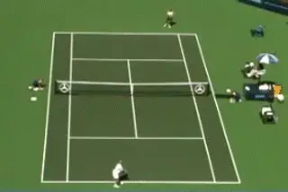

# Pro Patterns: The Inside Out Diagonal

### Craig Cignarelli

------------------------------------------------------------------------

**Playing inside forehands is basic at the world class level.**

Roger Federer, Pete Sampras, Steffi Graf. Some of the greatest champions
in tennis history. You might think their games are completely different,
and in many ways you'd be right. But they have one thing in common
underlying their success: Mastery of the Inside Out position.

To a greater or lesser extent every top player plays from this position.
You can see that by looking at the number of files in the Stroke
Archive. Of 150 Federer forehands in the archive, Roger hits over 30%
from the inside position, more than from any other position on the
court. It's the same for Rafael Nadal. More than 30% of his forehands
are inside out or inside in, the highest percentage of any player in the
archive. Even players like Agassi or David Nalbandian who play more from
the center of the court still hit 20% or more of their forehands from
the inside position.

\
**Even if they tend to play from the center, top players like Agassi
still hit 20% of their forehands from an inside position.**

Why is the inside game so critical in professional tennis? What is it
about controlling this diagonal that has allowed our greatest players to
dominate the sport? What do these champions know about the inside out
game that we don't? This article will delineate the strategic
components of the inside out position. It will instruct you how to
master your own inside game. It could be the information you need to
transform the outcome of your backcourt points, and the outcome of your
close matches.

**Why Inside?**

**Why play inside out? The obvious advantage is that it allows you to
use your forehand against your opponent's
backhand.** **In general, we know very few top
pros have obvious weaknesses on their backhand sides, yet they still
chose to move around and play a large percentage of balls from the
inside out position.**

\
**If so many pros use the inside out to hit to the backhand, what about
club players?**

Let's think about what that means from the perspective of the average
player. How many club players can honestly say that that their backhand
side is as strong as their forehand? In almost cases, the backhand is
the weaker side. This applies to most club players, and it applies to
their opponent's as well\--other club players with similarly weaker
backhands. How much of an advantage would it be in the average club
match to use your strength to hit to your opponent's weakness as the
basic diagonal in backcourt exchanges?

**Inside Offense**

**[[When you move to the inside out position, your ready position is now
on the ad side, a few feet to the left of center. From this position you
rip inside-out forehands crosscourt, making decisions with every shot.
If your opponent can keep you close to your singles sideline, you rip it
back crosscourt to his backhand. If he hits a higher ball towards the
middle, you can destroy it inside in\--that is down the singles sideline
to your opponent's forehand. Or you can approach inside-out to his
backhand.]{.mark}]{.underline}**

\
**Dominating inside out produces balls to destroy inside in.**

**There are many other options. If your opponent hits short and low,
you can use your slice backhand to chip back crosscourt, again looking
to maneuver for position and set up the inside in. Or you can chip up
the line and attack.**

**Inside Defense**

The above decisions are offensive in nature. But often a quality
opponent will attempt to disrupt your offensive intentions by altering
your command of the inside-out diagonal. Let's go through the options
to counteract these efforts.

**[Standing on the ad side, you appear vulnerable if your opponent hits
his backhand down the line to your deuce side. At the club level, this
is an illusion. Few players can hit accurately or consistently enough to
hurt their opponent with a backhand down the line. When they try, they
often hit short or too much to the middle. This can actually set you up
to really take charge of the point. You do this by hitting crosscourt in
the open court or hitting a short forehand for a winner.]{.underline}**

At the pro level, something similar happens, with players turning an
apparent vulnerability into an offensive opportunity. Often pro players
will try to drive the ball deep crosscourt to get to the backhand of an
opponent in the inside position.

**Sampras used the slice backhand to set up the inside in forehand.**

Pete Sampras would turn this into an offensive by pattern by first
rolling a high, relatively soft backhand crosscourt, and daring his
opponent to hit the backhand up the line. When the opponent took the
bait, this allowed him to hit his incredible running forehand, driving
it crosscourt with severe pace and/or angle, or hitting down the line
behind his opponent, who had moved to cover the forehand crosscourt.

**Sampras dared his opponents to hit into the open court and answered
with his running forehand.**

Another option is to use the slice. Federer slices this ball back
crosscourt short, inviting, his opponent to come to the net off a low
ball against his forehand passing shot. We all know the result as
Roger's forehand pass is one of the best in the game.

**Federer uses the slice to invite his opponent in, then passes with his
running forehand.**

Steffi Graf also used the slice to set up the points playing the inside
game. She would pound inside out forehands until she was far enough
ahead to finish hitting inside in. When opponent's hit to her backhand,
she would bide her time slicing back crosscourt hitting wide and/or
short until she could go around the ball and attack with her forehand.

**Steffi Graf was the master of setting up her inside forehand\--one of
the biggest weapons in the history of the women's game.**

Alternatively, against her opponent's drives deep to her backhand,
Steffi would chip down the line short, and force her opponent to hit to
her forehand side, once again allowing her to employ the greatest weapon
in the women's game.

**Another tactic players try against the inside position is to try to
hit short angles to the backhand side, usually
slice**. But the great inside player has developed
a counterplay here by hiting his own backhand slice up the line followed
by a forehand volley winner. Sampras was the master of this combination.

**Your opponent has two other options. He may attempt a drop
shot.** **This shot is risky and will likely not
be a very effective tactic over the course of a match, especially on a
hard court. If it is, you can hit your inside-out forehand heavier, or
higher to prevent him from using that ploy.**

**The last option is a drive down the middle.**
**This shot is exactly what you have been waiting for. If it is high
and short enough, you can go on the attack. If it is not, then simply
return it back inside-out and wait for a better ball to
attack.**

\
**The slice counterplay up the line and the forehand volley winner.**

That covers all of the tactical options. So, let's review. What are the
patterns and shot combinations you need to master inside play?

**These are:**

- **Inside out rally ball, varying depth, height, angle, pace and
  spin.**

- **Backhand slice crosscourt, varying height and angle.**

- **Inside in finishing shot.**

- **Running forehand crosscourt angle and down the line.**

- **Inside out approach shot with volley combination.**

- **Backhand chip down the line with volley combination.**

**Learn to attack or defend from the inside out position, like the
game's masters.**

With these tools you can both attack and defend the inside out position
with authority and play like the masters of the game.

With this article we have now covered all of the backcourt diagonals and
the corresponding defensive and offensive shots for strategic play at
the baseline. In the next article, we will look at utilizing the serve
and return to establish control of the diagonals at the start of the
point. Stay Tuned.

Craig Cignarelli is one of the most prolific and successful
developmental coaches in the country. His original analysis of
professional tactics and movement is unique in modern coaching. Based at
the renowned Riviera Country Club in Southern California, Craig has
personally nurtured 4 junior players from the beginning of their careers
who have gone on to achieve #1 national rankings. Currently he is
working with a cadre of aspiring WTA and ATP players, as well as
competitive juniors at all levels. Versed in 4 languages, Craig is
completing his first book \"What Champions Know,\" which forms the basis
for his articles on Tennisplayer.
