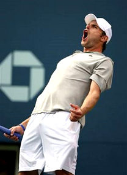
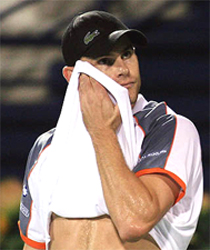
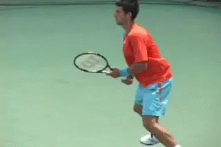
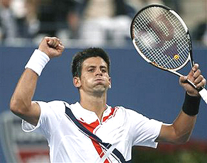
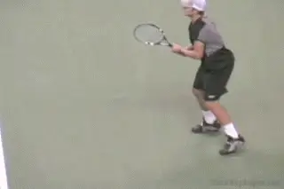
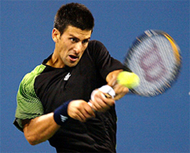
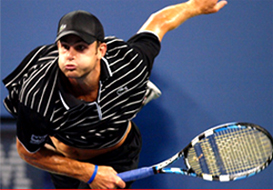
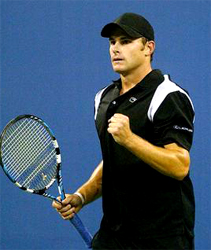
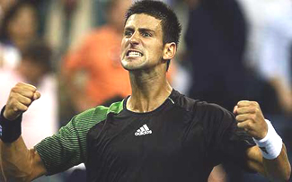
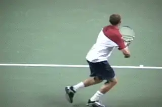

# The Favorite and the Underdog

**The Favorite and the Underdog:\
Understanding Match Dynamics**

**Jeff McCullough**

|  |
|  |
|  |
| The Favorite and the Underdog: what were the match dynamics? |

In the quarterfinals of the 2008 U.S. Open the third seed Novak Djokovic
defeated the eighth seed Andy Roddick in four sets.  Yes, the big
"story" of the Open was obviously Roger Federer.  But for the average
player this match was a virtual archetype when it comes to understanding
the dynamics of match play, and especially what it means to be the
favorite or the underdog in pressure situations.

Once we understand these dynamics, we can see how players at all levels
can apply them and have a significant impact on their own match
outcomes. By studying the forces at work here, we can gain an
understanding of some of the things that happen in matches that may seem
surprising---things that aren't in fact so surprising to experienced
observers. 

So what happened in that quarterfinal Thursday night match in New York? 
For starters the favorite, Djokovic won, and the underdog, Roddick,
lost, although it appeared Andy had a real chance in the fourth set.

Djokovic got off to a big lead, relying on his superior baseline
proficiency, his movement and his tenacity, taking the first two sets,
6-2, 6-3.  Roddick lost the first set in 27 minutes behind a barrage of
errors and a low first serve percentage.

  -----------------------------------------------------------------------------------------------------------------------------------------------------------------------------
                                                  
  -----------------------------------------------------------------------------------------------------------------------------------------------------------------------------
                                                                    A Babolat racket was the innocent victim.

  -----------------------------------------------------------------------------------------------------------------------------------------------------------------------------

After being completely outplayed in the first two sets Roddick was so
angry he brutalized an innocent Babolat racket. However, the underdog
found his service rhythm in the third set and was basically unbreakable.
 He began to paint the lines with his big inside out and inside in
forehands. Even his shaky, flawed two-handed backhand yielded some
winners and forced errors. Now Djokovic was the one who looked
frustrated and went down 6-3 in the third.

And things continued in Andy's direction through most of the fourth.
 Roddick again dominated with his serve. He got up a break and served
for the set at 5-4.  But after going up 30-love, two points from the
fifth set, he hit two double faults that turned the match. 

Inexplicably, he went for two huge second serves and missed them both.

The Swedish champion Stefan Edberg once said that there comes a time
"when a match can be had." This was one of those times.  Watching at
home after the double faults I said to myself "that should just about do
it."  

Roddick knew it. Djokovic knew it. A lot of fans could also feel it.
After the second double fault a groan reverberated throughout the
stadium.  The double faults were a mental and emotional turning
point---even though the score was still 30 all in Andy's service game. 
Djokovic went on to break back and then was able to win the fourth set
and the match in the tiebreaker that followed.  

  --------------------------------------------------------------------------------------------------------------------------------------------------------------------
   
  --------------------------------------------------------------------------------------------------------------------------------------------------------------------
                                                           Until the double faults, great positive intensity.

  --------------------------------------------------------------------------------------------------------------------------------------------------------------------

The impact was obvious in Andy's altered body language. Prior to the
double faults, he had exhibited great positive intensity. After breaking
Djokovic's serve earlier in the set, he looked almost like his former
coach Jimmy Connors, with his head thrown back and his fists pumping
wildly, back peddling in a sort of reverse moon walk.   Then suddenly
after the doubles, he looked beaten. 

It was also obvious when the TV cameras panned into the American's
court side box. Led by Patrick McEnroe, his entourage displayed brave
faces and gave perfunctory encouraging gestures. But you could see their
belief had faded.  They had all seen enough tennis matches to know what
was about to happen. 

Inexperienced observers often believe that the pressure mounts as you
fall further behind in a tennis match and defeat is imminent.  But
sports psychologists have observed the reverse.  The pressure actually
mounts on the player who is ahead as he gets closer to the goal.  At
5-4, Roddick had been serving to get into the fifth set. He was one
point away from a set point and evening the match.  

At 5 all Djokovic held easily. With the pressure of serving for the
fourth set gone, Roddick was able to hold serve to get into the fourth
set tie-breaker, so again, theoretically, he was still in the match. 

But at 5 all in the breaker, after a long, brilliant rally in which both
players traded and absorbed furious punches from positions well beyond
the sidelines, Roddick deposited a backhand drop shot several feet short
of the net strap.

Now Roddick's face had defeat written all over it. He seemed totally
resigned as he walked over to the ad court to receive serve, and the
curtain came down one point later.

  ---------------------------------------------------------------------------------------------------------------------------------------------------------------------
   
  ---------------------------------------------------------------------------------------------------------------------------------------------------------------------
                                                          **After the double faults, resignation and defeat.**

  ---------------------------------------------------------------------------------------------------------------------------------------------------------------------

The next day's headlines would proclaim that Novak Djokovic defeated
Andy Roddick in a "close" match that "could have gone either way." In
reality, when Roddick double faulted serving for the fourth set, the
match was all but over.  So let's examine the dynamics that were at
work, dynamics that recur time and time again in matches at the pro
level on down.

**The Script**

Here is a simple fact.  Most of the time in sports, and tennis is no
different, the favorite wins and the underdog loses.  There are usually
compelling reasons why one player is favored.  And the advantages that
make a player the favorite leads to victory more often than not.

Famed former college tennis coach Chuck Kriese calls this relationship
between favorite and underdog "The Script." It is the recurring primary
dynamic in most tennis matches.  But not always.  If the favorite always
won we, the audience, would lose interest.  The underdog comes through
just often enough to make it interesting, and upsets are emotionally
compelling. So why does the favorite usually win?  And when upsets do
occur why do they happen? 

**Favorites win in part because they have the game.**

First, let's ask what does the underdog has to do to win against the
odds.  Most of the time the answer is simple:  The underdog has to raise
his game at critical moments.  Then he must sustain the change in
momentum. If he can keep the momenturm long enough, he has a legitimate
chance to chalk up an upset. This was exactly the opportunity Roddick
had as he served for the fourth set. 

Chuck Kriese also argues that when the underdog grabs the momentum, but
then loses it at a critical juncture as happened to Roddick, it is very
difficult to get it back.  Recovery is still possible, but far more
often than not, it never happens.

**Emotional Control**

Now let's look at it from the favorite side. The favorite usually wins
because the favorite is simply likely to perform better at the critical
junctures.  Why?  Well, there is a reason the favorite is the favorite. 
Favorites usually win because they have more game.  They have proven
this in previous matches, and winning previous matches breeds
confidence.  Having more game and more confidence simply means better
performance at turning points and under pressure. It's a snowball
effect.

The favorite is also helped at these times by the relative lack of
confidence on the part of the underdog.  Lacking the experience of
having come through under pressure, this is the time that the underdog
so often crumbles or chokes.   The underdog typically either makes too
many unforced errors or fails to play aggressively enough to neutralize
or overcome the favorite. ** **Perhaps there is no other stronger
indicator of a failure of confidence than a double fault on a big point
in a critical game.

**The Confidence Exchange**

After an escape like Djokovic had with Roddick's double faults, the
favorite is likely to be inspired and energized, often hitting another
gear.  This only compounds the challenge faced by the underdog. The
result in what I term a "confidence exchange." The underdog's rising
confidence is snuffed out, and the favorite's flagging confidence is
suddenly revived. After breaking to even the match at 5 all Djokovic
looked both relieved and bolstered. Only a few minutes earlier Roddick
appeared to be supercharged. Now he appeared to be in state of shock.
The bottom line was that The Script played itself out as it usually
does.

  --------------------------------------------------------------------------------------------------------------------------------------------------------------------
   
  --------------------------------------------------------------------------------------------------------------------------------------------------------------------
                                                 **After a near escape, the favorite is often relieved and bolstered.**

  --------------------------------------------------------------------------------------------------------------------------------------------------------------------

**The Battle of the Body Language**

In each match there are many sub plots. One is the "battle of the body
language."  Body language is the best gage for determining what is
really going on internally with a competitive tennis player in the heat
of battle.

When you watch the pros take notice of who is truly sending the message
to the other side of the court that they believe they can win. In this
match that person was Novak Djokovic. Despite shaking his head in
frustration late in the fourth set after framing a couple of 140 m.p.h.
serves, he was able to shake this negativity off.  The message to Andy
was clear: "You may be serving well, but I still believe I will win."

After the second double fault Andy's face conveyed the opposite message.
Then after the failed drop shot any  remaining positive intensity
vanished into the night. The fight had been all but sucked out of him by
a tougher, smarter opponent.

**Decision Making and Problem Solving**

In pressure situations such as the one these players faced in this
quarterfinal match, it is the ability to think clearly and make good
decisions at critical times that often makes the difference between
winning and losing.  Even when things are moving very quickly, players
must still think clearly and react effectively.  Djokovic passed this
test by making good choices and Roddick did not. 

For Roddick this decision making challenge is increased because he has
been criticized by the fans and the press for his relative lack of
success. The result is that he is so desperate to succeed that sometimes
it causes him to play either recklessly or foolishly.

Roddick's rash decision to go for two huge second serves on these
critical points has to be called into question. In point of fact, he has
a very good second serve and might have held serve by hitting it, rather
than over hitting and trying to do more than was likely necessary to
complete this task.

**How does your level of belief affect your shot tolerance?**

**Shot Tolerance and Stroke Weakness**

Let's look at what happened from another, related angle.  Elliot
Teltscher has identified a basic attribute in the games of all tennis
players, which is their "shot tolerance."  ([[]](../High%20Performance/Shot%20Tolerance.docx).)  Shot
tolerance is the average number of balls a player is physically,
mentally and emotionally able to hit in a given point. When players
reach the limit of their shot tolerance they are much more likely to
either abruptly go for a winner, regardless of their position in the
point, or to try a low percentage shot.

When a player is near this threshold and must also hit a shot which is
his "weakness" then he is even more likely to make a bad decision. For
Roddick I believe this is what resulted in that ill advised drop shot at
5 all in the fourth set tie-breaker.  It was not a surprise Roddick went
for the drop shot instead of attempting an aggressive two-handed
backhand drive.  It shows that, deep down, Andy lacks confidence in his
backhand wing.

I suspect part of his rationale for over hitting his second serves was
also the result of this mentality.  At some level he may have been
thinking that if he could just hit a couple of huge unreturnable serves
he could avoid having to test his backhand in pressure packed
groundstroke rallies.  Novak Djokovic, on the other hand, has no
discernible technical weaknesses. And that's one of the main reasons
that his star is on the rise.   He is not as susceptible to the same
kind of doubts under pressure.

**The Pay Off for You**

And so the curtain came down on an interesting and highly entertaining
match.  There are many lessons for those seeking to improve their match
play by observing pro matches with a more sophisticated eye. The fact is
the very same dynamics seen in the Djokovic/Roddick match are present in
matches at all levels.

Unfortunately, many recreational tennis players and even some hard-core
competitive players are either unaware of these match play dynamics, or
do not sufficiently attend to them. Consequently, they go hurtling into
their matches with incomplete road maps. They fall into the all too
common trap of thinking that the quick, simple solution lies in simply
"trying harder."  

  ----------------------------------------------------------------------------------------------------------------------------------------------------------------------------------------------------
                  
  ----------------------------------------------------------------------------------------------------------------------------------------------------------------------------------------------------
                                                                        A critical question: are you a favorite or an underdog?

  ----------------------------------------------------------------------------------------------------------------------------------------------------------------------------------------------------

**The Critical Question**

There is a critical question to ask in applying the lessons of the
Roddick match.  Will you be a favorite, an underdog or a coequal? And
how will your role determine your modus operandi? Just as in the pros,
you must recognize that the status of each player in terms of pre-match
dominance is not only operative, but usually determinant.

The exception occurs in the rare matches where the players themselves
and others perceive the competitors as equivalent. Without the pressure
of defending a superior position or trying to overcome a formidable
challenge, both players feel less pressure. Sometimes these matches are
more free wheeling and turn out to be more uninhibited and entertaining.

This was not the case in this quarterfinal U.S. Open match, in which
there was a clear favorite and a clear underdog. And it is not the case
in most club matches either because, most of the time, someone is
perceived as having the upper hand.  So the most important thing is to
understand the meaning of your role of as favorite or underdog in a
given match. This understanding is the prerequisite to defining your
mission.   Coaches need to educate their students regarding the impact
of playing these different roles in order to improve their chances of
winning.

**Underdog**

What if you are the underdog?  What if you are playing next weekend in a
club tournament or league match against a player you have lost to
previously or who beats your regular opponents?  What if you're an
aspiring pro trying to gain some traction on the challenger circuit?
What if you're number three on your high school team trying to
challenge the number one? These are all equivalent situations insofar as
they all involve the dominance dynamic.

  ----------------------------------------------------------------------------------------------------------------------------------------------------------------------
   
  ----------------------------------------------------------------------------------------------------------------------------------------------------------------------
                                                           **As an underdog can you demonstrate true belief?**

  ----------------------------------------------------------------------------------------------------------------------------------------------------------------------

All underdogs need to understand that they have a mountain to climb. 
Just wanting to win and hoping for an upset is not enough.  It takes
decisive action.  Specifically, underdogs must take advantage of
opportunities to get ahead and then find a way to keep momentum and stay
ahead.  Opportunities cannot be wasted because there are typically
precious few. So successful underdogs are opportunists. They have to be
ready to respond because they are operating with a small window of
opportunity to reverse the flow of the match.

At the first moment the favorite falters or weakens, the underdog has to
step up and take the momentum for himself.  This can mean playing more
aggressively, or more consistently, depending on the circumstances.

But as important or more important, when the underdog has taken the
lead, he must continue to perform in a manner which demonstrates true
belief that he can win. Exhibiting true belief is the hardest thing for
an underdog to do, which is why upsets are so rare.  But if you wish to
win as an underdog you must come into the match believing you can win.
Then you must have the emotional strength to maintain this belief if you
are fortunate to have opportunities, exploit them, and seize a lead. 

Players have an almost unlimited number of excuses when they lose to
better players, especially if they have had a glimmer of victory at some
point in the match.  But the bottom line you will not become an
effective underdog until you address the underlying emotional challenges
that go with performing in this role.  Again, these are the belief that
you can win and the courage to seize opportunities.

  ----------------------------------------------------------------------------------------------------------------------------------------------------------------------
   
  ----------------------------------------------------------------------------------------------------------------------------------------------------------------------
                                        **A favorite has to believe in his level of play, and be able to execute under pressure.**

  ----------------------------------------------------------------------------------------------------------------------------------------------------------------------

**The Favorite Role**

On the other hand, what if you're the clear favorite?  Despite what
many fans believe, it still can be emotionally challenging to play from
this position because this is where the most pressure often resides. The
favorite must cope with and overcome the pressure created by the
expectation that he will win.  This pressure can be either internally or
externally generated, or both.

To do this, the favorite must believe in his generally higher level of
play and then simply execute effectively.  This is one of the things
that made Pete Sampras so great.  He won so many close matches because
he truly believed he was the better player, and that eventually, his
ability would win out.  Of course this is much easier said than done,
which is why so few players are able to stay at the top as long as Pete
or Roger Federer, another great champion who has reported feeling
"invincible" on the court.

As a favorite once you have established momentum you must also attempt
to hold on to it all the way to the finish line. Unfortunately, this is
also the point at which the temptation to relax and assume the victory
becomes the greatest.  But the confidence built on past success is the
favorite's greatest asset.  Favorites have that precious "backlog of
confidence" stemming from a lot of past wins in other big matches.

Novak Djokovic is increasingly looked upon as a player who may have
these rare abilities.  the more tough matches he pulls out, the more
likely he is to continue to do this in the future.

In the Open match versus Roddick, Djokovic could draw on this
experience, as well as on his Grand Slam victory in Australia and his
higher world ranking.  His confidence was also buoyed by knowing that
Roddick, lacking big wins, could not have a comparable level of
self-belief. At this point in his career, Roddick simply doesn't have
the reputation of being able to come through in big matches.

**[[So another key when you are in the favorite role is to simply
recognize how tough it is for the underdog to seize and maintain
momentum.  The key is not to panic and continue to play your superior
game.] ]**

**When you are the favorite, play your superior game and show confidence
with your body language.**

**Next time you are the favorite and have fallen behind look for signs
of a weakening resolve or faltering performance from your opponent. See
if they really can maintain their nerve.  The odds are against it.  They
may swing back to the negative, manifested in a change in body language,
poor shot selection of tactics, or even just one egregious unforced
error.  Don't overreact.  Play within yourself, but continue to create
pressure that will most likely lead to the underdog's downhill
slide.** **Remember in many close, high stakes
matches each player is always only one point away from \"cracking.\"
More often than not it's the underdog.**

**[[Even favorites are human and an underdog who stays close enough long
enough will sometimes have a breakthrough.  So if you are the underdog
you must also look for similar signs of \"cracking\" on the part of the
favorite. It will happen to every favorite eventually.  If it does, you
have to apply pressure with a sense of urgency.  You must play within
your capabilities, of course, but when you have the chance, you have to
go for it, whether you succeed or not.  As an underdog, it's better to
try to take control and fail, then not to try at
all.] ]**

If a wavering favorite recovers from a bad patch and you allow him
regain the momentum, you have probably squandered your opportunity.  As
the Roddick match shows, when the underdog has gained the momentum at a
critical juncture, but then gives it back, it becomes very tough to win
the big points. Discouragement and demoralization after squandering a
golden opportunity usually lead to unraveling and loss.

**Body Language**

Next time you are involved in a close, tough match ask yourself if your
body language is really consistently communicating the message you want
to be sending to your opponent.  The body language tells the story and
if you cannot walk the walk, it will almost always be reflected in your
results.

In the Open match, Djokovic's superior confidence enabled him to win
the battle of the body language going away.  Roddick wilted partly due
to Djokovic's more powerful and assured physical presence.  After the
two double faults Andy went from appearing profoundly inspired to
looking defeated. And then, when he offered up the drop shot brick, his
body language demonstrated a complete lack of genuine belief in his
ability to make a comeback.

There is an incredible body of work on Tennisplayer, dealing with just
this topic, including two recent article's from Jim Loehr on Rafael
Nadal's amazing body language, as well as his training system for
improving this critical dimension in your game. If you aren't familiar
with them, they are highly recommended. ([[]](../Mental%20game/Love%20the%20Battle-Pathways%20to%20Performing.docx))

**Body language demonstrates belief, or its lack.**

**Cognitive Element**

The Djokovic-Roddick showdown also clearly illustrates the importance of
the cognitive element in a close match. The ability to think clearly and
pick the highest percentage strategy, tactic, or the right shot at the
right time will almost always be critical in such situations.

It is a matter of making the choice which gives you the best chance of
either winning the point immediately, or sustaining the point so as to
be able to give yourself the best chance of winning it later. In this
match Djokovic ultimately proved much better in this regard. When the
match was on the line, he used his strengths of speed, consistency,
tenacity, and confidence. With his greater patience and higher shot
tolerance, he wisely chose to \"work\" that critical 5 all tie-breaker
point. In so doing, he cleverly allowed the faltering underdog to
self-destruct with flawed decision making.

In your next close match make note of your choices at critical times.
Remember, below the professional level most matches are lost with
unforced errors, as opposed to won with winners and forced errors. So a
key point is to be aware of your honest capabilities, particularly at
potential turning points.

More than anything else at the club level, this means understanding your
weaknesses, and not trying to do too much when forced to play a less
functional stroke.  If your opponent has exposed your weak backhand, for
example, play within yourself to manage this liability.  Understand what
you can do and stick to do it.  Don't self-destruct by trying shots
which you know deep inside you are not capable of hitting.  To use an
automotive analogy: If you have a car that is engineered to go only 50
m.p.h. don't try to drive it 100 m.p.h. 

**Beneath the Surface**

Next time you watch a top level match, or a lower level match for that
matter, try to look for all these factors that turn the match. And then
strive to apply them to your own matches.

This can be difficult. Watching the modern professional game is a
visually intoxicating experience.   It is easy to become mesmerized by
the stroke shapes, the fluid, explosive movement patterns, the
athleticism, and the power and speed on display.

But if you want to win matches, look beneath the glittery surface to
discover the dynamic elements which inevitably determine the outcomes.
 Looking at matches in this new, more probing and penetrating manner
will deepen your appreciation of the battle that you have witnessed.
These insights are directly applicable to the games of most players and
have the potential to be decisive for you the next time you step on the
court, whether you are the favorite or the underdog.

  --------------------------------------------------------------------------------------------------------------------------------------------------------------------------------------------------------------------------------------------------------------------------------------------------------------
