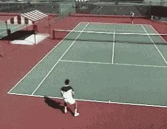

# Winning Matches - Winning Baseline Exchanges

**Winning Matches: Winning Baseline Exchanges**

**By Allen Fox, Ph.D.**

  -----------------------------------------------------------------------------------------------------------------------------------------------------------------------------------------
                                                    {width="2.9479166666666665in"
                                                                                     height="2.28125in"}
  -----------------------------------------------------------------------------------------------------------------------------------------------------------------------------------------
                   **When the player goes into the down the line opening too soon, the basic geometry of the tennis court makes him vulnerable to the crosscourt reply.**

  -----------------------------------------------------------------------------------------------------------------------------------------------------------------------------------------

**Just hit the ball into the open court and make your opponent run.
You\'re in a baseline rally, your opponent hits the ball crosscourt, and
you whack the ball down the line into the opening.**

**[[This strategy has a nice simple ring to it. Your opponent will get
tired of running and, if he doesn\'t run fast enough, your shot will be
a winner. But even among experienced players, this is probably the most
common and most costly strategic error in tennis.]{.mark}]{.underline}**

**[[Hitting the ball into the open court at the wrong time may result in
more lost points than any other factor in matches below the pro level.
Why? Pro players like Andre Agassi, make attacking from the baseline
look easy, because they know how to set it up and when to do it. This is
because they understand the geometry of baseline play and how to exploit
it.]{.mark}]{.underline}**

**The Crosscourt Exchange**

  ----------------------------------
    Hitting the ball into the open
   court too soon, especially from
   wide positions, causes more lost
    points than any factor in most
               matches.

  ----------------------------------

Let\'s examine a few of these basic facts about the angles of baseline
play and see how they should be affecting your decisions in baseline
rallies, so you can start to think more like the top players.

The first is that you should almost always hit the ball crosscourt from
wide positions in baseline exchanges. This is particularly true when
your opponent has pulled you out near the doubles alley with a good
crosscourt of his own. And this is when most players fall for the
temptation to go down the line into the open court.

In reality when you are pulled wide and under pressure you have a
significantly better chance of staying in the point by hitting the ball
crosscourt, directly back to your opponent. How could this be true? To
answer, let\'s examine the basic geometry of the tennis court.

**[[If I\'m pulled wide crosscourt to my forehand side, for example,
it\'s true that the whole half of my opponent\'s court and his backhand
side may look wide open. But what happens if I hit my forehand down the
line into the opening? Unless I can hit an outright winner or a forcing
approach shot, I\'ll actually create an even greater opening for my
opponent.]{.mark}]{.underline}**

  ----------------------------------------------------------------------------------------------------------------------------------------------------------------------------------
   {width="2.8958333333333335in"
      height="2.240972222222222in"}**By working the crosscourt exchange, you can force your opponent to go down the line too soon, opening the court for a forcing crosscourt.**

  ----------------------------------------------------------------------------------------------------------------------------------------------------------------------------------

**[[This is because hitting down the line opens up your own court so
that your opponent can hurt you on the next shot with a crosscourt
reply]{.underline}]{.mark}**.

**[[When I hit down the line, I can\'t run my opponent further than the
sideline, but I have created an angle for him to hit the ball much wider
crosscourt into my backhand side. With this shot he can force me further
wide than I can run him.]{.mark}]{.underline}**

**[[His crosscourt may end up being an outright winner, or the added
pressure may force me into an error. At the very minimum he is now
firmly in control of the point, and I am on the run. In fact, the better
my down the line shot, the more open court I give him to work with and
the sharper his crosscourt angle can be struck.]{.mark}]{.underline}**

**[[So, what happens if I don\'t fall into this initial trap? What if,
instead of going down the line into the opening, I reply crosscourt,
more or less directly back to my opponent. Now, no matter what he does I
have a much shorter distance to cover to reach his next
ball.]{.mark}]{.underline}**

**[[A second important advantage, since I\'m hitting over the low part
of the net, my ball has up to six inches more margin of net clearance.
And finally, I have more court to hit into. Clearly, it\'s a safer
shot.]{.mark}]{.underline}**

  ------------------------------------------------------------------------------------------------------------------------------------------------------------------------------------------
                                                           {width="2.6173611111111112in"
                                                                                height="2.0076388888888888in"}
  ------------------------------------------------------------------------------------------------------------------------------------------------------------------------------------------
                                                    Hitting crosscourt on both sides is the key to good defense - and to winning offense.

  ------------------------------------------------------------------------------------------------------------------------------------------------------------------------------------------

**[[When I make the crosscourt reply, my opponent may then choose to go
back crosscourt, or he may choose to go down the line into the opening
himself. I hope he goes down the line because now the situation is
reversed. Unless he can hit a winner or a powerful forcing shot, he\'s
exposed himself to my crosscourt backhand reply.]{.mark}]{.underline}**

In responding to my opponent\'s down the line, not only do I have less
court to cover but I also have the chance to hit a backhand crosscourt
myself. So, by waiting an extra shot or two for my opponent to hit down
the line and open up his court, I get to hit the low risk crosscourt
shot myself. It goes into his open court and makes my opponent run the
maximum distance.

Although few players ever stop to analyze it, hitting crosscourt
actually changes the geometric dimensions of the tennis court.

The further out of position you are, the wider the opening for your
opponent becomes if you go down the line. Because of this, a key rule in
back court play is **[[\"the wider you\'re pulled off the court
crosscourt, the more important it is to go back crosscourt yourself to
cut down your opponent\'s angle\".]{.underline}]{.mark}**

  -----------------------------------------------------------------------------------------------------------------------------------------------------------------------------------------
                                                          {width="2.9166666666666665in"
                                                                               height="2.2395833333333335in"}
  -----------------------------------------------------------------------------------------------------------------------------------------------------------------------------------------
                         **When you\'re pulled wide crosscourt, geometry dictates that the best defense is to go crosscourt yourself, right back at your opponent.**

  -----------------------------------------------------------------------------------------------------------------------------------------------------------------------------------------

**\
[[As counterintuitive as it may initially seem, the best defense in this
situation is actually to go right back to your
opponent]{.underline}]{.mark}**[[.]{.mark} **[This is because when your
opponent finds he can\'t win by trading cross-courts with you, he\'s
forced to hit down the line too often, and then you can run him from
corner to corner with low risk crosscourt
replies.]{.mark}**]{.underline}

**[[Since there are two basic crosscourt exchanges, forehand to forehand
and backhand to backhand, you should explore both of these to see which
gives you an advantage.]{.mark}]{.underline}**

If your opponent is clearly weaker on one side, you may want to exploit
it. You can test your strength against his, or you may find that your
weaker side is stronger than his weaker side.

In any case, look for a relative advantage and get into these exchanges
over and over. If you can do this, eventually you\'ll force short balls
that will allow you to hurt your opponent with very strong down the line
or forcing approaches.

  -----------------------------------------------------------------------------------------------------------------------------------------------------------------------------------------
                                                          {width="2.8645833333333335in"
                                                                               height="2.3958333333333335in"}
  -----------------------------------------------------------------------------------------------------------------------------------------------------------------------------------------
                                                    **Using the crosscourt strategy, you\'ll set up your ability to hit volley winners**.

  -----------------------------------------------------------------------------------------------------------------------------------------------------------------------------------------

**[[When you go down the line, your goal is always to attack. You must
hit a shot that forces an error or a weak reply so you can run your
opponent violently or come to the net and volley for a
winner.]{.underline}]{.mark}**

**[[If you and your opponent are equally matched in the exchanges, keep
hitting crosscourt and try to bluff your opponent into hitting down the
line first. One way or another your strategy is to use crosscourt
exchanges to gain control of the points.]{.mark}]{.underline}**

**Crosscourt Rally Game**

Here\'s a rally game you can play to improve your ability to hit
crosscourt consistently. Working with a practice partner start in the
backcourt on opposite sides. Divide the court in half by extending the
service center line. Now play rally points from the back court hitting
only into the crosscourt (half). Hit forehand to forehand and then
backhand to backhand. Play points.

  ------------------------------------------------------------------------------------------------------------------------------------------------------------------------------------------
                                                          {width="2.8229166666666665in"
                                                                                height="2.2083333333333335in"}
  ------------------------------------------------------------------------------------------------------------------------------------------------------------------------------------------
                                    **When you go down the line, your goal is to hit a winner, force an error, or force a weak reply and attack the net.**

  ------------------------------------------------------------------------------------------------------------------------------------------------------------------------------------------

**[For example, in the forehand exchanges you lose the point if you hit
into the wrong side of the court or hit a backhand. Do this daily for a
couple of ten-point games against a steady opponent, and you\'ll quickly
improve your accuracy so that you can implement the crosscourt strategy
in match play.]{.underline}**

Read More From Allen!

Visit him at [www.allenfoxtennis.net](http://www.allenfoxtennis.net) 

+------------------------------------------------------------------------------------------------------------------------------------------------------------------------------------------+------------------------------------------------------------------------------------------------------------------------------------+
| {width="1.3041666666666667in" |                                                                                                                                    |
| height="2.0in"}                                                                                                                                                                          | Tennis is mentally the most difficult sport due to it's personal nature which makes winning and losing feel more important than    |
|                                                                                                                                                                                          | they are. In this new book, Allen offers his proven solutions to problems such as choking, reducing stress, finishing matches, and |
|                                                                                                                                                                                          | developing confidence. Based on a lifetime of high level play and coaching success, it's a must for all competitive players.       |
|                                                                                                                                                                                          |                                                                                                                                    |
|                                                                                                                                                                                          | [[Click Here to                                                                                                                    |
|                                                                                                                                                                                          | Order]{.underline}](http://www.amazon.com/Tennis-Winning-Mental-Allen-Fox/dp/0615407765/ref=sr_1_1?ie=UTF8&qid=1336083459&sr=8-1). |
+==========================================================================================================================================================================================+====================================================================================================================================+

+------------------------------------------------------------------------------------------------------------------------------------------------------------------------------------------+--------------------------------------------------------------------------+
| {width="1.8243055555555556in" | are honest with ourselves, winning is still eminently preferable to      |
| height="2.727777777777778in"}                                                                                                                                                            | losing. In his new book, The Winner\'s Mind, Allen lays out an original  |
|                                                                                                                                                                                          | step-by-step plan for succeeding at any of life\'s endeavors, based on   |
|                                                                                                                                                                                          | his first hand and very personal observations of the careers of both     |
|                                                                                                                                                                                          | world-class tennis players and successful businessman. The bottom line   |
|                                                                                                                                                                                          | is that even if you are not a born champion\--and only a tiny percentage |
|                                                                                                                                                                                          | of us are\--you can still use the success strategies of champions to     |
|                                                                                                                                                                                          | tilt the odds in your favor. Writing with brutal honesty and dry humor,  |
|                                                                                                                                                                                          | Fox lays out the common mental characteristics of winners in sports and  |
|                                                                                                                                                                                          | in life. He explains the critical role of intellect over emotion. He     |
|                                                                                                                                                                                          | analyzes the struggle between ambition and fear and the insidious and    |
|                                                                                                                                                                                          | pervasive fear of failure that undermines so many of us. He then outline |
|                                                                                                                                                                                          | how to confront and overcome these fears in your life and career, even   |
|                                                                                                                                                                                          | when they are initially subconscious. Must reading from one of the great |
|                                                                                                                                                                                          | thinkers in tennis, and a Renaissance Man in life. [[Click Here to       |
|                                                                                                                                                                                          | Order]{.underline}](http://www.tennis-warehouse.com/descpage-MIND.html). |
|                                                                                                                                                                                          |                                                                          |
|                                                                                                                                                                                          | To purchase this book you can also send a check for \$17.95 to Allen     |
|                                                                                                                                                                                          | Fox, 1120 Inverness Place, San Luis Obispo, CA. 93401. The price         |
|                                                                                                                                                                                          | includes shipping.                                                       |
+==========================================================================================================================================================================================+==========================================================================+

  --------------------------------------------------------------------------------------------------------------------------------------------------------------------------------------------------------------------------------------------------
  {width="1.2479166666666666in"   psychologist, and one of the most original and
  height="1.320138888888889in"}                                                                                                                                                             insightful analysts in modern tennis. A top 10 American
                                                                                                                                                                                            player from the glory days before Open tennis, Fox
                                                                                                                                                                                            played many of the legendary greats, among them Roy
                                                                                                                                                                                            Emerson, Rod Laver, Stan Smith, and Arthur Ashe. At
                                                                                                                                                                                            Pepperdine he developed the men\'s tennis program into
                                                                                                                                                                                            an elite contender for national titles, and gave Brad
                                                                                                                                                                                            Gilbert the insights that became the foundation for
                                                                                                                                                                                            \"Winning Ugly\". His book Think to Win is a modern
                                                                                                                                                                                            classic. He has also starred in a series of acclaimed
                                                                                                                                                                                            videos, including Pro Secrets of Match Play and Allen
                                                                                                                                                                                            Fox\'s Ultimate Tennis Lesson.
  ----------------------------------------------------------------------------------------------------------------------------------------------------------------------------------------- --------------------------------------------------------

  --------------------------------------------------------------------------------------------------------------------------------------------------------------------------------------------------------------------------------------------------
