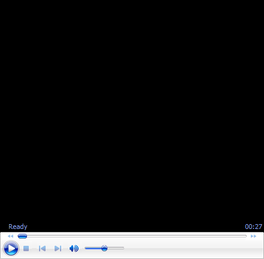

# A New Teaching System: Doing Your Own Side by Side Video Analysis

**John Yandell**

 

**Seeing yourself side by side with the right model is critical.**

In a previous article, I outlined how to do high speed filming for
yourself and the various recording options using compact video cameras
and also the phones. It's easier and cheaper than many people think and
the critical first step in making core technical changes in any stroke.
([[Click
Here]{.underline}](https://www.tennisplayer.net/members/teaching_systems/john_yandell/high_speed_video_analysis/).)

The next question though is how to evaluate that footage. What are you
actually seeing that is sound technically? What isn't?

**A partial list of the players in the Tennisplayer High Speed
Archive.**

What changes do you need to make to really master world class
fundamentals? How do you use high speed video to do this?

In my experience the ability for any player to see his strokes side by
side with the right models is critical. Players think they know what
they are doing, but usually don't. The common reaction is surprise when
they see themselves for the first time.

But the comparison is critical. This is way Tennisplayer is an
unparalleled resource. There is nowhere else in the tennis world where
you can find hundreds of clips of elite players filmed from multiple
angles that you can study in super slow motion and advance frame by
frame. Every one of them can be downloaded on either a PC or a Mac.
[[Click
Here]{.underline}](https://www.tennisplayer.net/members/high_speed_archive)
to see the complete list.

The next question is how to view yourself side by side with Tennisplayer
clips. Do you need a complicated, expensive editing software?

No. The absolute best way to do side by side is to use Quick Time 7.
This is free for either Mac or PC. Just search it on the web.

Notice I said Quick Time 7. A different version of Quick Time comes
standard on all Macs, a so-called upgrade.

But the controls on that version partially cover the images. That's
dumb. That version is also much less reliable in doing frame by frame
advance. It tends to jump multiple frames at a time.

**So take the time to get Quick Time 7. You will be glad.**

Now just open your clip. As I explained in the article on doing the
capture, put the memory card from your filming in the slot and copy over
the files to a folder. Then open the one you want in Quick Time 7.

Now open the pro model you want to use in a second Quick Time window.
Move the windows around til they are side by side.

**What model of what shot are you looking for**

You now have complete, independent control of the video of yourself or
your player if you are a coach, and also of the pro model. You can pause
and do frame by frame advance using the arrows on your keyboard on both
videos.

But what are you looking for? Which of those thousands of clips is the
right model for you? Many players and coaches may know exactly what they
are looking for. A server with a platform stance like Federer---or a
pinpoint stance like Isner.

A reverse forehand with the finish over the head like Rafa. A two-handed
backhand with two bent elbows like Serena and most pro women. A
one-handed topspin backhand with an extreme grip like Dominic Thiem or
Stan Wawrinka. Those are all there for you on Tennisplayer.

But what if you aren't really sure what you should focus on in the
footage? This where my series on Ultimate Fundamentals provides answers.

There are Ultimate Fundamentals articles on all the strokes. Rather than
focusing on variations, they identify underlying commonalities.

In reality no one but pro players can do everything pro players do. But
the core technical positions in pro strokes provide the best possible
models for players at any level.

**The Ultimate Fundamental on the forehand---for pro players and you.**

Take the forehand for example. What elements do Federer, Nadal, and
Djokovic all share? These are strong unit turns, set ups (usually and
preferably) in semi-open stances, and outward and upward extension in
the forward swings. These elements are there across the grip styles,
variations in backswings, and differences in wrap finishes.

So looking at yourself side by side with these players, you can advance
your video of your own stroke to the key positions, compare yourself to
the pro positions, they create your own physical and visual models.

Want more detail? Then go to the Teaching Systems section with my
articles on a New Teaching Method. ([[Click
Here]{.underline}](https://www.tennisplayer.net/members/teaching_systems/).)
There are a series of in depth articles on the strokes that show the
differences as well as the similarities and how the players connect the
positions and vary them in various situations.

These articles provide specific checkpoints for keying the strokes and
how to use images of these checkpoints for executing under pressure.
Don't like my checkpoints? Create your own using the clips in the High
Speed Archives.

What About the Phones?

If you have a relatively new iphone or android phone, you can replicate
the same process. It just a little more complicated with a few more
steps.

**Side by side applications on the phone work the same way as with two
Quick Time Windows.**

Currently, you can't download the Tennisplayer clips directly to the
phone. But you can pick your model clips and email them to yourself on
the phone.

Now you need one more piece of free software to do the side by side.
There are a few options, but the one we prefer is called Hudl Technique.
(Click Here.)

This application allows you to open the clips side by side---you on one,
the pro model on the other. You now have the same functionality as with
Quick Time. You can advance the two videos independently and frame by
frame to compare key positions.

If you want to see the power of this process, look through the Your
Strokes section. ([[Click
Here]{.underline}](https://www.tennisplayer.net/members/your_strokes)).
These are all examples of this exact process. If you struggle doing it
yourself, you can always come to San Francisco and have me do an
analysis for you. And demonstrate how to do it for yourself going
forward!

John Yandell is widely acknowledged as one of the leading videographers
and students of the modern game of professional tennis. His high speed
filming for Advanced Tennis and Tennisplayer have provided new visual
resources that have changed the way the game is studied and understood
by both players and coaches. He has done personal video analysis for
hundreds of high level competitive players, including Justine
Henin-Hardenne, Taylor Dent and John McEnroe, among others.

In addition to his role as Editor of Tennisplayer he is the author of
the critically acclaimed book Visual Tennis. The John Yandell Tennis
School is located in San Francisco, California.
