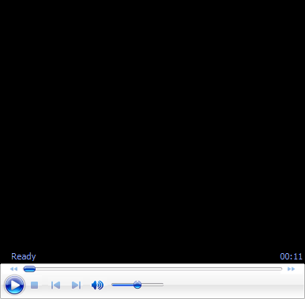

# Ultimate Fundamentals-Forehand Volley

**Ultimate Fundamentals:\
Forehand Volley**

**John Yandell**

Following conventional wisdom you might have the wrong grip, you might
think the volley is a punch, you might not be using shoulder rotation in
the preparation and the forward swing. Trying to create spin, your swing
plane might be way off.

Here is what really happens in high level forehand volleys and the two
positions you need to develop a rock solid volley---all based on our new
incredible high speed footage of Roger Federer and other skilled
volleyers in the pro game.

John Yandell is widely acknowledged as one of the leading videographers
and students of the modern game of professional tennis. His high speed
filming for Advanced Tennis and Tennisplayer have provided new visual
resources that have changed the way the game is studied and understood
by both players and coaches. He has done personal video analysis for
hundreds of high level competitive players, including Justine
Henin-Hardenne, Taylor Dent and John McEnroe, among others.

In addition to his role as Editor of Tennisplayer he is the author of
the critically acclaimed book Visual Tennis. The John Yandell Tennis
School is located in San Francisco, California.
