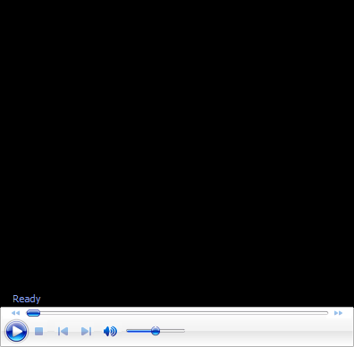

# Ultimate Fundamentals-The Slice Backhand

**Ultimate Fundamentals:\
The Slice Backhand**

**John Yandell**

All players need a slice, whether they hit with one hand or two. But is
the \"modern\" slice hit with its radical downward swing the right model
for most players? Let's take a look.

The speed and especially spin in the modern game has forced an adaption
in the slice swing patterns from its classical predecessors\--backhands
hit by players such as Ken Rosewall, Pancho Gonzales, Jack Kramer, and
Don Budge.

But those fundamental classical elements are still the blue print for
most players in developing a sound and effective slice backhand.

John Yandell is widely acknowledged as one of the leading videographers
and students of the modern game of professional tennis. His high speed
filming for Advanced Tennis and Tennisplayer have provided new visual
resources that have changed the way the game is studied and understood
by both players and coaches. He has done personal video analysis for
hundreds of high level competitive players, including Justine
Henin-Hardenne, Taylor Dent and John McEnroe, among others.

In addition to his role as Editor of Tennisplayer he is the author of
the critically acclaimed book Visual Tennis. The John Yandell Tennis
School is located in San Francisco, California.
