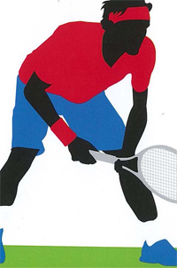

# Confidence and Relaxation

### Miguel Crespo, Paul Lubbers

------------------------------------------------------------------------

**The time between points and games is critical in maintaining
self-confidence. On a changeover, confident thoughts could include: \"I
will maintain my winning strategy.\"**

The intermittent nature of competitive tennis creates \"dead time\"
during match play---in fact this is the majority of time in any match.
This places high demands on the cognitive aspects of the player's
performance.

**One of the key components is self-confidence. Self-confidence is the
degree of certainty that the player has in his or her ability to execute
a skill or series of tasks.** **How much better
will I play when I'm confident? Self-belief is one of the best
predictors of competitive success.**

Building and maintaining appropriate thoughts before, during, and after
a match is therefore one of a player's main goals. These can be
increased with psychological training.

But to do so, players need to first become aware of their thoughts. Only
then can they regulate them, particularly during critical moments.

But how many players actually have this awareness? Many are the victims
of unconscious negative thought loops.

There are a variety of strategies to overcome these negative loops. They
include thought stoppage, positive body language, goal setting, the use
of imagery, focus on process rather than outcome, and the ability to
increase and decrease intensity. (To read Jim Loehr's article on moving
from negative to positive, [Click
Here](https://www.tennisplayer.net/members/mentalgame/jim_loehr/jim_loehr_breathing_mental_game_images/jim_loehr_breathing_mental_game.html).)

Self-talk\--the use of positive and motivational key words---is one of
the most effective strategies. Research has shown that negative
self-talk is associated with losing.

Research has also shown that increasing execution-related thoughts (for
instance, \"watch the ball until impact\") decreased outcome-related
thoughts (for instance, \"win this point\"). The conclusion is that
those players who believe in the utility of positive self-talk win more
points than players who do not.

**Focusing on process not outcome can overcome negativity with thoughts
such as: \"Keep your rhythm. Solid return.\"**

Research also suggests that self-confident players have enhanced
concentration, more fighting spirit, and that these characteristics in
turn have positive flow-on effects to physical endurance, goal setting,
performing better in adversity, having lower cognitive and somatic
anxiety levels and lower total mood disturbance from negative events
such as losing a match.

When comparing winners to losers, it has been found that winners
attribute their performance more to internal or personal factors such as
effort and less to internal debilitating factors such as lack of
practice.

Some players naturally focus on their performance rather than the
outcome of the match, and therefore can feel satisfied irrespective of
the result. These conclusions are entirely consistent with the
statements made by Roger Federer after his comeback from injury to win
the Australian Open.

**Relaxation**

How important is it to relax during a match? Do relaxation strategies
enhance performance?

**Winners tend to have increased execution related thoughts such as \"I
will attack with my second serve.\"**

**Most tennis players want to win, whether competing for money,
trophies, championships, rankings, or for a team or personal
achievement. This is part of the thrill of competition, but often this
is also the root of stress and anxiety.**

Studies on anxiety have concluded that anxiety is detrimental to
performance as it typically causes players to become more vulnerable,
and that winners have significantly lower cognitive anxiety prior to
competition than losers.

Even the world's best players have admitted to how, at times, they are
overcome by nerves. The source of this stress is the belief that you do
not have the ability to meet the demands of competition-for instance,
winning the match, or playing their best tennis in front of others.

This perception triggers negative self-talk, doubt, anxiety, lack of
confidence and feelings of fatigue. This in turn triggers a deep
physiological response where the player's heart rate increases, blood
pressure rises, and muscle tension increases.

Significant reductions in somatic anxiety (physical) and cognitive
anxiety (mental), and significant increases in self-confidence, can be
realized with proper training.

**Centered breathing between points decreases heart rate and stress.**

The first step to relaxing is for the player to become self-aware by
monitoring both the causes and symptoms of the stress.

For many players, a solution is to learn to view the symptoms of stress
as positive and part of the routine for competition. Another technique
is to learn to control both breathing and muscle tension.

Many players use the time between points and games as an opportunity to
employ centered breathing to regain and maintain emotional control
during high-pressured situations.

Centered breathing is a method of bringing your attention to your
breathing. This has several beneficial physiological effects. (To read
Jim Loehr's seminal article on Breathing, [Click
Here](https://www.tennisplayer.net/members/mentalgame/jim_loehr/jim_loehr_breathing_mental_game_images/jim_loehr_breathing_mental_game.html).)

**Players can learn progressive muscle relaxation both on and off
court.**

**Deep or diaphragmic breathing decreases your
heart rate and stress levels by maximizing oxygen levels in your blood**
**(which causes the heart to beat slower, expending less energy),
increases oxygen saturation in the cells and lowers your blood
pressure.** **This in turn reduces the stress hormones in your
system.** All of these physical reactions are
beneficial to your state of mind, calming you and enabling you to relax
and make better playing decisions.

In addition to breath control, many players use progressive relaxation,
which involves the alternate tensing and relaxing of specific muscles.
This helps the player to learn to feel the tension that is built up in
the muscles and then let go of it. With practice, players can also learn
to do this during competition.

Tennis players are \"relaxed\" when they are mentally and physically
free of the tension and anxiety that produces thoughts such as: \"I need
to win this match\" or \"I cannot double fault.\"

**Players in a relaxed state generally report feelings of tranquility
and calmness combined with lack of conscious
thought.** Through the implementation of breath
control, progressive relaxation, and the development of on-court
routines, players can gain higher levels of concentration and focus,
which in turn lead to more success and a more enjoyable competitive
experience.

Miguel Crespo is the research officer at the International Tennis
Federation Development Department, Spain. He oversees the ITF's coach
education program and has coauthored and edited many ITF publications.

Paul Lubbers is the Director of Coaching Education and Performance for
USTA Player Development. Paul also manages and directs activities
related to Strength and Conditioning and Medical Services for Player
Development Training Centers.
