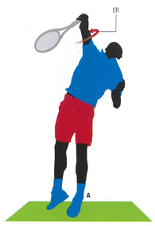
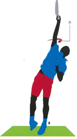

# Men\'s Versus Women\'s Serving: What is the Role of Internal Rotation?

### Bruce Elliott and Machar Reid

------------------------------------------------------------------------

{width="3.3333333333333335in"
height="2.5in"}

**Could differences in internal rotation of the shoulder help account
for the 20 percent difference in the speed of men\'s versus women\'s
serves?**

If we compare the highest service speeds of top players in men\'s and
women\'s professional tennis, the speed of the female serve is on
average approximately 80% that of the male serve.

Milos Raonic, for example, has been recorded at 155 mph and Serena
Williams at 129 mph. Sam Groth has hit the fastest the fastest serve on
record on the ATP tour at 163mph. Venus Williams has the fastest
recorded WTA serve at 130 mph.

Are these differences due purely to strength and physical size, or does
technique also play a role?

There are obvious physical differences between men and women, but one
movement clearly differentiates male from female players where service
speed is concerned. This is shoulder internal rotation. ([Click
Here](../../Stroke%20Analysis/Biomechanics/Internal%20Shoulder%20Rotation%20-%20Key%20to%20serving%20power.docx)
for additional explanation of this critical movement.)

Research shows that internal shoulder rotation is the largest
contributor (approximately 40%) to the generation of racket velocity at
impact in the male high performance serve.

There is also comparative data suggesting the speed of this rotation
accounts for the differences in the serves between men and women.

{width="3.3333333333333335in"
height="2.5in"}

**Internal shoulder rotation: watch the upper arm rotate in the shoulder
joint.**

If you compare the internal rotation velocity of male professional
players analyzed at the Sydney Olympics\' with that of an analysis of
Australian female professionals, the speed of the rotation for females
is almost 20 percent less.

The actual number is 83% of the males\' values. Interestingly this
difference is about the same as the differences in ball speed.

While it is too simplistic to say that this is the sole cause of the
serve velocity differential, it is a revealing comparison that should be
a consideration for female players wanting to increase their service
velocity.

(For an article by John Yandell that experimented with increased
internal shoulder rotation in a high level female ITF player and the
effect this had on ball velocity, [Click
Here](https://www.tennisplayer.net/members/your_strokes/2017/ingrid_neel_serve/).)

So what is internal shoulder rotation exactly? It must first be set up
by the rotation of the arm in the shoulder joint in the opposite
direction.

The arm must externally rotate (ER) during the backswing to put the
muscles of the shoulder (the internal rotators) on stretch. This then
positions the racket for acceleration to impact.

Internal rotation (IR) occurs during the forward swing to impact.
Internal rotation then continues into the follow-through. This is the
motion that most assists the generation of racket speed at impact.

{width="2.1268657042869643in"
height="3.1084951881014873in"}{width="1.716418416447944in"
height="3.0960706474190727in"}{width="2.2238801399825023in"
height="3.04714457567804in"}

**The backward external rotation of the arm in the opposite direction in
the backswing sets up the forward internal rotation of the arm to the
contact and out into the follow-through.**

Coaches and young players alike must be careful to choose when they
emphasize the importance of internal rotation in the service action. For
example, research has observed that increases in internal rotation
velocity occur primarily after puberty.

Therefore, it is possible that young players should attend to other
aspects of the service action and lay the foundations for appropriate
internal rotation velocity development prior to puberty, so that they
can most effectively use this aspect of the serve when they mature.

{width="1.5597222222222222in"
height="1.9777777777777779in"}

Machar Reid is the innovation catalyst at Tennis Australia. He
established the Sports Science and Medicine Unit there in 2008. He is
the coauthor of several books on tennis sports science and coaching.

{width="1.5597222222222222in"
height="1.9625in"}

Bruce Elliott is a senior research fellow in biomechanics at the
University of Western Australia. He is the author of the Power Serve
articles on Tennisplayer [(Click
Here)](http://www.tennisplayer.net/members/biomechanics/bruce_elliot/BE_Power_Serve_P1/BE_Power_Serve_Part1.pg1.html)
as well as numerous other articles and books on sports biomechanics.
