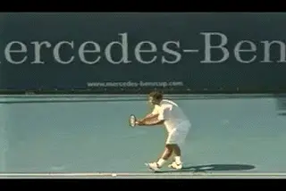

# Andy Roddick: The New Serving Model?

# Part 1

# John Yandell 

# 

# An inevitable transition: from Pete to Andy?

It's inevitable. When a player reaches the top of the pro game, players
and coaches begin talking about his or her strokes differently. Slowly
but surely the references to the dominant players of the previous
generation fade away.

When it comes to the serve, we are going through one of these
transitions, from the glorification of Pete Sampras to the glorification
of Andy Roddick. It's analogous to what happened when Sampras displaced
John McEnroe fifteen years ago.

I see the transition when I talk with junior coaches. Up until last
year, most coaches still wanted to study Pete. The Advanced Tennis high
speed video of Pete and the talks I did about his motion at coaching
conventions were phenomenally popular. I also did dozens of side by side
filming comparisons using Pete as a model for competitive junior and
club players. The impact of his unbelievable clutch serving and his
gorgeous, fluid motion lingered well after his retirement. ([link](http://www.tennisplayer.net/public/tour_strokes/tour_strokes_sample.html)
to see the series on his Sampras motion.)

Click Photo to study Andy's motion for yourself in high speed video.

But in the last year the conversation has shifted. Now these same
coaches are asking me for high speed footage of Roddick. No one talks
directly about this shift. It's more subtle than that. It's just
become part of the atmosphere. When coaches discuss serving technique
they say things like \"Andy does this\" or \"Andy does that\" as the
reference points in their arguments.

It wasn't like that when Andy was coming up. It fact, it was the
opposite. Many if not most coaches and \"expert\" commentators said that
Andy's motion, in particular that distinctive, super abbreviated
windup, was dangerous and unsound. The conventional wisdom was that
Roddick was going to tear up his shoulder and ruin his career.

One exception was Rick Macci, a coach who actually worked with Andy.
Rick helped him develop his serving fundamentals when he was around 11
years old. ([link](http://www.tennisplayer.net/members/tour_strokes/rick_macci/rick_macci_andy_roddick_serve_images/rick_macci_andy_roddick_serve.html)
to read his analysis of Roddick's serve development.) In his article,
Rick turns the argument about Roddick's \"dangerous\" motion on its
head. He believes that the problem was never with Andy's serve.

**Dangerous and unsound or a breakthrough?**

The problem was with the so-called experts who didn't know what they
were seeing. \"Experts\" fear what they don't understand. And Andy's
motion was definitely different. Rather than really try to understand
what was happening, the predominant response was to assume there must be
something wrong with Andy's motion and dismiss it as dangerous.

All that started to change when Andy got to number one in the world and
won the U.S. Open. Suddenly Andy's serve didn't look quite so weird.
Junior players started trying to emulate Andy's abbreviated windup. A
poll showed that over 50% of adult club players wanted to copy Andy's
motion! And, across the country, coaches who had criticized him
vehemently began telling their students they had the secret to hitting
the150mph bomb, just like Andy.

I had an experience like that with a friend of mine who is a top junior
coach in Northern California. He introduced me at a presentation I was
giving to coaches and players that included some high speed video of
Roddick's serve. As part of his introduction, he gave an impassioned
warning about the dangers of copying Roddick's motion.

**Conventional wisdom started to change when Andy won the U.S. Open.**

But after the presentation, he called me and got the Roddick DVD footage
(www.AdvancedTennis.com). A week later he called again to say that one
of the elements I'd identified in Roddick's was a \"jewel,\" and that
a college player he coached had tried it and suddenly made a big jump in
his serving velocity. (More on what that \"jewel\" was later on.) That
kind of transition from critic to advocate is common in junior coaching,
because it's all about referencing the top players. And now the move
from Pete's serve to Andy's serve is approaching a landslide.

**What's the Reality?**

But let's go back to the original question, and ask what is really
happening in Andy's motion. Are there actually valid reasons why
coaches should be looking at him as the new model? How does Roddick's
serve actually stack up technically compared with Pete?

**Velocity and spin: the marks of a heavy serve.**

In the series on Pete's serve, we saw that Sampras had a unique
combination of ball speed and ball spin that probably made his serve
\"heavier\" than other players of his generation. We found that there
were players that served as fast or faster than Pete. We found players
who served with as much spin or more spin. But we didn't find many
players serving as fast as Pete with as much spin. His first serve
averaged about 118mph with total spin of about 2500rpm. You can see the
detailed results of that study in the new article about the heavy ball
in this issue. 

Then Andy came along. Last year at Indian Wells we had the opportunity
to do high speed filming of his spin rates. This allowed us to compare
Andy and Pete quantitatively. The results were surprising. My hunch was
that Andy was hitting the ball harder but flatter. But the numbers
showed something else. Andy was definitely hitting the ball
significantly harder, but at the same time he was actually generating
virtually the same amount of spin as Pete. Roddick, it appeared, was
taking the \"heavy ball\" to a new level.

**As much spin as Pete\--and a lot more speed.**

On over a dozen serves we measured, Andy averaged about 130mph with a
spin rate of 2400rpm. That compares to Sampras at 118mph and 2500rpm. It
appears then that Andy is transferring more total energy to the ball. To
do this, Roddick must also be generating more racket head speed. But the
question is: how? Does this racket head speed relate to his motion? Is
it just his raw physical ability? Is his abbreviated wind up the key? Or
is it also something else about the technical shape of the motion itself
that may actually be different than the other top players?

Normally I'm leery when people say \"I have the Gustavo Kuerten
forehand,\" or \"Can you teach me the Tommy Haas backhand?\" or \"\"I
want the Andy Roddick serve,\" as if the signature strokes of certain
players were somehow technically unique. The core elements in good
stroke production are usually very similar from player to player. The
problem is that these commonalities aren't always obvious to the naked
eye. In the effort to find the secret of some pro player's stroke,
lower level players end up copying the individual idiosyncrasies\--and
unfortunately\--frequently exaggerating them. This is usually at the
expense of the underlying fundamentals.

But you know what? Roddick may be the exception. When we look at Andy's
motion in high speed video, there are significant differences in the
biomechanics of his motion, compared to other top servers. These
technical differences may help to account for his supersonic delivery,
and his ability to combine new levels of ball speed with heavy spin.
Whether other players should copy these elements or not\--well, that is
another question. We'll address that at the end.

**What technical elements make Andy's motion unique?**

Let's take a look at his serve from the ground up and in particular, at
three factors. The first is his serving stance and the related leg
action as he goes upward to the ball. The second is his body turn.
Ththird is his swing path. This is where we get to the invisible part.

We can see that Roddick has a different wind up, that much is obvious.
What the high speed video shows is that Roddick also has a different
swing path upward to the ball. This variation in the racket path would
be difficult if not impossible with a conventional windup. For all the
talk about Roddick's motion pro and con, these differences have gone
completely unrecognized by coaches and commentators. This is because
they happen so fast. they are literally invisible to the human eye. They
are too fast for TV cameras and other standard speed video as well. It
takes a much higher frame rate to see them. But the differences
magically appear when you look at his motion at 250 frames per second.

The video also reveals that the overall timing of his motion is
different than other top players. These differences are all interrelated
and part of a new biomechanical synthesis. When we look at them together
we can see his racket head speed as it develops literally frame by
frame.

**Stance and Legs**

**Andy's unique stance, weight distribution, and leg drive.**

Let's start by taking a look at Roddick's stance, and let's see how
this is related to the use of his legs. Unlike the supersonic movement
of his hand and racket around the contact, these elements aren't
invisible\--but you do have to look closely to see them with the naked
eye. All the top players have some differences in their stances, many of
which are idiosyncratic or ritualistic and/or irrelevant to the actual
biomechanics of their motions. But with Roddick his narrow starting
stance makes a difference in the way he uses his legs in the serve.

Roddick starts with both feet almost parallel to the baseline, with the
front toe at a slight angle. What makes this different is that the feet
are only a few inches apart. The back, right foot is also offset behind
about 6 inches to his left. It appears that the tip of the toe of his
back foot is roughly lined up with the middle of his front ankle. I
don't think we've filmed another player with a similar stance. But
what is more unusual is what happens to this stance as the motion
starts.

**Is the small step back a matter of style, or?**

At the start of the motion Roddick does something I've never seen in a
high level player\--moves the front foot **backwards**, narrowing the
stance even further. Just as the knees are starting to bend he picks up
his front foot off the court and actually steps back probably 2 or 3
inches. At the same time he turns the heel slightly backward on an
angle. The heel of his front foot is now no more than a couple of inches
from touching his rear shoe. Maybe you've noticed this movement
watching Andy play. But when you see it for the first time, especially
on video, it looks bizarre.

But that's not all that is different in his stance. As Roddick moves
the front foot back, his rear knee comes forward so that his weight
shifts more forward onto the toes of his rear foot. Then he reverses
course. He knee actually moves back the other way, so that his weight
shifts backwards again. The result is that his weight is much more on
the ball of his rear foot. He completes this shift just as both knees
reach the point of maximum bend.

**Roddick shfits his weight to the back foot at the maximum knee bend.**

What's the effect? The distribution of his weight in the narrow stance
makes it possible for Roddick to push off with both feet. He gets a very
deep knee bend, probably equal to any player, including Sampras. And
this knee bend combined with the push from both feet give him tremendous
leg drive. Unlike most players, he takes advantage of that deep knee
bend in both legs. (Interestingly, another player who does this appears
to be Maria Sharapova.)

**Leg Drive and the Stances**

There has been a lot of discussion, in tennis coaching and also in the
Forum on TPA, about the role of the stance in creating leg
drive. Check out Bruce Elliot's great article on the Power Serve
([link](http://www.tennisplayer.net/members/biomechanics/bruce_elliot/BE_Power_Serve_P1/BE_Power_Serve_Part1.pg1.html)),
in which he finds pluses and minuses to both stances. You can also
compare it to my article in the Advanced Tennis section for an argument
that the platform stance is superior.([link](http://www.tennisplayer.net/members/tour_strokes/john_yandell/sampras_serve/sampras_serve_footwork_images/sampras_serve_footwork.html)).

**Rusedski comes up on his back toes before leaving the court.**

Obviously, there have been (and will be) great servers using both
stances. But one of the main claims about the advantages of the pinpoint
doesn't hold up if we scrutinize the high speed video carefully. This
argument is that players with the pinpoint stance automatically push
with both feet and therefore get higher off the court and further
upwards to the ball.

It's commonly believed, but it's not true. The video shows that the
majority of pinpoint players don't really push off the back foot, or at
best they get a minimal additional push. Some pinpoint servers like Greg
Rusedski slide the back foot up until they are standing on their tip
toes. This makes it very difficult to push with the back foot. Try it
yourself. Stand up on your tip toes and try to jump up and maximize your
vertical leap. It's hard to get very far up in the air off your toes.

**The feet of many \"pinpoint\" players like Phillippoussis, leave the
court at different times.**

Other pinpoint servers like Mark Philippoussis don't come up on the
back toes, but if you look at the timing of when the feet leave the
court, you can see that they back foot isn't really pushing. This is
because the back foot leaves the court well before the front foot. If
you really were pushing with any force with the back foot, it would lift
your whole body up off the court-. Your feet would leave the court at
the same time.

Try it for yourself. Stand up and just push up hard off the balls of
your backfoot. You can't keep the front foot on the court, even if you
try. But the pinpoint players don't do that. They leave with the back
foot first with the front foot still down. What really happens is that
the back foot gets pulled along by the action of the front foot and the
front leg.(See the Myth of the Pinpoint Stance

[link](http://www.tennisplayer.net/members/avancedtennis/john_yandell/the_myth/the_myth_of_the_pinpoint_stance_images/the_myth_of_the_pinpoint_stance.html)

The leg drive for both the platform and the traditional pinpoint players
comes mainly from the front foot. But Roddick appears to be the
exception. The video shows that Roddick actually does push off with both
legs. In fact the push from the rear leg appears to about the same as
the push from the front leg, or just slightly less. Roddick doesn't
stand up on his back toes. He pushes off with the balls of his back
foot, the way the way the other players push with their front foot. His
feet leave the court at almost exactly the same point in time.

**His leg drive comes from the narrow stance, a deep knee bend and the
push off from the balls of both feet.**

For Roddick this push with both feet is possible because of the narrow
stance. Again, try it yourself right now. Stand up and narrow up your
stance like Roddick. Push off upward and to the left. You'll feel it.
With the narrow stance you can actually get a good push from the back
feet. You'll feel that your feet leave the court at the same time.

Once we understand how Roddick is pushing, we get a possible clue why he
picks up the front foot and moves it back. It's probably related to
finding just the right spacing for that narrow stance. In addition to
giving him a better base to push from, it's also conceivable that
picking up the foot and then putting it down actually increases the
loading in the muscles compared to the equivalent stationary position
(as suggested to me by Scott Riewald, the head of sports science at USA
Tennis High Performance.)

However it works, there is no doubt that Roddick gets massive leg drive.
If you look at how high Andy gets in the air, and how far he hands
inside the court, he's at the top or near the top in both dimensions
compared to the other top servers.

**Roddick gets as far into the air\--and into the court\--as any
player.**

**The Role of Body Rotation**

When it comes to another major factor in the service motion, however,
Andy's stance appears to be a limiting factor. This is body rotation\--
the turn away from the ball in the windup and then the rotation of the
body back the other way into the contact. Andy does have a discernable
body turn, but it's nowhere near as much as Sampras or even Roger
Federer.

This is due to the positioning of his feet in the stance. The narrow
stance makes it impossible. Sampras and Federer are probably the two
players with the greatest amount of body rotation. They both start with
much more of an offset between the back and the front foot, and then
turn away from the ball on the line of this stance. (To see my Sampras
stance article, [link](http://www.tennisplayer.net/members/tour_strokes/john_yandell/sampras_serve/sampras_serve_footwork_images/sampras_serve_footwork.html).)
This gives them both more rotation forward into the hit.

**The wider, more offset stance leads to more body rotation.**

But this rotational pattern away from and back to the ball takes time.
The rhythm of Andy's serve is way to fast for that. This is due to his
relatively low toss and fast windup. If we count the frames in the high
speed video, it takes Andy less than a second to reach his maximum turn
position away from the ball. By comparison it takes Sampras about 1 and
1/2 seconds. From the turn it takes Pete another second to rotate back
the other way and reach the contact. Andy goes from his turn position to
the contact in two thirds of that.

Because he does have some off set between his feet in his stance,
Roddick is able to create some body turn. This has got to be an overall
positive factor in his motion. He actually turns more than many other
pro players, even players with slower motions and wider starting
stances. It's just not nearly as much as the more extreme platform
players. It appears that this is the tradeoff he makes for being able to
push off with both feet, and it's not possible to have it both ways.

**Even with the narrow stance, Andy gets a significant turn.**

John Yandell is widely acknowledged as one of the leading videographers
and students of the modern game of professional tennis. His high speed
filming for Advanced Tennis and TPA have provided new visual
resources that have changed the way the game is studied and understood
by both players and coaches. He has done personal video analysis for
hundreds of high level competitive players, including Justine
Henin-Hardenne, Taylor Dent and John McEnroe, among others.

In addition to his role as Editor of TPA he is the author of
the critically acclaimed book Visual Tennis. The John Yandell Tennis
School is located in San Francisco, California.
