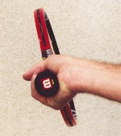
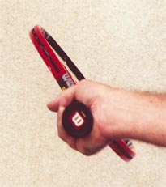

# Building the Modern Forehand-Racket Face Angle

**Building the Modern Forehand:**

**Racket Face Angle**

**John Yandell**

In understanding the differences in the modern forehand across the grip
styles, the first factor to examine is the angle of the racket face at
the start of the forward swing to the ball.

In a previous article, we've already looked closely at certain elements
in the hitting arm position at the bottom of the backswing. [(Click here
for Part 1)](Common%20Elements%20Across%20the%20Grip%20Styles.docx)
We've seen that every player falls into a characteristic hitting arm
position with the elbow in and the wrist laid back.

  -----------------------------------------------------------------------------------------------------------------------------------------------------------------------------------------------------------------------------------------------------------------------------------------------------------------------------------------------------------------------------------------------------------------
                                                                 
  -------------------------------------------------------------------------------------------------------------------------------------------------------------------------------------------------------- --------------------------------------------------------------------------------------------------------------------------------------------------------------------------------------------------------
                                                              **With classic grips the racket face stays on edge, or may be slightly closed.**                                                             **     As the grip moves underneath the handle the racket face closes naturally.**

  -----------------------------------------------------------------------------------------------------------------------------------------------------------------------------------------------------------------------------------------------------------------------------------------------------------------------------------------------------------------------------------------------------------------

  -------------------------------------------------------------------------------------------------------------------------------------------------------------------------------------------------------
                                                                 
  -------------------------------------------------------------------------------------------------------------------------------------------------------------------------------------------------------
                                                              **With a extreme semi-western grip the racket angle can approach 60 degrees.**

  -------------------------------------------------------------------------------------------------------------------------------------------------------------------------------------------------------

We've also seen that the racket height is a natural function of this
position, and that when top players set up the hitting arm position the
racket head itself is typically only a few inches below the level of the
ball.

But if you've looked closely at the footage in these articles, you may
have also noticed that this doesn't mean that the racket face is at the
exact same angle for all the players as the racket starts forward.

**[Some players have the racket on edge, others have the face closed
slightly, others have it more closed still. This is the first critical
difference in the grip styles. The more extreme the grip, the more
closed the face at the start of the forward swing.]**

This position needs to be carefully distinguished from what happens to
the racket face over the course of the backswing. Players with very
different grip styles may or may not close the face at some point in the
backswing phase. ***[But the face is completely closed when the racket
reaches the end of the backswing and starts forward to the
ball.]***

**Sampras closes the face early in the backswing, but finds the hitting
arm position before starting forward to the ball.**

Sampras with a modern eastern grip actually points the racket face flat
at the court during the early phase of his backswing. But at the start
of the foreswing, the racket face is vertical-perpendicular to the
court, or just slightly closed.

Andy Roddick sometimes turns the racket face completely down facing the
court toward the end of his backswing, much later than Pete. But this
changes by the start of the forward swing. Just before he starts forward
to the ball, his racket face finds an angle somewhere between 45 and 60
degrees. This is about the same as other players with extreme grips like
or Guga or Lleyton Hewitt.

It's important to understand that\--whatever they do in the
backswing\--none of these players is consciously \"closing\" the face by
turning the palm downward at the start of the forward swing.

In fact, this would be impossible to do this without destroying the
hitting arm position. Try it yourself and you'll find that you can't
turn the palm all the way down to close the face and at the same time
keep the double bend position in the hitting arm-your arm and shoulder
don't move that way.

**Roddick closes the face on the backswing, but finds the correct racket
angle at start of the forward swing.**

The reality is that as the grip rotates so the hand is more and more
underneath, the racket face naturally closes at the start of the
foreswing. If the hitting arm position is correct, the angle of the
racket face will automatically be correct as well.

The 3 photo sequence below shows how this works. In the three photos,
the hitting arm position is the same. The wrist is laid back and the
elbow tucked in toward the waist. The only difference is the grip. As
the hand rotates under the handle from a more classic to a more extreme
grip position, the angle of the face changes in direct proportion to the
grip.

On the left, the modern eastern grip places the racket face is on edge.
In the center photo, the only change is the rotation of the hand
slightly underneath the handle to a mild semi-western, similar to
Agassi.

|  |  |  |
|  |  |  |
|  |  |  |
| **The hitting arm position stays the same, but as the racket rotates the grip becomes more extreme and the angle of the racket face naturally closes.** |  |  |

In the third photo the grip has rotated further to the extreme
semi-western of players like Roddick Hewitt, and Guga. The result is
that the face closes another increment.

**Even heavy topspin players rarely drop the racket face more than a few
inches below the ball.**

This is why the advice to deliberately close the face by turning the
palm down has such a negative impact. Players have to straighten their
arms out. Then they have to try to recover the correct hitting arm
position. Since this all happens in micro seconds, it decreases the
chances of the racket and hand being positioned correctly at contact. At
best, it's wasted motion. More than likely, it actually slows down the
racket head.

The correct hitting arm position automatically takes care of the height
of the racket as well as the angle of the face, placing it at most a few
inches below the level of the ball. So the key point is, let the racket
face find it's natural position\--concentrate on setting up the hitting
arm at the bottom of the backswing no matter what your grip style.

Next we'll look at the second factor, how the amount and the timing of
shoulder rotation varies across the range of forehand grips in the
modern game.

John Yandell is widely acknowledged as one of the leading videographers
and students of the modern game of professional tennis. His high speed
filming for Advanced Tennis and TPA have provided new visual
resources that have changed the way the game is studied and understood
by both players and coaches. He has done personal video analysis for
hundreds of high level competitive players, including Justine
Henin-Hardenne, Taylor Dent and John McEnroe, among others.

In addition to his role as Editor of TPA he is the author of
the critically acclaimed book Visual Tennis. The John Yandell Tennis
School is located in San Francisco, California.
