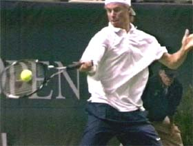
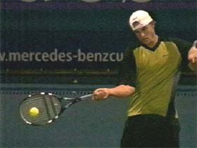

# Building the Modern Forehand-Shoulder Rotation

**Building the Modern Forehand:**

**Shoulder Rotation**

**John Yandell**

In the last article we took a close look at how the grip affects the
angle of the racket face on the forward swing in the modern forehand. In
this article we\'ll move on to the second critical factor, shoulder
rotation and how it varies depending on grip style.

The second factor to we need to understand across the grip styles is
shoulder rotation. In the first article in this series, we saw that that
one commonality across all the grips was how far the top players turned
their shoulders in the preparation phase. [(Click here for Part
1)](Common%20Elements%20Across%20the%20Grip%20Styles.docx) Virtually
every top pro turns until his shoulders are slightly more than square to
the baseline and the net, or a little more than 90 degrees.

+-------------------------------------------------------------------------------------------------------------------------------------------------------------------------------------------------------+------------------------------------------------------------------------------------------------------------------------------------------------------------------------------------------------------+
| {width="3.888888888888889in" | generated](media_building-the-modern-forehand-shoulder-rotation/media/image2.jpg){width="3.888888888888889in" |
| height="2.9583333333333335in"}                                                                                                                                                                        | height="3.0in"}                                                                                                                                                                                      |
+=======================================================================================================================================================================================================+======================================================================================================================================================================================================+
| {width="3.888888888888889in" | generated](media_building-the-modern-forehand-shoulder-rotation/media/image4.jpg){width="3.888888888888889in" |
| height="2.9722222222222223in"}                                                                                                                                                                        | height="2.9305555555555554in"}                                                                                                                                                                       |
+-------------------------------------------------------------------------------------------------------------------------------------------------------------------------------------------------------+------------------------------------------------------------------------------------------------------------------------------------------------------------------------------------------------------+
| **The shoulder turn is a key commonality we identified across the grip styles.**                                                                                                                                                                                                                                                                                                                             |
+--------------------------------------------------------------------------------------------------------------------------------------------------------------------------------------------------------------------------------------------------------------------------------------------------------------------------------------------------------------------------------------------------------------+

The shoulders may be same angle at the completion of the turn for all
the grips, but this changes in the forward swing. The total amount of
rotation and the position of the shoulders at the contact and at the
finish differ significantly as the grips become more extreme.

Basically, the more extreme the grip, the more total shoulder rotation.
If we look at great pro players with a variety of grip styles, we can
see a virtual straight line continuum from Pete Sampras to Andre Agassi
to Andy Roddick.

+--------------------------------------------------------------------------------------------------------------------------------------------------------------------------------------------------------+--------------------------------------------------------------------------------------------------------------------------------------------------------------------------------------------+-------------------------------------------------------------------------------------------------------------------------------------------------------------------------------------------------------+
| ![A person playing tennis Description automatically generated with medium                                                                                                                              | {width="2.3896325459317587in" | confidence](media_building-the-modern-forehand-shoulder-rotation/media/image6.jpg){width="2.3125in" | confidence](media_building-the-modern-forehand-shoulder-rotation/media/image7.jpg){width="2.278701881014873in" |
| height="1.7951388888888888in"}                                                                                                                                                                         | height="1.7371948818897638in"}                                                                                                                                                             | height="1.7118055555555556in"}                                                                                                                                                                        |
+:======================================================================================================================================================================================================:+:==========================================================================================================================================================================================:+:=====================================================================================================================================================================================================:+
| **Pete turns about 90 degrees to the baseline. His forward rotation is the same, with the contact in the middle at about 45 degrees.**                                                                                                                                                                                                                                                                                                                                                                                                                                                                      |
+-------------------------------------------------------------------------------------------------------------------------------------------------------------------------------------------------------------------------------------------------------------------------------------------------------------------------------------------------------------------------------------------------------------------------------------------------------------------------------------------------------------------------------------------------------------------------------------------------------------+

With a modern eastern forehand like Sampras, the shoulders start
parallel to the baseline in the ready position. They turn sideways about
90 degrees or a little more in the preparation. They rotate back through
the hit that same amount, 90 degrees plus, to reach the finish. The
contact point is midway through this rotational pattern, with the
shoulders at about 45 degrees to the net, give or take.

This can vary a depending on the stance and the line of the shot,
sometimes Pete is more open with the shoulders, maybe about 30 degrees.
But the basic pattern holds. (It\'s exactly the same as when Robert
Lansdorp first trained him at age 8. [Click here to see the amazing
animation of Pete\'s forehand
then.](https://www.tennisplayer.net/members/avancedtennis/john_yandell/building%20_the_modern%20_forehand/key_differences_grip_styles/SmileyPete_FHFinish_1.mov))

+------------------------------------------------------------------------------------------------------------------------------------------------------------------------------------------------------+------------------------------------------------------------------------------------------------------------------------------------------------------------------------------------------------------+--------------------------------------------------------------------------------------------------------------------------------------------------------------------------------------------------------+
| ![A person hitting a ball with a tennis racket Description automatically                                                                                                                             | {width="2.354433508311461in" | generated](media_building-the-modern-forehand-shoulder-rotation/media/image9.jpg){width="2.354433508311461in" | generated](media_building-the-modern-forehand-shoulder-rotation/media/image10.jpg){width="2.3133683289588802in" |
| height="1.7916666666666667in"}                                                                                                                                                                       | height="1.7916666666666667in"}                                                                                                                                                                       | height="1.7604166666666667in"}                                                                                                                                                                         |
+:====================================================================================================================================================================================================:+:====================================================================================================================================================================================================:+:======================================================================================================================================================================================================:+
| **Agassi has slightly more total rotation than Pete, and his shoulders have rotated further forward at contact-about 30 degrees to the baseline.**                                                                                                                                                                                                                                                                                                                                                                                                                                                                   |
+----------------------------------------------------------------------------------------------------------------------------------------------------------------------------------------------------------------------------------------------------------------------------------------------------------------------------------------------------------------------------------------------------------------------------------------------------------------------------------------------------------------------------------------------------------------------------------------------------------------------+

If we look at a player with a mild semi-western grip like Agassi, we can
see that there is more rotation. His turn is the same as Pete\'s. But
Agassi\'s overall rotation is greater because he rotates further in his
forward swing.

+---------------------------------------------------------------------------------------------------------------------------------------------------------------------------------------------------------+----------------------------------------------------------------------------------------------------------------------------------------------------------------------------------------------+
| {width="3.4391229221347333in" | confidence](media_building-the-modern-forehand-shoulder-rotation/media/image12.jpg){width="3.40625in" |
| height="2.6284722222222223in"}                                                                                                                                                                          | height="2.5911832895888014in"}                                                                                                                                                               |
+:=======================================================================================================================================================================================================:+:============================================================================================================================================================================================:+
| **Guga and Hewitt at full shoulder rotation on the forehand finish.**                                                                                                                                                                                                                                                                                                                                  |
+--------------------------------------------------------------------------------------------------------------------------------------------------------------------------------------------------------------------------------------------------------------------------------------------------------------------------------------------------------------------------------------------------------+

Instead of ending with his shoulders parallel to the net, he continues
about another 30 degrees. His front shoulder finishes back across the
baseline, whereas Pete\'s stops roughly parallel to the baseline. So if
Pete\'s forward total forward rotation is around 90 degrees, Agassi\'s
is more like 120 degrees.

{width="3.3333333333333335in"
height="2.2291666666666665in"}

**With the extreme grips the forward shoulder rotation can reach 180\
degrees-double that of classical players.**

Agassi has slightly more forward rotation, but what is interesting is
that he still makes contact halfway through the total rotational
pattern. Pete makes contact at about 45 degrees to the baseline
Agassi\'s shoulders rotate a little further forward. He usually makes
contact with his shoulders about 30 degrees to the baseline. But the
contact point remains halfway through the forward rotational pattern.

Next on the continuum are players like Guga, Hewitt, and Andy Roddick.
Again their turns are similar to Pete\'s or Agassi\'s. But the
difference is they all have much more forward rotation.

Pete rotates forward a total of about 90 degrees. Agassi rotates about
120 degrees. The more extreme players rotate forward as much as 180
degrees in their basic forehands. At the end of the extreme forehand,
the back shoulder can come all the way around until it is literally
pointing forward to the net.

So as we go from a classic eastern to an extreme semi-western, the
shoulder rotation basically doubles. But what about the contact point?
In one important sense it\'s not different for the extreme grips. It\'s
still in the middle of the total rotational pattern.

+------------------------------------------------------------------------------------------------------------------------------------------------------------------------------------------------+------------------------------------------------------------------------------------------------------------------------------------------------------------------------------------------------+
| {width="3.256026902887139in" | {width="3.266851487314086in" |
| height="2.4652777777777777in"}                                                                                                                                                                 | height="2.4618055555555554in"}                                                                                                                                                                 |
+:==============================================================================================================================================================================================:+:==============================================================================================================================================================================================:+
| **Extreme players make contact with their shoulders parallel the baseline-the midpoint of their rotational pattern.**                                                                                                                                                                                                                                                                           |
+-------------------------------------------------------------------------------------------------------------------------------------------------------------------------------------------------------------------------------------------------------------------------------------------------------------------------------------------------------------------------------------------------+

This means that the contact point is with the shoulders \"open\" or
parallel to the baseline. This is the point where Pete\'s rotation
usually ends. Agassi still has another 30 degrees to go. But at contact
the shoulders of the extreme players still have as much as 90 degrees to
go. They all meet the ball half way around, it\'s just that the less
extreme players have less total rotation.

These differences in the rotational patterns across the grip styles have
lead to a lot of confusion in coaching and teaching. Extreme players are
often criticized for being over-rotated or too \"open,\" when actually
their positions are perfectly correct for their grip style.

{width="3.3333333333333335in"
height="2.2291666666666665in"}

**Guga demonstrates the extreme grip shoulder position at contact, at
the midpoint of the total body rotation.**

One writer on another instructional site, who also promotes a swiveling
training board, believes that there is some kind of cosmic, geometric
relationship between the angle of the shoulders and the \"correct\"
contact point on the forehand.

This magic angle is supposed to be with the shoulders 45degrees to the
baseline, regardless of grip. The problem is this is not an accurate
description of most players on the tour. A player like Sampras may fit,
but it\'s inaccurate to force this concept on other players with
different grips.

Unfortunately, he has to fudge the video to establish that the 45 angle
is \"universal.\" In one of his articles there\'s an image of Lleyton
Hewitt\'s forehand frozen a few frames before contact to demonstrate the
\"magic\" angle. The problem is he hasn\'t hit the ball. Run the same
video a few frames further and you\'ll see the correct \"open\" torso
contact position for the more extreme forehand grip.

  -------------------------------------------------------------------------------------------------------------------------------------------------------------------------------------------------
   {width="3.1354166666666665in"
                                                                                         height="2.3625in"}
  -------------------------------------------------------------------------------------------------------------------------------------------------------------------------------------------------
                                                       **Another look at Hewitt\'s contact point. Old beliefs about torso rotation die hard.**

  -------------------------------------------------------------------------------------------------------------------------------------------------------------------------------------------------

The fact is old beliefs and cherished theories die hard. And some
coaches will go to great lengths to defend them\--especially if these
beliefs are connected to a lot of product marketing hype.

But even experienced coaches with no commercial agenda to push sometimes
criticize modern players thinking they are opening and decimating their
power. In reality, understanding appropriate shoulder rotation\--as with
the racket face angle\--requires an understanding of how the grip
determines the key characteristics of the forward swing.

Next let\'s look at the third factor: hand and arm rotation, the most
complex and one of the most varied and confusing elements in the modern
forehand.

{width="1.8208333333333333in"
height="2.6493055555555554in"}

John Yandell is widely acknowledged as one of the leading videographers
and students of the modern game of professional tennis. His high speed
filming for Advanced Tennis and Tennisplayer have provided new visual
resources that have changed the way the game is studied and understood
by both players and coaches. He has done personal video analysis for
hundreds of high level competitive players, including Justine
Henin-Hardenne, Taylor Dent and John McEnroe, among others.

In addition to his role as Editor of Tennisplayer he is the author of
the critically acclaimed book Visual Tennis. The John Yandell Tennis
School is located in San Francisco, California.
