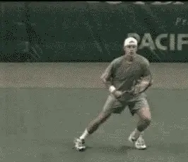

# Building the Modern Forehand-The Backswings

**Building the Modern Forehand:**

**The BackSwing**

**John Yandell**

In the first article on the [Modern
Forehand](Common%20Elements%20Across%20the%20Grip%20Styles.docx) we
examined the surprising technical commonalities across the grip styles.
These included the turn, the hitting arm position, the set up, and the
universal finish position.\
\
However we noted that besides these common elements, there were
significant technical differences in the forehands. So in future
articles, I'll examine the differences in the swing patterns across the
range of grips: from Pete Sampras, to Andre Agassi to Gustavo Kuerten,
and to Tommy Haas.

In this article, let's start with the surprising variety of shapes and
sizes of backswings. Then we'll look at the differences in the forward
swing, from the completion of the backswing through the end of the
stroke.

**Can we make any sense of the incredible diversity in pro backswings?**

**The Backswing**

Top players have many things in common on the forehand, regardless of
grip style, but the backswing isn't one of them. Take the racquet up and
back in a loop, drop it down, and swing, how complicated could it be? In
reality the backswing turns out to be the most complex and varied
element in the modern forehand.\
\
When we look closely at the high speed video, we see no two players look
alike. It's quite surprising. The closer we look, the more different
they appear. The players are all highly individualistic and have
bewildering combinations of shapes and sizes.

Some of the motions are much more elaborate than others. It turns out
there is no simple way to describe them. There are core commonalities
we'll identify, but also extensive differences. Really understanding it
all takes a surprising amount of time and effort.

  ----------------------------------------------------------------------------------------------------------------------------------------------------------------------------------------------------
                                                                      
  ----------------------------------------------------------------------------------------------------------------------------------------------------------------------------------------------------
                                                      **How important is the size and shape of the backswing in the pro forehand---and in yours?**

  ----------------------------------------------------------------------------------------------------------------------------------------------------------------------------------------------------

How significant are these differences from a technical point of view?
Obviously every player needs to develop a backswing. The question is
what should it look like? How important is the type of backswing to the
effectiveness of the stroke of the average player?\
\
Do some pro players have an advantage in terms of racquet head speed or
timing? Should players at other levels try to figure that out and copy
them? We might suppose that players with the more extreme grips have
larger backswings, but is it really true? What about backswing shapes?
Do the more complex shapes also pair with the extreme grips?\
\
In addition to the complexity of some of the motions, another problem is
that they happen so fast, they are impossible to see accurately with the
naked eye. It takes pro players less than a second to get from the start
of the motion to the contact.\
\
Amazingly we'll find there are no less than 6 factors that go into the
pro backswing, all of which can vary widely from one player to another.

### Six Components of the Pro Backswing

1.  The movement upward, or the height of the backswing

2.  The movement backward, or away from the body

3.  The side to side movement, both on the way up and the way down

4.  The closure of the racquet face in the upward motion

5.  The closure of the racquet face in the downward motion

6.  The timing in reaching the hitting arm position

It's been argued in the coaching community that the backswing is a
matter of personal style. That is certainly true. But it doesn't mean
the differences aren't worth exploring and understanding. This process
is the only way to shed light on decisions about size and shape that
coaches and players make everyday. And to find what if anything they all
do share.

**Backswing Size**

You might think that just looking at the backswings of different players
and evaluating the size of the swing would be one thing you could see
fairly easily with the naked eye. But it actually turns out to be quite
difficult and somewhat inconclusive to define, even analyzing the high
speed video.\
\
First of all, what actually determines the "size?\" Is it primarily the
height?\
\
In addition to moving upwards, the racquet also moves in two other
directions during the course of the motion: backward, and to a lesser
extent, from side to side. How does the movement in each of these three
dimensions contribute to backswing size?

Let's look first at "height." That sounds simple, but how do we measure
it? Do we look at the height of the racquet hand, or the height of the
racquet itself?

  -----------------------------------------------------------------------------------------------------------------------------------------------------------------------------------------------------
                                                               
  -----------------------------------------------------------------------------------------------------------------------------------------------------------------------------------------------------
                                                  **How do we measure backswing height: the height of the racquet or the height of the racquet hand?**

  -----------------------------------------------------------------------------------------------------------------------------------------------------------------------------------------------------

Looking at the racquet hand first, we see that Andy Roddick and Lleyton
Hewitt have the highest hand positions at the top of the motion. Both
players consistently raise their racquet hands above head level.\
\
But if we look at the other possible measure, the height of the racquet,
suddenly the two players look very different. Hewitt has a high hand
position. He also has the highest racquet position of any player, with
the tip usually reaching 2 feet or more above the top of his head at the
top of the backswing.

Roddick also has a high hand position. But, unlike Hewitt, he combines
this with a very low racquet tip position. In fact, Roddick has the
lowest racquet position of any player, with the tip at almost the same
level as his racquet hand.\
\
How can this be possible? How can Roddick have the highest hand position
and the lowest racquet tip position at the same time? What the video
shows is that racquet height and hand height are independent variables.

Rather than pointing straight upward like Hewitt, Roddick points the
racquet tip directly forward at the top of his motion, with the shaft of
his racquet literally parallel to the court! This puts the racquet at
virtually the same height as his racquet hand.\
\
The fact is that all of the players point the tip of the racquet in
slightly different or very different directions at the top of the
backswing.\
\
Just because a player has a high hand position, it doesn't mean his
racquet tip will be high as well. Conversely a player can have a fairly
low hand position, but the racquet tip can be quite high depending on
where it is pointing at the top of the motion.\
\
What this means when we look across the grip styles, is that every
player has his own unique combination of racquet and hand height.\
\
Tommy Haas, for example, has the lowest hand position by far, usually
between chest and shoulder level. But the top of the backswing, he
points his racquet tip at a backward angle, so that the tip is actually
higher than Roddick's, who has a much higher hand position.\
\
Guga also has a fairly low hand position, usually shoulder level or a
little higher. But Guga points his racquet roughly straight up at the
top of the backswing, making the tip of his racquet higher than Tommy's,
even though there's not a huge difference in the hand position.

| **Backswing height based on the hand: from lowest to highest** |  |  |  |
| --- | --- | --- | --- |
|  |  |  |  |
| 1\. Haas | 2\. Guga | 3\. Safin | 4\. Agassi |

|  |  |  |
| --- | --- | --- |
|  |  |  |
| **5. Pete** | **6. Roddick** | **7. Hewitt** |

Marat Safin has a hand position that appears slightly higher than Guga,
but has a lower racquet tip position. This is because at the top of his
backswing, he points the tip of his racquet forward.

Agassi and Sampras both have fairly high hand positions, at about eye
level or sometimes higher. But Pete's racquet tip reaches higher, since
it points more straight up and down. Agassi's racquet tip points forward
like Safin's and also tilts a little more to the side.

| **Backswing height based on the racquet: from lowest to highest** |  |  |  |
| --- | --- | --- | --- |
|  |  |  |  |
| **1. Roddick** | **2. Haas** | **3. Safin** | **4. Guga** |

|  |  |  |
| --- | --- | --- |
|  |  |  |
| **5. Agassi** | **6. Pete** | **7. Hewitt** |

###  

### Movement Backwards

So measuring backswing height by looking at the hand and racket tip, the
results are ambiguous at best. What about the second dimension in
overall backswing size\--how far the racquet moves back away from the
player toward the rear of the court?

Again we find there are variations from player to player that don't seem
to correlate at all with their grips or any other factor in their
backswings.

  -----------------------------------------------------------------------------------------------------------------------------------------------------------------------------------------------------
                                                                      
  -----------------------------------------------------------------------------------------------------------------------------------------------------------------------------------------------------
                                                  **The amount of movement backward doesn't seem to correlate to grip style or any technical element.**

  -----------------------------------------------------------------------------------------------------------------------------------------------------------------------------------------------------

Some players reach a point that is clearly further backwards than
others. And all the players seem to reach the point furthest behind
them---whatever it may be\--at slightly different times.

Just as at the top of the backswing, there are also significant
differences in the position and angle of the hand and the position and
angle of the racquet.\
\
At the furthest point in the backward movement, Agassi and Pete both
have their hands at about shoulder level or a little lower. They both
seem to straighten there arms out slightly more than most of the other
players. Both also point the tip of the racquet backwards and upwards at
a slight angle, with the face of the racquet slightly closed.\
\
Haas looks very similar to Agassi and Pete in terms of height and
direction the racquet points. He may straighten out his arm slightly
more and reach further backwards. His racquet face is also closed much
further than Pete or Andre.\
\
At the furthest point behind him, Hewitt's racquet hand is usually still
above shoulder level, with the tip of the racquet pointing backward at
about 45 degrees, but also pointing at an angle behind him to his left,
so that a big part of his racket is actually behind his body when viewed
from the front. Sometimes Hewitt straightens his arm out completely,
even more than Pete or Agassi, but most times it remains bent at the
elbow at about 30 degrees or more.

| **Movement backwards in the backswing: from least to most** |  |  |  |
| --- | --- | --- | --- |
|  |  |  |  |
| **1. Roddick** | **2. Safin** | **3. Guga** | **4. Hewitt** |

|  |  |  |
| --- | --- | --- |
|  |  |  |
| **5. Pete** | **6. Agassi** | **7. Haas** |

Guga's racquet hand is much lower than Hewitt's, about midway between
the shoulders and the waist. But like Hewitt, his racquet tip also
points at an angle behind him and to his left.\
\
Safin and Roddick are at about the same hand height as Guga. Unlike
Guga, however, they both point the tip of the racquet to their right
side, rather than to the left. Roddick points his slightly further to
the right than Marat.\
\
Confused yet? Just wait until we examine the sideways component of the
movement.

### Sideways Movement 

The movement from side to side in the backswing is much less than the
movement upwards or backwards. This makes it even harder to follow.

  -----------------------------------------------------------------------------------------------------------------------------------------------------------------------------------------------------
                                                                      
  -----------------------------------------------------------------------------------------------------------------------------------------------------------------------------------------------------
                                    **Side to side movement is the third dimension. How much does a player move his racquet out to his right, and back to his left?**

  -----------------------------------------------------------------------------------------------------------------------------------------------------------------------------------------------------

It's also related to whether or not the player closes the racquet face,
and, if so, how much.\
\
Typically, the less the player closes the face, the more he moves the
racquet to his right at the start of the backswing. And the more he
moves it to the right at the start of the backswing, the more he tends
to move it back to the left as well.\
\
Conversely, the more the player closes the face, the less he tends to
move his racquet to the right at the start of the motion, and the less
movement back to the left thereafter. The only exception appears to be
Marat Safin (more on that below).

Haas keeps his racquet literally on edge, and moves his racquet head the
furthest to the right at the start of his backswing, around two feet as
the motion starts upward. He then moves the racquet back to the left to
get to top of the motion, and continues this motion to his left as he
starts down.

Roddick and Pete on the other hand have minimal movement of the racquet
head to the right, and minimal movement back the other way.\
\
The rest of the players are in between the extremes, with some motion to
the right and some motion back to their left.

### Sideways movement in the backswing: from least to most 

  -------------------------------------------------------------------------------------------------------------------------------------------------------------------------------------------------------------------------------------------------------------------------------------------------------------------------------------------------------------------------------------------------------------------------------------------------------------------------------------------------------------------------------------------------------------------------------------------------------------------------------------------------------------------------------------------------------------------------------------------------------------------------------------------------------------------------
                                                                   ![A person playing golf Description automatically generated with low                                                                                                                                           
  ------------------------------------------------------------------------------------------------------------------------------------------------------------------------------------------------------ ----------------------------------------------------------------------------------------------------------------------------------------------------------------------------------------------------- ------------------------------------------------------------------------------------------------------------------------------------------------------------------------------------------------------ -----------------------------------------------------------------------------------------------------------------------------------------------------------------------------------------------------
                                                                                              **1. Roddick**                                                                                                                                                                                          **2. Pete**                                                                                                                                                                                           **3. Guga**                                                                                                                                                                                           **4. Hewitt**

  -------------------------------------------------------------------------------------------------------------------------------------------------------------------------------------------------------------------------------------------------------------------------------------------------------------------------------------------------------------------------------------------------------------------------------------------------------------------------------------------------------------------------------------------------------------------------------------------------------------------------------------------------------------------------------------------------------------------------------------------------------------------------------------------------------------------------

 

  ------------------------------------------------------------------------------------------------------------------------------------------------------------------------------------------------------------------------------------------------------------------------------------------------------------------------------------------------------------------------------------------------------------------------------------------------------------------------------------------------------------------------------------------------------------------------------------------------------------------
                                                                      
  ----------------------------------------------------------------------------------------------------------------------------------------------------------------------------------------------------- ------------------------------------------------------------------------------------------------------------------------------------------------------------------------------------------------------ -----------------------------------------------------------------------------------------------------------------------------------------------------------------------------------------------------
                                                                                              **5. Safin**                                                                                                                                                                                          **6. Agassi**                                                                                                                                                                                           **7. Haas**

  ------------------------------------------------------------------------------------------------------------------------------------------------------------------------------------------------------------------------------------------------------------------------------------------------------------------------------------------------------------------------------------------------------------------------------------------------------------------------------------------------------------------------------------------------------------------------------------------------------------------

Agassi and Hewitt close the face partially, and still have substantial
sideways motion, but noticeably less than Haas. Safin is the exception,
closing the face as far as Guga and Roddick, but with about the same
sideways movement as Agassi and Hewitt.\
\
Pete Sampras turns the face all the way down and has less sideways
movement than possibly anyone but Roddick. But in looking at the
sideways component, we once again have to distinguish between how far
the hand moves and where the hand and the racquet point.\
\
Although Pete has little sideways hand movement his racquet tip actually
reaches farther to the right because he is also pointing his hand to the
side. This is the same for Roddick at the bottom of his backswing. As
his racquet drops, it will end up pointing farther than anyone but Pete.
It's just another one of the complex differences among the players.

  ------------------------------------------------------------------------------------------------------------------------------------------------------------------------------------------
                                                                 
  ------------------------------------------------------------------------------------------------------------------------------------------------------------------------------------------
                                                            **Watch Roddick, Guga and Safin turn the racquet over on the way up.**

  ------------------------------------------------------------------------------------------------------------------------------------------------------------------------------------------

Again all these factors vary independently of grip, so there seems to be
no simple explanation of the differences between the players in our
first three factors.

### Racquet Rotation 

**[This brings us to the fourth issue, how much the racquet rotates or
\"closes\" during the start of backswing. This is different from the
closed face position near the end of the backswing, which we'll look at
below.\
\
When the players \"close\" the racquet face during this beginning phase,
they are actually rotating the racquet face downward or
counterclockwise, from their right to their left. Some players, like
Agassi, close the face only partially. Other players like Pete and
Hewitt go further, rotating the face until it is pointing straight down
at the court. This is typically considered fully \"closed.\"]\**
\
But some players go further than the so-called closed position. Safin,
Guga and Roddick all continue turning the face over in the
counterclockwise direction another 90 degrees, until the racquet edge is
again straight up and down. They literally turn the racquet face upside
down.

Even on the high speed video, this turning motion is hard to see,
because as it is happening, the players are also moving the racquet head
upward. But you can follow it if you focus on the edge of the frame.

Watch the racquet continue to turn past what we think of as the totally
closed position. As the racquet gets to the top of the backswing, the
left edge of the frame is pointing more or less at the net.

  -------------------------------------------------------------------------------------------------------------------------------------------------------------------------------------------
                                                           
  -------------------------------------------------------------------------------------------------------------------------------------------------------------------------------------------
                                                  **Guga and Roddick have the least left to right movement on the way up and the way down.**

  -------------------------------------------------------------------------------------------------------------------------------------------------------------------------------------------

Does this extra rotation affect the shape of the backswing? The answer
is it can reduce the amount of movement in the left to right dimension,
although this isn't true for all three players.\
\
Safin turns the racquet over all the way, but he also moves it to the
right on the way up, similar to Agassi. This means he also moves the
racquet back to his left to reach the top of his motion. He also
continues this motion to his left as he starts the racquet down.

But Guga and Roddick also turn the racquet face all the way over, and
they have much less sideways movement in both directions. They also take
the racquet upward on a much straighter line than Safin.

Guga appears to move only a few inches to the right on the way up, and
then back to his left about the same amount, although there may be more
sideways movement when he is on the run.\
\
Roddick has almost no movement in the side to side dimension. He keeps
the racquet in very close to his torso on the way up, and then has only
minimal if any movement to his left on the way down.

It appears these players are trading off one kind of movement for
another, rotating the racquet more in order to reduce the side to side
movement. But is that really an advantage? Another good question with no
easy or apparent answer.

### Closure on the Way Down 

Which brings us to factor number five: **[what happens to the racquet
face on the way down? Whether or not the racquet closes at the start of
the backswing, it moves through most of the backward motion with the
face angled to the court. But as it starts to move down, the racket face
can start to close again, varying with the player.]**

Some of the top players close the face almost completely, others
virtually not at all.\
\
Haas and Roddick for example sometimes point the racquet face almost
completely down at the court. Safin is also close to this position.
Hewitt closes the face only slightly less. Agassi closes the racquet
somewhat on the way down, maybe slightly more closed than the angle at
the top of his motion, but much less than these other players.\
\
On the other hand Pete and Guga don't close the racquet face much if at
all on the way down. At the top of the motion they both have the racquet
almost straight up or on edge, and they keep the angle the same, or even
square the racquet face slightly more as they start down.

### Closing the racquet face on the way down: from least to most 

  --------------------------------------------------------------------------------------------------------------------------------------------------------------------------------------------------------------------------------------------------------------------------------------------------------------------------------------------------------------------------------------------------------------------------------------------------------------------------------------------------------------------------------------------------------------------------------------------------------------------------------------------------------------------------------------------------------------------------------------------------------------------------------------------------------------------------
                                                           ![A person swinging a tennis racket Description automatically generated with medium                                                                                                                         
  ------------------------------------------------------------------------------------------------------------------------------------------------------------------------------------------------------ ----------------------------------------------------------------------------------------------------------------------------------------------------------------------------------------------------- ------------------------------------------------------------------------------------------------------------------------------------------------------------------------------------------------------ ------------------------------------------------------------------------------------------------------------------------------------------------------------------------------------------------------
                                                                                               **1. Pete**                                                                                                                                                                                            **2. Guga**                                                                                                                                                                                          **3. Agassi**                                                                                                                                                                                          **4. Hewitt**

  --------------------------------------------------------------------------------------------------------------------------------------------------------------------------------------------------------------------------------------------------------------------------------------------------------------------------------------------------------------------------------------------------------------------------------------------------------------------------------------------------------------------------------------------------------------------------------------------------------------------------------------------------------------------------------------------------------------------------------------------------------------------------------------------------------------------------

 

  ------------------------------------------------------------------------------------------------------------------------------------------------------------------------------------------------------------------------------------------------------------------------------------------------------------------------------------------------------------------------------------------------------------------------------------------------------------------------------------------------------------------------------------------------------------------------------------------------------------------
                                                                      
  ----------------------------------------------------------------------------------------------------------------------------------------------------------------------------------------------------- ----------------------------------------------------------------------------------------------------------------------------------------------------------------------------------------------------- ------------------------------------------------------------------------------------------------------------------------------------------------------------------------------------------------------
                                                                                              **5. Safin**                                                                                                                                                                                         **6. Roddick**                                                                                                                                                                                          **7. Haas**

  ------------------------------------------------------------------------------------------------------------------------------------------------------------------------------------------------------------------------------------------------------------------------------------------------------------------------------------------------------------------------------------------------------------------------------------------------------------------------------------------------------------------------------------------------------------------------------------------------------------------

So you have Pete with the least extreme grip and Guga with one of the
more extreme grips both keeping the racquet on edge.\
\
Meanwhile, Safin, Roddick and Haas are at the other extreme with the
face fully closed or close to it, with Hewitt and Agassi in the middle.
Once again, the grip style proves a non-factor in deciphering what is
happening.\
\
Some coaches and players advocate the closed face position as the
racquet moves downward in the backswing, believing it relates to the
ability to generate topspin and/or racquet head speed.\
\
But is there really any advantage? That seems dubious. In fact, I think
the footage tends to support the opposite conclusion, that closing the
face that far is a potential liability, at least for most players below
world class.\
\
For one thing the closed face isn't a commonality. Two of the players
with the biggest forehand in tennis history, Agassi and Sampras keep the
racquet close to on edge. It's not a requirement for heavy topspin
either, as Guga's motion shows.\
\
To generate pace and spin the arm has to reach the hitting arm position.
Closing the face all the way appears to make the motion to reach the
hitting arm position longer and also more complex. This is related to
our final backswing element, the timing to reach the bottom of the
backswing, as we will see.

### Timing to Hitting Arm Position 

We saw in the first article how all top players reach the hitting arm
position as the racquet starts forward to the ball. But some reach it
much earlier than others.\
\
Again there doesn't seem to be a relationship between the timing and
the grip style.

### Reaching the hitting arm position: from earliest to latest 

  ---------------------------------------------------------------------------------------------------------------------------------------------------------------------------------------------------------------------------------------------------------------------------------------------------------------------------------------------------------------------------------------------------------------------------------------------------------------------------------------------------------------------------------------------------------------------------------------------------------------------------------------------------------------------------------------------------------------------------------------------------------------------------------------------------------------------------
                                                            ![A person holding a tennis racket Description automatically generated with medium                                                                                                                         
  ------------------------------------------------------------------------------------------------------------------------------------------------------------------------------------------------------ ------------------------------------------------------------------------------------------------------------------------------------------------------------------------------------------------------ ------------------------------------------------------------------------------------------------------------------------------------------------------------------------------------------------------ ------------------------------------------------------------------------------------------------------------------------------------------------------------------------------------------------------
                                                                                               **1. Pete**                                                                                                                                                                                            **2. Guga**                                                                                                                                                                                           **3. Roddick**                                                                                                                                                                                         **4. Agassi**

  ---------------------------------------------------------------------------------------------------------------------------------------------------------------------------------------------------------------------------------------------------------------------------------------------------------------------------------------------------------------------------------------------------------------------------------------------------------------------------------------------------------------------------------------------------------------------------------------------------------------------------------------------------------------------------------------------------------------------------------------------------------------------------------------------------------------------------

 

  ------------------------------------------------------------------------------------------------------------------------------------------------------------------------------------------------------------------------------------------------------------------------------------------------------------------------------------------------------------------------------------------------------------------------------------------------------------------------------------------------------------------------------------------------------------------------------------------------------------------
                                                                
  ------------------------------------------------------------------------------------------------------------------------------------------------------------------------------------------------------ ----------------------------------------------------------------------------------------------------------------------------------------------------------------------------------------------------- -----------------------------------------------------------------------------------------------------------------------------------------------------------------------------------------------------
                                                                                               **5. Safin**                                                                                                                                                                                          **6. Hewitt**                                                                                                                                                                                          **7. Haas**

  ------------------------------------------------------------------------------------------------------------------------------------------------------------------------------------------------------------------------------------------------------------------------------------------------------------------------------------------------------------------------------------------------------------------------------------------------------------------------------------------------------------------------------------------------------------------------------------------------------------------

No top pro reaches the bottom of the backswing with the face completely
closed. At some point in the downward motion, all the players begin to
square the racquet face, tuck the elbow in toward the torso, and find
the laid back wrist position.\
\
Most of the players reach the full hitting arm position about 1/10 of a
second before the hit, or even a little less, though it can vary
somewhat from ball to ball.\
\
Guga and Sampras both have the racquet more on edge on the way down, as
we saw, and they clearly get to this position much sooner in the motion,
around 2/10s of a second before the hit.\
\
Note that we are saying that 1/10 of a second is a \"large\" difference!
It just goes to show you how fast things really happen in pro tennis. It
also raises an interesting point about the efficiency of the closed face
racquet position on the way down.\
\
The players who close the racquet face the most on the way down, for
example, Haas and Roddick need much more motion to reach the bottom of
the backswing.\
\
They have to rotate the arm and the palm of his hand over about 90
degrees to get the racquet on edge, as well bend the arm at the elbow
and lay the wrist back. As they do this from the extreme closed face
position, it causes the racquet head to swing behind them and to the
right in a curving motion.\
\
This all has to happen in a few milliseconds before the start of the
foreswing. It seems much more complicated, and it definitely takes
longer than the simple dropping motion Agassi uses with the racquet
virtually on edge.

Yes, Haas and Roddick definitely get to the hitting arm position on
time, that is at the start of the foreswing, or up to a 1/10 of a second
before.

  ------------------------------------------------------------------------------------------------------------------------------------------------------------------------------------------------------
                                                                
  ------------------------------------------------------------------------------------------------------------------------------------------------------------------------------------------------------
                                                                                 **Watch how long the face stays closed\
                                                                                  at the start of the forward swing for\
                                                                           a 4.5 player who lacked racquet head acceleration.**

  ------------------------------------------------------------------------------------------------------------------------------------------------------------------------------------------------------

What would happen if they didn't make it on time? What if they got
there 1/10 or a second too late? Just because two world class players
can get there with a more complex motion, does that mean the average
player can as well?\
\
Who knows, maybe there is even some advantage for Haas and Roddick in
terms of racquet head acceleration. Or maybe it's irrelevant. We don't
really know. (See more on measuring these factors through quantitative
analysis below.)

But one thing for sure, any potential advantage is more than wiped out
if the player doesn't deliver the racquet head to the hitting arm
position on time.\
\
I actually saw this exact problem when an avid 4.5 men's player came to
San Francisco to do a video analysis of his strokes. He was tortured by
the lack of power and consistency on his forehand, which he felt should
be his best shot.\
\
He had a fairly extreme semi-western grip and had been taught the fully
closed face position on his backswing. When we videoed his motion,
however, we saw that he actually kept the face closed much longer than
any of the top pros, well past the point where they found the hitting
arm position.

So he was very late getting to the hitting arm position himself. In fact
his racquet face was still completely closed well into the start of the
foreswing. This dramatically reduced his ability to accelerate the
racquet, since the palm of his hand was pointing downward instead of
forward in the direction of the swing.\
\
We looked at his motion on video and compared it to some pro players,
particularly Agassi. He responded well and began working on closing the
face less and on setting up the hitting arm position earlier.\
\
In less than an hour the difference was amazing-the ball was coming off
his racquet with a lot more zip and he was able to control the
consistency of the swing much better from ball to ball.\
\
Again we find something that may work for a top player is sometimes, but
not always the best model for the rest of us.

### Backswing Patterns 

So now that we've dissected all the factors and taken the top players'
backswings apart, let's put the pieces back together. Let's take a
look at their motions from start to finish and see how everything fits
together, and try to summarize what each player does. Then at the end,
we'll try to draw some conclusions about what it might all mean.

  -----------------------------------------------------------------------------------------------------------------------------------------------------------------------------------------------------
                                                             
  -----------------------------------------------------------------------------------------------------------------------------------------------------------------------------------------------------
                                                                                    **Backswing Stages: Tommy Haas**

  -----------------------------------------------------------------------------------------------------------------------------------------------------------------------------------------------------

### Tommy Haas 

Hass has one of the most extreme grips. But, as we saw, his backswing is
among the most compact of the players we have examined, at least in
terms of hand position and racquet position.\
\
He starts with the racquet basically on edge in the ready position.
Alone among the players we are looking at, he keeps the racquet on edge
and doesn't close the face at the start of the upward motion.\
\
Because of this, his backswing has the most sideways movement to his
right. He has a very traditional looking loop, closing the face only
slightly at the top, with the tip of his racquet is pointing at an angle
upward and slightly behind him.\
\
On the way down, his motion becomes more extreme. First, he moves his
hand fairly sharply back from his right to his left, bringing the elbow
into the side of his body. At the same time, he closes the racquet face
almost completely, sometimes actually pointing it all the way face down
to the court.\
\
To get to the hitting arm position, he rotates his hitting arm and the
tip of the racquet upward from this closed position, as we have seen. He
arrives in this position with his elbow in and wrist land back just at
the start of the forward swing, or a fraction of a second before.

  -----------------------------------------------------------------------------------------------------------------------------------------------------------------------------------------------------
                                                             
  -----------------------------------------------------------------------------------------------------------------------------------------------------------------------------------------------------
                                                                                  **Backswing Stages: Gustavo Kuerten**

  -----------------------------------------------------------------------------------------------------------------------------------------------------------------------------------------------------

### Gustavo Kuerten 

Unlike Haas, Guga closes the face of the racquet almost completely at
the start of the swing, and continues to turn the racquet over as he
starts his upward motion, rotating the racquet face another 90 degrees.
His upward motion is more direct with far less movement to the side than
most players.\
\
At the top of the backswing, his hand is above shoulder level and the
tip of his racquet points almost straight up at the sky. Interestingly,
even though Guga's hand position is higher than Haas's, his elbow
position is actually much lower, pointing downward at an angle toward
his torso.\
\
From the top of the backswing, Guga closes the racquet face at most only
slightly, far less than Haas. For this reason he moves into the hitting
arm position much sooner than most of the other players, well before the
bottom of the backswing.

  -------------------------------------------------------------------------------------------------------------------------------------------------------------------------------------------
                                                           
  -------------------------------------------------------------------------------------------------------------------------------------------------------------------------------------------
                                                                             **Backswing Stages: Lleyton Hewitt**

  -------------------------------------------------------------------------------------------------------------------------------------------------------------------------------------------

### Lleyton Hewitt 

Hewitt is less closed at the start of the motion than Kuerten, but on
the way up, he turns the racquet face almost all the way down. He keeps
his arms quite bent at this point, however, and doesn't have much
motion at all to his right.\
\
Unlike Guga or Roddick, however, he keeps his racquet close to the toros
without continuing to turn the face over.Instead, he opens it again
somewhat on the way up, so that it is only partially closed at the top.\
\
On the way down, he closes the face again, much more than Guga, at times
almost as far as Haas. But the face stays closed more briefly than
Tommy. He turns his hand and racquet upward sooner as he moves toward
the bottom of the motion. Bu his arm stays somewhat straighten as he
does this so that his hand and elbow fall into the hitting arm position
later than Guga and more like Haas, just at the start of the foreswing
or slightly before.

### Marat Safin 

  -----------------------------------------------------------------------------------------------------------------------------------------------------------------------------------------------------
                                                                      
  -----------------------------------------------------------------------------------------------------------------------------------------------------------------------------------------------------
                                                                                    **Backswing Stages: Marat Safin**

  -----------------------------------------------------------------------------------------------------------------------------------------------------------------------------------------------------

Safin, as we have seen, is an interesting case. He starts with the face
partially closed, closes it almost completely as the backswing starts,
then continues to turn the racquet all the way over like Guga and
Roddick.\
\
But unlike them, he also moves his racquet and racquet hand to the right
as the motion starts, and then back to his left on his way to the top.
This motion back to his left continues on the way down as well.\
\
Although he has a higher hand position than Guga at the top of his
motion, the tip of his racquet is lower. This is because it points the
racquet somewhat forward and to the side rather than straight up in the
air.\
\
Safin closes the face again on the way down, but usually not all the
way. At this point his elbow is somewhat bent and tucked in. Like Hass
and Hewitt, he finds the hitting arm position more or less at the last
instant before the motion starts forward.

  ------------------------------------------------------------------------------------------------------------------------------------------------------------------------------------------------------
                                                                
  ------------------------------------------------------------------------------------------------------------------------------------------------------------------------------------------------------
                                                                                    **Backswing Stages: Pete Sampras**

  ------------------------------------------------------------------------------------------------------------------------------------------------------------------------------------------------------

### Pete Sampras 

We think of Pete Sampras as being a classical player, but his backswing
motion is probably as complex or more complex than any top pro.\
\
Pete starts with the racquet on edge and pointing slightly to his left.
As the backswing starts, he raises his elbow and actually tilts the tip
of the racquet downward at least a foot.\
\
As his elbow and hand continue to rise, he starts to close the face by
turning his palm downward toward the court, but he also turns his hand
outward toward the sideline. This points the tip of his racquet directly
to his right, reaching much further in that direction than any of the
other players. Despite the racquet tip position, however, his racquet
hand is still very close to his torso, closer than any player but
Roddick.\
\
As he starts the motion upward, Pete begins to open the racquet face. At
the top, the tip of the racquet is pointing almost straight up with the
face only slightly closed.\
\
On the way down, Pete moves the racquet back slightly to his left. He
also squares the racquet face much faster than most players, so the face
is perpendicular to court halfway through the downward motion, or even
sooner. Because of this, he moves into the hitting arm position the
soonest of any player except Guga, getting there twice as fast as most
other players, well before the bottom of the backswing.

  ------------------------------------------------------------------------------------------------------------------------------------------------------------------------------------------------------
  
  ------------------------------------------------------------------------------------------------------------------------------------------------------------------------------------------------------
  **Backswing Stages: Andy Roddick**

  ------------------------------------------------------------------------------------------------------------------------------------------------------------------------------------------------------

### Andy Roddick 

Roddick's backswing probably has the most unusual shape, or at least
the most unfamiliar.\
\
In the ready position, he has the racquet on edge, despite his extreme
grip. At the start of the motion, however, he partially closes the face.
Then like Guga and Safin he continues to turn his palm over until the
racquet face is upside down.\
\
Since he starts with the racquet on edge, he rotates the racquet head
something close to 180 degrees, more total rotation than either Guga or
Safin, who both start with the racquet face at least partially closed.\
\
As he is turning the racquet face over, Roddick is also raising it
almost straight up, so the racquet tip ends up pointing almost directly
at his opponent. The shaft of his racquet is actually parallel with the
court at this point in the motion.\
\
From this position he raises the hand slightly further upwards, moves it
slightly backwards, and then starts downward. As noted, his downward
motion is in the straightest line of any player, with very little
movement back to his left.\
\
On the way down he also closes the face dramatically, around the same
amount as Haas. Unlike Haas, as he starts to move downward, he also
turns his hand to the right. This causes the tip of the racquet to swing
to his right and point almost directly at the sideline. His hand
position is the closest to the torso, but his racquet position is the
furthest to the right of anyone but Pete.\
\
Roddick then rotates his arm and racquet hand upward, tucks his elbow
inward and lays the wrist back the furthest of all our players in
setting the hitting arm position. This last phase of the motion is again
similar to Haas, happening just a fraction before the bottom of the
backswing and the start of the foreswing.

  ------------------------------------------------------------------------------------------------------------------------------------------------------------------------------------------------------
                                                                
  ------------------------------------------------------------------------------------------------------------------------------------------------------------------------------------------------------
                                                                                    **Backswing Stages: Andre Agassi**

  ------------------------------------------------------------------------------------------------------------------------------------------------------------------------------------------------------

### Andre Agassi 

Agassi has the simplest and most internally consistent backswing. He
starts with the racquet more or less on edge, closes it slightly as he
starts the turn, and the racquet face stays pretty much at this same
angle all the way up. As he starts the loop, he moves his arm and
racquet to the right, further than most of the other players, but less
than Haas.\
\
At the top of the backswing, his racquet face is slightly closed,
similar to Hass. But unlike Tommy, the tip of the racquet is pointing
slightly forward and upward and also tilted slightly to the side.\
\
As he starts down, Agassi moves his hand and racquet back to his left,
but far less than Hass or Roddick. As he does, he keeps the angle of the
racquet face quite constant, at about same angle as at the start of the
motion.\
\
As he starts to get close to the hitting arm position, he usually
squares the face slightly more, until it is close to perpendicular. He
drops straight down into the hitting arm position just before the start
of the foreswing, a little sooner than some players, but not as quickly
as Pete or Guga.

###  Commonalities At Last 

Quite a range, to say the least! It's incredible when you think about
it. Here are 7 players who have all been at or near the top in pro
tennis and the shapes of their backswings are all completely different.\
\
And we haven't even talked about how their backswing motions change-or
don't change-when these same players are rushed, on the run, or when
the ball is especially low. (Don't worry, we'll save that for later.)\
\
So what does it all mean?\
\
Despite this long list of similarities and differences, and despite all
the unanswered questions, there are two things all the backswings do
seem to share.\
\
First, no matter what the shape of the backswing, no matter how high or
low, the players all keep the racquet hand on the right side of the
body. If you look at the hand over the course of the motion, it never
goes back behind the plane of the torso. Note that this is the hand we
are talking about, not the racquet which may extend well behind the body
as we have seen.\
\
Hewitt, Hass, and Safin sometimes flirt with the edge of this line with
their hand, but they don't cross it. Interestingly, Roddick, the man
with the highest hand position, seems to stay further to the right on
the way down than anyone else with the possible exception of Agassi.

### A critical commonality: right-hand on the right side 

  -------------------------------------------------------------------------------------------------------------------------------------------------------------------------------------------------------------------------------------------------------------------------------------------------------------------------------------------------------------------------------------------------------------------------------------------------------------------------------------------------------------------------------------------------------------------------------------------------------------------------------------------------------------------------------------------------------------------------------------------------------------------------------------------------------------------------
                                                                ![A person playing tennis Description automatically generated with medium                                                                                                                              
  ------------------------------------------------------------------------------------------------------------------------------------------------------------------------------------------------------ ----------------------------------------------------------------------------------------------------------------------------------------------------------------------------------------------------- ----------------------------------------------------------------------------------------------------------------------------------------------------------------------------------------------------- ------------------------------------------------------------------------------------------------------------------------------------------------------------------------------------------------------
                                                                                                **Agassi**                                                                                                                                                                                            **Roddick**                                                                                                                                                                                            **Guga**                                                                                                                                                                                               **Haas**

  -------------------------------------------------------------------------------------------------------------------------------------------------------------------------------------------------------------------------------------------------------------------------------------------------------------------------------------------------------------------------------------------------------------------------------------------------------------------------------------------------------------------------------------------------------------------------------------------------------------------------------------------------------------------------------------------------------------------------------------------------------------------------------------------------------------------------

  --------------------------------------------------------------------------------------------------------------------------------------------------------------------------------------------------------------------------------------------------------------------------------------------------------------------------------------------------------------------------------------------------------------------------------------------------------------------------------------------------------------------------------------------------------------------------------------------------------------------
                                                            
  ------------------------------------------------------------------------------------------------------------------------------------------------------------------------------------------------------ ------------------------------------------------------------------------------------------------------------------------------------------------------------------------------------------------------ ------------------------------------------------------------------------------------------------------------------------------------------------------------------------------------------------------
                                                                                                **Hewitt**                                                                                                                                                                                             **Safin**                                                                                                                                                                                               **Pete**

  --------------------------------------------------------------------------------------------------------------------------------------------------------------------------------------------------------------------------------------------------------------------------------------------------------------------------------------------------------------------------------------------------------------------------------------------------------------------------------------------------------------------------------------------------------------------------------------------------------------------

The second commonality we've already noted, and this is the hitting arm
position at the bottom of the backswing. All the motions deliver the
racquet to a similar position as the player starts the foreswing to the
ball, or in some cases before, with the elbow tucked in toward the body
and the wrist laid back.\
\
But that still leaves some pretty basic questions unanswered. For
example, can we actually determine the relative size of the motion of
the various players in terms of the actual length of the racquet path?\
\
The players' backswings all travel different distances in multiple
dimensions. The overall \"size\" of the backswing could be defined by
the total distance the tip of the racquet head travels, or it could be
defined by the total distance traveled by the racquet hand instead.\
\
And what about the motion of turning the racquet partially or completely
upside down? These players may move less from side to side, but how do
we factor in the extra motion required to rotate the racquet?\
\
We can probably say with some confidence that Hewitt has the largest
overall backswing. He has the highest hand position and the highest
racquet position.

  ------------------------------------------------------------------------------------------------------------------------------------------------------------------------------------------------------
                                                                
  ------------------------------------------------------------------------------------------------------------------------------------------------------------------------------------------------------
                                                       **What we don't know: is there really a technical advantage to any of the pro backswings?**

  ------------------------------------------------------------------------------------------------------------------------------------------------------------------------------------------------------

His racket also reaches fairly far behind him with the racquet pointing
away from his body. And he has some side to side movement as well,
although less than some of the other players.\
\
Beyond that, it gets tougher to tell. The fact is that any really
accurate comparison of backswing size will have to await the opportunity
to do 3-Dimensional, quantitative analysis. This will give us the
ability to actually measure the distances the hand and racquet head
travel and in what directions.\
\
In fact, Advanced Tennis has actually completed a study of this in top
college players with some quite interesting results. (More on that in
later articles.) But even if we do develop accurate measurements of the
various pro backswings, that would still only provide one element in
evaluating and comparing them.\
\
We've seen that some players turn the face over radically at the start
of the backswing. Does that make the motion more complex and difficult,
or does it end up making it easier and more efficient?\
\
We've also seen that the players who close the face on the way down
seem to have more complex and time consuming motions at the bottom of
the backswing, and for lower level players that definitely seems like a
bad idea. But, as we have also noted, maybe there is some advantage for
top players.\
\
And that brings us to the issue most often associated with backswing
shape: racquet head speed.\
\
You may have noticed that in all the analysis of size and shape, there
has been no discussion of racquet head speed. Isn't that the whole
purpose of the backswing, to generate speed?\
\
This is another extremely widely held belief among players and coaches.
But is it actually true? And if it is true, is it also true that bigger
is better? The bigger the loop, the faster the racquet?\
\
Watch the Hi Definition video footage closely and it's difficult to see
much acceleration over the course of even the biggest loops. When you go
frame by the frame, the racquet advances what appears to be very nearly
the same distance, until near the very bottom of the loop, or the start
of the movement forward to the contact.

Then and only then do you see a real jump as the racquet moves toward
the ball. You can count this for yourself in the Agassi movie below.
This high speed clip shows the last 30 frames leading up to the contact,
so you can see the racquet dropping toward the bottom of the backswing,
and then accelerating forward to the target.

  ----------------------------------

  ----------------------------------

  -----------------------------------------------------------------------------------------------------------------------------------------------------------------
   
  -----------------------------------------------------------------------------------------------------------------------------------------------------------------
                                 **Click frame by frame to see when the acceleration to the ball increases in Agassi's forehand.**

  -----------------------------------------------------------------------------------------------------------------------------------------------------------------

Click the first 10 frames and watch how much his hand moves from frame
to frame. The movement is quite slight and virtually the same from frame
to frame.\
\
Now click the next 10 frames. Again there appears to be almost no
difference in how far his hand advances.\
\
Now click the last 10 frames leading up to the contact. You'll see a
noticeable jump in how far the hand moves-especially the last 3 or 4
frames before the hit.\
\
So as the racquet head is moving through the backswing, it appears to be
moving evenly, at about the same speed. Rather than building racquet
head speed gradually, the real acceleration seems to start only with the
forward movement to the ball. This is after the backswing has delivered
the hand and racquet to the hitting arm position.\
\
It takes almost exactly 1 second for the player to move from the start
of the forehand to the contact. But, as we noted above, the motion from
the bottom of the backswing to the contact takes only a tiny fraction of
this interval, about 5% of the total time or a little more. This is an
interval of less than 1/10th of a second.\
\
The acceleration of the racquet happens suddenly and explosively,
starting only a split second before contact. The racquet appears to be
moving at a much slower speed for the vast majority of the backswing.\
\
Looking at the footage, you could reasonably argue that, rather than
accelerate the racquet, the role of a good backswing is to place the
racquet in the right position at the right time so it can accelerate in
the next phase of the motion.

This observation is consistent with an Advanced Tennis 3D quantitative
study of college and local tournament players. The data showed the speed
of the racquet head was basically even over the course of the loop,
accelerating only at bottom of the loop or slightly before.

  ----------------------------------------------------------------------------------------------------------------------------------------------------------------------------------------------
   
  ----------------------------------------------------------------------------------------------------------------------------------------------------------------------------------------------
                                                          **What we don't know: is there any real advantage based on backswing shape?**

  ----------------------------------------------------------------------------------------------------------------------------------------------------------------------------------------------

Interestingly, two players in the Advanced Tennis subject group had
straight backswings, and both seemed to accelerate the racquet as soon,
or possibly even sooner, than the players with larger, looping motions.

Now is it still possible some of the amazing variations in pro
backswings contribute more to racquet head speed at contact than others?
Sure.\
\
Conceivably, a particular backswing size or shape could get the racquet
moving at a faster average speed over the course of the motion, or
possibly it cold start the burst of acceleration at the foreswing a
fraction of a second sooner, or help it peak at a slightly higher
speed.\
\
But we really have no idea if any of this is true. Again a definitive
answer will require quantitative filming and 3 dimensional measurements
of the top players.\
\
What the footage does seem to show is that any differences (and possible
advantages) in particular pro backswings have got to be less important
than the two key points they all have in common. Again these are:
staying on the right side of the torso regardless of the size, and
delivering the arm and racquet to the hitting position at the bottom of
the backswing (or before).\
\
So if it's all that simple, then why bother with this long, intricate
analysis of the differences and what we know and don't know? It's a
fair question.\
\
I hope that students of the game will find it inherently interesting,
because it is something that has never been studied in detail.

But it's also important from a teaching point of view, because so much
current teaching input focuses on the \"best\" size and shape. So it is
important to know what's really going on. Before you decide to copy a
player, you should at least know whether your idea of what his backswing
looks like matches the reality.

  ------------------------------------------------------------------------------------------------------------------------------------------------------------------------------------------------------
                                                                
  ------------------------------------------------------------------------------------------------------------------------------------------------------------------------------------------------------
                                   **Some young players have backswings that are exaggerated versions of top pros. Note how far behind the body the racquet travels.**

  ------------------------------------------------------------------------------------------------------------------------------------------------------------------------------------------------------

But if we have now succeeded in accurately describing the various pro
backswings, does that mean the average player can just use the motion of
his favorite pro as a model and develop a great forehand?

You already can guess the answer. Unfortunately this isn't the case. In
fact, this strategy can lead to disaster.

From my experience, there is an all too common tendency to copy what is
most unusual and idiosyncratic in the swings of top players. These
things are easiest to see for the very reason they are unusual the most
different. Worse, players who copy them also tend to magnify and
exaggerate them. Ironically, this sometimes keeps them from developing
the few elements the average player should have in common with the pros.

So, for example, if you copied Andy Roddick's backswing with the
radical hand position and racquet rotation at the start of the motion,
but couldn't get to the hitting arm position, it would be a huge
negative, not a positive.\
\
Whether a specific backswing motion is shorter or longer or simpler or
more complex is irrelevant if it doesn't do it's most basic job. You
see all the top players get to the foreswing position with their unique
motions, but the point is they all get there.

And that raises another question. Where did all those unique pro motions
come from anyway? Did top players come up through the juniors with the
same size and shape backswings they now use as pros?

  -----------------------------------------------------------------------------------------------------------------------------------------------------------------------------------------
                                                                
  -----------------------------------------------------------------------------------------------------------------------------------------------------------------------------------------
                                                   **Compare the compact motion Pete had as a young junior with his backswing as a pro.**

  -----------------------------------------------------------------------------------------------------------------------------------------------------------------------------------------

Not according to some of their coaches. As Rick Macci pointed out in his
article on [Developing Roddick's
Forehand](https://www.tennisplayer.net/members/tour_strokes/rick_macci/Macci_Weapon_Roddick_Forehand_images/Macci_Weapon_Roddick_Forehand.html)
, the size of Andy's backswing increased substantially over time as he
got older, bigger, and stronger.

Pete Sampras is another example. As a junior he had a classic, beautiful
compact loop. You can see it in this piece of rare footage of Pete at
age 9 that Robert Lansdorp has been kind enough to share with
Tennisplayer.\
\
We see something similar in the video that Nick Bollettieri took of a
young Tommy Haas training at the Academy. In some respects, Haas's
backswing is still one of the most compact in the pro game.\
\
But it was even more compact and classical looking then. Note how the
loop was even smaller and he didn't close the face nearly as radically
on the way down. Pete and Haas have very different grips, and their
motions look very different now. But it is fascinating to see how
similar they were as juniors.\
\
So if these elite players learned with simple, compact motions, how good
an idea is it for junior players to try to model the much more extreme
variations they may have developed later in their careers?\
\
In the filming I've done over the years for USTA national coaches, one
of the things that has been most shocking has been the gigantic
backswings of many top juniors. Some of these players have bigger
backswings at age 12 than Lleyton Hewitt has today.

  ------------------------------------------------------------------------------------------------------------------------------------------------------------------------------------------------------
                                                                
  ------------------------------------------------------------------------------------------------------------------------------------------------------------------------------------------------------
                                                                     **Tommy Haas, like Sampras, was much more compact as a junior.**

  ------------------------------------------------------------------------------------------------------------------------------------------------------------------------------------------------------

Unlike the players we have examined above, many of them also take the
racquet hand back way behind the plane of the body. That probably
doesn't bode well for playing at higher levels.\
\
But severe backswing problems are just as common at the lower levels of
competitive and even recreational junior tennis. In some cases, they can
incapacitate players and make it impossible for them to even rally.\
\
I recently saw a 13 year old girl who was hoping to make her high school
junior varsity team. She was about 5' tall and weighed about 95 lbs.
She had some athletic ability, loved tennis, and had a great attitude.\
\
Unfortunately, her teaching pro had tried to teach her to the Pete
Sampras backswing (the adult versio!). I said tried, because her motion
didn't really look too much like Pete's.\
\
When she started her forehand, she instantly closed the racquet face all
the way down. Next, she straightened out her arm and took the racquet
back until her hand was two feet behind her, keeping the racquet face
still completely closed.\
\
From this position, she would swing forward, desperately trying to flip
the racquet face over and get it to the contact point on time. A lot of
balls were going into the bottom of the net. At best, she was able to
bunt a few over that bounced on the service line at about 20mph.

|  |  |  |  |
| **Some examples of elite juniors with backswing positions that are more extreme\ |  |  |  |
| than any top pro.** |  |  |  |

Now that was depressing. Saying that her pro was trying to put the cart
before the horse would be the understatement of the tennis teaching
year.\
\
The main thing all pro backswings do is connect the two key points in
the forehand: the turn and the start of the foreswing. For the
overwhelming majority of players, the best way to move between these
positions is going to be the simplest. This is true even for young
players who may actually grow up to be elite competitors.\
\
Trying to develop an extreme backswing right off the bat is probably the
best way I can think of to reduce the chance of mastering those far more
vital positions.\
\
At the end of the day, if you want to copy a pro backswing, Agassi is
easily the best model. Why? Because his motion is quite compact, because
his hand stays well on his right side, and because the motion has the
least internal movement.\
\
The racquet face starts slightly closed and stays more or less at the
same angle all the way to the start of the foreswing. This simplicity
has got to help in consistently establishing the correct hitting arm
position at the bottom of the motion.

  -----------------------------------------------------------------------------------------------------------------------------------------------------------------------------------------------------
                                                                      
  -----------------------------------------------------------------------------------------------------------------------------------------------------------------------------------------------------
                                                        **The best pro model? A compact Agassi backswing with the hand at about shoulder level.**

  -----------------------------------------------------------------------------------------------------------------------------------------------------------------------------------------------------

But if you decide to use Agassi as a model, pick one of his more compact
backswing variations, in which his racquet hand reaches about shoulder
level. It might also be a good idea to incorporate one element from Pete
Sampras, and try to establish that hitting arm position even sooner than
Agassi on the way down from the top of the backswing.\
\
In fact the video of a young Pete or Tommy Haas are probably as good or
better models for most players. A final possibility is to go totally
retro and consider a straight backswing, especially if you are not able
to create the key hitting position at the start of the forward swing.\
\
I've had tremendous success doing this in the Visual Tennis system. (
[Click here for more info about the book Visual
Tennis.](http://www.tennis-warehouse.com/descpageKINETIC-BVT.html) ) It
may not be fashionable but it works. Check out Kerry Mitchell's great
article \" [Measuring Ball
Height](https://www.tennisplayer.net/members/classiclessons/kerry_mitchell/Mithcell_Measuring_Ball_Height_images/Mithcell_Measuring_Ball_Height.html?new=true)
,\" which makes the same point. Typically, if you learn to connect the
positions in this way, you'll eventually and naturally evolve a super
smooth compact loop. But that's just my opinion (currently in the
coaching minority).\
\
So that concludes the first detailed analysis of what may have seemed
like a simple topic-at least until you started this article. Now let's
move on and see what happens when the players move from the start of the
swing to the finish.\
\
We've seen the commonalities in the swings across the grip styles in
the first article. We've seen that there seems to be no correlation
between the type backswing and the grip style, or between the backswing
and any other technical element, for that matter. Now let's see some
technical differences between the players that actually do correlate
with grip style, and how and why they matter in playing and teaching.

John Yandell is widely acknowledged as one of the leading videographers
and students of the modern game of professional tennis. His high speed
filming for Advanced Tennis and Tennisplayer have provided new visual
resources that have changed the way the game is studied and understood
by both players and coaches. He has done personal video analysis for
hundreds of high level competitive players, including Justine
Henin-Hardenne, Taylor Dent and John McEnroe, among others.

In addition to his role as Editor of Tennisplayer he is the author of
the critically acclaimed book Visual Tennis. The John Yandell Tennis
School is located in San Francisco, California.
