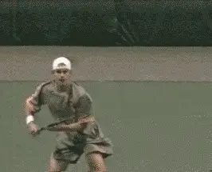
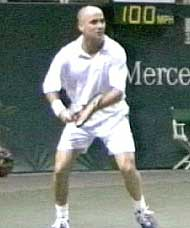

# Common Elements Across the Grip Styles

# John Yandell

{width="2.6979166666666665in"
height="2.4375in"}

**What are the commonalities in the modern forehand---if any?**

Before we talk about building the modern forehand we should probably ask
the question: is there even such a thing as "the" modern forehand? 

When players and coaches who grew up with classic strokes look at
professional tennis they see chaos and confusion. Grips range from the
old fashion eastern of Tim Henman to the extreme semi-western of Gustavo
Kuerten or Andy Roddick, and everything in between. 

The backswings vary drastically in size and shape. The range of
followthroughs is equally extreme. The racquet can finish wrapped around
the player's neck, all the way across the body at waist level, or behind
the head on the right side of the body.

The open stance is dominant, even for players with classic grip styles.
But there are several open stance variations. The vast majority of balls
are hit open, but at times even players with the most extreme grips hit
closed. In fact some extreme players hit more closed stance forehands
than Pete Sampras.  

Ball contact height ranges from knee level to shoulder level and above.
On the vast majority of balls, players make contact with one or both
feet in the air, and typically, they begin the recovery step before the
completion of the swing.  

What does it all really mean? What if anything do modern players share
in common on the forehand? How do their forehands really differ across
the grip styles? What, if anything, can the average player model from
the top pros? Should they even try?

In this new series of articles, we'll try to understand what is really
happening and what players at all levels can learn. We'll work through
the similarities and the differences across grip styles. 

  ----------------------------------------------------------------------------------------------------------------------------------------------------------------------------------------------
                                                          {width="2.615972222222222in"
                                                                                  height="2.3666666666666667in"}
  ----------------------------------------------------------------------------------------------------------------------------------------------------------------------------------------------
                                                         **Can we make sense of the radical diversity in backswings and followthroughs?**

  ----------------------------------------------------------------------------------------------------------------------------------------------------------------------------------------------

We'll go into a lot of detail and try to sort out the many confusing
issues that are widely debated by players and coaches. Then we'll try to
boil it all down to a simple teaching approach you can use to build or
improve your own forehand.

Thanks to the advent of resources such as our [Stroke
Archive](https://www.tennisplayer.net/members/strokearchive/strokearchive.html)
as well as the high speed video developed by [Advanced Tennis
Research](http://advancedtennis.com/), it is now possible to get a clear
look at the sequence of technical elements in the strokes of great
players.

Using these resources, it is possible to develop accurate bio-mechanical
information in the form of visual stroke models. These models allow
players to absorb technical information more directly, by developing the
image and the feeling of the shot patterns, rather than having to
"translate" it from verbal descriptions. 

This approach helps to overcome two major limitations in traditional
teaching. The first is the imprecision and inaccuracy of much teaching
information, which is based on the personal experience of coaches, and
observations of the game made with the naked eye (We've explored this
problem extensively in our series on [Common Tennis
Myths](https://www.tennisplayer.net/members/avancedtennis/advtennis.html)). 

The second limitation is the reliance on the verbal approach, which
conveys teaching information in words through tennis tips. Research
shows that most players learn best in the language of imagery and
kinesthetics, and this matches reports of elite players about how they
learned ([See the Myth of the Tennis
Tip](https://www.tennisplayer.net/members/avancedtennis/john_yandell/the_myth/the_myth_of_the_tennis_tip_images/the_myth_of_the_tennis_tip.html)). 

Although we are going to analyze the modern forehand in detail, and then
construct models for learning several variations, one thing we won't do
is make any absolute pronouncements about which grip style and/or stroke
variation is ultimately preferable.   

  ----------------------------------------------------------------------------------------------------------------------------------------------------------------------------------------
   {width="2.7708333333333335in"
                                                                               height="2.2395833333333335in"}
  ----------------------------------------------------------------------------------------------------------------------------------------------------------------------------------------
                                                      **Love them or hate them, radical forehands are here to stay in junior tennis.**

  ----------------------------------------------------------------------------------------------------------------------------------------------------------------------------------------

As any coach working with junior players knows very well, the more
extreme, westernized grips are here to stay. One of the challenges many
coaches face is knowing how to work with players with these radical
grips, when their own playing and coaching backgrounds are from a
different technical era. 

In my personal opinion, is it probably crazy for a 4.0 club player to
try to copy Gustavo Kuerten's or Andy Roddick's forehand? Yes. Would the
vast majority of all players---including junior players---be better off
in the long run with something closer to the classical grip structure
and swing style of Pete Sampras? Or at the most Andre Agassi? Again, yes
in my opinion. 

Should we sometimes try to get recreational players and inexperienced
junior players off the more extreme grips? Yes at times, usually early
in their development.  But does that mean we should reject the extreme
technical swing patterns completely or refuse to work with players who
use them in the hope they will somehow just disappear from the game?   

In competitive junior tennis the more extreme topspin styles are usually
the fastest way to early competitive success. For that reason alone, we
are going to see more and more young players committed to underneath
grip styles. So it's important to try to understand what is actually
happening with these grips, what is not happening, and also, the
sequence of what happens when. 

As [Robert Lansdorp has
noted](https://www.tennisplayer.net/members/famouscoach/robert_lansdorp/lansdorp_forehand_images/lansdorp_forehand.html),
it is virtually impossible (and therefore counterproductive) to retool a
successful competitive junior's forehand grip after the age of 12 or 13.
With these players, the right coaching path is usually to work with them
within the grip structures they have already developed. This is
precisely what [Rick Macci did in working with the young Andy
Roddick](https://www.tennisplayer.net/members/worldclassstrokes/rick_macci/Macci_Weapon_Roddick_Forehand_images/Macci_Weapon_Roddick_Forehand.html).

  -----------------------------------------------------------------------------------------------------------------------------------------------------------------------------------
                                                                  {width="2.6875in"
                                                                                  height="2.1875in"}
  -----------------------------------------------------------------------------------------------------------------------------------------------------------------------------------
                              **With their increasing dominance in junior tennis, it\'s critical for coaches to understand the more extreme forehands.**

  -----------------------------------------------------------------------------------------------------------------------------------------------------------------------------------

So even if you believe in classic grips, it's essential to understand
the extreme forehands, and to know how to teach them. Obviously, this is
even more critical for coaches who are starting their players from
scratch with semi-western or even more extreme grips. 

So that's what we'll try to do in these articles---understand the
forehand variations and how to teach and/or learn them, as part of an
extended series that will eventually address all the strokes in the same
way. 

Surprisingly, as we dig into the basic bio-mechanics, we'll see that the
new extreme forehands actually share many core technical elements with
the classical style. Or, put another way, so-called classical technique
may be more "modern" than it actually appears. 

We'll also see critical technical differences between the classic and
extreme grips. These are vital for both players and coaches to
understand. It is possible for a coach to give technical input that is
absolutely correct for one grip style, but incorrect and potentially
detrimental for the grip the player is actually using.  

The current article will deal with the surprising commonalities in the
basic swings. What do I mean by basic swings? It\'s a little arbitrary,
but to me a basic swing is on a ball were the player has time, is not
rushed or forced, where the ball can be played comfortably in the strike
zone, and where the player is looking to drive the ball relatively flat
within their own topspin range. Typically these balls are in the center
of the court, or from the inside out position, or possibly slightly
forward of the baseline.

After we address the commonalities, up coming articles will look at the
very real technical differences across the grip styles. These include
the differences on even basic balls, but also, on balls in different
positions, at different heights, hit with different arcs and spins etc.
 We\'ll explore all these mysteries including footwork, hitting stances
and recovery steps. 

Eventually we\'ll go on to show you how to construct your own stroke
models, both physically, through the use of specific checkpoints, and
visually, through the use of mental imagery. We'll also show you the
radical power this imagery can have in building your mental game, and
executing your forehand under pressure. So let's dig in, beginning with
forehand preparation.

### Preparation

  ------------------------------------------------------------------------------------------------------------------------------------------------------------------------------------------------
                                                             {width="2.6979166666666665in"
                                                                                   height="2.4583333333333335in"}
  ------------------------------------------------------------------------------------------------------------------------------------------------------------------------------------------------
                                                            **Focusing on the backswing obscures the fundamental elements of the turn.**

  ------------------------------------------------------------------------------------------------------------------------------------------------------------------------------------------------

When most club players think of preparation, they think of the so-called
"backswing." But if we look at the pros, virtually no two players have
backswings with the same shape or size. Some players with extreme grips
have big loops and others are quite compact. The same is true for the
more classical players (in the next article, we will do a detailed
comparison of the differences in backswing size and shape).

One of my fellow members at the San Francisco Tennis Club watched Andre
Agassi practicing there and tried to study his incredible forehand
firsthand. He sought me out in the locker room to tell me what he'd
learned---that Agassi "hooded" his backswing on his forehand (Whatever
that meant).   

Now this guy had one of the stiffest forehands you've ever seen, with a
continental grip and a horrendous lack of preparation. But he was sure
he'd found the magic bullet that was going to fix his forehand. Like
many other players and even coaches, he didn't understand the real key
to preparation has virtually nothing to do with the shape of the
backswing.   

High speed video shows that, no matter what the backswing, virtually
every pro player initiates the forehand with a body turn, and that this
turn has two parts. 

### The Start of the Turn

The first part we can call the Start of the Turn. Sometimes this is also
called the first move, or the unit turn. The move is initiated with the
feet and torso. There is very little or no independent movement of the
arms and racquet.

  -----------------------------------------------------------------------------------------------------------------------------------------------------------------------------------------------
                                                                   {width="2.6458333333333335in"
                                                                                          height="2.5in"}
  -----------------------------------------------------------------------------------------------------------------------------------------------------------------------------------------------
                                 **The Start of the Turn with the feet and shoulders and very little movement of the racquet. Note the amount or torso rotation.**

  -----------------------------------------------------------------------------------------------------------------------------------------------------------------------------------------------

The body starts to turn sideways as a unit. Sometimes this is
accomplished with a step to the side with the outside foot (the right
foot for a right-hander), or sometimes with a drop step as Jim McLennan
was among the first to recognize. 

In this first move, the player creates almost half of his total shoulder
turn, with the upper torso rotated so that it is at about a 45 degree
angle to the net. As the body turns, the arms and racquet turn
automatically as well. This actually completes a substantial part of the
racquet preparation, but without any real movement in the form of a
backswing.  

In some players, you see a slight raise in the elbow or some small
movement of the hands, but this is minor. In all cases, the hands stay
together, with the left hand cradling or touching the racquet through
the completion of the first move. 

The old idea of  preparing by "getting the racquet back early" is a
myth, as we have examined ([Myth of the
Backwsing](https://www.tennisplayer.net/members/avancedtennis/john_yandell/the_myth/the_myth_of_the_backswing_images/the_myth_of_the_backswing.html)). 
 

The other key point to realize here is that the Start of the Turn
happens virtually instantaneously. On average, it takes only about 2/10s
of a second. **[Players start the turn as soon as they recognize which
side the ball is coming to. It definitely precedes any significant
movement to the ball, even if they are in for a long run.]{.mark} **

This first move is universal across the grip styles. Compare the players
below and see how they are all in virtually the same position at this
point in the motion.

+---------------------------------------------------------------------------------------------------------------------------------------------------------------------------------------------------------------------------------------------------------------------------------------------------------------------------------------------------------------------------------------------------------------------------------------------------------------------------------------------------------------------------------------------------------------------------------------------------------------------------------------------------------------------------------------------------------+
| **Start of the Turn Across Grip Styles**                                                                                                                                                                                                                                                                                                                                                                                                                                                                                                                                                                                                                                                                |
+================================================================================================================================================================================================+==================================================================================================+==================================================================================================+=================================================================================================+================================================================================================================================================================================================+
| {width="1.9791666666666667in" height="2.375in"}        | ![A person playing tennis Description automatically generated with medium                                                                                                                          | {width="1.9791666666666667in"     | confidence](media_common-elements-across-the-grip-styles/media/image9.jpg){width="1.9791666666666667in" |
|                                                                                                                                                                                                                                                                                                   | height="2.375in"}                                                                                                                                                                                  | height="2.375in"}                                                                                                                                                                              |
+---------------------------------------------------------------------------------------------------------------------------------------------------------------------------------------------------------------------------------------------------------------------------------------------------+----------------------------------------------------------------------------------------------------------------------------------------------------------------------------------------------------+------------------------------------------------------------------------------------------------------------------------------------------------------------------------------------------------+
| **[The shoulders and feet start the preparation by turning the player partially sideways.]{.mark}**                                                                                                                                                                                                                                                                                                                                                                                                                                                                                                                                                                                                     |
+------------------------------------------------------------------------------------------------------------------------------------------------------------------------------------------------+-----------------------------------------------------------------------------------------------------------------------------------------------------------------------------------------------------+--------------------------------------------------------------------------------------------------------------------------------------------------------------------------------------------------------------------------------------------------------------------------------------------------+
| {width="1.9791666666666667in" | confidence](media_common-elements-across-the-grip-styles/media/image11.jpg){width="1.9791666666666667in"     |                                                                                                                                                                                                                                                                                                  |
| height="2.375in"}                                                                                                                                                                              | height="2.375in"}                                                                                                                                                                                   |                                                                                                                                                                                                                                                                                                  |
+------------------------------------------------------------------------------------------------------------------------------------------------------------------------------------------------+-----------------------------------------------------------------------------------------------------------------------------------------------------------------------------------------------------+--------------------------------------------------------------------------------------------------------------------------------------------------------------------------------------------------------------------------------------------------------------------------------------------------+

**The Full Turn**

The second position, what I call the Full Turn, or the completion of the
turn, is the natural continuation of the initial move. Usually, the two
movements are completely seamless---that is, the player flows from one
to the other continuously and without pause. This is true even if the
player has also started moving to the ball after the start of the turn. 

In developing the feel for the preparation of the basic stroke, the
movements should be taught as two continuous parts. The only time there
is a discernable pause after the initial move is when the player has a
long run across the court, or sometimes when he takes several steps to
get around the ball to hit inside out or inside in. But this pause
should develop naturally as the player progresses.

To reach the Full Turn, the player continues to rotate his shoulders
until, typically, he or she is turned slightly more than 90 degrees or
perpendicular to the net. The head remains forward, tracking the ball,
with the chin almost touching the front shoulder.

As the shoulders continue to turn, the opposite arm extends across the
body, pointing toward the sideline. The arm can be completely straight,
or it can be slightly bent at the elbow. It can be a little higher or
lower, pointing at an angle slightly upward or downward, depending on
the player. But these are individual differences.

**Start of The Backswing**

{width="2.6041666666666665in"
height="2.4583333333333335in"}

**The completion of the turn move and the start of the backswing**

**[As the players move from the unit turn to the full turn, they also
initiate the backswing.]{.mark}** At this point, some players, like
Sampras, separate their hands. Others, like Agassi and Hewitt, keep
their opposite hand on the throat of the racquet until the hands reach
shoulder level.

This variation probably doesn't matter too much. **[[The key point, is
that after the hands separate, the left arm extends across the
body.]{.underline}]{.mark}** Meanwhile the racquet hand is moving upward
in some form of looping motion. The exact position of the racquet hand
at the completion of the turn can vary greatly depending on the player
and the type of ball he is hitting.

Some players\--Agassi and Hewitt, for example\--reach the top of the
backswing just as they complete the turn, so that the racquet hand is
higher. Other players such as Sampras or Kuerten have a slightly lower
hand position and have already dropped the racquet somewhat below the
highest point of the motion. This position can also vary when players
are on the move, when most players compact the swing at least somewhat,
but more on this in later articles.

To summarize, when a player reaches the Full Turn, he has this
characteristic look:

- The shoulders turned slightly past perpendicular

- The head turned to track the ball with the chin over the front
  shoulder

- The left arm pointing across the body at the sideline

- The racquet hand at shoulder level or higher

It doesn't matter if you're at Pete Sampras, Andre Agassi, Lleyton
Hewitt, Gustavo Kuerten, Marat Safin or Tommy Haas. Their forehands all
share these elements, with only minor variations.

+----------------------------------------------------------------------------------------------------------------------------------------------------------------------------------------------------------------------------------------------------------------------------------------------------------------------------------------------------------------------------------------------------------------------------------------------------------------------------------------------------------------------------------------------------------------------------------------------------+
| **The Completion of the Turn Across Grip Styles**                                                                                                                                                                                                                                                                                                                                                                                                                                                                                                                                                  |
+=================================================================================================================================================================================================+================================================================================================================================================================================================+================================================================================================================================================================================================:+
| ![A person playing tennis Description automatically generated with medium                                                                                                                       | {width="1.9791666666666667in" | generated](media_common-elements-across-the-grip-styles/media/image15.jpg){width="1.9791666666666667in" | confidence](media_common-elements-across-the-grip-styles/media/image16.jpg){width="1.9791666666666667in" |
| height="2.6979166666666665in"}                                                                                                                                                                  | height="2.6979166666666665in"}                                                                                                                                                                 | height="2.6979166666666665in"}                                                                                                                                                                  |
+-------------------------------------------------------------------------------------------------------------------------------------------------------------------------------------------------+------------------------------------------------------------------------------------------------------------------------------------------------------------------------------------------------+-------------------------------------------------------------------------------------------------------------------------------------------------------------------------------------------------+
| **[The common elements in the Full Turn: shoulders slightly past perpendicular to the net, left arm extended to the sideline, racquet hand high.]{.mark}**                                                                                                                                                                                                                                                                                                                                                                                                                                         |
+-------------------------------------------------------------------------------------------------------------------------------------------------------------------------------------------------+------------------------------------------------------------------------------------------------------------------------------------------------------------------------------------------------+-------------------------------------------------------------------------------------------------------------------------------------------------------------------------------------------------+
| ![A person playing tennis Description automatically generated with low                                                                                                                          | {width="1.9791666666666667in" | generated](media_common-elements-across-the-grip-styles/media/image18.jpg){width="1.9791666666666667in" | generated](media_common-elements-across-the-grip-styles/media/image19.jpg){width="1.9791666666666667in"  |
| height="2.6979166666666665in"}                                                                                                                                                                  | height="2.6979166666666665in"}                                                                                                                                                                 | height="2.6979166666666665in"}                                                                                                                                                                  |
+-------------------------------------------------------------------------------------------------------------------------------------------------------------------------------------------------+------------------------------------------------------------------------------------------------------------------------------------------------------------------------------------------------+-------------------------------------------------------------------------------------------------------------------------------------------------------------------------------------------------+

### Timing

Another critical element in the Full Turn is the timing. It should feel
like it happens in a flash. The start of the turn, we noted, takes only
about 2/10s of a second. The additional movement to the Full Turn takes
about another 3/10s of a second. That's a total of about ½ second from
the start to the completion of the preparation! The turn move can be
technically perfect but still far too slow. It needs to feel decisive
and instantaneous. At lower levels of play, but also in competitive
junior tennis, slow or incomplete preparation in probably the most
common problem I see.

  -------------------------------------------------------------------------------------------------------------------------------------------------------------------------------------------------
                                                             {width="2.8020833333333335in"
                                                                                   height="2.4479166666666665in"}
  -------------------------------------------------------------------------------------------------------------------------------------------------------------------------------------------------
                                                              **Agassi completes the full turn in ½ second usually at the time of the\
                                                                                           ball bounce.**

  -------------------------------------------------------------------------------------------------------------------------------------------------------------------------------------------------

On many balls, pro players reach the Full Turn by the time the ball
bounces on their side of the court. In club tennis, the goal should be
to reach the turn at this point or sooner.

**[[A sense of urgency is key.]{.mark}]{.underline}** But far too many
players wait for the ball to bounce before starting to prepare. As a
result they are chronically rushed, late, and/or forced to muscle the
ball at contact, like our friend from the San Francisco Tennis Club who
focused on the shape of Agassi's backswing.

### Set Up and Alignment

**[[After the turn, the next commonality in all modern forehands is the
set up or alignment to the ball, including the coiling of the back
leg.]{.underline}]{.mark}** Again, there is a characteristic position
top players reach when they have time to set up for the ball. 

Without exception, they set up on the outside foot, or the foot closest
to the ball. This is the right foot for a righthander. This outside foot
is turned sideways. It can be parallel to the baseline. It can also be
turned somewhat forward or inward, with the toes pointing at the net an
an angle of thirty to forty five degrees. **[Most of the weight is on
this outside foot, with that foot typically completely flat on the
court. The torso is erect, more or less completely straight up and down
from the waist.]{.mark}**

  ---------------------------------------------------------------------------------------------------------------------------------------------------------------------------------
                                                                 {width="2.5in"
                                                                           height="2.4270833333333335in"}
  ---------------------------------------------------------------------------------------------------------------------------------------------------------------------------------
                                             **At the set up the player is aligned behind the ball with the outside leg fully coiled.**

  ---------------------------------------------------------------------------------------------------------------------------------------------------------------------------------

There is a substantial knee bend in the outside leg, up to as much as 45
degrees. This leg coil is critical in the modern game both for
generating power, and also for controlling the contact height as we'll
see in a future article.

**[The other foot (the left foot for a righthander) is also turned at
least partially sideways and is in front of the outside foot, and closer
to the net. The player is usually up on the toes of this foot to keep
balance.]{.mark}  **

The player establishes this position fairly close to the line of the
incoming ball. Often this is called setting up "behind the ball." He is
now in position to hit without having to make any further positioning
adjustments.

The distance between the feet is related to the hitting stance the
player will use. The distance is usually shoulder width or wider for
open stance shots. The left foot can also be up much closer to the right
when the player plans to step in. (We'll take a detailed look at the all
variations in the stances as well as what happens to the feet during and
after the hit in the upcoming articles.)

+-------------------------------------------------------------------------------------------------------------------------------------------------------------------------------------------------+-------------------------------------------------------------------------------------------------------------------------------------------------------------------------------------------------+-------------------------------------------------------------------------------------------------------------------------------------------------------------------------------------------------+
| ![A person playing tennis Description automatically generated with medium                                                                                                                       | {width="1.9791666666666667in" | confidence](media_common-elements-across-the-grip-styles/media/image23.jpg){width="1.9791666666666667in" | confidence](media_common-elements-across-the-grip-styles/media/image24.jpg){width="1.9791666666666667in" |
| height="2.5208333333333335in"}                                                                                                                                                                  | height="2.5208333333333335in"}                                                                                                                                                                  | height="2.5208333333333335in"}                                                                                                                                                                  |
+:===============================================================================================================================================================================================:+:===============================================================================================================================================================================================:+:===============================================================================================================================================================================================:+
| **Agassi shows the variations in the position of the feet at the setup. At left, a semi-open forehand. In the center, fully open. At the right, preparing to step in.**                                                                                                                                                                                                                                                                                                                                                                                                                             |
+-----------------------------------------------------------------------------------------------------------------------------------------------------------------------------------------------------------------------------------------------------------------------------------------------------------------------------------------------------------------------------------------------------------------------------------------------------------------------------------------------------------------------------------------------------------------------------------------------------+

On balls that require little or no movement, the set up can coincide
with the completion of the turn. The player will actually come to a full
stop with the leg fully coiled at about the time he reaches the full
turn. It can be taught this way, as a basic sequence in developing the
fundamentals: **[[Start of Turn, Completion of Turn, and then
immediately, Set Up and Coil.]{.underline}]{.mark}** However, it is also
important to note that **[the turn and the set up are actually
independent]{.mark} [elements that usually don't occur at the same time
when the player has to move to the ball.]{.mark}**

  -------------------------------------------------------------------------------------------------------------------------------------------------------------------------------------
                                                        {width="2.5625in"
                                                                             height="2.4791666666666665in"}
  -------------------------------------------------------------------------------------------------------------------------------------------------------------------------------------
                                                          **When the player takes two steps the timing of the set up changes.**

  -------------------------------------------------------------------------------------------------------------------------------------------------------------------------------------

The further the movement, the later the set up occurs in relation to the
rest of the swing. For example, when the player takes two steps to the
ball, the backswing can drop to shoulder level, with the left arm moving
back across the body as the torso rotation begins.

If there is still more movement to reach the ball, the racquet can be
near the bottom of the backswing and almost ready to start forward to
the ball at the time, with the left arm  pointing toward the net.

This is **[why it is critical to teach the start of the turn and the
completion of the turn as the first two movements.]{.mark}** If players
are taught to always pair them with the set up, their timing will be
late on the vast majority of balls.

Obviously, when players hit on the move they never come fully to rest in
the set up. However, in almost all cases, they will still pass through
the set up position, with the weight on the outside leg and the outside
knee bent as deeply as possible. If you look closely, you'll see that
even when player's appear to be on the run, there is a different pattern
to the final step before the hit.

+----------------------------------------------------------------------------------------------------------------------------------------------------------------------------------------------------------------------------------------------------------------------------------------------------------------------------------------------------------------------------------------------------------------------------------------------------------------------------------------------------------------------------------------------------------------------------------------------------+
| **Variations in Timing the Setup Across Grip Styles**                                                                                                                                                                                                                                                                                                                                                                                                                                                                                                                                              |
+=================================================================================================================================================================================================+:===============================================================================================================================================================================================:+===============================================================================================================================================================================================:+
| ![A person playing tennis Description automatically generated with medium                                                                                                                       | {width="1.9791666666666667in" | confidence](media_common-elements-across-the-grip-styles/media/image27.jpg){width="1.9791666666666667in" | generated](media_common-elements-across-the-grip-styles/media/image28.jpg){width="1.9791666666666667in" |
| height="2.2395833333333335in"}                                                                                                                                                                  | height="2.2395833333333335in"}                                                                                                                                                                  | height="2.2395833333333335in"}                                                                                                                                                                 |
+-------------------------------------------------------------------------------------------------------------------------------------------------------------------------------------------------+-------------------------------------------------------------------------------------------------------------------------------------------------------------------------------------------------+------------------------------------------------------------------------------------------------------------------------------------------------------------------------------------------------+
| **Note the variation in the timing of the set up. The differences are in the position of the left arm, the height of the racquet hand, and the rotation of the torso.**                                                                                                                                                                                                                                                                                                                                                                                                                            |
+-------------------------------------------------------------------------------------------------------------------------------------------------------------------------------------------------+-------------------------------------------------------------------------------------------------------------------------------------------------------------------------------------------------+------------------------------------------------------------------------------------------------------------------------------------------------------------------------------------------------+
| ![A person playing tennis Description automatically                                                                                                                                             | {width="1.9791666666666667in"  | confidence](media_common-elements-across-the-grip-styles/media/image30.jpg){width="1.9791666666666667in" | generated](media_common-elements-across-the-grip-styles/media/image31.jpg){width="1.9791666666666667in" |
| height="2.2395833333333335in"}                                                                                                                                                                  | height="2.2395833333333335in"}                                                                                                                                                                  | height="2.2395833333333335in"}                                                                                                                                                                 |
+-------------------------------------------------------------------------------------------------------------------------------------------------------------------------------------------------+-------------------------------------------------------------------------------------------------------------------------------------------------------------------------------------------------+------------------------------------------------------------------------------------------------------------------------------------------------------------------------------------------------+

You can see this in the way the foot moves on and off the court. As
players start to move toward the ball, they tend to stay mainly on the
balls and/or the toes of their feet. When they take the set up step,
however, this changes. **[On the last step before the hit, they land
heel first. This is a "braking step" that slows them down somewhat. As
they brake, they coil the back leg by deepening the knee bend.]{.mark}**

  --------------------------------------------------------------------------------------------------------------------------------------------------------------------------------------
                                                        {width="2.71875in"
                                                                                    height="2.4375in"}
  --------------------------------------------------------------------------------------------------------------------------------------------------------------------------------------
                   **Even on the dead run watch Agassi's "breaking step." Note how he lands on the heel of his outside or right foot and the deepening his knee bend.**

  --------------------------------------------------------------------------------------------------------------------------------------------------------------------------------------

**[This is usually at the time of the set up, true even when they
continue to move through the shot at what appears to be full speed. This
braking step\--and the extra knee bend that goes with it\--is a subtle
but very important element is learning to hit effectively on the
move.]{.mark}**

### Completion of Backswing-Start of the Foreswing

The next commonality is the position of the arm and racquet at the
completion of the backswing. Regardless of the size and shape of the
backswing, all top players reach this position just as the racquet
starts forward to the ball. In fact, it's not going so far to say that
the main purpose of the backswing is to deliver the hitting arm to this
position.

The position of the hitting arm and racquet at the completion of the
backswing is one of the most misunderstood technical points in the
modern game.

As the racquet drops to the bottom of the backswing, the arm settles
into a characteristic "hitting arm position," what I've also called the
power palm or double bend position. This hitting arm position has two
distinctive elements that are common across the grip styles. The elbow
is bent and tucked in toward the torso, and the wrist is laid back. 

The exact angle of the arm and the amount of wrist lay back can vary
somewhat from player to player, and also, with the height of the
ball. **[[But the basic elements are virtually universal among modern
players: elbow in, wrist laid back.]{.mark}]{.underline}** (For an
exception check out Mark Philippoussis in the [Advanced
Tennis](http://www.advancedtennis.com) footage.)

  ------------------------------------------------------------------------------------------------------------------------------------------------------------------------------------------------
                                                           {width="2.7916666666666665in"
                                                                                          height="2.5in"}
  ------------------------------------------------------------------------------------------------------------------------------------------------------------------------------------------------
                                         **Movement from backswing to hitting arm position may be the most misunderstood element in the modern forehand.**

  ------------------------------------------------------------------------------------------------------------------------------------------------------------------------------------------------

This position is critical because it allows the palm of the hand to
drive the racquet to the contact point\--and beyond. It is also critical
because it positions the racquet head correctly for the upward swing to
the ball to generate topspin. 

One of the most inaccurate and damaging tennis tips of all time is the
idea that players should drop the racquet head far below the level of
the ball to create topspin. What the high speed video shows is that in
reality the racquet head is usually only a few inches below the ball at
the start of the foreswing. This is for pro players who are generating
phenomenal amounts of topspin, sometimes exceeding 3000rpm!

The key is not trying to drop the racquet way below the ball. **[[The
key is finding the hitting arm position at the completion of the
backswing.]{.mark}]{.underline}** Dropping the racquet further, will
actually impede your ability to generate spin, as well as reduce or
destroy the consistency and power of your forehand. At times players may
rotate the entire arm backwards lowering the racquet head further, but
in all cases the integrity of the hitting arm position is maintained.

**[[Finding the hitting arm position at the end of the backswing will
position the racquet perfectly to hit through the ball with power, to
generate the right amount of spin for the given situation, and to hit
the forehand with consistent technical precision over
time.]{.underline}]{.mark}**

+-----------------------------------------------------------------------------------------------------------------------------------------------------------------------------------------------------------------------------------------------------------------------------------------------------------------------------------------------------------------------------------------------------------------------------------------------------------------------------------------------------------------------------------------------------------------------------------------------------+
| **The Hitting Arm Position Across the Grip Styles**                                                                                                                                                                                                                                                                                                                                                                                                                                                                                                                                                 |
+=================================================================================================================================================================================================+=================================================================================================================================================================================================+================================================================================================================================================================================================:+
| ![A person playing tennis Description automatically generated with low                                                                                                                          | {width="1.9791666666666667in" | confidence](media_common-elements-across-the-grip-styles/media/image35.jpg){width="1.9791666666666667in" | confidence](media_common-elements-across-the-grip-styles/media/image36.jpg){width="1.9791666666666667in" |
| height="2.5625in"}                                                                                                                                                                              | height="2.5625in"}                                                                                                                                                                              | height="2.5625in"}                                                                                                                                                                              |
+-------------------------------------------------------------------------------------------------------------------------------------------------------------------------------------------------+-------------------------------------------------------------------------------------------------------------------------------------------------------------------------------------------------+-------------------------------------------------------------------------------------------------------------------------------------------------------------------------------------------------+
| **Note how players with grips ranging from classical to extreme all find a similar position with the elbow tucked in and the wrist laid back at the start of the forward swing.**                                                                                                                                                                                                                                                                                                                                                                                                                   |
+-------------------------------------------------------------------------------------------------------------------------------------------------------------------------------------------------+-------------------------------------------------------------------------------------------------------------------------------------------------------------------------------------------------+-------------------------------------------------------------------------------------------------------------------------------------------------------------------------------------------------+
| ![A person playing tennis Description automatically generated with medium                                                                                                                       | {width="1.9791666666666667in" | confidence](media_common-elements-across-the-grip-styles/media/image38.jpg){width="1.9791666666666667in" | confidence](media_common-elements-across-the-grip-styles/media/image39.jpg){width="1.9791666666666667in" |
| height="2.5625in"}                                                                                                                                                                              | height="2.5625in"}                                                                                                                                                                              | height="2.5625in"}                                                                                                                                                                              |
+-------------------------------------------------------------------------------------------------------------------------------------------------------------------------------------------------+-------------------------------------------------------------------------------------------------------------------------------------------------------------------------------------------------+-------------------------------------------------------------------------------------------------------------------------------------------------------------------------------------------------+

You can spend years developing the most beautiful circular loop in the
history of tennis, and the effort will be completely wasted and
counterproductive if you don't end up in this position. That's why in my
basic teaching system, ([see the Visual Tennis
series](https://www.tennisplayer.net/members/teaching_systems/teaching_systems.html))
I still advocate the straight backswing. It's the easiest way there is
to set up the hitting arm.

 

  ------------------------------------------------------------------------------------------------------------------------------------------------------------------------------------------------
                                                                        {width="2.8020833333333335in"
                                                                                   height="2.3229166666666665in"}
  ------------------------------------------------------------------------------------------------------------------------------------------------------------------------------------------------
                                                               **Hewitt moves to the contact with the elbow in and the wrist back.**

  ------------------------------------------------------------------------------------------------------------------------------------------------------------------------------------------------

### Contact

As we have examined in detail ([Myth of Wrist
Forehand](https://www.tennisplayer.net/members/avancedtennis/john_yandell/the_myth/the_myth_of_the_wrist_proforehand_images/the_myth_of_the_wrist_proforehand.html)),
the common belief that the "wrist snap" is the key to power on the
modern forehand is a myth.  In fact the critical hitting arm position
the player established at the completion of the backswing remains
essentially unchanged as the player swings forward and upward to
contact.

Ironically, this laid back position is usually more extreme with the
western forehand grips\--typically the forehands considered to have the
most "wrist action" at contact.

The exact angle of the wrist lay back may decrease slightly as the palm
drives the racquet forward, but on virtually every forehand hit by every
top player, the wrist remains laid back at contact at an angle of about
45 to 60 and sometimes even approaching 90 degrees.

 

+----------------------------------------------------------------------------------------------------------------------------------------------------------------------------------------------------------------------------------------------------------------------------------------------------------------------------------------------------------------------------------------------------------------------------------------------------------------------------------------------------------------------------------------------------------------------------------------------------+
| **The Contact Point Across the Grip Styles**                                                                                                                                                                                                                                                                                                                                                                                                                                                                                                                                                       |
+=================================================================================================================================================================================================+================================================================================================================================================================================================+================================================================================================================================================================================================:+
| ![A person playing tennis Description automatically generated with medium                                                                                                                       | {width="1.9791666666666667in" | generated](media_common-elements-across-the-grip-styles/media/image42.jpg){width="1.9791666666666667in" | confidence](media_common-elements-across-the-grip-styles/media/image43.jpg){width="1.9791666666666667in" |
| height="2.1875in"}                                                                                                                                                                              | height="2.1875in"}                                                                                                                                                                             | height="2.1875in"}                                                                                                                                                                              |
+-------------------------------------------------------------------------------------------------------------------------------------------------------------------------------------------------+------------------------------------------------------------------------------------------------------------------------------------------------------------------------------------------------+-------------------------------------------------------------------------------------------------------------------------------------------------------------------------------------------------+
| **Here we can see how the player maintain the hitting arm position at contact\--elbow still bent and the wrist still laid back.**                                                                                                                                                                                                                                                                                                                                                                                                                                                                  |
+-------------------------------------------------------------------------------------------------------------------------------------------------------------------------------------------------+------------------------------------------------------------------------------------------------------------------------------------------------------------------------------------------------+-------------------------------------------------------------------------------------------------------------------------------------------------------------------------------------------------+
| ![A person hitting a ball with a tennis racket Description automatically                                                                                                                        | {width="1.9791666666666667in"  | generated](media_common-elements-across-the-grip-styles/media/image45.jpg){width="1.9791666666666667in" | generated](media_common-elements-across-the-grip-styles/media/image46.jpg){width="1.9791666666666667in"  |
| height="2.1875in"}                                                                                                                                                                              | height="2.1875in"}                                                                                                                                                                             | height="2.1875in"}                                                                                                                                                                              |
+-------------------------------------------------------------------------------------------------------------------------------------------------------------------------------------------------+------------------------------------------------------------------------------------------------------------------------------------------------------------------------------------------------+-------------------------------------------------------------------------------------------------------------------------------------------------------------------------------------------------+

**\"Wrist\" on the Low Ball**

{width="3.3333333333333335in"
height="2.5in"}

**Click here to study how Hewitt uses\--or actually doesn\'t use\--his
wrist to lift a low ball.**

Amazingly, this is even true on low balls close to the net. Check out
the incredible video of Lleyton Hewitt for yourself. He may appear to
roll the wrist radically. **[Look closer at the frame by frame and see
how he lifts the ball with the wrist laid back.]{.mark}** The huge
racquet rollover happens well after the contact and is just one more
example of how our naked eyes deceive us when we look at pro tennis.

**The Start of the Release**

{width="3.3333333333333335in"
height="2.2291666666666665in"}

**Agassi moves to the start of the release with the wrist still laid
back.**

**[[\"Elbow in, wrist laid back.\" It\'s a magic key to the modern
forehand.]{.underline}]{.mark}** There is no \"snap\" during the
contact. The arm should be relaxed and the grip pressure as light as
possible, but beyond that, the wrist is essentially along for the ride.
Any forward movement, if and when it does occur, is a natural
consequence of the swing. Focusing on using or worse snapping the wrist
is counterproductive in generating power or spin.

**[The high speed video shows that the top players set up in the hitting
arm position at the completion of the backswing, and keep this position
essentially in tact as they move the racket forward to the
hit.]{.mark}** Sometimes the amount of layback, and therefore the angle
between the racket and the forearm, decreases as the racket comes
forward to the ball. But most times it doesn\'t, for most players. When
this movement does happen, it seems obvious that it is a natural
consequence of the swing\--and the fact that the players are staying as
relaxed as possible.

If there were a conscious \"snap\" or muscle contraction coinciding with
the hit, we would see the angle between the racket and the forearm
changing radically just before and after contact. If you think about, if
a player really snapped his wrist all the way forward at contact, it
would send the ball into the left side fence. The fact is that in the
hundreds of forehands we examined, the wrist remained substantially laid
back both before and after contact. In fact, we sometimes see the laid
back angle actually increase slightly after contact due to the impact of
the ball. Again this is due to relaxation in the hitting arm.

The high speed video also shows that the top players maintain the
hitting arm position, keeping the wrist back, until the racket and
racket hand are well out past the contact. Typically, this appears to be
around two feet or so into the followthrough. Only after reaching this
point does the hitting arm clearly start to lose its characteristic
shape. This is what I call the Start of the Release. At this point the
ball has been off the strings for light years in the high speed world of
professional tennis.

For players at all levels, this is probably the single most important
technical key on the forehand: the image of the palm of the hand driving
the racket from the completion of the backswing out well past the
contact.

+------------------------------------------------------------------------------------------------------------------------------------------------------------------------------------------------------------------------------------------------------------------------------------------------------------------------------------------------------------------------------------------------------------------------------------------------------------------------------------------------------------------------------------------------------------------------------------------------+
| **The Start of the Release Across the Grip Styles**                                                                                                                                                                                                                                                                                                                                                                                                                                                                                                                                            |
+================================================================================================================================================================================================+===============================================================================================================================================================================================+===============================================================================================================================================================================================+
| ![A person playing tennis Description automatically generated with medium                                                                                                                      | {width="2.638888888888889in" | generated](media_common-elements-across-the-grip-styles/media/image50.jpg){width="2.638888888888889in" | generated](media_common-elements-across-the-grip-styles/media/image51.jpg){width="2.638888888888889in" |
| height="2.8055555555555554in"}                                                                                                                                                                 | height="2.8055555555555554in"}                                                                                                                                                                | height="2.8055555555555554in"}                                                                                                                                                                |
+------------------------------------------------------------------------------------------------------------------------------------------------------------------------------------------------+-----------------------------------------------------------------------------------------------------------------------------------------------------------------------------------------------+-----------------------------------------------------------------------------------------------------------------------------------------------------------------------------------------------+
| **The start of the release-the last point in the swing with the wrist fully laid back.**                                                                                                                                                                                                                                                                                                                                                                                                                                                                                                       |
+------------------------------------------------------------------------------------------------------------------------------------------------------------------------------------------------+-----------------------------------------------------------------------------------------------------------------------------------------------------------------------------------------------+-----------------------------------------------------------------------------------------------------------------------------------------------------------------------------------------------+
| ![A person playing tennis Description automatically generated with medium                                                                                                                      | {width="2.638888888888889in" | generated](media_common-elements-across-the-grip-styles/media/image53.jpg){width="2.638888888888889in" | generated](media_common-elements-across-the-grip-styles/media/image54.jpg){width="2.638888888888889in" |
| height="2.8055555555555554in"}                                                                                                                                                                 | height="2.8055555555555554in"}                                                                                                                                                                | height="2.8055555555555554in"}                                                                                                                                                                |
+------------------------------------------------------------------------------------------------------------------------------------------------------------------------------------------------+-----------------------------------------------------------------------------------------------------------------------------------------------------------------------------------------------+-----------------------------------------------------------------------------------------------------------------------------------------------------------------------------------------------+

**The Universal Finish**

Another widely debated point about the modern forehand is the finish of
the stroke. Is teaching the \"wrap\" the key to the followthrough? Or is
it the consequence of other elements in the swing? We explored this
issue in detail in a previous myth article [(Click here. Myth of the
Wrap.)](https://www.tennisplayer.net/members/avancedtennis/john_yandell/the_myth/the_myth_of_the_wrap_images/the_myth_of_the_wrap.html)

Because the \"wrap\" appears so distinctive, particularly with the
extreme grips, many coaches have adopted it as central tenet in teaching
the modern forehand, training their players to mechanically turn the
racket over at the end of the swing: \"Show me the butt of the racket!\"

{width="3.3333333333333335in"
height="2.2291666666666665in"}

**Even with an extreme semi-western grip, Hewitt hits the universal
finish position on 75% of his forehands.**

What the high speed video shows, however, is that on basic balls the
players reach a kind of Universal Finish position that precedes the
wrap. This position represents the technical completion of the
foreswing. It\'s our last critical commonality shared across the grip
styles. Ironically this position has always been a key component in
classical teaching.

The Universal Finish position represents the last point in the swing
pattern in which the racket is traveling either outward or upward, or
both. That is, it is the last point in the swing before the racket
starts to move backwards and/or downwards, the so-called \"wrap\".

This position has several characteristic checkpoints. Typically the
player\'s racket hand will reach about eye level, or a little above or a
little below.

The racket hand will also be across the body, roughly in line with the
left edge of the torso. The forearm will be at an angle of 45 degrees to
the court, or sometimes slightly less. The upper arm will be at an angle
to the court of about 90 degrees.

The video shows that Sampras, Agassi, Kuerten, Hewitt, Haas, and Safin
all reach this position on a significant percentage of all forehands.
This includes most balls in the center of the court, most inside out and
inside in balls, most short balls, and even many of balls hit on the
run. Even Roddick, who seems to have the most variation in his swing
pattern of any player, still gets to this position on a regular basis.

+-------------------------------------------------------------------------------------------------------------------------------------------------------------------------------------------------------------------------------------------------------------------------------------------------------------------------------------------------------------------------------------------------------------------------------------------------------------------------------------------------------------------------------------------------------------------------------------------------+
| **The Universal Finish Across the Grip Styles**                                                                                                                                                                                                                                                                                                                                                                                                                                                                                                                                                 |
+=================================================================================================================================================================================================+===============================================================================================================================================================================================+===============================================================================================================================================================================================+
| ![A person in a white shirt Description automatically generated with low                                                                                                                        | {width="2.5972222222222223in" | generated](media_common-elements-across-the-grip-styles/media/image57.jpg){width="2.611111111111111in" | generated](media_common-elements-across-the-grip-styles/media/image58.jpg){width="2.638888888888889in" |
| height="3.013888888888889in"}                                                                                                                                                                   | height="3.0833333333333335in"}                                                                                                                                                                | height="3.0972222222222223in"}                                                                                                                                                                |
+-------------------------------------------------------------------------------------------------------------------------------------------------------------------------------------------------+-----------------------------------------------------------------------------------------------------------------------------------------------------------------------------------------------+-----------------------------------------------------------------------------------------------------------------------------------------------------------------------------------------------+
| **Some of the key checkpoints are wrist at about eye level, upper arm parallel to the court, and the forearm at about 30 - 45 degrees.**                                                                                                                                                                                                                                                                                                                                                                                                                                                        |
+-------------------------------------------------------------------------------------------------------------------------------------------------------------------------------------------------+-----------------------------------------------------------------------------------------------------------------------------------------------------------------------------------------------+-----------------------------------------------------------------------------------------------------------------------------------------------------------------------------------------------+
| ![A picture containing person, outdoor, player Description automatically                                                                                                                        | {width="2.638888888888889in"   | generated](media_common-elements-across-the-grip-styles/media/image60.jpg){width="2.625in"             | confidence](media_common-elements-across-the-grip-styles/media/image61.jpg){width="2.625in"            |
| height="3.0694444444444446in"}                                                                                                                                                                  | height="3.0694444444444446in"}                                                                                                                                                                | height="3.0694444444444446in"}                                                                                                                                                                |
+-------------------------------------------------------------------------------------------------------------------------------------------------------------------------------------------------+-----------------------------------------------------------------------------------------------------------------------------------------------------------------------------------------------+-----------------------------------------------------------------------------------------------------------------------------------------------------------------------------------------------+

Yes, there are variations. In addition to Roddick, you can find examples
of the other players with more extreme grips finishing lower, and
sometimes much lower, and/or across the body with the racket ending up
at waist leve, as well as over the head on the right side as in Pete
Sampras\'s running forehand.

What the footage shows, however, is that these are usually variations
due to ball position on the court, ball height, ball spin, and the angle
of the shot the player is hitting.

The checkpoints above therefore represent a commonality across the grip
styles on the basic forehand drive. But this is not to say the finishes
are completely identical. The biggest difference is the greater amount
of internal arm rotation with the extreme grips, something we\'ll look
at in detail in the next article. This internal arm rotation also
accounts for the greater diversity in the swing patterns with extreme
grips.

Still, this finish position includes enough elements common across the
grips styles to be considered a true commonality. When we see most top
players make the check points for universal finish on so many balls, we
can be fairly confident that it really is fundamental. As such it can
serve as a model position in developing basic swing patterns as we shall
see.

**Extension Outward**

A critical further point is the outward extension of the motion at the
Universal Finish. So critical that it deserves it\'s own extended
discussion. We can see this extension in the position of the hand and
racket in relation to the torso. Typically the racket hand will reach a
point that is at least one up to two feet in front of the plane of the
torso.

This is an indication of the real path of the swing, and how far the
racket has continued outward toward the target before the start of the
wrap. This outward extension is present in the forehand of virtually all
top players at the Universal Finish. It\'s also there even when they
fall a little short of the precise finish checkpoints described above.

{width="3.3333333333333335in"
height="2.2291666666666665in"}

**The extension of the swing away from the torso is commonly overlooked,
especially with the extreme grips.**

The importance of the motion from the contact to this final extension is
widely overlooked and misunderstood by both players and coaches. Many
players who believe they are imitating the pros finish with the hand far
too close to the torso in an effort to force the wrap. I\'ve even filmed
ranked junior players who were hitting themselves in the chest with
their racket hand!

Players mistakenly believe that the wrap is what generates racket head
acceleration, and this causes them to severely limit their extension.
Unfortunately the truth is the exact opposite.

A 3-dimensional study of top college players completed by Advanced
Tennis showed that racket head speed during the wrap declines radically,
down to about 5mph or less. This is a fraction of the speed at the
contact, and still far less than the racket head speed at the Universal
Finish. (More on this study coming in future articles.)

If you think about this, it makes perfect sense. **[[The wrap is the
natural \"deceleration\" phase of the forehand motion. What speeds up
has to slow down.]{.underline}]{.mark}** Teaching the wrap to generate
racket head speed violates a basic principle of bio-mechanics, and
probably, increases the chance of injury.

The high speed video shows that pro players pass through the technical
finish position, with great extension away from the torso. Only then do
they decelerate the racket by moving it backward toward the body, the
\"wrap\" phase of the stroke.

You can actually see the deceleration in the high speed video movie of
Guga below. Just watch how far the racket moves from frame to frame.
You\'ll see it move further as it accelerates to contact and through the
extension of the motion, and much less as it starts to move backwards
through the wrap.

Let\'s be clear: **[[the wrap is a critical part of the motion on the
modern forehand. But let\'s not confuse acceleration and deceleration.
Most players will naturally wrap as a consequence of extending their
swing. They have to, in order to slow down the racket smoothly and keep
from putting additional strain on their shoulder
muscles.]{.underline}]{.mark}**

Unfortunately what we see in great numbers of junior players who have
been taught to wrap is that they never make the technical finish
position that great players with the same grip styles achieve. This is
way so many of them hit forehands that are heavily spun, but lack
velocity or depth.

Because the racket is moving so much slower during the wrap, it is much
easier to see the wrap than the extension of the swing, and this has
added to the coaching confusion. Because they can see it more clearly,
coaches often seize on the wrap in order to have some way to understand
the extreme forehands.

What they don\'t see is the universal finish because it happens so much
faster. Even watching Advanced Tennis video, you can sometimes miss or
overlook this position if you don\'t stop and go frame by frame.

At a recent coaching convention where I was speaking, a teaching pro who
was a big Kuerten fan was checking out the high speed video.

After seeing Guga finish a few forehands with the wrap across the body,
he started modeling Guga\'s stroke and telling me how this was exactly
how he had taught all his juniors to hit heavy topspin. I noticed,
however, that his racket hand wasn\'t even reaching shoulder level
before crossing over his body, so I asked him to take a look at the Guga
footage frame by frame.

+-------------------------------+-------------------------------------------------------------------------------------------------------------------------------------------------------------------------------------------------+
|                               | {width="3.3333333333333335in" |
|                               | height="2.2291666666666665in"}{width="3.331288276465442in"  |
|                               | height="2.224825021872266in"}                                                                                                                                                                   |
+:=============================:+:===============================================================================================================================================================================================:+
| **Even watching on video, you can miss the extension after the hit. The still frame on the right shows the point of maximum extension in the same swing.**                                                                      |
|                                                                                                                                                                                                                                 |
| **Watch the animation and see if you can see him make the position.**                                                                                                                                                           |
+---------------------------------------------------------------------------------------------------------------------------------------------------------------------------------------------------------------------------------+

When he saw Guga reach the universal finish position on several balls,
he decided that Guga really didn\'t hit his forehand that well after
all, maybe not even as well as his own 12 year old son. Then he
proceeded to tell me how he thought Guga should come take some lessons
from him and learn to shorten up his followthrough.

Now that was a strong response (strongly defensive!), and I had to
laugh, but it gives another example of how even experienced teachers can
be fooled looking at tennis strokes\--and how these misperceptions can
harden into principles that teachers will naturally want to defend.

Teachers think that by stressing the wrap, they are teaching what is new
in the modern forehand. But, as we saw in the myth of the wrap article,
the wrap is absolutely nothing new. Big Bill Tilden had a full wrapping
motion on his classic eastern forehand, and so did Pancho Gonzales and
Jack Kramer. And so does Pete Sampras.

{width="3.3333333333333335in"
height="2.2291666666666665in"}

**The key positions on the modern forehand: Do they look more familiar
now?**

What is new is the way the wrap appears to be more extreme with the
western grips. The increased internal arm rotation in the swing makes
the wrap look more dramatic, particularly on the lower finishes across
the body, and that has caught the attention of coaches and players.

If the player reaches the universal finish the wrap usually just
happens. In fact, it would be difficult to stop it from happening.

But should coaches be stressing the wrap? In my experience this
inevitably leads to restrictions in the extension. The only exception
would be the case of a player with an extremely rigid swing, and the
point would still be to relax and let the wrap on its own, rather than
forcing it to happen.

So that\'s Part 1 on the commonalities in the swing patterns. Next
let\'s take a detailed look at the backswings. They turn out to be far
more complex and individualistic than you might think. From there we\'ll
move on to the considerable technical differences, and finally on to
issues like shot variety, stances and recovery steps.

{width="1.8208333333333333in"
height="2.6493055555555554in"}

John Yandell is widely acknowledged as one of the leading videographers
and students of the modern game of professional tennis. His high speed
filming for Advanced Tennis and Tennisplayer have provided new visual
resources that have changed the way the game is studied and understood
by both players and coaches. He has done personal video analysis for
hundreds of high level competitive players, including Justine
Henin-Hardenne, Taylor Dent and John McEnroe, among others.

In addition to his role as Editor of Tennisplayer he is the author of
the critically acclaimed book Visual Tennis. The John Yandell Tennis
School is located in San Francisco, California.
