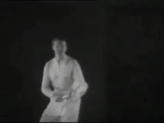

# Classic and Modern Tennis:

# Modern Tennis, Your Tennis

### John Yandell

**How absolute is the distinction between modern and classical tennis?**

As a player you may have found yourself perplexed\--or even
tormented\--by this question: Should I play \"classical\" or \"modern\"
tennis?

You may have heard \"definitive\" statements from coaches on both sides
of the divide. Possibly you have heard the same coaches make derisive
statements about the \"opposite\" view.

The radical advocates for the modern game argue that tennis has changed
fundamentally over time and that so called \"modern\" technique is
vastly superior to its antiquated predecessors. Everyone should play
modern tennis and even the most extreme modern technical elements are
applicable for any player who has ever touched a racket.

The anti-modern viewpoint is that there is an \"unbridgeable\" gap
between pro players and the rest of the tennis world. This means that
trying to emulate pro players results in frustration, injury, and bad
tennis.

You can't play like the pros and you will never reach your potential if
you try to. Modern tennis is something that should only be watched on
television.

**Is \"modern\" tennis something to learn from or just watch on TV?**

As a player how do you proceed when the viewpoints of the authorities
are so adamantly contradictory? And how, if at all, should your decision
relate to your age, your level, or playing style?

In these articles I want to examine these issues, because they can have
a huge impact on any player's development, enjoyment of the game, and
competitive success.

We'll start by looking at a critical unexamined assumption that is
shared by both sides in the debate. This assumption has led to
fundamental misunderstandings about the history of technique.

Then in this article and the next we'll try to cut through all the
partisan rhetoric and clarify the actual technical elements used by high
level players across the history of the game from the \"classic\" to the
\"modern\" era.

Finally in a third article, we'll examine how this wide range of
historical technical elements may or may not apply to games of players
at all levels, and try to create a framework to help you decide what to
adopt for yourself.

**Is the divide from the classic to the modern era \"unbridgeable\"?**

This series of articles actually is the deep background for a new series
of teaching articles I plan to publish over the next two years. This
series, the result of over a decade of filming, research and on court
experimentation, will offer teaching progressions for players at all
levels for developing and correcting technique on all the strokes.

The goal is to give you a clear path help you create the best possible
technical foundation for a lifetime of tennis success and pleasure.

For the past 10 years I have been studying every tree in tennis forest.
Now it's time to elevate and make some general conclusions about the
forest itself. I am tremendously excited at this prospect and look
forward to sharing the results with you here on Tennisplayer.

**The Assumption**

The first step in unraveling the whole modern versus classical debate is
to understand the assumption that is, ironically, accepted by both sides
in the debate without critical scrutiny.

**What classic elements are modern and vice versa?**

This is the belief that there really is some hard, unbridgeable
distinction between classical and modern tennis and that one style or
the other is somehow inherently superior.

Is that assumption true? How much difference is there really between
modern and classical tennis?

A careful historical examination of the top players, beginning with the
game's first great superstar Big Bill Tilden and continuing all the way
to Roger Federer, Rafael Nadal, and Novak Djokovic shows that, as with
most rhetorical distinctions, the reality is more complex than either
side understands.

Here is the reality. Classical tennis is partially modern, and modern
tennis is partially classical. Rather than a cosmic divide, there is a
continuum between the two styles.

You can find many \"modern\" elements in tennis going back to the
1920's. And there are many \"classical\" elements that are still
fundamental to tour technique today. Has the game evolved? Definitely.
Have there been major changes that have affected technique? Yes.

**Changes in tactical styles separate classic and modern tennis.**

Are some modern elements less common in the games of older classical
players? Affirmative. Have there been fundamental changes in tactical
styles? Ditto.

But is there some deep, categorical, technical chasm separating the two
styles? No. Not if you really look closely at the whole complex,
historical picture.

The answer to the question posed at the start of this article is that
there is no simple answer as to whether you should play \"classical\" or
\"modern\" tennis. The real answer is not an \"either/or,\" the real
answer is some version of an \"and/both.\"

Every player needs to draw from the full range of potential elements
manifest in the history of high level tennis in experimenting with and
creating a technical and tactical style that suits his ability,
commitment, and personal preferences.

It's counter productive to exclude and vilify some of those elements one
way or the other. The real goal is to understand how they may or may not
help you play tennis at the level you dream of reaching.

**Try this shot with a 16 ounce wooden racket.**

**Fundamental Change**

It is undoubtedly true that technique has evolved in many significant
ways in over 100 years. Some of the changes are a matter of emphasis and
degree. But others have resulted mainly from changes in the equipment
and the court surfaces.

The most obvious change that has affected technique is in the rackets
and the strings. Have you ever tried to hit an extreme grip heavy
topspin windshield wiper forehand on an incoming 90mph shoulder high
ball with 3000rpm of spin using a wooden racket that weighed 16 ounces
and was strung with natural gut?

A few years ago at Indian Wells, a national tennis writer talked Novak
Djokovic into that experiment. Djokovic's evaluation was something to
the effect of \"With this racket I don't have a forehand.\"

**The poly string snap back effect radically increases spin.**

Although it took decades for players to discover the full implications,
the graphite racket revolution of the 1980's was an epochal shift. This
started with the natural increase in the velocity from the larger heads
and stiffer materials, but eventually it reverberated to the foundations
of strategy and technique.

Someday someone will actually quantify the speed changes that began with
the graphite era, but obviously they are real. Just watch film clips of
wood racket matches and they seem to be in slow motion.

Then there is the amazing consistency. Miss hit the ball slightly with a
wood racket and you get an error.

Miss hit the ball to the same degree with a larger headed graphite
racket and you get a shot very similar to one hit dead center. This is
the major factor in the development of the modern 30-ball backcourt
rally.

**Poly string has made the use of extreme swing elements routine.**

The other huge factor is poly string, which is now virtually universal
on the tour and is becoming more and more prevalent at all levels. Poly
string increases spin levels 25% or more, again, virtually
automatically. ([Click
Here](https://www.tennisplayer.net/members/physics_of_tennis/josh_speakman/strings_and_spins/)
for more info on the nature and effect of poly.)

And poly has a synergistic effect on velocity and technique. With
greater spin players can swing the rackets faster and faster, relying on
the poly effect to give them consistency and control. To generate this
additional velocity and spin, players have adopted more extreme
biomechanical swing elements, as we will see.

The data shows that among the current top players there has been a huge
average increase in spin levels even since the 1990s. While players like
Pete Sampras and Andre Agassi hit forehands spinning at 2000rpm or less,
now average spin is often 3000rpm or higher.

The bottom line is that together the rackets and the strings give
players the ability to do things to a tennis ball on a consistent basis
that simply were not possible in the classical era.

**The Courts**

**Contact points through most of the classical era were between knee and
waist height.**

The other fundamental change that is often overlooked is the courts
themselves. This has been just as influential as racket and string
technology in the evolution of technique.

For most of the last century three of the four major tournaments were
played on grass courts. The bounces were low, uneven and often
unpredictable.

The wide spread growth of hard courts, including their adoption at the
U.S. and Australian Opens, changed things in a fundamental way. On hard
courts the ball bounced higher, but also bounced true on virtually every
shot.

The effect has been magnified further still on tour today as hard courts
typically have much more particulate in the top coats, bounce even
higher, and play much slower than the hard courts common 10 years ago.

Even the last remaining Slam grass courts at Wimbledon have been
\"improved\" so they bounce much more evenly and also significantly
higher, with many players saying the bounce is now something close to
hard court play.

**Slower courts, heavier spin, higher bounces, higher contact.**

Indoor surfaces have also been standardized. In the early open era
indoor cushioned carpet courts such as supreme court were the norm, with
a bounce that was lower, deader, and closer to grass. Now indoor courts
are typically finished with top coats similar or identical to outdoor
hardcourts, for example at the tour ending ATP championships in London.

So what is the cumulative effect of the racket, string and court
changes? First the slower, higher bouncing courts have increased the
length of time it takes a ball hit at a given speed to travel from one
player to the other. This means that although the absolute velocity of
the shots has increased, this increase has been partially nullified by
the slower courts.

Equally or more importantly, the higher bounces have drastically raised
the contact height---the distance above the court surface at which the
ball is struck. Average contact height has been increased further still
by the poly strings and the higher levels of topspin.

**In the classical era mild continental grips were common on the
forehand.**

The contact height factor continues to go unnoticed or analyzed by
mainstream tennis media. In many pro tournament rallies, the average
strike zone is now at shoulder level and sometimes above.

These factors\--court speed and contact height---may be overlooked, but
they are huge in understanding the technical and tactical evolution of
the sport and also how that evolution applies or doesn't to tennis at
all other levels.

**History**

To try to understand this, let's go back to the dawn of serious
international competitive tennis and see exactly how the game was played
technically, and how all that changed over the last hundred years.

The most important change in the last two decades has been in the grips,
particularly on the forehand, and this has resulted primarily from the
court and equipment changes detailed above. These changes in grip
structure have in turn been critical in leading to other major changes
in swing biomechanics.

**Classical players often used open in additional to neutral stances.**

If we look at players from the 1920's through the 1960's, we see that
most players used forehand grips that were some version of what we would
today call a traditional eastern or, probably more commonly, a mild
continental grip, with the index knuckle and/or part of the heel pad
shifted somewhat toward the top of the grip.

Those grips were ideal for the contact heights of the day. Playing on
grass courts with wooden rackets, ball bounces were usually between knee
and waist level. Hard courts were generally slicker and lower bouncing
as well.

But since the graphite/poly/court surface revolution the grips of more
and more players have moved more and more under the handle. This, as we
will see in more detail in the second article, has led to more use of
open stances and more use of windshield wiper action, or hand and arm
rotation on the follow-throughs. ([Click
Here](https://www.tennisplayer.net/members/avancedtennis/john_yandell/your_forehand_and_the_modern_forehand/hand_arm_rotation/hand_arm_rotation.html)
for more on the wiper.)

Still it is important to understand that even the radical forehand
elements which are so prevalent in the \"modern\" game, always existed
in so-called \"classical\" style.

**Tilden among others hit reverse and wiper finishes.**

Tragically, there is very little good stroke footage of most of the
champions of the pre-digital era. Yet what we do have proves the
existence of most of the technical elements that are often considered
exclusively \"modern.\"

Bill Tilden for example hit windshield wiper and reverse finish
forehands. Tilden's major rival Little Bill Johnston played with a
semi-western grip with his hand shifted significantly under the handle.

When we look at the classical serve motions we can see hand and arm
rotation resulting in \"pronated\" racket positions in the
followthroughs. We can see topspin finishes with the racket coming down
on the right side of the body, just as we do with Pete Sampras or Sam
Stosur.

It was the golden era of classical, compact volleys. (For a great recent
Tennisplayer article by Paul Cohen on the classic forehand volley [Click
Here](https://www.tennisplayer.net/members/classiclessons/paul_cohen/classic_forehand_volley/index.html).)

But Fred Perry hit swinging volleys in the 1930's, as did other players.
All the top players used a mixture of neutral and open stances, even
with continental forehand grips.

**Fred Perry among others hit swinging volleys.**

Many advocates of the modern game like to parody the so-called classical
forehand. They claim old school players and teachers advocated immediate
separation of the hands, straight backswings, and short, linear
followthroughs that stay on the player's right side.

The reality however is that classical players used unit turns and
brought the left arm across the body in the preparation. They finished
with over the shoulder wraps on basic drives and, as noted, used more
exotic finishes as well.

Look around at your club. It's depressing how many players have
exaggerated modern elements but lack theses fundamentals of preparation,
timing, extension etc. There is no doubt in my mind that players like
Big Bill Tilden or Don Budge, even with their wooden frames, could have
used their forehands to crush the entire modern club playing population
and probably a majority of current college players as well.

**Backhands**

On the backhand side, classical tennis was all one hand. There were
virtually no two-handers.

**The classical forehand: a unit turn with the left arm stretch, great
extension and a wrap followthrough.**

One-handed backhands were usually hit with a slightly stronger grip than
the forehand---ie, with the hand shifted more toward the top of the
frame. But the predominant swing pattern on the backhand was the hard
slice or the slice drive. Most players came over the ball only on
passing shots, and never did.

Using these technical swing elements with wooden frames and natural gut
strings, it was difficult for even the top players to finish points
consistently from the backcourt. Players tended to play close to the
baseline, took the ball early and/or on the rise, stepped into the ball
with neutral stances and looked to move forward.

In general they looked to finish points primarily at the net. The
predominate tactical style was serve and volley, or at least all court
style with a high percentage of net approaches.

**Real Changes**

The analysis of the technical history of the game shows that it is
important to give the founders of world competitive tennis their due, to
understand the sophisticated technical nature of the tennis they played,
and to understand the technical continuities that stretch across the
history of the game.

**In the classic era it was all one hand.**

It's equally important to see how technique has evolved, due in large
part to the equipment and court changes described above. In some ways
this is simply a matter of emphasis or prevalence. Although open
stances, modern finishes and swinging volleys go back to the beginnings
of the game, there is no doubt that in the current era their frequency
has increased exponentially.

But the reality is that the court, racket and string changes have also
led to the widespread adoption of certain technical elements that were
mostly absent in the pre-open era.

Again, these changes have to do with the increases in spin and contact
height we have already noted. Even when players hit with open stance in
the pre-classical era, their contact heights remained similar or only
slightly higher than with traditional neutral stances. They struck the
ball at waist level or mid chest level at the highest and tended to keep
their feet on the ground much more.

In the modern game, groundstrokes now are routinely hit at mid chest,
shoulder level and higher. This has led to the much wider adoption of
under the handle grips, and greater loading in the legs.

**The modern forehand can finish with the rear shoulder rotating 180
degrees.**

This in turn has led to players exploding upward off the court and
making contact in the air with one or both feet off the ground. Contact
in the air has in turn opened the door for much greater torso rotation,
unrestricted by the friction between the feet and the ground.

Whereas a classical forehand was hit with roughly 90 degrees of forward
body rotation, an extreme semi-western forehand struck at shoulder level
can have double that rotation. Instead of finishing with the shoulders
roughly parallel to the baseline, players are rotating in the air, and
finishing with the front shoulder pointing at the opponent as they land
back on the court.

There have been major changes on the backhand as well. The most obvious
is the rise of the two-hander. But another is the evolution of heavy
topspin on the one-handed backhand.

A third important impact has been the reduced prevalence and
effectiveness of the slice backhand, and changes in slice technique to
adapt to higher contact height and increased spin. (For more on the
evolution of the slice backand, [Click
Here](https://www.tennisplayer.net/members/avancedtennis/john_yandell/classical_tennis_and_modern_tennis/modern_pro_slice_2/).)

**The rise of two-hands is a fundamental modern change.**

Yet another critical change has nothing to do with courts and equipment.
This is the rule change on the serve that allowed players to leave the
court with both feet and make contact with the ball in the air. It seems
obvious that this increased use of the legs has led to more power and
much heavier spin.

There has also been a seismic shift in the nature of strategy and
tactics that relates directly to these changes. This includes the death
of the serve and volley game and the rise of extended heavy spin
backcourt changes that have come to dominate at the pro level.

Players like Rod Laver and Lew Hoad were transitional figures in the
decade before the open era, hitting with more topspin off both sides,
especially the backhand. Yet both were serve and volley and all court
players.

John McEnroe was another important transitional figure and won major
titles with both wooden and graphite rackets. Although McEnroe could hit
significant topspin off both wings, he also relied on slice backhands
and, like the great classical players, took the ball on the rise close
to the baseline and looked to finish primarily at the net.

Through the 1980's and early 90's, the serve and volley style continued
to be viable at the highest levels of the game, with McEnroe, Stefan
Edberg, and Boris Becker all winning multiple Slam titles.

**McEnroe, a transitional figure with a classic game and a graphite
racket.**

But Borg was a transitional figure of another kind and the harbinger of
the next age. Playing with a grip on his forehand that was shifted
slightly toward the semi-western he used increased topspin, deeper court
positions, and incredible court coverage to play a proto modern
backcourt style---despite using a wooden racket.

Then along came Ivan Lendl and Andre Agassi. They were among the first
players to exploit the power and spin potential of the new rackets more
fully and both players held what were extreme forehand grips for the
day.

Lendl took the level of power in the pro game to new levels. Agassi
showed that the return could be a weapon that neutralized net attack
with power and spin.

But what about Pete Sampras? No doubt one of the greatest, most
beautiful, and courageous players of all times, Pete was probably the
last great classical champion. Pete played with a relatively small
headed graphite frame and ultra thin gauge natural gut. He had a classic
eastern grip forehand, with a gorgeous classical finish taught to him by
the great Robert Lansdorp ([Click
Here](https://www.tennisplayer.net/members/famouscoach/robert_lansdorp/lansdorp_forehand_images/lansdorp_forehand.html).)

He had a one-handed eastern backhand that he could drive, come over with
heavy spin, or slice. And, obviously, he was one of the greatest serve
and volley players of all time, if not the very greatest of all.

**The last of the great classical players?**

The Sampras era was transitional. With his retirement, with the
increasing prevalence of poly strings, and with the continued adoption
of more radical technique elements, so-called modern era tennis became
more dominant.

Roger Federer, who idolized Sampras, abandoned his earlier serve and
volley tactical style. Heavier spin backcourt players began to fill the
top 50 on the computer. Soon the game had Rafael Nadal, playing
backcourt tennis like an oversize supercharged Borg, as well the other
primarily backcourt champions who followed, Novak Djokovic and Andy
Murray.

So in the next article, let's take a look at that next step in the
evolution of the game and a more detailed look at the \"extreme\"
elements that have become more predominant. At the same time, however,
let's look at the surprisingly strong presence of classical technical
components that remain viable, and even central to the pro game. Stay
tuned!

# Is Don Budge's Forehand Good Enough for You?

**Who was Don Budge and what was his forehand really like?**

Who in this modern era would be crazy enough to model their forehand on
Don Budge? Who was Don Budge anyway? Oh right, he was the guy who
invented the concept of the Grand Slam (actually he invented the
phrase!)\--and then went out and won the first one.

OK fine, but Budge played with a wood racket that weighed over a pound!
In those days you held onto the racket with naked wooden handles! They
didn't even have leather grips yet! There was no poly string! Not to
mention you had to wear long white flannel pants!

Recently one of our subscribers posted something amazing that I had
never seen. A link to a Don Budge instructional film made in the mid
1940s. ([Click Here](https://youtu.be/j_jT-pqRIDI) to see the whole
thing.)

Is this film some curiosity demonstrating the primitive nature of tennis
in a distant era? Budge's technique must be completed antiquated, right?

No! This film is fascinating. The fundamentals of the way Budge hit his
forehand are in many respects little different from so-called modern
tennis. If 99% of the players in the world had this technique they would
all be 1000% better.

We are talking unit turn and left arm stretch and an ATP-like backswing!
Open stance! Reverse finishes! Budge even advocates a closed racket face
for topspin, something that was once viewed as impossible. So were the
1940s more modern than modern?

**How classical is classical and how modern is modern?**

Let's not go too far. There is no doubt the game is way different today
at the highest levels. Spin, velocity and contact height are all
higher---way, way higher. 100mph forehands with 5000rpms that bounce
above shoulder level.

But there are fundamental technical continuities. Guess what? Great
athletes in all eras figure out similar things in similar circumstances.

In the previous article in this series, I looked at some of the
classical elements in modern tennis\--and vice versa ([Click
Here](https://www.tennisplayer.net/members/avancedtennis/avancedtennis/john_yandell/classical_tennis_and_modern_tennis/part_01/).)
Now let's do the same in more detail with the technical specifics of
Budge's forehand.

If you believe the scornful words of "modern tennis\" exponents no one
could even play real tennis before extreme windshield wipers and massive
topspin. Players like John McEnroe and Pete Sampras couldn't even
compete against \"modern\" heavy ball baseliners.

So how could Don Budge? This is the background discussion that makes
Budge's film so interesting. The extreme modern game propaganda loses
credibility when tested against historical reality. The fundamentals in
Budge's forehand are amazing.

**Grip**

**An eastern grip with the hand on the wood and aligned with racket
head.**

But wait Budge has an antiquated eastern grip. Doesn't that disqualify
him as \"proto modern\" right there? Well that grip is good enough for
Roger Federer, Jo Willie Tsonga, and Juan Martin Del Potro among others.

Although other players of Budge's era and later had forehand grips
turned toward the continental, Budge himself had a classic eastern with
the palm of the hand aligned directly with the racket face and the
string bed\--a grip that falls within the range of effective grips in
the pro game. And for players at all other levels, that grip is probably
far more suitable and effective, as we see in this month's article from
my new teaching methodology series. (Click Here.)

Why Eastern? The grip allows players to hit through with the racket more
or less on edge\--a basic semi-flat drive. That's a great basic swing
pattern and one that even advanced club players can hit with great
effect. ([Click
Here](https://www.tennisplayer.net/members/avancedtennis/classiclessons/scott_murphy/traditional_forehand/)
to see the forehand of Karsten Pop, who even in his 40s, is one of the
best players in super competitive Marin county California.)

**A modern unit turn with both hands on the frame.**

It is also suited to the contact height of most club and league
tennis\--balls that are waist high to mid chest high at the highest. But
an Eastern grip also allows players to hit the windshield wiper that
happens on almost every ball in the pro game and is an important option
for players at lower levels as they develop.

**Preparation**

The preparation Budge demonstrates is the most amazing part of this
film. He starts with a unit turn with both hands on the racket. This
takes his body to about 45 degrees to the net before the hands separate.
Sound familiar? ([Click
Here](https://www.tennisplayer.net/members/avancedtennis/avancedtennis/john_yandell/your_forehand_and_the_modern_forehand/preparation/your_forehand_and_the_modern_forehand_preparation.html).)

Next his hands separate and the left arm stretches across the body. All
I can remember from the 1960's on was teachers advocating pointing the
left arm at the ball! It wasn't really until high speed video came
along that the left arm stretch was \"discovered.\"

Or should we say, rediscovered? Here is the best player in the world
demonstrating and advocating it in 1940. How did that not get into the
teaching consciousness of the time for the future?

**The left arm stretch and the ATP backswing\--decades before the ATP
existed.**

But what is even more amazing is what happens with the racket arm and
the backswing. There was a major stir\--a revolution even when Brian
Gordon and Rick Macci developed the concept of the \"ATP backswing.\"

Every teacher on the internet suddenly stole the concept and acted like
he had known it all along. ([Click
Here](https://www.tennisplayer.net/members/avancedtennis/high_performance/rick_macci/develop_atp_forehand/)
to Rick talk about this on Tennisplayer. [Click
Here](https://www.tennisplayer.net/members/avancedtennis/biomechanics/brian_gordon/developing_an_atp_forehand_part_01/)
to see Brian's more scientific explanation.)

In case you been off the planet for the last few years, the ATP
backswing is with the racket head above the hand, the racket arm to the
right of the body on a slight diagonal, and the racket face slightly
closed to the court. Look at Budge! It's virtually the exact ATP
position.

Maybe Rick and Brain secretly found this film before I did. Just
kidding. What is interesting is that Brian established by his research
not only that this was a commonality for top male pro, he showed why
it's a biomechanical advantages in terms of the way the muscles work.

Who could know that Don Budge was turbo charging his forehand via the
stretch shorten cycle in the 1940s? And then bringing that one-pounder
through\--no wonder he was widely perceived to hit a very heavy ball.

**Natural adaptations to open stance.**

**Stances**

Not to mention his \"modern\" use of stances. In the instructional
components Budge demonstrates the perfect basic footwork to hit a
neutral stance forehand\--and also how to shift the weight with that
stance pattern.

And many of the balls he hits\--controlled rhythm rallies with a high
level teaching pro are hit neutral. But you also see him shift stances
effortlessly to adjust for various balls. Watch him adjust his feet and
set up a mild semi-open stance on a higher ball. Watch hit semi-open
when he moves wide.

It's a fantasy but what if we had extensive high speed film of him,
Jack Kramer, Pancho Gonzales, even Bill Tilden, the same way we have of
modern players in our High Speed Archives? Then we could actually study
the evolution of technique in a much more detailed, more nuanced and
more conclusive way.

**Finishes**

**The classic eastern finish: simplicty pace, depth, consistency.**

As I said one of the advantages of the eastern grip is the flexibility
in the finishes. When you watch Budge in his film, you see mainly long,
gorgeous, rhythmic, classic finishes.

Love these. If your grip is Eastern or close you can come through with
the racket on edge or with a little bit of arm rotation and hit a
topspin drive that maximizes velocity with just enough spin to keep it
in and hit deeply and consistently.

Because there is not the same level of upper arm rotation as in a wiper,
you have eliminated a huge variable, which although it has benefits, can
also introduce crazy errors for lower level players. And look at the
extension!

If you look at video of self-taught players on the Tennis Warehouse
message boards, they often have extreme mechanical wipers. We all need
to robotically copy the pros right?

So you see these guys no matter what kind of ball they are dealing with
or trying to hit turning the racket over 180 degrees from sideline to
sideline on every swing\-- regardless of the lack of depth or pace or
control\--or the heinous errors. Sad yet funny.

**Even under controlled conditions a hint of finish variety.**

You don't have that problem with the more classic finish. But then that
goes back to grip. If you go under the handle you have to wiper much
more to get the racket head through the swing. Why not have the option
to play the ball that suits the situation\--especially below the pro
level\--ie especially for 100% of all people reading this article.

In fact, it looks very much like the finish in the great Welby Van
Horn's teaching system. ([Click
Here](https://www.tennisplayer.net/members/avancedtennis/teaching_systems/welby_vanhorn/true_master_forehand_balance_checkpoints/true_master_forehand_balance_checkpoints.html).)
He lived to be 94 and I feel very lucky that we were able to capture his
approach on Tennisplayer. Guess what? He was a contemporary of Don
Budge.

**Other Finishes**

Having said all that, even in the staged, controlled rallies in the
film, you see how easily Budge can alter the swing to fit the situation.
On some forehands the racket head turns over much more, a partial wiper.

There are also a couple of natural \"reverse\" finishes where the racket
comes back to the same side as it started. (For the original article
from Robert Lansdorp that started the Reverse Finish craze in our era,
[Click
Here](https://www.tennisplayer.net/members/avancedtennis/famouscoach/robert_lansdorp/lansdorp_reverse_forehand_images/lansdorp_reverse_forehand.html).)

**Don Budge advocating the impossible closed face.**

**Closed Face**

And then there is the closed face. A lot of \"modern\" research
concluded that this just wasn't even possible. The ball would obviously
go down into the net.

It took high speed video in the 90s to show that well, no, it was not
only possible but common. Our contributor Kerry Mitchell was way ahead
of his time (or maybe the ultimate retro thinker\...) in advocating this
years ago. ([Click
Here](https://www.tennisplayer.net/members/avancedtennis/classiclessons/kerry_mitchell/Mitchell_Forehand_Grips_images/Mitchell_Forehand_Grips.html).)

The interesting thing is that all these elements: different stances,
finishes, racket face angles happen at all in this highly structured
instructional film. Again makes me long to film a few matches on the
different surfaces.

Grass was lower bouncing at the time. But what about filming Budge on
red clay winning the French? Wow. I bet we would learn some stuff
then\...

If I still played with a wood racket maybe I'd take the grip off it
just to feel what the wood itself actually felt like when you found the
exact sweet spot.

John Yandell is widely acknowledged as one of the leading videographers
and students of the modern game of professional tennis. His high speed
filming for Advanced Tennis and Tennisplayer have provided new visual
resources that have changed the way the game is studied and understood
by both players and coaches. He has done personal video analysis for
hundreds of high level competitive players, including Justine
Henin-Hardenne, Taylor Dent and John McEnroe, among others.

In addition to his role as Editor of Tennisplayer he is the author of
the critically acclaimed book Visual Tennis. The John Yandell Tennis
School is located in San Francisco, California.
