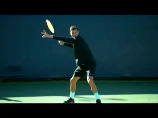

# John Yandell-Modern Tennis Forehand-Where Are We Now

**Modern Tennis:\
What Have We Learned?\
The Forehand Part 1**

**John Yandell**

**That's me upper left, looking through my goggles at Pete Sampras in
high speed video at the US Open in 1997.**

In 1997, we did our first high speed filming of professional tennis. And
we have continued to film the top players ever since. It's now been 20
years.

So what have we learned? How has the game evolved technically? And what
are the implications for not just elite players, but for the rest of the
tennis playing world? This new series presents a summary of that work,
starting this month and next with the forehand.

In 1997, when I sat on the sideline with a high speed camera in the
first year of Arthur Ashe Stadium, Andre Agassi and Pete Sampras were
still at the top of the pro game. Tennis had seen two huge changes---the
transition to graphite rackets and to predominant hard court play with
two Grand Slams, Australia and the US, going from grass to hard courts.
The continental grip was a thing of the past. The power baseline game
was becoming much more widespread, but players including Sampras, Pat
Rafter, Tim Henman, and Greg Rusedski were still winning playing serve
and volley.

Most players still had conservative grips by today's standards---not
continental certainly, but eastern or modified eastern or mild
semi-westerns. Off the ground, hard relatively flat winners were
predominant at least on hard courts.

That same filming was the first work ever to measure actual spin rates.
Sampras and Agassi were generating a little less than 2000rpm of spin on
their forehands. ([**[Click
Here]{.underline}**](https://www.tennisplayer.net/members/mystheavyball/john_yandell/Spintest/spin_test.html).)
Sergi Bruguera was generating spin levels over 3000rpm, but that was
seen as something that worked only on clay. Rafael Nadal was 11 years
old.

Over the next 10 years the game evolved gradually until a new style of
forehand became the norm. Poly strings had started to predominate. The
new strings combined with later generation graphite rackets allowed
players to morph the extreme forehand elements together, increase
velocity, and increase spin levels to equal and surpass Bruguera---not
just on clay but on all surfaces.

**Bruguera's spin levels seemed like an anomaly in 1997.**

We saw in a previous article ([**[Click
Here]{.underline}**](https://www.tennisplayer.net/members/avancedtennis/john_yandell/classical_tennis_and_modern_tennis/part_01/))
that classic players of past eras used most of these elements now
associated with the modern forehand---open stance, leaping with both
feet in the air, windshield wiper finishes, reverse over the head
finishes, straight arm forehands, swinging volleys.

But by the time Nadal won his fourth straight French Open title in 2008,
the more extreme elements had become the norm on the forehand. In many
ways it appeared there was now an increasing disconnect on the forehand
between the highest levels of tennis and the recreational game.

The question became then what can we learn from these elite players'
forehands---if anything? Were the differences so fundamental that
players were better off with more purely classical models?

Because there is so little good film of the strokes of the greats from
Tilden to Budge to Kramer to Gonzales to Laver (to see the best
collection anywhere in our Stroke Archive, [**[Click
Here]{.underline}**](https://www.tennisplayer.net/members/strokearchive/strokearchive.html))
it would be hard to create great normative models from the previous with
real confidence. Perhaps the best source anywhere for understanding the
classical game is our incredible series from Welby Van Horn. ([**[Click
Here]{.underline}**](https://www.tennisplayer.net/members/teaching_systems/welby_vanhorn/true_master_part1/).)

**What can the average player learn from the evolution of the modern
forehand?**

But what about the great modern players? I believe that certain core
fundamentals in the current game still apply across all levels. In fact
some of the most foundational elements are actually stronger with
today's top players and these players are actually better models in
some ways for all players. And because of our high speed filming, these
model elements can be clearly identified across the entire range of
elite pros.

Many of the current pro elements of course don't apply, despite the
hopes and delusions of many club players. The important question is
which ones do?And how do we separate foundational from advanced? This is
what I have tried to do in my series on the Ultimate Fundamentals
([**[Click
Here]{.underline}**](https://www.tennisplayer.net/members/ultimate_fundamentals/ultimate_fundamentals.html).)

And elsewhere in the Advanced Tennis section I have worked through
almost the entire pro game in extended detail. There is a lot of
material. ([**[Click
Here]{.underline}**](https://www.tennisplayer.net/members/avancedtennis/index.html).)
There is also groundbreaking biomechanical research from Brian Gordon
that brings even greater understanding to issues that were before
matters of interpretation and opinion. ([**[Click
Here]{.underline}**](https://www.tennisplayer.net/members/biomechanics/brian_gordon/developing_an_atp_forehand_part_01/index_2.html).)

**What applications of pro elements are delusional and which are
possible?**

So in this article let's summarize what and how we can learn from the
pros forehands. But it's important to understand I am not saying \"play
like the pros.\" The players that can play like the pros are the pros.
We aren't them. But we can still be inspired by the top players and
develop tremendous technical foundations using core elements as models.

**Split Step**

Let's start with the split step. As Tim Mayotte has recently written
([**[Click
Here]{.underline}**](https://www.tennisplayer.net/members/famouscoach/tim_mayotte/the_split_step_ready_position/))
a great split step separates players even at the pro level. Roger
Federer is the ultimate example.

He starts to split usually slightly before his opponent even makes
contact and is at the top of his split when the ball comes off the
strings. He lands in a wide base with great knee bend, coiling his legs
for smooth yet amazingly explosive movement toward the ball.

The average player, very unfortunately, is often still waiting in some
version of a ready position---or even casually standing\--when the ball
bounces on his side. Even in low level tennis this is technically
disastrous.

**Federer's split step perfection---starting before contact, the top of
the split at the hit and a balanced landing in a wide base.**

The time between the hits in club tennis is usually a little more than a
second, at most a second and a half. Yet players waste half or more of
that time. This makes executing a fundamentally sound groundstroke
impossible.

You may not time your split like Roger. But it only takes focus and
intention to begin to split at the opponent's hit.

You may not have the strength or flexibility to split in a base that is
twice your shoulder width with substantial knee bend like Federer---it
fact you probably or undoubtedly don't. But you have to develop a feel
for a width and depth in your own split that is comfortable for you and
that lets you immediately initiate the preparation on landing.

**Grips**

In pro tennis the grips range from eastern with most of the hand behind
the handle like Federer to full western with most of the hand under the
handle like Jack Sock---and everything in between.

The biggest factor to understand in looking at grips is contact height.
In pro tennis, the ball is regularly played at shoulder height or
higher. Although players like Djokovic who are partially under the
handle can certainly take the ball early at lower heights, the more
extreme grips are far better suited to heavy high bouncing balls that
are common in the pro game.

**The modern game includes the full range of grips from Eastern to Full
Western.**

So unless you are an elite junior, a college player, or a young athletic
open player, a more conservative grip is probably far better suited to
the type of ball you hit. You may not split like Roger, but a grip like
Roger Federer is most likely ideal.

Federer can elevate for high balls no doubt. But he prefers contact
heights from his waist to mid chest. In the pro game this requires the
super human ability to play 90mph balls with heavy spin on the rise.

For the huge majority of all players, that same contact height matches
the top of the bounce on most incoming balls. You don't have to hit on
the rise. You can also hit slightly on the way down. That makes the
Eastern a great choice, or at most a mild semi-western.

**Preparation**

No matter what you may have heard about delaying preparation and
\"stalking\" the ball by keeping the racket in front of your body, it's
unarguable that good preparation begins instantaneously after landing
the split---or sometimes even in the air. The high speed footage is
conclusive. Preparation starts immediately with a unitary body turn
involving the feet torso and racket.

**The start of the body turn with the racket staying in front of the
torso.**

The other end of the advice spectrum from \"stalking\" is to immediately
\"take your racket back,\" with independent motion of the arm. Don't do
it. Instead start the unitary body turn immediately after the split.

In the initial phase of the turn, the shoulders turn about 45 degrees.
Depending on where the player is and where the ball is coming, there can
be various combinations of first steps happening as the body turns.

There could be a simple pivot, an out step, a backward step, a shuffle
step or a cross step. David Bailey has outlined them in his phenomenal
footwork articles ([**[Click
Here]{.underline}**](https://www.tennisplayer.net/members/footwork/footwork.html).)
But the end result is that the right foot usually turns to point
basically toward the right sideline. The left leg, left foot and hips
also pivot and come forward, so the foot positioning is offset with the
left foot in front of the right.

The opposite hand stays on the racket and the racket moves naturally
with the body turn although the hands may start to rise somewhat and the
angle of the face of the racket can change somewhat. These changes tend
to be individual. But regardless of that, in this first phase the racket
is still in front of the torso and moving back mainly as a natural
consequence of the body rotation.

**The hands can separate at slightly different times and the opposite
arm can be straight or slightly bent. The keys are in the shoulder, hip
and leg rotations.**

**Full Turn**

As the turn progresses, the hands separate and the left hand and arm
move to point across the body, basically perpendicular to the sideline.
The shoulders and hips continue to rotate until the shoulders are at
least 90 degrees to the net or usually more.

Some players, like Djokovic, hold on longer with the opposite hand. The
left arm stretch starts a little later and the arm doesn't always
straighten out completely. But most players are going to get a better
turn by focusing on the straight arm and probably a little sooner
separation of the hands.

As the player completes the turn, the weight is shifting to the outside
right leg and the knees are coiling. The left leg and left foot move
forward and are 3 feet or more closer to the baseline. The left heel is
usually partially elevated with the weight in the left leg mainly on the
balls of the foot. The posture is upright with the spine close to 90
degrees to the court, tilted only slightly to the right.

**The ATP backswing---more compact and more powerful.**

**Backswing**

Since Brian Gordon delineated the types of backswings on the forehand
with his distinction between the so-called WTA and ATP backswings, the
topic has become the rage on the internet and is the distinction is
widely accepted by most knowledgeable coaches. ([**[Click
Here]{.underline}**](https://www.tennisplayer.net/members/biomechanics/brian_gordon/developing_an_atp_forehand_part_01/).)

His research showed the ATP backswing was both more compact and more
powerful, in effect \"turbo charging\" the forehand through increased
stretching of the shoulder muscles. Players like Roger Federer and
Grigor Dimitrov are the cleanest models.

In the pure form of this backswing the hand moves upward on a diagonal
and slightly to the outside or away from the player during the
completion of the turn\--with the hand reaching shoulder height or
slightly below. The racket face is slightly closed, in what Rick Macci,
who was heavily influenced in his professional collaboration with Brian,
calls the \"tap the dog\" position. ([**[Click
Here]{.underline}**](https://www.tennisplayer.net/members/high_performance/rick_macci/develop_atp_forehand/).)

From this backswing position, the racket moves down with the hitting
hand staying the player's right side. This is in comparison to the
so-called WTA backswing of a player like Madison Keys in which the hand
moves backward behind the plane of the body. ([**[Click
Here]{.underline}**](https://www.tennisplayer.net/bulletin/forum/tennisplayer/66212-interactive-forum-october-2017-madison-keys-groundstrokes).)

**From the outside backswing position, the hand, arm and racket rotate
backward from the shoulder as the they move downward preparing for the
forward swing.**

Central in this movement is what Brian and Rick call the \"flip.\" This
is the backward or external rotation of the hitting arm and racket from
the top of the backswing as they move down and set up the hitting arm
position for the forward swing. This flip sets up the hitting arm for
maximum explosion from the shoulder in the movement toward contact.

Another huge internet teaching fad has been the emphasis on the further
closing of the racket face as the hand, arm and racket move downward and
into the flip. It is true that often the racket face continues to turn
downward until it is fully parallel to the court, the so-called \"pat
the dog.\"

Many self-styled experts have advocated consciously recreating this
position---or even creating a backswing based on \"laying the racket
face flat on a table\" and starting the forward swing from that
position. In truth, when it happens this more extreme down turn it is an
automatic consequence of the move through the flip.

It is situational and tends to happen most on lower balls and far less
on higher balls. And many great, great forehands---for example Juan
Martin Delpotro's forehand have little to no racket face closure. (For
an article on the Myth of the Dog Pat [**[Click
Here]{.underline}**](https://www.tennisplayer.net/members/avancedtennis/john_yandell/the_myth/the_myth_of_the_dog/).)

**Is there an acceleration benefit in pointing the tip of the racket
more toward the opponent?**

So don't think about patting the dog! It will destroy the timing of the
completion of the flip and diminish the creation of energy and the
natural and automatic benefits of the outside backswing by putting a
mechanical muscle movement into the middle of a critical part of the
swing. (For an example of the negative effects of trying to pat the dog
in the forehand a good club player, [**[Click
Here]{.underline}**](https://www.tennisplayer.net/members/your_strokes/fred_bye_fh_3_01_05/fred_bye_fh_3_01_05.html).)

**Accelerator?**

Another interesting element in the backswing is what happens to the tip
of the racket. As the hand and racket move up many top players turn the
tip of the racket to point partially or even totally at the opponent.
Dominick Thiem does that and so do Djokovic and Sock to a lesser degree.

Why? We know that the backward arm rotation moving into the flip is part
of the turbocharge effect in the swing from the ATP backswing. If the
tip of the racket is pointing forward, possibly this effect is
increased. That hypothesis is shared by Brian Gordon.

**Federer tilts the racket tip around 30 degrees forward, but Nadal
points it straight upward or close.**

But how critical is it? Federer has the tip pointing somewhat toward the
opponent. So does Alexander Zverev. They have two of the two of the best
forehands there are. But Rafa Nadal actually does the opposite, pointing
the racket tip almost directly upward.

So pointing the tip is not something fundamental to a great forehand.
And it adds complexity to the movement and takes somewhat more time.
It's not something that the average player should try to build in to
underlying fundamentals. If you have or develop a rock solid technical
motion---ok then sure try the experiment. But if you have a rock solid
technical forehand, you might wonder why.

The fact is the precise size and shape of the backswing varies
tremendously among great players. Many years ago I dove all the way into
the question and took a detailed looked at the players then at the top
of the game from Pete Sampras to Andre Agassi to Gustavo Kuerten to
Marat Safin and others. ([**[Click
Here]{.underline}**](https://www.tennisplayer.net/members/avancedtennis/john_yandell/building%20_the_modern%20_forehand/building_modern_forehand_backswing_page1/building_modern_forehand_backswing_page1.html).)

I found different hand heights, different racket tip heights, different
racket tip angles, different shapes in the racket paths, different
distances from the torso among other things. You can saw the same thing
about the current top players.

**Compare the racket movement, racket tip angle and backward arm
rotation for Djokovic and Sock.**

After tilting the tip forward Djokovic continues his backward external
arm rotation until his racket face literally is parallel to the
baseline. DelPotro takes the racket up with the face slightly open and
then points the racket tip backward with no forward tilt involved.

The one commonality I found was that the racket hand tended to stay on
the right side---what is now recognized as a commonality in the
so-called ATP forehand. My conclusion was that the simpler the better
and at the time choose Agassi as a model because of the simplicity and
relative compactness of the motion. Not dissimilar to Roger Federer
today although Roger is probably even a better model because his hand
position stays lower, usually below shoulder level.

A final point of confusion to look at on the compact backswing model.
The difference in the position of the hand, versus the position of the
racket as the backswing descends and moves into the forward swing.

As the animations of Agassi and Federer show, players with the ATP
backswing and relatively mild grips show, the racket tip as well as the
hand stay on the player's hitting side.

**Compare the similar outside backswings of Andre Agassi and Roger
Federer.**

It's the hand position that's the important element here. Many players
with grips further under the handle will actually point the racket tip
behind them at the bottom of the backswing.

This is a function primarily of grip and the way the racket sits across
the palm of the hand with extreme semi-western and western grips. The
racket is at an angle across the palm and this angle can approach 90
degrees with a very extreme player like Sock. You see the same with
Nadal and Djokovic.

This is very different than the milder grips of Agassi and Federer where
most of the palm of the hand is behind the handle, basically parallel
with the string bed. The key to evaluating the backswing is to look at
the hand not the racket tip.

The angle of the racket tip isn't a problem. Conceivably it may take
some small additional fraction of time for the racket head to get around
to the contact. But the angle is a natural component and just because
the racket points behind the torso it doesn't mean the hand went too
far back or indicate that the player isn't using the more compact ATP
style motion with his hand on his hitting side.

**With extreme grips the hand can be on the hitting side, but the racket
tip itself is angled behind the torso.**

**Stance**

Now let's move onto another important misunderstood element: stance.
There is widespread confusion about stances in pro tennis---and how they
apply at the levels below. One mantra you hear is: \"play open stance
like the pros.\" This usually is interpreted to mean fully open stance,
with both feet parallel to the baseline. You hear this from online gurus
but also amazingly from experienced tour coaches.

The actuality is that pro players hit the vast majority of all forehands
with semi-open stances. The feet aren't parallel to the baseline. A
line across the toes is at an angle of 30 to 45 degrees to the baseline.

But if open is good isn't more open better? It's the opposite. If the
feet stay parallel to the baseline it restricts the rotation of the
hips, left leg and left foot. Players cannot coil and load as fully. In
fact if you look at a pro player like Andy Murray, one of the problems
in his forehand is that he uses more fully open stances and doesn't
turn as fully as players like Nadal, Federer or Djokovic on balls where
he could. ([**[Click
Here]{.underline}**](https://www.tennisplayer.net/members/avancedtennis/john_yandell/building%20_the_modern%20_forehand/andy_murray_open_stance_forehand/).)

**Fully open stance reduces coiling. Note the angle of Andy's shoulders
and hips and the reduced left arm stretch.**

**Forward Torso Rotation**

Beyond the coiling in the preparation phase, the semi open stance is
critical in the modern forehand. This is because the shoulders rotate up
to 180 degrees or sometimes even slightly more in the forward swing.

From the full coil with the shoulders turned to the net, the rear
shoulder typically comes around until it is facing the net. The semi
open alignment positions the left foot so this can happen freely.

So semi-open creates maximum coiling and allows for maximum uncoiling.
These two factors are a primary source of the increases of forehand
speeds up to 100mph or even higher and spin up to and exceeding 3000rpm.

**The back shoulder rotates around 180 degrees in the forward swing,
finishing facing the net.**

**Neutral Stance**

But there is another benefit to setting up the semi-open stance
correctly. It also allows top players to step forward naturally and
easily into neutral stances.

This happens relatively rarely in pro tennis---on lower bouncing and
shorter balls. But is an easy transition from the semi-open set up,
something more difficult and unnatural from the extreme fully open foot
position with the left foot.

It was once believed that \"stepping in\" using a neutral\--or what is
sometimes called a square stance\--was a major power source on the
forehand, generating \"linear\" energy in the direction of the ball.

That has been completely replaced on the vast majority of pro forehands
by the forces of torso rotation, which create \"angular\" energy. If
stepping directly forward into the shot would generate more power, you
would see the top players do it. They don't. The neutral step puts the
front foot in the way of the forward rotation of the back shoulder,
which is what maximizes racket speed, velocity and spin.

**In pro tennis the semi-open set up allows an easy, natural transition
to neutral stance or lower or shorter balls.**

And now the question for the rest of us. Should we all try to rotate 180
degrees with the torso in the forward swing---just like the pros? That
amount of rotation is common in elite junior tennis and college tennis.
But is it realistic for us? No\--and recreational players who try it
often look awkward or comical.

It's not only the more extreme and more athletic movement that is far
more difficult and as well more difficult to time. It's also related to
contact height. Pro players in general play the ball at far more extreme
contact heights with one or both feet fully in the air.

For the vast majority of players though, the neutral stance is
applicable to the vast majority of balls. It also helps in another
respect.

The step forward and across into a neutral stance insures a full body
turn---and in fact is the best way for many players to feel and develop
it. So many players tend to get the left side of the torso and left leg
stuck---especially if they are laboring under the delusion that fully
open stance is the magic key to a \"modern\" forehand.

**High contact goes hand in hand with full body rotation with both feet
in the air.**

In fact with lower level players, I usually prioritize a great turn with
a either a solid semi-open stance or a neutral stance above the exact
size or shape of the backswing---assuming it isn't gigantically huge.
If the hand goes a little bit behind the body, that's ok as a player
works to create great preparation. Again, in the crazy internet world
you see an obsession with the outside, ATP backswing but when you look
at the players they often have terrible turns and extreme open stances.

With the neutral stance the torso rotation through the swing will be
about 90 degrees. With a great semi open stance often slightly more. But
don't try to throw your back shoulder through the shot! Let the
rotation happen naturally in the course of forward swing---something we
will look at in similar detail in the second article. Stay tuned!

**Where Are We Now?\
The Forehand Part 2**

**John Yandell**

**Let's look at how to develop a great forward swing.**

So in Part 1, we looked at the fundamentals of preparation including the
body turn, the coiling in the stances, and the elements of a compact ATP
backswing and the relationship between the positioning of the hand and
the racket tip, depending on grip. Although there are many elements in
pro forehands that don't apply at all levels, I said that the modern
players actually provide the best possible models for the core
fundamentals in preparation---even stronger than the so-called old
school classical players.

We also addressed some bad ideas\--though unfortunately widely
disseminated\--regarding the timing of preparation, the angle of the
racket face, and the inferiority of fully open stances. ([**[Click
Here]{.underline}**](https://www.tennisplayer.net/members/avancedtennis/john_yandell/modern_tennis/what_have_we_learned/).)

Now let's look at the core elements in forward swing on a basic
forehand power drive. And the conclusion is the same. As with
preparation, if you know what to look for and what to develop, elite
pros provide the best possible models as well in the forward swing for
maximizing power, spin, and consistency in your forehand.

**Hitting Arm Structure**

Let's start with what happens from the top of the backswing. As the
racket, hand and arm descend, they come back slightly to the inside, and
the player sets up the hitting arm structure.

**The bent arm and the straight arm variations.**

There are two basic variations in the hitting arm shapes\--the bent
elbow and the straight elbow. The bent elbow means that the elbow is
bent in toward the torso. The exact shape, the angle of the bend, and
the distance from the body varies somewhat with the grips, the length of
the player's arm, and preference.

A few examples of bent elbow forehands are: Andre Agassi, Novak
Djokovic, Stan Wawrinka, and Jack Sock. Agassi's grip is milder with
less bend, Novak more, and Sock with his hand fully under the handle,
the most.

With the straight arm the elbow straightens out so there is a more or
less straight line from the shoulder to the hand. This is the
configuration used by Roger Federer, Grigor Dimitrov, Juan Martin
Delpotro and Rafael Nadal.

Is one superior to the other? According to Brian Gordon, it's the
straight arm. The contact is further in front than the bent arm and the
straight arm allows more independent forward and upward arm movement in
the forward swing.

As part of the obsession with the ATP forehand, the straight hitting arm
configuration has become a virtual internet sacrament. Read the message
boards, go on YouTube, and coaches and club players will advocate it as
an absolute necessity for any player who wants a \"pro\" forehand.

**The straight arm may have biomechanical advantages at the highest
levels.**

Most of these experts/advocates couldn't rally with Agassi or Djokovic,
or the vast majority of women pros who hit the double bend almost
exclusively. Most of them probably don't even hit with straight arms.

Is a straight arm really some critical component of a great forehand?
Not really. But zealots believe what zealots believe. Brian Gordon
himself makes a point of saying how much more difficult it is to master
and to time. He is training elite juniors to hit it with amazing
results. But these kinds of kids have actual ability and are training
hours a day.

For the vast majority of players, the vast majority of whom have huge,
basic technical problems in their forehands, the straight arm is the
last element they should be thinking about instead of the first.

In my experience the great majority of players are natural bent arm
hitters. Some of greatest forehands in tennis have been and are bent
elbow. My belief is that first you focus on the preparation. Then you
master the fundamental elements of the forward swing we are looking at
here.

**The majority of forehands even in pro tennis are bent elbow.**

Then take a look. If those fundamentals are excellent you may find you
have naturally developed the straight arm---or not. If not and you want
to experiment from there with the straight arm, go for it. But it's
used by a small percentage of the players that I have ever filmed---not
just club players, but elite juniors, college players, and touring pros.

One alternative if you have the deep need to develop it is move to
Florida and train with Brian. People have!

**Hand and Racket Height**

Regardless of hitting arm shape, the next question is where are the
hitting arm and the hand and the racket in relation to the height of the
oncoming ball?

How low does the hand drop? A standard cliché is drop the hand \"well\"
below the level of the ball so you swing \"low to high.\" But how
accurate is that?

The fact is that the hand drop can slightly or a most a few inches below
the ball. But sometimes it doesn't drop below it at all. Hard to
believe but it's true.

**The hand drops at most only slightly below the ball.**

I wrote about this in detail in an article called Myths About Low to
High in the Modern Forehand. ([**[Click
Here]{.underline}**](https://www.tennisplayer.net/members/avancedtennis/john_yandell/the_myth/the_myth_of_low_to_high/).)
As with so many things these elements are impossible to see without high
speed video.

The hand itself can be slightly below the ball, but it can actually be
slightly above the ball as well. How is that possible? The answer lies
in looking at the height of the racket head.

In some cases, it's backward rotation of the arm not the hand drops the
racket head, so that the tip points at a downward angle at the court.
The racket head in fact can be a few inches or even a foot below the
ball when players use this backward rotation.

But this only happens when players are using more extreme versions of
the so-called windshield wiper---they rotate the arm and racket
backwards from the shoulder to set up additional forward rotation on the
way to contact and then out into the followthrough.

**When there is backward rotation in the wiper, the hand can actually be
slightly above ball level.**

So what you don't want to do is artificially drop the hand and destroy
the hitting arm shape in a quest to hit \"low to high.\" But really you
don't have to think about it. From the outside backswing position we
described in Part 1, probably the best key is just to pull the hand
forward with the idea of hitting up and out to the extension position on
a power drive.

**Extension Position**

And what is that finish position? I summarize it in my forehand article
in Ultimate Fundamentals section. ([**[Click
Here]{.underline}**](https://www.tennisplayer.net/members/ultimate_fundamentals/john_yandell/the_forehand/).)
But let's understand it in more depth by looking at the entire path of
the forward swing.

In the forward swing the hand and racket move in three
directions\--upward, outward, and also across. It's a three dimensional
curve.

The racket and hand start forward from close to the body and move at
first outward from the player's right to the player's left, in other
words, inside out toward the contact. At the same time they are moving
upward, driven by the path of the hand and/or the forward rotation in
the windshield wiper.

**The hand and racket move on a 3D curve from the players left to right,
upward, outward, and also back to the left.**

At some point around the contact, the curve changes and the hand and
racket start to come across the body, moving from the player's right
back to the player's left. At the same time the racket is still moving
upward and outward or forward toward the opponent. Again, a curve with
movement in three directions.

The extension of the forward swing happens when, more or less, the hand
reaches eye level, and at about the same time reaches the left edge of
the torso. The third check point is the spacing. The hand on a power
drive is usually spaced about 2 feet in front of the plane of the torso.
It's similar for both hitting arm styles, though it can be more on the
straight arm forehand.

Another common internet idea is that the secret to the modern forehand
is to emphasize the motion of the hand and racket to the player's left
across the body, starting before the contact. \"Pull the racket sharply
across before the contact and bend the elbow sharply as well.\" Or
something like that.

Not true. The hitting arm structure in both versions keeps its basic
shape far out into the forward swing toward the extension point.

**Hand at about eye level, even with the left side, great spacing from
the torso---the checkpoints for extension on the power drive.**

**What About the Wiper?**

The wiper is an added complexity in trying to understand the stroke. In
modern tennis, when the top players reach the extension point on a power
drive, they almost always have wipered or rotated the hand arm and
racket to some greater or lesser extent. When this rotation is maximized
the racket tip can be pointing directly at the sideline.

Yet regardless of the amount of wiper, the swing has extended according
to the key checkpoints including, great spacing between the torso and
the hand. Compare this to the so-called classical forehand, where the
racket stays mostly \"on edge\" through the extension pointing directly
or mostly upward. To find pro players who used this simpler forward
swing pattern you have to go back to players like Pete Sampras or Tim
Henman, or even Andre Agassi on many balls.

The rise of the universal wiper rotation---along with poly
strings---explain the rise of astronomical spins levels in pro tennis.
Players with more traditional forward swings generated only about 2/3s
the forehand spin---say 2000rpm versus 3000rpm on average.

**You have to go back to the Sampras era to find a lot of on edge
finishes.**

The \"flatter\" swings were traditionally associated with more
conservative grips---eastern to mild semi-western. Roger Federer turned
this upside down when he married a slightly modified eastern grip with
the full range of wiper actions, wipering to some degree on virtually
every ball, although you see him coming through with more on edge finish
on returns.

But for players who are significantly more underneath the handle, the
wiper finish is an inherent part of the forward swing, and in fact it's
necessary to get the racket all the way to the extension checkpoints
we've outlined. That was true of the first heavy spin players like
Sergi Bruguera and still is.

One of the related things that causes confusion is the huge variety in
the forward swing depending on the ball. The hand and elbow can and do
come across faster. The hand can finish lower and with less extension.
The wiper action can happen faster or slower and be more or less
extreme. The elbow can bend more or less and bend sooner or later.

These factors come into play with shorter balls, deeper balls, wider
balls, lower balls and when the play is trying to hit with a certain
shot shape---more arcing, deeper more angled, shorter more angled, with
more or less spin and more or less speed.

**Depending on the ball and the shot intent the wiper can happen faster
with less extension.**

I've detailed the relation between all these factors in an article in
the Advanced Tennis section. ([**[Click
Here]{.underline}**](https://www.tennisplayer.net/members/avancedtennis/john_yandell/your_forehand_and_the_modern_forehand/hand_arm_rotation/hand_arm_rotation.html).)
But the key in developing a power topspin drive is understanding what's
more basic and what is a variation.

How does any of this apply to you? It depends on your grip. As we saw in
the first article, an easternish grip is usually best suited to the type
of ball most players see most of the time. And like Federer, this grip
gives you the option to wiper or rotate to a wide variety of
extents---or not. But if you are higher level or have a more extreme
grip that finish will be more inherent even in power drives with full
extension.

**The Wrap**

But wait. How can the forward swing \"finish\" at extension when it
continues to move or \"wrap,\" either back over the shoulder, or around
the shoulder, or even around the upper torso? One of the mantras in
junior coaching is in fact, \"show me the butt of the racket\" which
supposedly indicates the player had fully wrapped and therefore hit a
modern forehand with maximum acceleration.

The problem is the so-called wrap is the final stage in racket
deceleration. Not acceleration. If you hit a 90mph forehand your racket
is probably traveling something like 60 mph at contact. By the time it
reaches the end of the wrap it's going about 5mph.

**The wrap is the final deceleration phase after extension.**

If you swing to extension and make the checkpoints, you will naturally
decelerate or wrap. It would be dangerous probably not to.

Years ago I wrote an article distinguishing this natural wrap and
natural deceleration from the \"mechanical\" wrap. ([**[Click
Here]{.underline}**](https://www.tennisplayer.net/members/ultimate_fundamentals/john_yandell/the_forehand/).)
What it showed was that players often don't make the extension point
when they are concentrating on forcing the wrap. Instead of maximizing
acceleration, they were actually limiting it.

There is a reason great players extend on power drives. That outward
extension creates maximum racket head speed at contact. But that
extension is impossible or difficult to see without high speed video.
What the naked eye can see is the wrap, when the racket speed has
decelerated exponentially.

**Lag and Snap**

So speaking of acceleration let's address another horrible internet
myth: \"lag and snap.\" Again this is a prevailing view on the internet,
and I have written extensively about why it's a fatal impediment to
developing a great forehand. ([**[Click
Here]{.underline}**](https://www.tennisplayer.net/members/ultimate_fundamentals/john_yandell/the_forehand/).)

**The wrist flex is impeded to control the shot line.**

The idea behind \"lag\" is that players intentionally somehow delay the
racket head at the start of the forward swing, causing the wrist to lay
back. In fact with eastern and mild semi-western grips this happens
naturally as the racket and arm flip in the backswing and start
forward---assuming your hitting arm is at least somewhat relaxed.

As for \"snap\" it doesn't happen at all. Brian Gordon's research has
shown that players are actually impeding the forward flex of the wrist
to control the angle of the racket head to create the intended shot
line.

Yes with the less extreme grips the wrist usually comes forward. But on
the vast majority of balls it is still laid back before contact, at
contact, and well after contact. You can see exactly how this works and
what the differences are by comparing forehands hit inside out and
inside in. The slight differences in the angle of the wrist correlates
directly to the differences in the shot lines.

And on the super extreme grips like Jack Sock, the concept of lag and
snap totally falls apart. With the hand all the way under the handle,
the racket lies across the palm. There is no wrist lay back---no lag.

**You can't \"snap\" the wrist with the hand all the way under the
handle.**

Although I also hear people all the time talk about how Sock \"snaps\"
his wrist, he doesn't do that either. You can't snap the wrist forward
if it's not laid back. In fact, Sock's wrist stays at virtually the
same angle all the way through the forward swing. The massive power and
spin result from the upward and outward motion to extension in the swing
and his massive wiper.

**Key Moment**

Which brings us to the key moment in the swing---contact. If we look at
contact across the grips, the commonality is where it occurs in the body
rotation. That's almost always in the middle, when the torso has
completed half the forward rotation.

**Compare the amount of torso rotation and the angle of the shoulders to
the baseline at contact.**

The shoulders in pro forehands rotate up to 180 degrees in the forward
swing. The contact is halfway in between. This means the shoulders are
usually parallel to the baseline. With more \"classical\" swing
patterns---especially with neutral stances\-- it's around 90 degrees of
total forward rotation. This means the shoulders are about 45 degrees to
the baseline at contact.

And where are the hand and racket in relation to the body? To the side
obviously and in front. But these distances happen naturally and
automatically as a function of hitting arm style. Straight arm, usually
slightly further away from the body and slightly more in front. Bent
arm, a little less in front and a little closer in.

Knowing these relationships though is mostly academic. Again, the exact
position is the consequence of the hitting arm shape and the motions
upward, outward and across in the forward swing.

Although it sometimes helps to model the contact to see where it is and
even visualize it on the continuum of the swing, in general I believe
that if you have the preparation right and the extension right, the
contact point basically will be right as well.

**Look at the two key positions again on this gorgeous, perfect Dimitrov
forehand.**

**So?**

So after all that discussion and complexity and controversy we get back
to two simple points. Develop great preparation as described in the
first article (Again, ([**[Click
Here]{.underline}**](https://www.tennisplayer.net/members/avancedtennis/john_yandell/modern_tennis/what_have_we_learned/).)
Develop great extension as described here. Develop a clear feeling and a
clear mental image of both with the checkpoints. You will have a great
forehand---classical, modern, or in between.

It's great to know what to focus on, but also to what not to focus
on---in fact it's the whole magic. In the next article we will see
exactly how that works for a couple of players I've worked with
recently---one purely classical and one fully modern. Stay Tuned!

.

John Yandell is widely acknowledged as one of the leading videographers
and students of the modern game of professional tennis. His high speed
filming for Advanced Tennis and Tennisplayer have provided new visual
resources that have changed the way the game is studied and understood
by both players and coaches. He has done personal video analysis for
hundreds of high level competitive players, including Justine
Henin-Hardenne, Taylor Dent and John McEnroe, among others.

In addition to his role as Editor of Tennisplayer he is the author of
the critically acclaimed book Visual Tennis. The John Yandell Tennis
School is located in San Francisco, California.
