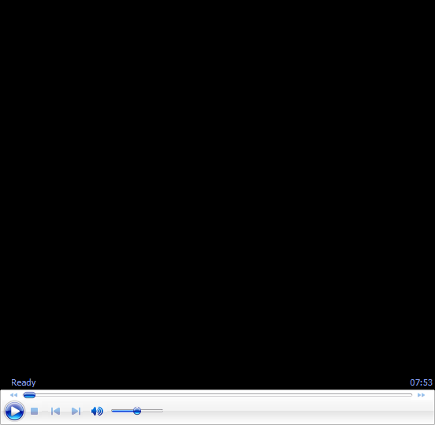

# The Osmosis Clinic: Backhand 

# John Yandell 

**How much do two-handers share and how much do they vary?**

What can you absorb when you watch the great two-handed backhand
players? In this article, we'll take a look at some of the
commonalities all two-handers share.

But we'll also look at the 4 major variations of the pro two-handel, a
groundbreaking analysis presented for the first time here on
Tennisplayer in our Advanced Tennis series ([Click
Here](http://www.tennisplayer.net/members/avancedtennis/john_yandell/two_handed_backhand/2hd_bh_simplest_complex/2hd_bh_simplest_complex.html)).

On Tennisplayer we are committed to bringing you the latest cutting edge
research, work that pushes the information envelope, and has
revolutionized how the two-handed backhand stroke is understood and
taught.

In these Osmosis articles, we are boiling this exhaustive and highly
detailed analysis down into a more succinct form. We are also presenting
it in a new audio/ video format, making it more similar to the
presentations I do at coaching conventions around the world. (To see the
first Osmosis article on the modern pro forehand, [Click
Here](John%20Yandell-The%20Osmosis%20Forehand%20.docx).)

So what is really going on in the strokes of the great two-handers? How
do the top players differ and how are they the same? When we look at pro
forehands there are obvious techncial differences that can be traced
back to fundamentals of grip. As we have seen, this is because there are
at least 6 different forehand grips used in the modern pro game. ([Click
Here.)](http://www.tennisplayer.net/members/avancedtennis/john_yandell/grips/modern_forehand_grip_variations_part1/modern_forehand_grip_variations_part1.html)

When we look at the two-handed backhand, the differences aren't as
obvious. The swings look far more similar from one player to the next.
Although there are some grip variations in the pro two-handers, these
are relatively minor compared to the forehands. In reality, however, the
technical differences between two-handed players are significant and
real, and understanding them is very important in constructing or
improving your own stroke.

Early in my teaching career, before we began to film players with high
speed video, I believed that the two-handed backhand was a relatively
simple shot that could be taught basically as a left-handed forehand,
with a little extra help from the other arm. Today, thanks to that video
research, we know it's more complex than that and the relationship
between the arms varies considerably from player to player. It's true
that one variation of the pro two-hander has the same primary technical
characteristics as a forehand hit with the opposite arm. But other
versions have very different combinations of front and back arm
dominance.

As with the forehand, there are certain factors that all good two
handers share in common, and other factors that are variables that can
be used with all the hitting arm combinations. So click on my
presentation below and let's try to create an overview of what to
consider in building a two-handed stroke that works for you!

# 

John Yandell is widely acknowledged as one of the leading videographers
and students of the modern game of professional tennis. His high speed
filming for Advanced Tennis and Tennisplayer have provided new visual
resources that have changed the way the game is studied and understood
by both players and coaches. He has done personal video analysis for
hundreds of high level competitive players, including Justine
Henin-Hardenne, Taylor Dent and John McEnroe, among others.

In addition to his role as Editor of Tennisplayer he is the author of
the critically acclaimed book Visual Tennis. The John Yandell Tennis
School is located in San Francisco, California.
