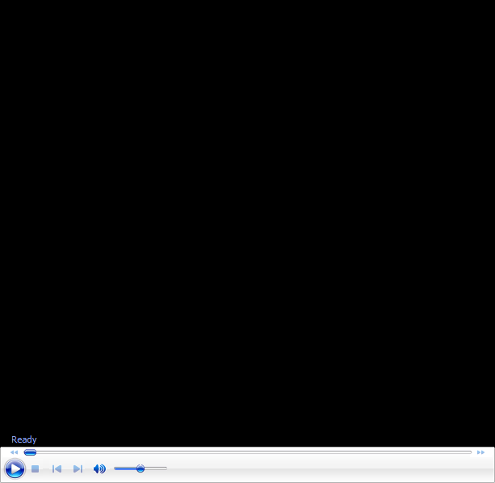

# The Osmosis Clinic: One-Handed Backhand

# John Yandell 

What should you watch for when you study the great one-handers play? In
past Osmosis articles we've looked at the forehand [link](John%20Yandell-The%20Osmosis%20Forehand%20.docx) and the
two-handed backhand [link](John%20Yandell-The%20Osmosis%20Clinic-Backhand.docx).

Now let's look at the one-handed backhand, including the similarities
and differences in the classic and extreme styles. Check it out in one
of our new audio/video segments below!

  -----------------------------------------------------------------------

  -----------------------------------------------------------------------

John Yandell is widely acknowledged as one of the leading videographers
and students of the modern game of professional tennis. His high speed
filming for Advanced Tennis and Tennisplayer have provided new visual
resources that have changed the way the game is studied and understood
by both players and coaches. He has done personal video analysis for
hundreds of high level competitive players, including Justine
Henin-Hardenne, Taylor Dent and John McEnroe, among others.

In addition to his role as Editor of Tennisplayer he is the author of
the critically acclaimed book Visual Tennis. The John Yandell Tennis
School is located in San Francisco, California.
