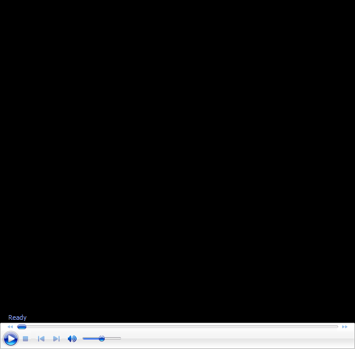

# John Yandell-Your forehand and the modern forehand-Grip and Contact Height

**John Yandell\
Your Forehand and the Modern Forehand**

# Grip and contact height

Over the past 4 years we\'ve used the high speed footage from Advanced
Tennis to explore the modern forehand in pro tennis in virtually every
aspect. Currently there are over a dozen detailed articles in the
Advanced Tennis section on the modern forehand. These cover the
commonalities and the differences among the top pro players. ([Click
Here](http://www.tennisplayer.net/members/avancedtennis/john_yandell/building%20_the_modern%20_forehand/building_modern_forehand_pg1/building_modern_forehand_pg1.html).)

{width="3.3333333333333335in"
height="2.5in"}

**What elements in the modern pro forehand really apply to your game?**

For me it\'s been a magical adventure and I have taken the time to go
into the detail that I think the complexity of the subject requires. But
I also feel that the time is now ripe to summarize what we\'ve learned,
and especially, to make it more accessible to everyone on Tennisplayer.

Many subscribers, I know, have mined these articles repeatedly. But I
also know from the emails I get that many players aren\'t aware of
everything we have done and of richness and depth of theses archives.

A recurring issue is what applies to whom. Although some readers have
mistaken my intent, I never said that every player should hit the
forehand like Roddick, or Nadal, or Federer\--not in all respects
anyway. I stated repeatedly that the main purpose was just to try to
understand the pro forehand. But now it\'s time to spell out how it
applies to your game.

So in \"Your Forehand and the Modern Forehand,\" we\'ll try to synthesis
everything we\'ve learned over the last few years, and simplify it as
much as possible. There will still be questions, but we\'ll try to lay
them out and suggest what options apply when for what levels. We\'ll
also do it in a new format, using voice over video commentary, which I
hope will bring a new immediacy and clarity to the analysis.

In this article we start with the controversial topic of Grips. If
you\'ve followed the previous articles you know that there is a huge
range of grip varations\--probably at least six distinct patterns in the
pro game. Should you base your grip on game style, ability level, or on
the player you most admire? Or, what about the critical and usually
unrecognized factor of Contact Height?

**Click on the image and see my analysis!**

{width="1.8263888888888888in"
height="2.6458333333333335in"}

John Yandell is widely acknowledged as one of the leading videographers
and students of the modern game of professional tennis. His high speed
filming for Advanced Tennis and Tennisplayer have provided new visual
resources that have changed the way the game is studied and understood
by both players and coaches. He has done personal video analysis for
hundreds of high level competitive players, including Justine
Henin-Hardenne, Taylor Dent and John McEnroe, among others.

In addition to his role as Editor of Tennisplayer he is the author of
the critically acclaimed book Visual Tennis. The John Yandell Tennis
School is located in San Francisco, California.
