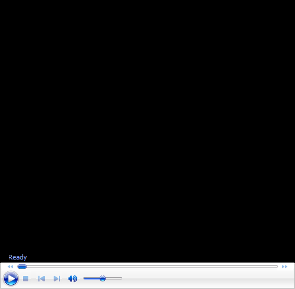

# John Yandell-Your forehand and the modern forehand-Shoulder Rotation

**John Yandell\
Your Forehand and the Modern Forehand**

# Shoulder Rotation

This month, we\'ll take a look at another common and controversial
technical component: torso rotation. Top players are rotating their
shoulders 90 degrees or more in the forward swing on many balls. How
does this factor work, when does it happen, and how does it apply to
your game?

{width="3.3333333333333335in"
height="2.5in"}

Shoulder rotation has become extreme in pro tennis, but how does this
apply to you?

{width="1.8263888888888888in"
height="2.6458333333333335in"}

John Yandell is widely acknowledged as one of the leading videographers
and students of the modern game of professional tennis. His high speed
filming for Advanced Tennis and Tennisplayer have provided new visual
resources that have changed the way the game is studied and understood
by both players and coaches. He has done personal video analysis for
hundreds of high level competitive players, including Justine
Henin-Hardenne, Taylor Dent and John McEnroe, among others.

In addition to his role as Editor of Tennisplayer he is the author of
the critically acclaimed book Visual Tennis. The John Yandell Tennis
School is located in San Francisco, California.
