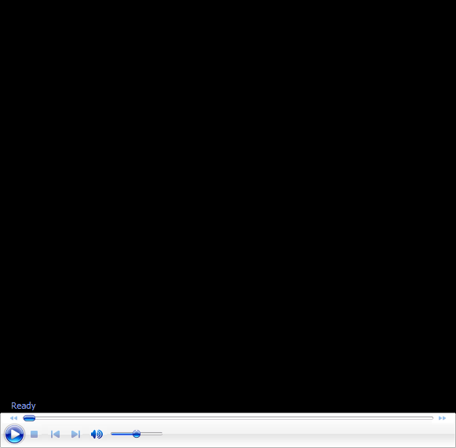

# John Yandell-Your forehand and the modern forehand-The Backswing Part 1 

**John Yandell\
Your Forehand and the Modern Forehand**

# The Backswing: Part 1 

This month we continue with \"The Backswing: Part 1.\" It's a
confusing, complex topic. So much so that it's going to take two
articles to sort it all out. So here's Part 1. Find out the real
purpose of the backswing and see what applies to your game in pro
tennis.

AND let us know what you think by posting a comment in the Forum!

John Yandell is widely acknowledged as one of the leading videographers
and students of the modern game of professional tennis. His high speed
filming for Advanced Tennis and Tennisplayer have provided new visual
resources that have changed the way the game is studied and understood
by both players and coaches. He has done personal video analysis for
hundreds of high level competitive players, including Justine
Henin-Hardenne, Taylor Dent and John McEnroe, among others.

In addition to his role as Editor of Tennisplayer he is the author of
the critically acclaimed book Visual Tennis. The John Yandell Tennis
School is located in San Francisco, California.
