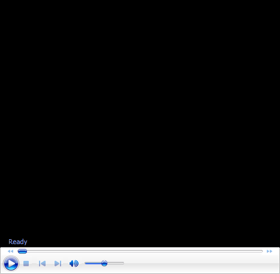

# John Yandell-Your forehand and the modern forehand-The Contact Point

**John Yandell\
Your Forehand and the Modern Forehand**

# The Contact Point

This month, we'll take a look at the key moment in the forehand\--the
contact point. How do you achieve it and how does it relate to your
position to the ball\--and especially to your hitting arm structure?

Contact is the key moment, but what are the characteristics of great
contact and how are they achieved?

John Yandell is widely acknowledged as one of the leading videographers
and students of the modern game of professional tennis. His high speed
filming for Advanced Tennis and Tennisplayer have provided new visual
resources that have changed the way the game is studied and understood
by both players and coaches. He has done personal video analysis for
hundreds of high level competitive players, including Justine
Henin-Hardenne, Taylor Dent and John McEnroe, among others.

In addition to his role as Editor of Tennisplayer he is the author of
the critically acclaimed book Visual Tennis. The John Yandell Tennis
School is located in San Francisco, California.
