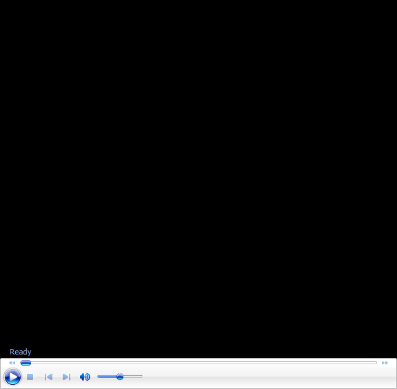

# John Yandell-Your forehand and the modern forehand-The Reverse Forehand

**John Yandell\
Your Forehand and the Modern Forehand**

# The Reverse Forehand

This month we\'ll look at the Reverse Forehand, a term first developed
by Robert Lansdorp to describe a forehand variation in which the racket
finishes on the same side that the swing starts, instead of across the
body.

Why and how do top players hit it? How can you develop it? And most
importantly, how should you incorporate it into your game?

How do top player\'s hit the reverse, and how applicable is it to your
game?

{width="3.3333333333333335in"
height="2.5in"}

{width="1.8263888888888888in"
height="2.6458333333333335in"}

John Yandell is widely acknowledged as one of the leading videographers
and students of the modern game of professional tennis. His high speed
filming for Advanced Tennis and Tennisplayer have provided new visual
resources that have changed the way the game is studied and understood
by both players and coaches. He has done personal video analysis for
hundreds of high level competitive players, including Justine
Henin-Hardenne, Taylor Dent and John McEnroe, among others.

In addition to his role as Editor of Tennisplayer he is the author of
the critically acclaimed book Visual Tennis. The John Yandell Tennis
School is located in San Francisco, California.
