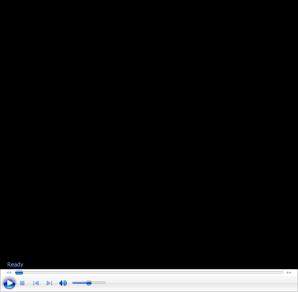

# John Yandell-Your forehand and the modern forehand-The Straight Elbow Hitting Arm Position

**John Yandell\
Your Forehand and the Modern Forehand**

**The Straight Elbow Hitting Arm Position**

Last month we looked at the most predominant forehand hitting structure,
the double bend arm configuration, where the hitting arm is bent at the
elbow and at the wrist. This month we look at the rare, more
controversial hitting arm structure - the straight elbow hitting arm
position - that a select few pro players use.

The Forward Swing Hand and Arm Extension This month we'll start to look
at the forward swing, possibly the most complex and dynamic element in
tennis. We'll try to understand what really happens and why there is so
much diversity among top players, by breaking the forward swing into two
components. This article will focus on Extension, with Rotation coming
up next month. Also, check out the classic lesson which adds additional
info on these two confusing and critical elements in developing a great
forehand of your own.

John Yandell is widely acknowledged as one of the leading videographers
and students of the modern game of professional tennis. His high speed
filming for Advanced Tennis and Tennisplayer have provided new visual
resources that have changed the way the game is studied and understood
by both players and coaches. He has done personal video analysis for
hundreds of high level competitive players, including Justine
Henin-Hardenne, Taylor Dent and John McEnroe, among others.

In addition to his role as Editor of Tennisplayer he is the author of
the critically acclaimed book Visual Tennis. The John Yandell Tennis
School is located in San Francisco, California.
