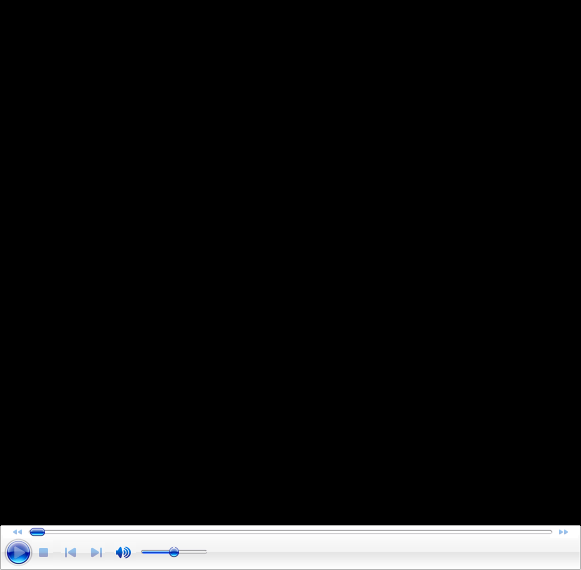
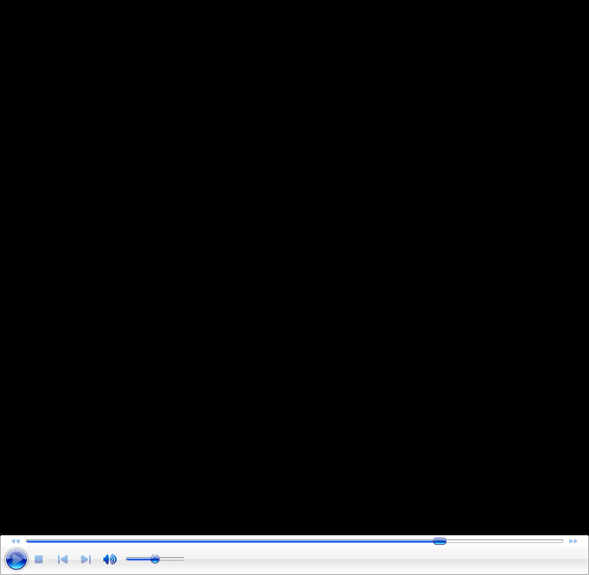

# John Yandell-Your forehand and the modern forehand

**John Yandell\
Your Forehand and the Modern Forehand**

[[Your Forehand and the Modern Forehand: A
Summary]{.underline}](https://www.tennisplayer.net/members/avancedtennis/john_yandell/your_forehand_and_the_modern_forehand/summary/index.html)\
[[The Contact
Point]{.underline}](https://www.tennisplayer.net/members/avancedtennis/john_yandell/your_forehand_and_the_modern_forehand/the_contact_point/the_contact_point.html)\
[[Shoulder
Rotation]{.underline}](https://www.tennisplayer.net/members/avancedtennis/john_yandell/your_forehand_and_the_modern_forehand/shoulder_rotation/shoulder_rotation.html)\
[[The Reverse
Forehand]{.underline}](https://www.tennisplayer.net/members/avancedtennis/john_yandell/your_forehand_and_the_modern_forehand/reverse_forehand/reverse_forehand.html)\
[[The Forward Swing Part 2: Hand and Arm
Rotation]{.underline}](https://www.tennisplayer.net/members/avancedtennis/john_yandell/your_forehand_and_the_modern_forehand/hand_arm_rotation/hand_arm_rotation.html)\
[[The Forward Swing Part 1:
Extension]{.underline}](https://www.tennisplayer.net/members/avancedtennis/john_yandell/your_forehand_and_the_modern_forehand/the_forward_swing/the_forward_swing.html)\
[[Hitting Arm Positions: The Straight Elbow Hitting Arm
Position]{.underline}](https://www.tennisplayer.net/members/avancedtennis/john_yandell/your_forehand_and_the_modern_forehand/hitting_arm_positions/your_forehand_and_the_modern_forehand_straight_elbow_arm_position.html)\
[[Hitting Arm Positions: The Double
Bend]{.underline}](https://www.tennisplayer.net/members/avancedtennis/john_yandell/your_forehand_and_the_modern_forehand/hitting_arm_positions/your_forehand_and_the_modern_forehand_hitting_arm_positions.html)\
[[Backswing: Part
2]{.underline}](https://www.tennisplayer.net/members/avancedtennis/john_yandell/your_forehand_and_the_modern_forehand/backswing_part2/your_forehand_and_the_modern_forehand_backswing_part2.html)\
[[Backswing: Part
1]{.underline}](https://www.tennisplayer.net/members/avancedtennis/john_yandell/your_forehand_and_the_modern_forehand/backswing/your_forehand_and_the_modern_forehand_backswing.html)\
[[Grip and Contact
Height]{.underline}](https://www.tennisplayer.net/members/avancedtennis/john_yandell/your_forehand_and_the_modern_forehand/grip/your_forehand_and_the_modern_forehand_grip.html)\
[[Preparation]{.underline}](https://www.tennisplayer.net/members/avancedtennis/john_yandell/your_forehand_and_the_modern_forehand/preparation/your_forehand_and_the_modern_forehand_preparation.html)

# Preparation

Over the past 4 years we've used the high speed footage from Advanced
Tennis to explore the modern forehand in pro tennis in virtually every
aspect. Currently there are over a dozen detailed articles in the
Advanced Tennis section on the modern forehand. These cover the
commonalities and the differences among the top pro players. ([Click
Here](https://www.tennisplayer.net/members/avancedtennis/advtennis.html).)

Last month we started a new series called \"Your Forehand and the Modern
Forehand.\" The idea is to apply everything we've learned to your game
and see what pro elements are universal and which are a function of
primarily of level of play.

Although some readers have occasionally mistaken my intent, in my
previous articles I never said that every player should hit the forehand
like Roddick, or Nadal, or Federer\--not in all respects anyway. I
stated repeatedly that my was just to try to understand the pro
forehand, a challenging goal to say the least. But now it's time to get
specific and see what pro elements you can incorporate to take your game
to the next level. In the first article, we started with an analysis of
Grip and Contact Height. ([Click
Here](https://www.tennisplayer.net/members/avancedtennis/john_yandell/your_forehand_and_the_modern_forehand/grip/your_forehand_and_the_modern_forehand_grip.html).)

This month we'll continue with Part 2 \"Preparation.\" It's a subject
that is widely misunderstood. I think this article is the best analysis
of forehand preparation that I've done or seen on the site, or
honestly, anywhere else.

So see what you think and let's know by posting a comment in the Forum!

**What are the secrets to great preparation and why is it so
misundertood?**

**[.]{.underline}**

# Grip and contact height

Over the past 4 years we've used the high speed footage from Advanced
Tennis to explore the modern forehand in pro tennis in virtually every
aspect. Currently there are over a dozen detailed articles in the
Advanced Tennis section on the modern forehand. These cover the
commonalities and the differences among the top pro players. ([Click
Here](http://www.tennisplayer.net/members/avancedtennis/john_yandell/building%20_the_modern%20_forehand/building_modern_forehand_pg1/building_modern_forehand_pg1.html).)

**What elements in the modern pro forehand really apply to your game?**

For me it's been a magical adventure and I have taken the time to go
into the detail that I think the complexity of the subject requires. But
I also feel that the time is now ripe to summarize what we've learned,
and especially, to make it more accessible to everyone on Tennisplayer.

Many subscribers, I know, have mined these articles repeatedly. But I
also know from the emails I get that many players aren't aware of
everything we have done and of richness and depth of theses archives.

A recurring issue is what applies to whom. Although some readers have
mistaken my intent, I never said that every player should hit the
forehand like Roddick, or Nadal, or Federer\--not in all respects
anyway. I stated repeatedly that the main purpose was just to try to
understand the pro forehand. But now it's time to spell out how it
applies to your game.

So in \"Your Forehand and the Modern Forehand,\" we'll try to synthesis
everything we've learned over the last few years, and simplify it as
much as possible. There will still be questions, but we'll try to lay
them out and suggest what options apply when for what levels. We'll
also do it in a new format, using voice over video commentary, which I
hope will bring a new immediacy and clarity to the analysis.

In this article we start with the controversial topic of Grips. If
you've followed the previous articles you know that there is a huge
range of grip varations\--probably at least six distinct patterns in the
pro game. Should you base your grip on game style, ability level, or on
the player you most admire? Or, what about the critical and usually
unrecognized factor of Contact Height?

**Click on the image and see my analysis!**

# The Backswing: Part 1 

This month we continue with \"The Backswing: Part 1.\" It's a
confusing, complex topic. So much so that it's going to take two
articles to sort it all out. So here's Part 1. Find out the real
purpose of the backswing and see what applies to your game in pro
tennis.

AND let us know what you think by posting a comment in the Forum!

# The Backswing: Part 2

This month we continue with \"The Backswing: Part 2.\" Amazing that it
takes two parts! But when you really start looking at this complex and
misunderstood motion frame by frame, it's amazing. No two pros do the
same thing, and none of the usual teaching descriptions seem accurate.
So what is really happening\--and what should you apply, or not, in your
own game? That's what this article is all about.

AND let us know what you think by posting a comment in the Forum!

# 

# Hitting Arm Positions: The Double Bend

Last month we looked at the most predominant forehand hitting structure,
the double bend arm configuration, where the hitting arm is bent at the
elbow and at the wrist. This month we look at the rare, more
controversial hitting arm structure - the straight elbow hitting arm
position - that a select few pro players use.

  --------------------------------------------------

  --------------------------------------------------

# The Straight Elbow Hitting Arm Position

Last month we looked at the most predominant forehand hitting structure,
the double bend arm configuration, where the hitting arm is bent at the
elbow and at the wrist. This month we look at the rare, more
controversial hitting arm structure - the straight elbow hitting arm
position - that a select few pro players use.

The Forward Swing Hand and Arm Extension This month we'll start to look
at the forward swing, possibly the most complex and dynamic element in
tennis. We'll try to understand what really happens and why there is so
much diversity among top players, by breaking the forward swing into two
components. This article will focus on Extension, with Rotation coming
up next month. Also, check out the classic lesson which adds additional
info on these two confusing and critical elements in developing a great
forehand of your own.

# The Forward Swing Hand and Arm Extension

# 

# 

# This month we'll start to look at the forward swing, possibly the most complex and dynamic element in tennis. We'll try to understand what really happens and why there is so much diversity among top players, by breaking the forward swing into two components. This article will focus on Extension, with Rotation coming up next month. Also, check out the classic lesson which adds additional info on these two confusing and critical elements in developing a great forehand of your own.

# 

# 

# The Forward Swing Hand and Arm Rotation

This month we'll start to look at the forward swing, possibly the most
complex and dynamic element in tennis. We'll try to understand what
really happens and why there is so much diversity among top players, by
breaking the forward swing into two components.

This month focuses on Hand and Arm Rotation, how the top player create
the windshield wiper finish, how to create it yourself, and how it
applies to your game. 

**How should you incorporate hand and arm rotation into your forehand?**

# The Reverse Forehand

This month we'll look at the Reverse Forehand, a term first developed
by Robert Lansdorp to describe a forehand variation in which the racket
finishes on the same side that the swing starts, instead of across the
body.

Why and how do top players hit it? How can you develop it? And most
importantly, how should you incorporate it into your game?

How do top player's hit the reverse, and how applicable is it to your
game?

# Shoulder Rotation

This month, we'll take a look at another common and controversial
technical component: torso rotation. Top players are rotating their
shoulders 90 degrees or more in the forward swing on many balls. How
does this factor work, when does it happen, and how does it apply to
your game?

Shoulder rotation has become extreme in pro tennis, but how does this
apply to you?

# The Contact Point

This month, we'll take a look at the key moment in the forehand\--the
contact point. How do you achieve it and how does it relate to your
position to the ball\--and especially to your hitting arm structure?

Contact is the key moment, but what are the characteristics of great
contact and how are they achieved?

# A Summary

**Is it possible to summarize the modern forehand in one article? You be
the judge\...**

Over the past 4 years we've used the high speed footage from Advanced
Tennis to explore the modern forehand in pro tennis in virtually every
aspect. Currently there are over a dozen detailed articles in the
Advanced Tennis section on the modern forehand. These cover the
commonalities and the differences among the top pro players.( [Click
Here.](https://www.tennisplayer.net/members/avancedtennis/advtennis.html))

In this new series called \"Your Forehand and the Modern Forehand,\"
we've applied everything we've learned to your game and see what pro
elements are universal and which are a function of primarily of level of
play.

This marks the 12th full article devoted to the beautiful and
tremendously dynamic motion we call the forehand. We've covered
everything from grip to preparation to hittting arm positions, finishes,
wipers and more. Now in this last article, we try to summarize all the
components and see what we've learned.

John Yandell is widely acknowledged as one of the leading videographers
and students of the modern game of professional tennis. His high speed
filming for Advanced Tennis and Tennisplayer have provided new visual
resources that have changed the way the game is studied and understood
by both players and coaches. He has done personal video analysis for
hundreds of high level competitive players, including Justine
Henin-Hardenne, Taylor Dent and John McEnroe, among others.

In addition to his role as Editor of Tennisplayer he is the author of
the critically acclaimed book Visual Tennis. The John Yandell Tennis
School is located in San Francisco, California.
