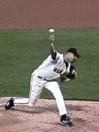
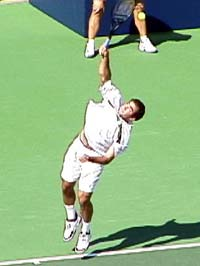

# Myth of the Pitch

# John Yandell

\"Serving is just like pitching a baseball.\" Probably everyone who ever
took a serving lesson has heard this claim. It's is one of the most
common myths in teaching. Unfortunately, it's not an accurate
description. It's of minimal value in learning to serve and can even be
counterproductive. This is especially true if the student has actually
played baseball and can throw or pitch well.

**Is this the model for the serve? How much does the serve really have
in common with the pitching motion in baseball?**

Actually the baseball pitching analogy is part of a larger category of
misleading analogy myths. Hitting a one-handed backhand is \"just like\"
drawing a sword out of scabbard. Hitting a forehand volley is \"just
like\" throwing a punch. **Then there's a teaching pro, and a regular
correspondent who insists that serving isn't really like throwing a
ball at all. Really, it's just like throwing a javelin!**

There are two related problems with these analogies. First, rather than
simplifying our explanations of the strokes, they actually make them
more complex. ***[What a tennis serve most resembles isn't a baseball
pitch, a javelin throw, or any other motion from any other
sport.]{.mark}*** The motion a tennis serve most resembles is a tennis
serve! Why try to hit a serve by emulating a motion from some other
sport that may be bio-mechanically completely different?

**Which brings me to the second problem with these analogies. They
imply that we can't really understand tennis strokes on their own
terms.** They have to be compared to other motions
so we can learn them. This is not only misleading, it makes tennis seem
like a second rate sport. Tennis strokes are among the most beautiful
and complex motions in all of sports. They deserve to be understood and
taught on their own terms. Imagine a baseball coach trying to tell a
pitcher that a fastball is really just like a first serve.

**The bio-mechanics of the serve have little in common with the pitching
motion and should be understood on its own terms instead of through
confusing analogies.**

To examine the limited and often counterproductive value of the myth of
the pitch, let's compare the delivery of Jason Schmidt, one of the top
pitchers in the National League, to Pete Sampras, one of the great
servers in tennis history. By comparing a major league pitching motion
side by side with Pete's serve, we'll see that the differences vastly
out way the similarities.

**The Obvious Differences**

Take a look at the animations of the two motions and several major
differences are obvious. ***[The first and most obvious difference is
that tennis is played by striking the ball with an implement, that is, a
tennis racquet. A pitcher pitches holding a ball in his bare
hand.]{.mark}***

**[Second, the balls are quite different. In addition to being made with
completely different materials, a baseball is a about one third larger
than a tennis ball, weighs more than twice as much, and has protruding,
stitched seems.]{.mark}**

***[A third major difference is the trajectories of the two balls. With
the racquet in his hand, a player of roughly Pete's height makes
contact with the ball about 10 feet above the court. A pitcher of the
same size releases the ball at a height of about 6 feet above the
ground\--about 4 feet lower than the height of the serve at
contact.]{.mark}***

**Relative trajectories of a tennis serve and a baseball pitch**

The starting points of the pitch and the serve are therefore quite
different. So are the ensuing flight paths. A pitch travels about 60
feet and passes through the strike zone at height of around 3 feet. It
travels on a fairly straight line, dropping at most about 3 feet over
it's entire flight. If things go according to plan, it never touches
the ground.

 

**Two characteristics both motions share: the ability to rotate the arm
internally backward from the shoulder, and the resulting pronation after
the hit or ball release.**

The serve on the other hand starts much higher and travels more steeply
downward, bouncing at about 60 feet, the same distance at which a pitch
crosses the plate. After the bounce, it rebounds to a height of about
four feet and travels an additional 20 feet. The total distance the
serve travels is around 80 feet, 20 feet more than the path of the
baseball.

Unlike the relatively straight flight of the baseball, the flight path
of the tennis ball is in the shape of a double arc, the first arc from
the contact to the bounce, and the second smaller arc from the bounce to
the receiver.

The charts show how different these flight paths really are. Given these
differences, it is no wonder that the bio-mechanics are so different as
well, as our comparisons of the key positions in the motions will make
clear.

**Two Points in Common**

So let's turn to the bio-mechanics, and compare the positions of the
body at various stages in the two motions. Let's start by acknowledging
the two points that the motions really do share in common.

First, there is the relatively low level of muscle tension in the body.
If you watch the great pitchers, their motions have a silky, relaxed
feeling, and this is certainly similar to great servers.

Second, there is one major technical point in common. Servers and
pitchers both have significant internal arm rotation and extensive
pronation in their deliveries. In fact, the more natural internal arm
rotation a player has, the more natural ability to serve or pitch, and
the more extreme the pronation.

 

**Note the differences in the shoulders and the feet. Jason starts
basically facing the target zone. Pete begins with the feet and
shoulders turned at about 90 degrees.**

Pete, for example, can achieve a full racquet drop with his elbow and
upper arm almost horizontal or parallel to the court. This is because of
his natural ability to rotate the arm backward from the shoulder an
ability he shares with most major pitchers including Jason.

Beyond these two points, however, there is little or nothing about the
position of their bodies or arms that is the same. The differences
vastly outweigh the similarities, as we shall see, and this is why the
pitch is such a poor model for developing the serve.

**Starting Stance**

Let's begin by comparing the starting stances. Pete starts with his
torso sideways to the net. His left foot is in front and his right foot
is set behind. Jason's torso is square or parallel to home plate. His
feet are also parallel to this same line. And just to repeat the
obvious: Pete has a racquet in his dominant hand, not a baseball.

 

**Pete has his weight coiled primarily on the front leg, while Jason's
front leg is kicking back toward his chest! Note also the angle of the
torsos.**

### The Contact Point/Release

###  

### A core difference: at contact Pete has uncoiled upward into the air, while Jason has both feet planted in a wide stance.

Note how Pete makes contact in the air. This is the difference in the
role of the legs. The uncoiling is driving his entire body and his arm
and racquet upward toward the ball.

Jason is shifting his weight forward and is firmly planted.

Obviously, the contact point for Pete is much higher than the pitching
release of the ball. The result is the differing trajectories of the
ball described above.

Also note again the angle of the torso. Due to the tossing position and
the \"left launch,\" [(Click
here)](https://www.tennisplayer.net/members/worldclassstrokes/john_yandell/sampras_serve/sampras_serve_left_launch_part6_images/sampras_serve_left_launch_part6.html),
Pete's torso is leaving the court at a angle to his left. Jason is
almost perfectly straight up and down from the waist.

Finally, there is the position of the head. Pete has perfect head
position, looking up at the moment of contact, even with his toss fairly
far to the left. [(Click here for Pete's
Toss)](https://www.tennisplayer.net/members/worldclassstrokes/john_yandell/sampras_serve/sampras_serve_tossingarm_part3_pg1_images/sampras_serve_tossingarm_part3_pg1.html).
Jason, on the other hand, is looking forward, with his head toward the
target zone.

### Body Rotation

A key difference is in the rotational sequence in the two motions.
Whereas the pitcher releases the ball with his torso already facing the
batter, the server is still rotating his torso and is at about a 45
degree angle to the net at the time of contact.

|  |  |
| #### **A pitcher rotates his torso ahead, parallel to the target zone while his arm lags behind. At the same point in the motion, Pete's shoulders are still about 60 degrees to the baseline.** |  |

If a tennis player with a good feel for throwing a baseball took the
pitch analogy seriously, he would rotate far too early and end up with
his torso much too far around at contact.

In fact, a top Norcal senior player, who was once a Division 1 college
pitcher, suffers from this exact problem. His feeling for the release of
the pitch leads him to severely over rotate at contact on his serve. The
bio-mechanical pattern is so deeply ingrained in his muscle memory that
he has never been able to correct it, \\despite his keen awareness of
the problem and of the loss of power it is causing in his serve.

Pros who advocate the throwing analogy can unwittingly cause this
fundamental problem for their students, particularly those with a strong
background in baseball.

The pitcher tends to whip his torso around while the arm lags behind.
This may allow him to generate velocity with a heavy ball held directly
in the hand, but on the serve, this dissipates energy in the service
motion and is widely recognized as a technical flaw, for example in the
motion of a player such as Anna Kournikova.

|  |  |
| #### **Modeling the serve on the pitching motion can lead to a disastrous bend at the waist on the followthrough.** |  |

### Followthrough

The angle of the torso after the release/hit is also radically different
in the two motions. A good \\pitcher, as the animation shows, can end up
bent over at the waist almost 90 degrees as he follows through after the
release. Tennis players in contrast stand up much straighter at the
waist with their shoulders and hips more closely in line. This probably
has to do with the lower trajectory taken by the baseball.

***[Again, as any good teaching pro knows, bending too much at the waist
is a disaster on the serve. It's a common problem with junior players
and even effects top pros like Venus Williams. The throwing analogy,
taken seriously, can encourage these torso movements-early rotation and
bending at the waist. Both are destructive to the serve.]{.mark}***

|  |  |
| #### **The pitcher releases with both feet on the ground. The server uncoils and leaves the court before contact.** |  |

### The Legs

The use of the legs is another important, radical difference between the
pitch and the serve. The tennis player coils the knees and launches
upward and only slightly forward to the ball, making contact with both
feet in the air, landing about 2 feet inside the court. The server lands
on his front foot and with his feet about the same distance apart as
they where at the start of the motion.

The baseball pitcher, by contrast, releases the ball from a very wide
stance with both feet planted firmly on the ground.

During the wind up the pitcher raises his front leg, bends his knee, and
brings his thigh back almost to his chest. He then takes a gigantic step
forward and plants virtually all his weight on the front foot just prior
to the release. The back foot remains back, far behind the front, and is
also on the ground. The width of his stance at this point can be 5 feet
or more.

  ----------------------------------------------------------------------------------------------------------------------------------------------------------------------------
  \
  **Here Pete has transferred his weight to his front leg on his way to the net.**
  ----------------------------------------------------------------------------------------------------------------------------------------------------------------------------

  ----------------------------------------------------------------------------------------------------------------------------------------------------------------------------

Anyone who has ever played baseball is familiar with this feeling of
stepping, planting, and throwing. Stepping into the serve, on the other
hand, is a recipe for bio-mechanical disaster. Stepping with the front
foot leads to foot faults and late contact behind the plane of the body.
Stepping with the back foot causes over rotation in the torso. Stepping
with the back foot can also cause the head and shoulders to drop too
soon in the motion.

**[Finally, note the position of the rear leg. When Pete lands in the
court, his back or rear leg is in the air. This is the technical end of
the motion. He has landed on balance on the front foot, and now has the
option to either take the next step forward to the net, or recover into
the ready position if he plans to stay back.]{.mark}**

Compare this to Jason's leg. There is a long, almost lazy cross step
forward and across his body with his back foot, the natural effect of
the continuing momentum of his delivery. Unlike Pete, who takes this
step as part of a movement pattern forward, the step for the pitcher is
a natural consequence of the delivery. For the tennis player, stepping
through the motion in any way that approximates the pitch is a technical
kiss of death.

|    |  |  |
| #### **In contrast to Sampras above, the pitcher's weight remains on the front foot and the back leg has taken a long lazy step forward.** |  |  |

Rather than stretching for analogies in other sports, the key to the
serve as well as the other strokes in tennis is a careful analysis of
the stroke itself. This is the point of many of our series articles,
such as the one on Pete' serve, as well as Stroke Archive

With the [Stroke
Archive](https://www.tennisplayer.net/members/strokearchive/strokearchive.html)
you have the chance to see exactly what the top players are doing at
each key moment in all the strokes and to use these players as physical
and visual models for your own game. Doesn't that sound like a better
idea-modeling your serve on a great server\--instead of an athlete from
some other sport that isn't even played with a tennis racquet?

John Yandell is widely acknowledged as one of the leading videographers
and students of the modern game of professional tennis. His high speed
filming for Advanced Tennis and Tennisplayer have provided new visual
resources that have changed the way the game is studied and understood
by both players and coaches. He has done personal video analysis for
hundreds of high level competitive players, including Justine
Henin-Hardenne, Taylor Dent and John McEnroe, among others.

In addition to his role as Editor of Tennisplayer he is the author of
the critically acclaimed book Visual Tennis. The John Yandell Tennis
School is located in San Francisco, California.
