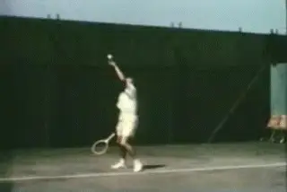

# The Modern Volley

### Bill Mountford

**Volley techniques have changed in the \"modern\" game.**

There is so much written about the \"modern game,\" and how techniques
and tactics have evolved and differ from the past. Most of this
discussion has been over groundstrokes, especially the forehand, and the
serve.

Less time has been spent doing the same for the volley. In part this is
because of how infrequently the players are coming forward. But the fact
is that when players do get to the net, or near to it anyway, the shots
they play have evolved. This article will explore those changes and the
modern techniques that are necessary for success.

Why aren't players rushing the net more regularly? Certainly the
returns of serves at the professional level have taken a quantum leap
forward in the past two decades. It used to be that servers, even at the
top of the sport, would aim most deliveries toward the backhand and
rarely would the return get blistered past them. This is positively no
longer the case.

**Aggressive returns have blunted serve and volley play.**

Returning aggressively is an acquired skill, but it is also an attitude.
Developing junior and even recreational players take their cue from the
top professionals and have grown increasingly bold when returning serve,
so this influence has certainly trickled down. This has subsequently
made serving and volleying less appealing as a regular tactic. This
change has become self-perpetuating. Developing players are not seeing
the best players rushing the net. Therefore they do not rush the net
themselves. Naturally, they tend to imitate the various baseline
game-styles on display.

**Polyester and the Net**

The biggest technological advance in equipment since (probably) the
oversize racquet has been the proliferation of polyester strings. As
recently as five years ago, most professionals were still using natural
gut. At the 2006 US Open, 75% of ALL players had their racquets strung
with the exact same poly-string. Virtually all of the rest used a
gut/polyester hybrid. Only a handful used all natural or synthetic gut.

The move to polyester is significant for two reasons. First, it is
easier to nail groundstrokes at sonic speed with polyester string. The
polyester strings give the ball more \"bite\" and enable players to hit
sharply angled shots with considerable pace.

**Are the new strings part of the explanation for the spins and
angles?**

One hypothesis I have considered is that there are differences between
Roger Federer and Pete Sampras that can be explained by the change in
string. The players use similar racket frames, but Federer is able to
create more angles off the ground than Sampras ever did. Volleying, or
trying to volley, against these fierce, dipping balls is particularly
challenging. Yes, as some of the articles on Federer's forehand have
explored, he has tremendous variety in the way he rotates the hand and
arm, and this is partially responsible for his ability to hit phenomenal
angles and spin. But is it possible that the bite and the resulting spin
from the poly-string is one of the things that makes this possible?

How does all this relate to the volley itself? According to no less of
an authority than John McEnroe, it is more difficult to \"feel\" the
volley with polyester strings. While the polyester strings help on the
serves, returns, and groundstrokes, they are not advantageous for the
volleyer.

**The \"Big Game\" was a simple idea\--get to net as quickly as
possible.**

In the Big Game era, Jack Kramer had a simple formula for \"high
percentage\" tennis. Rush the net behind a deep, well-placed serve
(almost always to the backhand). In the return game, approach
down-the-line at the earliest opportunity (if not immediately on the
return). Keep coming forward to volley while daring your opponent to
attempt risky passing shots or lobs.

This style worked for players at all levels for decades. I was lucky
enough to speak with Kramer's old doubles partner Ted Schroeder about
this, before he sadly passed away a few months ago. I asked Ted how he
would have played on clay against the best baseliners of this current
era. The answer wasn't surprising. A former Wimbledon and US Nationals
champion, the feisty Schroeder explained that he would rally crosscourt
until he earned a short ball and then approach down-the-line and then
follow that with a winning volley. \"Simple as can be,\" Schroeder said.
Maybe. But I am not so sure he would have felt that way after a few
matches on center court against Rafael Nadal and David Nalbandian
playing with the new rackets and strings.

So, then, why should we as coaches even urge our students to become
proficient around the net if so few professionals are inclined to rush
forward themselves? Our students often learn by watching their heroes
even more than they learn by listening to their coaches, so succeeding
in that effort can be a tall order. Is it worth it? Yes and I think the
reasons are compelling.

**For Federer a few points at the net helped him beat Nadal.**

With the ballistic nature of modern groundstrokes, knowing how to seize
the initiative by moving forward after hurting an opponent is about more
than just having a complete game. It's often the difference in top
professional matches. Championship matches are often decided by ten
points or less. Even when the actual number of total points decided at
the net is relatively few, it can surely tip the balance.

People ask why Federer doesn't volley more, but take a look at what
happens when he does. In the Wimbledon final versus Nadal, Federer won
133 points. Nadal won 113 points. Of that 20 point difference,
Federer's positive margin on net points accounted for 13, or 65% of his
winning margin. It was similar in Shanghai: Federer won 75 points, Nadal
65. Of those 10 points, Federer's margin at the net accounted for
8\--this time 80% of the difference in the match.

Is the real point that Federer doesn't go to the net that much? Or is
it that Federer knows when he can go to the net on opportunities that
make the difference in wining the biggest titles in tennis?

**How hard would you work if you knew your volley could be the
difference?**

You don't just get lucky and somehow execute a huge swinging forehand
volley, backed up by a stretch backhand volley angled winner, the way
Federer did when Nadal was serving at 4-5 in the second set in Shanghai.
The ability to make those kinds of shots at crucial moments in big
matches can be traced back to the fundamentals of a player's
development as a junior.

When you see one or two brilliant volleys, what you are actually seeing
is the pay-off from hundreds of hours of concentrated effort.
Interestingly this is the type of work that Federer still embraces, even
as the top-ranked professional, as evidenced by his hiring of Tony Roche
and the strides they have made in rounding out an already
nearly-flawless game.

If you were an aspiring junior, would you put in that kind of work if
you thought that it might give you the ten magic points you need to win
the Masters or a Grand Slam title? Would you do it even if you knew you
were going to play 90% of all your points from the baseline? Would it
still be worth it? Maybe more juniors should ask themselves that
question.

Even if few players will ever match Federer's grace at the net, it does
not require brilliant technique to block a ball into the open court
after you have worked your opponent six steps out of court with your
huge serve and or groundstrokes. Andy Roddick has proved this at times,
and there is a reason that he continues to work on his volleys and
continues to use them more.

**If you open the court far enough, it's easy to hit volley winners.**

At a more prosaic level, what if your aggressive baseline game is just
not as good as your opponent's aggressive baseline game? Then either
you lose, or you need another option to help you win points and, perhaps
more importantly, disrupt the natural rhythm of your confident opponent.
Playing some good volleys, or even just the process of rushing the net
and forcing your opponent to pass, can often accomplish this. Again,
most players never find out if this option will work for them because
they don't try it very often.

Tactically speaking, it makes sense to occasionally serve and volley
against players who return powerful (first) serves with a block return
to force them into playing a more ambitious return. Many returners are
conditioned to block these hard serves back deep and down the middle of
the court and that should make for an easy ball to volley when the
returner is not expecting to see you there.

Finally, As Bobby Bernstein noted in an article on the pro return,
players are playing returns of second serves (which are usually high
kickers, in the men's game anyway) from well behind the baseline. A few
serve and volley forays behind the second serve will force your opponent
to become much more precise with his return. If the opponent is ten feet
behind the baseline in the ad court, all it takes is a moderately
competent volley to win the point.

**What if you actually want to play doubles?**

Robert Kendrick used this play very effectively in his near-upset of
Rafael Nadal during the 2006 Wimbledon. After his huge first serve,
Kendrick often stayed back and looked to blast a forehand. But he would
serve and volley behind his second serve to avoid an extended rally with
Nadal. It was a clever and effective tactic.

**Doubles**

There are more reasons. Do you wish to become a solid doubles player?
This is not always a leading priority for top-ranking juniors, but the
reality of the situation is that becoming proficient in doubles can make
the difference in determining who receives scholarship consideration
from the best colleges. Certainly, becoming a sound doubles player could
help you earn a spot in the starting lineup that otherwise might have
gone to someone else.

Even on the pro tour the same principle applies. At any given time,
there are a few dozen players making a good living playing professional
doubles. Many of these players, no matter how talented, were unable to
succeed financially in the insanely competitive world of tour singles.

**Many pro volleys can still be hit with \"classic\" technique.**

Finally, it might be irrelevant to the players, but points at the net
are often much better for spectators. The entertainment value is
increased when the points are shorter and more dramatic, ending with a
dominating volley or a spectacular pass. For this reason alone, more net
play would be good for the game.

**The Three Modern Volleys**

How do you teach the Modern Volley? First of all, we have to define the
stroke as \"volleys\" plural, and not simply volley. When I was growing
up, the standard lessons and instructional articles would demonstrate
how to hit \"the\" volley. It was a short-sighted viewpoint, because
there are so many variances when playing a ball out of the air while
moving forward.

**Classic, Block, and Swing**

I'll talk about a few more less common variations below, but let's
start by looking at the three most common modern volleys. What I call
the Classic Volley, the Block Volley, and the Swing Volley.

**A block volley can deal with the speed of the modern game.**

In the modern pro game there are fewer opportunities to hit volleys, but
in most cases the best choice for these opportunities will still be a
Classic Volley. This is first type of volley that most teaching
professionals were taught as juniors. Sometimes this is called a punch
volley, although I prefer the term \"push\" because it more closely
describes that movement than it does a \"punch.\" I use the word
\"push,\" because in the classic volley the shoulders rotate forward
while driving or pushing the arm and racket toward and through the
contact.

But what if the ball is really railed toward you? There is not enough
time for the classic motion. The second type of volley, to deal with
this type of ball, is a Block Volley. Maintain a firm grip (squeezing
with your ring and pinky fingers) and keep your elbow near to your body.
There is very little movement of the racquet head as simply trying to
center the ball on your strings is of paramount importance.

If the ball is floating slowly through the air, the third option is the
Swing Volley. Players should be encouraged to take a more ambitious
backswing to assure they produce more racquet head speed. The best way
to learn this Swing Volley is through trial and error. How long is too
long on the swing? When you start to miss, you then shorten it up a
little. Bob and Mike Bryan, the best doubles players in the world, take
very lengthy swipes at slow moving balls.

**When the ball is slower and higher, expand the backswing.**

**The \"Correct\" Grip**

So how should you hold the racquet for these variations? I have heard,
and even engaged in, some arguments over the proper grip for most
volleys. Some would argue that the Continental grip is ideal; others
would state that there is room and time to switch to a stronger Eastern
(or an Eastern hybrid, anyway) for forehands and an Eastern backhand
grip for backhand volleys. My own opinion is that there is no such thing
as the \"correct\" grip. Instead, there must be a \"range of good.\"

A few examples of sensational net rushers who bucked the trend of the
\"correct grip\" for volleys were Boris Becker and Patrick Rafter.
Becker seemed to grip the racquet a little \"too far under\" on his
forehand volley than would be considered conventional. Rafter had
arguably the finest backhand volley over the past fifteen years, yet he
hit many of them with a \"weaker\" Continental grip (perilously close to
an Eastern forehand grip) for some backhand volleys.

**Rafter and Becker: two champions with slightly unconventional grips**

Interestingly, both of these big, strong, athletic players used size 4
3/8\" grips. Given their size and strength, they were able to grip the
racquet handle \"wrong\" but hit the ball plenty \"right.\"

This was a harbinger of the future because handle sizes are smaller than
ever these days. Rafael Nadal, a muscular 6' 2\" athlete, plays with a
4 1/4\" grip. For perspective, Chrissie Evert played with a 4 5/8\" grip
throughout her career. This is relevant because with a smaller handle
size it is easier to hold the racquet \"incorrectly\" yet still play
volleys effectively. Manipulating the racquet with a smaller handle is
easier. To be clear, a small handle does not automatically dictate a
non-traditional grip, as Roger Federer uses a 4 3/8\" grip and has
classic technique.

Finding a \"range of good\" when deciding on the best and/or most
versatile grip or grips for the volleys is something players and coaches
need to work out individually. Floating your hand on the handle is
becoming all the more common. A player with excellent technique for
\"normal\" volleys (like Bob/Mike Bryan), could just as easily switch to
a semi-western grip for a slow floater. In fact, they almost always do
exactly that. The best way for any player to find their own brand of the
\"range of good\" comes with repeated live-ball, or play-based,
practice.

**The swinging mid court volley is an established shot on the tour.**

**Other Modern Volleys**

Aside from the three most common volleys, there are several other
variations that are used frequently by top professionals and crafty club
players alike. The most obvious is the Mid-Court Swing Volley. It is hit
virtually like a high mid-court groundstroke, usually with the same grip
that would be used for that groundstroke. Understanding the ideal strike
zone is essential for playing this shot most effectively. This strike
zone will vary considerably from player to player, although above the
waist and below the head is a good starting point when learning to
master this shot. Recognizing pace and seeing (open court) space are
also essential, usually acquired, efficiencies necessary for this shot.

Another variation that is paramount to the modern style of play is the
Drop Volley. While this shot has always existed, there are more
opportunities to play this shot than ever before because: 1) players are
being forced further out of neutral position by powerful groundstrokes,
and 2) playing a \"dropper\" is easier against a rapidly dipping topspin
pass than a conventional deep volley would be. Making sure players learn
how and, more importantly, when to play this shot is crucial.
Baseliners, especially those who expect to succeed on clay courts,
thrive when they understand how/when to play this shot.

**The modern game may actually offer more drop volley opportunities.**

The Defend Yourself Volley is necessary to learn right away in the
modern game. Fear of being struck by the ball is a very real concern for
most players, and the pace of shot is only getting harder these days.
Teaching your student how to defend her entire body with the backhand
side of the racquet face (while flaring the elbow of the hitting arm out
as needed) is crucial. By learning this technique, they will know that
they are (reasonably) safe, even against a big hitter. That peace of
mind matters. Besides, it is a shot that one needs to play quite often
in fast-paced doubles.

The Nothing Volley is handy. A \"nothing volley\" is a shot with nothing
on it. Players ought to become comfortable simply \"dumping\" the ball
into open space (in singles) or softly at the feet of other players
positioned at net (in doubles). It is a \"hands\" shot, and with
practice a player will know when and how to control the length of this
soft shot. It is not a drop volley, nor is it a block volley. Often, a
player's feet will be moving independently of the hands when attempting
this shot.

**The Flick Volley, perfected by Pete Sampras.**

The Flick Volley might have been created by Ilie Nastase, but it was
perfected (off the forehand side anyway) by Pete Sampras. Roger Federer
and Pat Rafter are/were experts of this specific shot as well. It can
surely come in handy at the 3.0-level of ladies club tennis though. When
the ball is well away from the volleyer, it is normal to reach for it
and try to simply block it back. Instead, players might learn to take a
flat swipe at the ball, creating pace off this shot when nothing more
than a defensive shot is expected. The effect can be startling. It robs
the opponent of time. Consider that simply blocking the ball back is
usually not going to get it done in today's game, so a more aggressive
mindset really helps. You are at net to win the point abruptly, and this
unconventional volley will help in that regard.

**Development**

The best advice that I could suggest to fellow coaches about developing
players who will grow comfortable around the net is to give them plenty
of play-based opportunities to work on their shots. It should be
experiential.

**Going to the net at every opportunity: a path to mastery?**

I heard a story about Rod Laver recently that applies directly to this
developmental concept. As a young player over a half-century ago,
Laver's volleys were considered suspect. He was challenged by a coach
to rush the net behind every serve and as often as possible on return
games. The Rocket followed this advice, although by doing so he lost
dozens of practice sets to inferior competition. In the process,
however, he learned how to move around the net, what shots to play when,
developed the confidence to move forward during crucial moments, and
eventually mastered the art of net play. Rod Laver was certainly a
crafty volleyer, but he needed to get up there and \"give it a go\" in
thousands of \"live point\" situations before he eventually got it.

This task may be all the more challenging for the modern player, but the
process is similar. Rod Laver's willingness to develop his forecourt
game as a young player is an extreme example. It is hard to imagine a
young player today choosing to rush the net at every opportunity so that
he masters the nuances of shots that he will rarely play. In some
aspects, the game has definitely changed. However, it is not a stretch
to recognize that a player who is incapable of finishing points around
the net will be vulnerable against relative competition. As coaches, we
need to put players in position to develop confidence and belief.

**Nadal: the intention to rush the net and become number One.**

Frankly, I believe that Rafael Nadal announced to the world that he
intends to eventually become the #1 player- and a future Wimbledon
champion- by his willingness to rush the net at the most crucial moments
against his greatest rival. In the Wimbledon final against Federer,
Nadal served and volleyed on a break point early in the fourth set.
Federer mis-hit a floating return that was too low for an overhead but
high enough to create difficulty on the volley. Nadal missed this shot
by a mile, but his message was clear: To become the best, it will
require a more versatile style of attacking.

Just as the \"modern forehand\" has evolved over the years, the mindset
and techniques for playing volleys has also changed. Accept that
mastery, or at least improvement, will only come after ample
opportunities to fail. Devoting portions of practice sessions to
developing skills in the forecourt area- but without insisting on
following the exact structure of the \"correct\" volley technique- is
essential to developing Modern Players who will succeed at their highest
level.

  -----------------------------------------------------------------------------------------------------------------------------------------------------------------------------------------------------------------------------------
                                                                                                                                                             2001. He is a graduate of the USA Tennis High
                                                                                                                                                                               Performance Coaching Program and is a \"master
                                                                                                                                                                               trainer\" for the USTA's Recreation Coaches Workshop
                                                                                                                                                                               initiative. His articles have been published in
                                                                                                                                                                               several industry magazines. He writes the popular
                                                                                                                                                                               weekly \"Ask Bill\" column for the USTA.com. Click
                                                                                                                                                                               here to ask him a question! Mountford@usta.com
  ---------------------------------------------------------------------------------------------------------------------------------------------------------------------------- ------------------------------------------------------

  -----------------------------------------------------------------------------------------------------------------------------------------------------------------------------------------------------------------------------------
