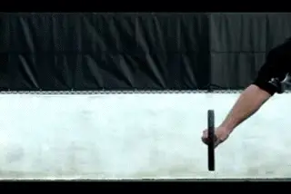

# The One Handed Topspin Backhand-The Forward Swing

**The One-Handed Topspin Backhand**

**The Forward Swing**

**John Yandell**

Get ready because\--finally\--in this fourth article in our series, we
will actually see someone hit a one-handed backhand! Just kidding, but
we have spent the first three articles looking at grips and preparation
and backswing\--everything leading up to the forward swing and the hit.
And now, hopefully it's time for the payoff in terms of what actually
happens at contact and beyond.

We've seen how players across the grip styles all start the preparation
with a unit turn. ([link](The%20One%20Handed%20Topspin%20Backhand-The%20Grip%20Shift%20and%20Unit%20Turn.docx).)
We've seen that there is a lot of variety in the backswings, and that
although some of the extreme players have the biggest take backs, others
are quite compact, and that there isn't any simple correlation between
backswing and grip style. ([link](The%20One%20Handed%20Topspin%20Backhand-The%20Backswing(s).docx).)

We also found that all the top players reach a common position with the
hand in relatively tight to the body at the bottom of the backswing, and
this position coincides more or less with the completion of the shoulder
turn and the step to the ball.

**The forward swing: extreme and classical styles.**

So what happens next?

**It's minimalistic: the straight hitting arm start to finish.**

**Hitting Arm Position**

***[On all the strokes, one essential component in the forward swing is
the hitting arm position.]*** This is as true, if not more true,
on the one-handed backhand. For the one-hander it's minimalistic:
***[the hitting arm is straight at the start of the forward swing and
stays that way all the way out through the extension of the
stroke.]***

This basic point can get lost when we get wrapped up in the study of the
backswing. When we look at the pro players we see many of them take the
hand and racket up very high with up to a 90 degree bend in the elbow.
Isn't that the key to hitting the ball like the pros? The answer is no.
Other players become obsessed with advanced elements such as hand and
arm rotation, things that can be added by most players, but these
aren't fundamental either.

**[We've noted many times the phenomenon of lower level players copying
these extreme and idiosyncratic aspects of pro tennis, rather than the
structural building blocks.]** This is also common on the
one-handed backhand.

Ironically, copying the larger backswings with the most bend at the
elbow often causes the dreaded \"elbow lead,\" in which the elbow comes
through the contact first. This means that the arm is still bent at the
hit, with the racket head trailing behind. The result is late contact,
loss of leverage, loss of power, and also, the inability to hit the ball
crosscourt. And discussion of any other factors become irrelevant.

|  |  |  |  |  |
|  |  |  |  |  |
| **The hitting arm position across the grips styles: totally and completely straight at the start of the forward swing.** |  |  |  |  |

If you look at all the players we've been studying, the hitting arm is
already straight at the bottom of the backswing, or very shortly
thereafter, right at the start of the forward swing. It's the same for
both the extreme and the classical players. And again, this is not
apparently related to the size of the backswing. Some of the players
with the largest backswings also straighten out the arm at the earliest
points. So here is a huge, vital, commonality.

We saw that Tommy Robredo actually has the highest hand and racket
position of any of the players we looked at. He also bends his elbow
substantially on the backswing. But look closely at what happens next.
As the racket starts down, the hitting arm straightens out completely
before even reaching the bottom of the backswing. When you watch him
this position just looks solid and strong.

**Big backswing, early hitting arm position.**

The other aspect we noted about Robredo's backswing that was more
extreme than the other players was how far he took the hand and racket
outside to his left, away from his torso at the top of the backswing.
But again, as he starts to drop the racket down from the top of the
backswing and straighten the arm, he is also moving the hand and racket
back in toward his body.

These are the prerequisites for having a great forward swing. The hand
inside, fairly close to the body and the hitting arm straight at the
elbow, forming a straight line all the way up to the shoulder.

**The Shoulder Hinge**

**Why is the straight arm hitting position so important\--and so
different from the double bend structure we've seen and studied on the
forehand**? ([link](http://www.tennisplayer.net/members/tour_strokes/jeff_counts/forehand_a_spring_event/forehand_a_spring_event%20.html)
to read Jeff Counts article on the Double Bend Forehand.) ***The
reason is the position of the hitting shoulder.***
**[On the forehand, the right shoulder has to rotate forward toward the
plane of the contact. On the one-handed backhand, the front right
shoulder is already there at the completion of the turn.]**

Although it isn't quite this simple, a good analogy for understanding
the forward swing on the one-hander is to think of the arm and the
racket as a one piece \"gate\" that swings around and forward from the
\"hinge\" of the right front hitting shoulder.

**There isn't any internal movement in the gate, or the structure of
the hitting arm. The player is simply using his shoulder and other upper
body muscles to swing the \"gate\" around, first to the contact point
and then out into the followthrough.**

This is why the straight hitting arm is a prerequisite for the shot to
work at any level of play. If the elbow stay bent too long, the \"gate\"
is effectively cut in two at the elbow. As the racket comes around with
the elbow bent, it can't reach the correct contact point and, at best,
can slide across and/or under the ball. This produces a weak push, often
hit with sidespin and also usually down the line, no matter how hard the
player tries to bring it crosscourt.

**The finish or the point of greatest forward extension.**

This is why we see the straight hitting arm position in all the
one-handers, and why they all establish it so early. With all the
variations and differences we've examined in the one-hander, the
hitting arm position is the closest thing there is to a universal
constant. Yes, we will see some variation in this position when we look
at how players now use more hand and arm rotation in this shot similar
to the forehand, at least on certain balls. But for now we'll stick to
looking at the more basic structure.

**The Finish**

This straight hitting arm position is maintained out through the forward
motion, all the way to the point of greatest extension. **I call this
the finish position, because it is the last point in the motion in which
the racket is traveling forward and upward toward the target, before
starting to move backwards in the recovery phase.**

**Typically we see this racket position is at about eye level, are a
few inches higher**. The arm is still straight and
the hand and arm point along the line of the shot or, more usually, 20
or 30 degrees past this position. Note that you can draw a straight line
across the torso all the way out to the hand. The exact position will
vary somewhat depending on the specific shot, the ball height, and
amount of spin. But the key point is how long the players maintain this
straight arm position.

|  |  |  |  |  |
|  |  |  |  |  |
| **Arm straight, wrist at about eye level or a little higher, straight line from the hitting arm across the torso.** |  |  |  |  |

**The Wrap**

As with the forehand and the two-handed backhand, one issue that needs
to be understood is the relationship between the extension and finish
and the so-called \"wrap.\" After passing through the finish position,
the players naturally decelerate the swing by continuing across the body
to their right side, usually relaxing the arm and letting it bend again
at the elbow as the move into the recovery phase.

**What is the real relationship between the extension and the wrap?**

Although it is far less common than on the forehand, sometimes you see
players actually \"wrap\" the racket backwards and upwards over the
head, so that the tip of the racket points backwards, and the butt of
the racket cap actually points at the opponent.

It is sometimes asserted that this wrapping motion is what \"produces\"
racket head speed? This is a confusion of cause and effect. The
extension and the racket head speed produce the wrap, not the other way
round. It's obvious from the high speed footage that this is the
deceleration phase of the shot. The racket is actually traveling the
slowest then compared to any other point in the swing.

In my opinion, mechanically teaching the wrap is a mistake because it
tends to alter the shape of the forward swing and restrict the extension
as players struggle to yank the racket up and over their heads. Players
who try to wrap the finish don't usually make the finish position
we've identified above.

**More extreme means contact naturally higher and further in front.**

A good question to ask is why would you consciously try to swing the
racket backwards in the opposite direction you are trying to hit the
ball? As with the forehand, if the shape of the swing is sufficiently
extended, and the player naturally accelerates the racket, and the arm
is relatively relaxed, the wrap will happen automatically, when
appropriate.

**Contact Point**

If the hitting arm is set up in the correct hitting position at the
start of the forward swing, and stays that way as the gate swings
forward on the hinge of the shoulder, the contact point tends to happen
naturally as a consequence of the forward swing. Obviously the contact
is the critical point. But it isn't an independent event that that can
be examined outside the overall context of the swing. It's one point on
the continuum of the forward swing.

This is especially important in looking at the various grip structures
on the one-hander, because where the contact falls on that continuum of
the swing differs significantly as we move from the more classical to
the more extreme players.

**How the change from classic to extreme effects contact.**

In general we can say that the more extreme the grip, the more in front
of the body the contact point. Typically it is also higher. This is a
consequence of the way the grip connects the body to the racket. Watch
in the animation as I go from a classic grip to an extreme grip. To
maintain the hitting arm position and get the racket square with the
line of incoming ball, the racket head has to move forward and upward.

So here is the first clear distinction between the grip styles that
holds up for all the players. In general, the more extreme the grip, the
more in front the contact. And the great ease of handling high bouncing
balls.

As we are going to see in future articles, extreme players can increase
hand and arm rotation and deal with lower balls effectively. It's also
true that extreme players, and in fact all modern players, close the
face at times as a way of generating certain combinations of speed,
spin, and trajectory. We will be looking at this in the future as well.
But what we are talking about are the differences on more basic drives
with the racket face more or less vertical at contact.

**Higher contact matches deeper court positioning.**

This higher natural contact point makes sense when we think about how
some of the extreme grip players position themselves on the court.
Players like Robredo and Fernando Gonzales are one-handers, but also
have extreme forehands, stay back and rip heavy topspin balls. The
higher contact height on the backhand with this grip style fits the way
they play, giving them the ability to deal with similar balls on either
wing. In addition, the deeper court positioning gives them more time to
reach the contact point which, as we saw, is further in front, and which
probably makes it tougher to play the ball late.

The grip also makes sense for a shorter player, like Justine
Henin-Hardenne. The more extreme grip may help her deal with balls that
are higher in her contact zone than they would be for players like Maria
Sharapova or Venus Williams who are both over 6 feet tall.

But what about the average player? Here is where we get to one of the
pitfalls in simply adopting technical styles based on our admiration for
elite players. What is the contact height on most balls you hit on your
backhand? Do you have an extreme forehand grip as well and do you choose
to play 10 feet behind the baseline?

**Which grip styles suits the balls you actually play?**

Does that technical style make sense against the levels of speed and
spin your opponents actually generate? Are you getting waist high balls,
or are you playing the ball up around your shoulder? Would you be better
off hitting more slices and slices drives if you stopped to analyze the
match exchange situations you actually face and what the best strategic
options might be?

In my opinion, the extreme grip backhand, while beautiful, powerful and
technically sound, isn't as well suited for most players as a less
extreme classical grip, and that includes many players at the world
class level, including the best player in the world, Roger Federer.

We see players such as Federer and James Blake standing in and taking
the ball much earlier on the one-hander. In Federer's case he often
picks the ball up right off the court surface. It's amazing. The less
extreme grip is naturally suited for these lower contact heights. It
also allows a contact point further in towards the body, which again
allows a little flexibility in the timing.

**In general, more extreme grips mean more torso rotation.**

**Torso Rotation**

***Besides the contact point, there is a second fundamental
distinction between the classical and the more extreme backhands. This
is the amount of torso rotation in the forward
swing.*** In general the more extreme grip players
rotate their hips and shoulders further through the course of the stroke
and are more open at contact.

This makes sense and is related to the other difference\--the position
of the contact point. There is more rotation in order to push the racket
further forward and out to the contact. And this continues on out into
the followthrough. The torsos of the classic players are typically open
30 degrees or less at contact. For the extreme players it's more like
45 degrees, and it can be more. With a player like Amelie Mauresmo, the
shoulders are open more like 60 degrees or even further.

|  |  |  |  |  |
|  |  |  |  |  |
| **Torso rotation relates directly to grip style: more classical grips mean a more sideways position at contact, more extreme grips mean a more open position.** |  |  |  |  |

**Opposite Arm**

But grip is not the only factor controlling torso rotation. The role of
the left arm also has a major impact on how much the players rotate.
This turns out to be another one of those factors that is apparently
independent of grip style. (For a great discussion of the role opposite
arm in all the strokes  to read Scott Murphy's article.)

**More left arm opposition, more sideways torso position.**

Roger Federer is probably the player with the most consistent sideways
torso position at contact. This is related to his grip as we saw, but it
is also related to the use of his left arm. On many balls, Roger Federer
extends his left arm behind him until it is completely straight and
quite high, sometimes reaching almost shoulder level and pointing
directly backwards.

The same is true to great degree for other classic grip players,
including Henman, Blake, and Tommy Haas. In general we can say a
conservative grip paired with dramatic left arm action equals a more
sideways torso position. But, again, we have to be careful in making
absolute statements, but it's not consistent or universal. Federer
varies the amount of left arm opposition considerably from ball to ball.
At times player like Blake and Heman will also oppose the arm noticeably
less, and when they do, will tend to rotate slightly more through the
contact.

**Opposite Arm: Extreme Grips**

The picture is more ambiguous with the extreme players. Overall, the
extreme players rotate the torso more due to the grip and the
differences in the contact point, as noted. But this rotation can also
moderated by how much they oppose their back arm.

**Little arm opposition, maximum torso rotation.**

Amelie Mauresmo is at the other extreme compared to Federer. She has the
most torso rotation on the forward swing of all the players we have
studied, and also, the least opposition of the left arm. In fact, after
she lets go of the racket, her left arm never actually move backwards on
most balls.

Instead it basically stays in the same position as when she lets go of
the racket. On most balls, it never straightens out or even begins to.
Her elbow stays bent at around 60 degrees at the elbow, and her left
hand stays forward at about the rear edge of her torso.

There appears to be a direct correlation between this limited use of the
left arm and the amount of torso rotation. As we noted, on most of her
backhands her front shoulder comes around 60 degrees or sometimes even
more.

Although Mauresmo is the most radical example, some of the other players
with extreme grips also have much less backward movement of the left
arm. Gaston Gaudio, for example, often leaves the left arm bent at his
side, or moves his arm backward less than other players. It almost never
rises above waist level or fully straightens out.

**There is more variation in the opposite arm with the extreme grips.**

Richard Gasquet opposes the left arm more than Gaudio, but it stays
below waist level. Other extreme grip players oppose the left arm as
dramatically as the classical players. Examples here are Fernando
Gonzales and Tommy Robredo. Even though they generally rotate more,
sometimes this opposition appears to keep their bodies almost completely
sideways, especially if they are going down the line.

If you have ever experimented with this relationship yourself, you know
it makes sense. The further and the more forcefully you straighten and
extend your opposite arm behind you, the more sideways you stay.

But again the use of the left arm varies player to player, and also from
ball to ball. When the ball is low or the players are picking up a half
volley, all the players, including Federer, will oppose the back arm
less. If you look closely through the Stroke Archive, you can find most
of the players in this article with the left arm straighter and higher
on some balls, and lower and more bent on others.

***[So what does it all mean? That like the backswing, the use of the
left arm appears to be a variable that isn't dependent on classical or
extreme grip styles. It seems clear however that the movement of the
opposite arm plays an important role in the stroke for most all the
players.]***

**Gonzales and Robredo tend to oppose the left arm dramatically.**

But how much is the ideal amount? There isn't a black and white answer.
It may be a technical factor that the players have a wide range of
latitude in controlling. Or it might have to do with the strength or
flexibility of the individual players. It's possible that even some
players might be able to improve the quality of their shot making by
emphasizing this factor more in certain circumstances.

Regardless of the variations we see in the pro game, I think
experimenting with more pronounced backward arm movement is very
worthwhile for most players. Especially at lower levels, over rotation
of the hips and shoulders is a common problem, and this is almost always
paired with a limited use the opposite arm. The precise path of the left
arm ends up taken for a given player with a given grip may depend on
individual factors. But it's definitely a critical element for all one
handers to develop for themselves.

**A Brief Summary**

So where are we with the development of this shot? Assume that after
reading the first 3 articles you do in fact execute the unit turn, get
your shoulders fully turned at the step to the ball, and complete the
backswing on time. From here keeping your hitting arm straight, reaching
the finish position, and learning to use your left arm are the other
magic core elements for developing a great one-handed backhand drive.

So that's it for the basic issues in the forward swing. Next we'll
look at the issue of stances and hand and arm rotation, something that
has become increasingly common in the pro game. Stay tuned!

John Yandell is widely acknowledged as one of the leading videographers
and students of the modern game of professional tennis. His high speed
filming for Advanced Tennis and TPA have provided new visual
resources that have changed the way the game is studied and understood
by both players and coaches. He has done personal video analysis for
hundreds of high level competitive players, including Justine
Henin-Hardenne, Taylor Dent and John McEnroe, among others.

In addition to his role as Editor of TPA he is the author of
the critically acclaimed book Visual Tennis. The John Yandell Tennis
School is located in San Francisco, California.
