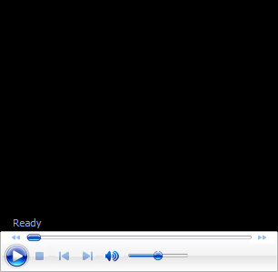
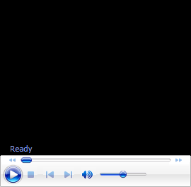

# Sampras Serve: New Filming Protocols

# Classic Motions 

# John Yandell

{width="3.3333333333333335in"
height="2.5in"}

**Anyone tired of watching this service motion?**

I can\'t speak for everyone on Tennisplayer, but speaking for myself, I
have yet to tire of watching the great Pete Sampras play\--especially
watching him hit that wonderful, silky bomb we call his serve.

Recently we had the chance to film Pete again, playing an exhibition
with Sam Querry at the Tiburon Peninsula Club in Marin County,
California, just over the Golden Gate Bridge from San Francisco. It was
a tremendous event organized by our friends on the tennis staff at TPC,
Steve Jackson and Brandon Coupe (both Tennisplayer subscribers).

Read on to find out more about the event and what and how we filmed. But
if you just can\'t wait to read the analysis of Pete\'s serve, skip down
about 6 or 7 paragraphs to the \"Analysis\" subhead below.

Over the weekend at TPC, there was a college alumni competition
featuring players including Roscoe Tanner, Paul Goldstein, Scott Davis,
Justin Gimelstob, Eric Taino and other former collegiate stars, some
going back a few decades.

Then Sunday afternoon Pete showed up to provide a final burst of star
power. Over 2,000 people watched as he and Sam split the first two sets
and then Sam won a third set super tie breaker.

  ------------------------------------

  ------------------------------------

+------------------------------------------------------------------------------------------------------------------------------------------------------------+
|                                                                                                                                                            |
+============================================================================================================================================================+
|  |
|                                                                                                                                                            |
| **Click on the image to study Pete\'s serve frame by frame for yourself.**                                                                                 |
+------------------------------------------------------------------------------------------------------------------------------------------------------------+

It looks like Pete is starting to get ready for the exo series he has
planned with Federer starting in November. How did he look? Overall he
seemed a little rusty and he missed some balls, but he still looked very
athletic and moved as fluidly as ever. And the serve? See for yourself
in this gorgeous new footage. It\'s still there. (The backhand might be
another story, but more on that in another article.)

As we\'ve discussed in the Forum ([Click
Here](http://www.tennisplayer.net/bulletin/showthread.php?t=966)), Brian
Gordon was here with us for a week to do a massive quantitative filming
for his research and his PhD dissertation. Prior to the Pete exo, we
were up in St. Helena in the wine country, filming about 25 top Division
1 college players at a team event called the Napa Classic, run by our
friend Doug King, the tennis director at the Meadowood Resort. This was
big time college tennis with teams from Cal, Southern Cal, North
Carolina, and defending champion Georgia.

But Sunday we made it back down to Tiburon to film Pete. What did Brian
find out studying the Sampras serve? Well, after he spends a few hundred
hours in a dark room with his data, we\'ll know the answer to that, and
he\'ll be sharing the info with us on Tennisplayer.

In the meantime, though, we thought you\'d like to see some of our new
qualitative high speed footage shot by our technical editor, Mr. Aaron
Martinez. You\'ll be seeing more of this type of footage on Tennisplayer
and we\'re curious to know what you think about it. In addition to the
animations, we\'ve embedded some sequences as click through movies right
in the article. Just click on anyone of them, and you can study Pete\'s
motion frame by frame for yourself, just like in the Stroke Archive.

**The Analysis**

{width="3.3333333333333335in"
height="2.5in"}

**The constellation of elements for a very heavy serve are still
there.**

What did I see when I looked at Pete? One of the first big series of
analytic articles I did was on Pete\'s service motion. ([Click
Here](http://www.tennisplayer.net/members/tour_strokes/john_yandell/sampras_serve/sampras_serve_part_1/sampras_serve_part_1.html).)
Sometimes as players get a little older you see their motions evolve,
change, or deteriorate. Sometimes players exaggerate tendencies they
already have. Sometimes a tendency can become a significant flaw, and
problems develop. This was what was so interesting about my work with
Johnny Mac on his serve in the early 1990s. ([Click
Here](http://www.tennisplayer.net/members/teaching_systems/john_yandell/VisualTennis_Part2/Yandell_VTP2_McEnroe_Case_Study.html).)

But there were no real problems in Pete\'s serve, at least that I could
see. To me it looked as good as ever. And that\'s pretty friggin\' good.
In our previous studies we found that although Pete\'s velocity tended
to stay between 120mph and 130mph, his phenomenal spin rates\--averaging
over 2500rpm on his first delivery with a huge topspin component\--were
what made his ball so heavy and almost impossible to return. ([Click
Here](http://www.tennisplayer.net/members/mystheavyball/john_yandell/speed_and_spin/speed_and_spin.html).)

The Tiburon footage shows the unique constellation of elements that make
his serve is still in place. Let\'s take a look at a few of the key
points as seen in this new footage.

{width="3.3333333333333335in"
height="2.5in"}

**The racket drop and upward and outward path of the racket.**

**Racket Path**

For starters take a look at the depth of his racket drop. The racket
falls along his right side and the face of the racket is on a plane that
is perpendicular to his torso. Notice how his upper arm is almost in
line with his shoulder. This shows his tremendous shoulder flexibility.

The racket drop position is a goal most players can achieve. But not too
many players can do it by externally rotating the arm backward in the
shoulder joint as far as Pete.

Now watch the action of the hitting arm frame by frame going up to the
ball. The elbow extends. Then 5 or 6 frames before the contact, watch
the hand and racket start to turn into the shot. As this rotation
progresses the wrist moves from the laid back to the neutral position at
contact.

{width="3.3333333333333335in"
height="2.5in"}

**Pete\'s unique \"left\" contact point, and the impact on the arm
motion that follows.**

Now the rotation continues out into the followthrough, with the arm and
racket rotating primarily as a unit from the shoulder joint (with some
probable additional elements of independent forearm rotation). The
extent of Pete\'s arm rotation, typically referred to as \"pronation,\"
is still incredible, easily 90 degrees after contact.

Next we see the famous early elbow bend. So many people and analysts
have jumped on this as a signature move. The fact is that most players
also bend the elbow at some point in the followthrough, it\'s just not
as early as in Pete\'s motion.

Why this happens has been a topic of debate for over a decade. Some
analysts have claimed it has to do with the \"tremendous\" forward wrist
snap at the hit, but the footage shows that this is anything but an
accurate description of what is actually happening. As the clips all
show, both the bend at the elbow and any release of the wrist occur
after the contact. (Want to read more on the Myth of the Wrist in the
serve? [Click
Here](http://www.tennisplayer.net/members/avancedtennis/john_yandell/the_myth/the_myth_of_the_wrist_serve_images/the_myth_of_the_wrist_serve.html).)

**Ball Position**

What I think is really happening has to be understood in the context of
Pete\'s unique contact point. Pete\'s first delivery is really best
understood as a 125mph kick serve.

{width="3.3333333333333335in"
height="2.5in"}

**The difference is in the timing of the arm as it straightens and
rotates.**

Compared to most other top servers, his ball position is further to his
left, closer to the edge of his head at contact. This means that his
motion with his hand and racket is more radically upward. Look at the
point when Pete\'s arm straightens out, roughly at the point of maximum
pronation. Compare this to the Roddick serve in the same animation.

Look how much earlier Pete\'s arm straightens out and how much sooner he
completes the rotation. It\'s much higher off the court than Roddick\'s,
actually above the line of his shoulder.

My opinion is that the elbow bend is just the natural consequence of
everything that happens before it in the motion. There is very little
muscle tension in the arm. The arm moves upward to the hit. The arm
straightens out and pronates.

From that position, there is really no where else for the hand and
racket to go except down and back across the body in the continuation of
the followthrough. **[So the elbow bends, the hand drops and the motion
comes back the other way. The racket continues outward, downward, and to
the left. It\'s just happening sooner in Pete\'s motion than for most
players.]{.mark}**

{width="3.3333333333333335in"
height="2.5in"}

**Watch how Pete turns off the ball and explodes rotating back through
the contact.**

Again this is one of those critical cause and effect issues and I think
trying to consciously create or imitate this position is a mistake. If
the other elements of the serve are in place, it\'ll naturally happen at
the right time and you definitely shouldn\'t try to force it to occur.

**Torso Rotation**

Pete Sampras may start his motion with his shoulders basically square to
the baseline, but watch what happens during his windup. He turns off the
ball as far as any player in the history of the game except John
McEnroe. With McEnroe, the massive body turn was hard to miss since he
started with his shoulders almost parallel to the baseline.

With Pete, the turn happens during the motion, so it isn\'t as obvious.
But in my opinion it\'s key to understanding that massive combination of
velocity and spin. Turning so far away in the windup, Pete naturally
gets tremendous leverage when he rotates back the other way into the
ball.

  ------------------------------------

  ------------------------------------

  ------------------------------------------------------------------------------------------------------------------------------------------------------------
  
  ------------------------------------------------------------------------------------------------------------------------------------------------------------
  **Click on the photo to study the relationship between the stance and the turn for yourself**.

  ------------------------------------------------------------------------------------------------------------------------------------------------------------

As we\'ve seen in the previous articles on his motion, this turn and
forward body rotation are directly related to his stance. At the start
of his motion, his rear foot is offset, behind and to his left of the
front. The toes of the back foot are turned open to the baseline around
30 degrees.

We all know how Pete starts in the ready position for his serve with the
front toes raised up in the air. But as his arms drop, he foot turns and
moves down so that it is flat on the court and close to parallel to the
baseline. (Slightly more open usually in the deuce court.)

His torso also immediately starts to rotate away from the net. At the
maximum turn, it\'s probably rotated something around 60 degrees from
its starting position\--we\'ll get a measurement from Brian Gordon on
this eventually I can hope.

**[The amount of turn is directly related to his stance.]{.mark}** If
you draw an imaginary line across his toes, and another imaginary line
across the front of his chest, they are essentially parallel at the
completion of the turn. The angle of his stance corresponds to, and to
some extent actually determines the amount of his body turn.

{width="3.3333333333333335in"
height="2.5in"}

**Look at the timing of the knee bend and weight distribution.**

**Legs**

We also know that Pete has tremendous knee bend. But it\'s important to
understand how that occurs. First pay close attention to the timing of
his leg action. The coiling of the legs really only begins after he has
released the toss.

Note that as the toss arm is going up, he is standing almost straight up
and down with just a little flex in the knees, and the weight appears
equally distributed between his feet. Now as the tossing arm continues
to extend, he begins to drop his weight, bending the knees and then
shifting the majority of the weight onto the left front foot.

The completion of the knee bend coincidences with the completion of the
turn. And with the full extension of the tossing arm. At this point he
is really coiled and ready to explode.

The legs, hips and shoulders all uncoil as he launches upward into the
ball and outward over the court. The launch means that when he makes
contact he is about 2 feet into the court, but it\'s also important to
understand where the contact point is in relationship to his body. The
ball is tossed in front, definitely, but note that the actual position
of the racket when it strikes the ball is just at the front edge of the
body\--roughly even with the front of his face.

{width="3.3333333333333335in"
height="2.5in"}

**The toss is forward into the court, the contact is at the front edge
of the body.**

So in relationship to his body the contact point is slightly in front.
But as we saw above is also quite far to his left. This means that as
his body rotates into the hit, the torso is still quite closed in
relation to the baseline at contact. This angle is probably something
like 60 degrees in the add court, and maybe more like 30 degrees in the
deuce. (Brian will correct me here I\'m sure.)

This explosive full body motion, combined with the left ball position,
are two factors that account for the incredible weight of shot or
\"heaviness\" Pete produces. As our studies showed, his ball is spinning
with over 5,000rpm by the time his opponent makes contact. And due to
the topspin component, his serve bounces significantly higher than
serves that may be as fast, but have less total rotation or less
topspin.

**Landing**

A final point to look at is his landing. Like all top servers, Pete
lands on his front foot, with the rear leg kicking back. The interesting
point is that, although Pete has served and volleyed as much as possible
over the course of his career, he typically lands only a shoe length or
so inside the court. By contrast a player like Richard Kracijek, another
great serve and volleyer, landed much further inside the baseline.

{width="3.3333333333333335in"
height="2.5in"}

**The left foot landing, the big cross step and the split.**

**[Pete also lands relatively balanced, with his body tilted slightly
forward but not a lot of bend from the waist.]{.mark}** Compare this to
a player like Roddick, who actually lands a foot to two feet further
inside the baseline than Pete and jack knifes over much more at the
waist.

This landing probably accounts for Pete\'s somewhat lower kick back with
the rear leg. His leg barely reaches parallel with the court. Roddick\'s
kick back is much higher. Interestingly, Pete\'s landing is actually
similar to Roger Federer.

So what about the serve and volley? In the old days the conventional
wisdom was that you had to reach the service line to be in good position
for the first volley. That rarely happens in the modern pro game, unless
the opponent hits a weak floating return. **[Most the returns are coming
back at 80 or 90 mph. And that is a major factor accounting for the lack
of serve and volley play.]{.mark}**

**[[In the modern game, the first volley is usually hit about half way
between the service line and the baseline. It\'s a function of now fast
the ball comes back to the server. And it makes the first volley very
difficult.]{.mark}]{.underline}**

  ------------------------------------

  ------------------------------------

+-------------------------------------------------------------------------------------------------------------------------------------------------------------+
|                                                                                                                                                             |
+=============================================================================================================================================================+
|  |
|                                                                                                                                                             |
| **Click on the photo for another frame by frame view.**                                                                                                     |
+-------------------------------------------------------------------------------------------------------------------------------------------------------------+

Pete\'s footwork pattern is interesting here. He lands only a foot
inside the baseline on relatively good balance. But watch the next step.
He takes a huge stride forward with the right, rear foot. This may be
why he limits his kick back as well\--to facilitate taking this forward
step as rapidly as possible.

The split step then follows the cross step. So it\'s really three
components: a left foot landing slightly inside the baseline, a big
cross step, and then a split. And then, hopefully, a successful first
volley. On a weaker return of course Pete\'s happy to close further, but
we are talking about the limitations and difficulties of a tactical
style resulting from the ball speed of the modern game.

So that\'s it for the look at Pete\'s serve. We also have some
incredible footage of his forehand that I\'ll be talking about in the
future, as well as a very interesting look at his backhand side,
including how it was always a little different from the other top
one-handers and what has happened to it over the years. Stay tuned.

**To view the complete Stroke Archives of Pete Sampras serves,
[\]{.underline}
[click
here.](file:///C:\Users\moosh\OneDrive\Documents\tennisplayer.net\Stroke%20Analysis\Advanced%20Tennis\Advanced%20Tennis%20TOC.docx)**

{width="1.8208333333333333in"
height="2.6493055555555554in"}

John Yandell is widely acknowledged as one of the leading videographers
and students of the modern game of professional tennis. His high speed
filming for Advanced Tennis and Tennisplayer have provided new visual
resources that have changed the way the game is studied and understood
by both players and coaches. He has done personal video analysis for
hundreds of high level competitive players, including Justine
Henin-Hardenne, Taylor Dent and John McEnroe, among others.

In addition to his role as Editor of Tennisplayer he is the author of
the critically acclaimed book Visual Tennis. The John Yandell Tennis
School is located in San Francisco, California.
